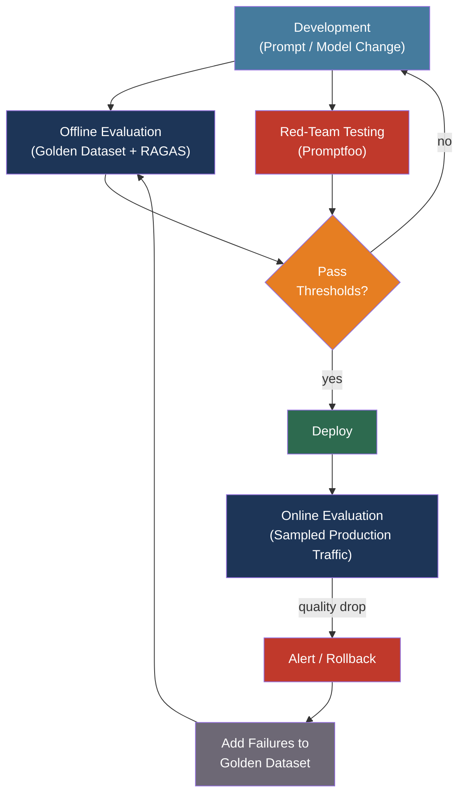

# [BEE-506] Evaluating and Testing LLM Applications

:::info
LLM outputs are probabilistic and often subjectively judged — traditional binary pass/fail assertions break down. Effective LLM evaluation combines automated metrics, LLM-as-judge scoring, curated golden datasets, and continuous production monitoring.
:::

## Context

Traditional software testing operates on a simple premise: input X produces output Y, and any deviation is a bug. LLMs break this contract at both ends. The same prompt can produce different outputs across runs, even at temperature zero, because floating-point arithmetic in GPU matrix operations is hardware-order-dependent (Yin et al., arXiv:2408.04667). More fundamentally, there is often no single correct output — a question about deploying a containerized service has many valid answers, and "correctness" depends on context, completeness, and the evaluator's judgment.

The field has drawn from machine translation and text summarization research, inheriting metrics like BLEU (Papineni et al., 2002) and ROUGE (Lin, 2004). Both measure n-gram overlap with reference text. Both perform poorly for modern LLM evaluation: they penalize correct paraphrases, ignore semantic equivalence, and produce uninformative scores for open-ended generation where many valid answers exist. BERTScore (Zhang et al., 2019) improved matters by using embedding similarity rather than token overlap, but it still depends on the existence of reference answers that may not exist in production.

The dominant evaluation paradigm in 2025 is LLM-as-judge: use a capable model (typically GPT-4 or Claude) to score another model's output against a rubric. Liu et al. (G-Eval, arXiv:2303.16634, 2023) showed that GPT-4 with chain-of-thought reasoning achieves agreement rates above 80% with human evaluators on summarization tasks. For RAG-specific evaluation, Shahul Es et al. (RAGAS, arXiv:2309.15217, EACL 2024) developed a reference-free framework that scores retrieval and generation quality without requiring gold-standard answers — a practical requirement for production evaluation where curated answers don't exist.

## Design Thinking

LLM evaluation has two distinct settings with different requirements:

**Offline evaluation** (pre-deployment): Run against a curated golden dataset with known acceptable answers. Fast feedback loop. Catches regressions before they reach users. Limited to cases you thought to include.

**Online evaluation** (production): Score sampled live traffic continuously. Detects real-world failure modes — distribution shift, edge cases, adversarial inputs — that offline datasets miss. Requires sampling (evaluating 100% of traffic is expensive) and PII-aware logging.

The effective approach runs both: offline evaluation gates deployments, online evaluation monitors for drift after deployment, and newly discovered production failures are added to the offline dataset.

A second design axis is the evaluation method spectrum:

```
Cheap, fast                                           Expensive, accurate
|------------------------------------------|
Exact match → Reference metrics → LLM-as-judge → Human evaluation
```

Exact match works for structured outputs (JSON schema compliance, classification). Reference metrics (BLEU, ROUGE, BERTScore) work for narrow tasks with clear correct answers. LLM-as-judge works for open-ended quality assessment. Human evaluation is the ground truth and should be used to calibrate all other methods.

## Best Practices

### Define Evaluation Dimensions Before Writing Tests

**MUST** define which dimensions matter for your specific application before choosing metrics. Different applications need different evaluation priorities:

| Dimension | What it measures | When critical |
|-----------|-----------------|---------------|
| Factual accuracy | Are claims true and supported? | Q&A, research assistance |
| Answer relevance | Does the output address the query? | All applications |
| Faithfulness | Are claims grounded in retrieved context? | RAG systems |
| Format compliance | Does output match expected schema? | API integrations, structured output |
| Toxicity / safety | Is output harmful or biased? | User-facing applications |
| Latency and cost | P95 latency, tokens consumed, cost per request | All production systems |

**SHOULD** weight dimensions by their production impact. A factual error in a medical information application is more serious than a verbose response. Toxicity in a children's application is a blocking issue. Define acceptable thresholds per dimension before deploying.

### Use LLM-as-Judge with Explicit Rubrics

**SHOULD use LLM-as-judge** for quality dimensions that cannot be measured by reference metrics — relevance, coherence, helpfulness, faithfulness. LLM-as-judge with structured rubrics reliably approaches human-level agreement (>80% per G-Eval).

**MUST account for judge biases** identified in the MT-Bench study (Zheng et al., arXiv:2306.05685):
- **Verbosity bias**: Judges prefer longer responses ~90% of the time regardless of quality. Mitigate by instructing the judge to evaluate conciseness as a factor.
- **Position bias**: Judges favor whichever answer appears first. Mitigate by running each comparison twice with positions swapped and averaging.
- **Self-enhancement bias**: A model acting as judge inflates scores for outputs from the same model family. Mitigate by using a different model family as judge.

```python
FAITHFULNESS_RUBRIC = """
You are evaluating whether the following answer is faithful to the provided context.
Faithful means: every factual claim in the answer can be traced to the context.
Do not reward answers that add correct information not found in the context.

Score on a 1-5 scale:
5 - All claims directly supported by context
4 - Minor paraphrase; all claims inferable from context
3 - Mostly supported; one unsupported claim
2 - Multiple unsupported claims
1 - Answer contradicts or ignores context

Context: {context}
Answer: {answer}

First reason step-by-step, then output your score as: Score: N
"""
```

### Build and Maintain a Golden Dataset

**MUST maintain a versioned golden dataset** — a curated collection of inputs, optional reference outputs, and expected quality properties — for regression testing. A model update or prompt change that regresses quality on the golden dataset must not deploy.

**SHOULD** build the golden dataset from real production traffic, not synthetic examples. Synthetic examples miss the long tail of real queries. After launch, continuously sample production inputs where the model performed poorly and add them to the dataset.

**SHOULD** include adversarial cases: queries designed to elicit hallucinations, edge cases near the application boundary, and inputs known to cause issues in similar systems. Coverage of edge cases matters more than raw dataset size.

**MUST NOT** reuse evaluation data for fine-tuning or prompt optimization. Benchmark contamination — using test data during training — produces inflated offline metrics that do not generalize to production.

A minimal dataset entry:

```json
{
  "id": "order-status-001",
  "input": "What is the status of my order #12345?",
  "context": "Order #12345 was shipped via FedEx on April 10 and is expected to arrive April 14.",
  "expected_properties": {
    "mentions_shipping_carrier": true,
    "mentions_expected_date": true,
    "tone": "helpful",
    "format_compliant": true
  },
  "tags": ["order-lookup", "core-path"]
}
```

### Evaluate RAG Pipelines with RAGAS Metrics

For RAG systems, RAGAS (Shahul Es et al., 2023) provides four reference-free metrics that cover both retrieval quality and generation quality:

**Context Precision**: Are the retrieved chunks ranked by relevance? A system that retrieves correct chunks but buries them among irrelevant ones degrades generation quality.

**Context Recall**: Did retrieval capture all information needed to answer the question? Low recall means the model lacks context and must hallucinate or decline.

**Faithfulness**: Does the generated answer make only claims supported by the retrieved context? The core anti-hallucination metric for RAG.

**Answer Relevance**: Does the answer actually address the user's question? A faithful but tangential answer fails on this metric.

```python
from ragas import evaluate
from ragas.metrics import faithfulness, answer_relevancy, context_precision, context_recall
from datasets import Dataset

samples = Dataset.from_list([{
    "question": "When was order #12345 shipped?",
    "answer": "Order #12345 was shipped on April 10 via FedEx.",
    "contexts": ["Order #12345 was shipped via FedEx on April 10 and is expected to arrive April 14."],
    "ground_truth": "April 10",
}])

results = evaluate(
    samples,
    metrics=[faithfulness, answer_relevancy, context_precision, context_recall],
)
# results: {'faithfulness': 1.0, 'answer_relevancy': 0.95, ...}
```

**SHOULD** run RAGAS metrics on each component of the RAG pipeline separately. A low faithfulness score may indicate a generation problem. A low context recall score indicates a retrieval problem — fix the retriever, not the prompt.

### Red-Team Before Launch

**MUST** perform adversarial testing before deploying any user-facing LLM application. Red-teaming systematically probes for:
- Prompt injection vulnerabilities
- Jailbreaks that bypass content policies
- Data leakage (does the system reveal training data, system prompts, or other users' data?)
- Harmful content generation
- Hallucination under pressure (false confidence on unknown topics)

Tools like **Promptfoo** (open-source, MIT license) automate red-teaming against 20+ vulnerability categories aligned with OWASP LLM Top 10. Run it in CI/CD to prevent regressions:

```yaml
# promptfoo config: run in CI on every PR
targets:
  - id: openai:gpt-4o
    config:
      temperature: 0

redteam:
  strategies:
    - jailbreak
    - prompt-injection
    - harmful:hate
  plugins:
    - owasp:llm
```

### Integrate Evaluation into CI/CD

**SHOULD run offline evaluation on every pull request** that changes a prompt, model configuration, or retrieval pipeline. Gate merges on evaluation score thresholds.

**SHOULD monitor quality metrics in production** alongside operational metrics (latency, error rate, cost). A system can be healthy by latency and error rate while silently degrading in answer quality due to a model update or distribution shift.

**SHOULD sample** 1–5% of production traffic for continuous evaluation rather than evaluating everything. Stratified sampling ensures the sample is representative across user segments, query types, and complexity levels.

```python
# Minimal continuous evaluation pipeline
import random

def maybe_evaluate(request: dict, response: dict, sample_rate: float = 0.02):
    if random.random() > sample_rate:
        return
    # Scrub PII before sending to judge
    scrubbed = redact_pii({"question": request["query"], "answer": response["text"]})
    score = llm_judge(scrubbed, rubric=RELEVANCE_RUBRIC)
    metrics.record("answer_relevance", score, tags={"model": response["model"]})
```

## Visual



Production failures feed back into the golden dataset, making offline evaluation stronger over time.

## Tool Landscape

| Tool | Type | Best for |
|------|------|---------|
| [Promptfoo](https://www.promptfoo.dev/) | Open-source | Prompt comparison, red-teaming, CI/CD |
| [RAGAS](https://github.com/explodinggradients/ragas) | Open-source library | RAG pipeline evaluation |
| [Langfuse](https://langfuse.com) | Open-source platform | Observability + evaluation, self-hostable |
| [LangSmith](https://smith.langchain.com) | Managed (LangChain) | LangChain-based applications |
| [OpenAI Evals](https://github.com/openai/evals) | Open-source framework | Benchmarking, model comparison |
| [Braintrust](https://www.braintrust.dev) | Managed (enterprise) | Large-scale evaluation, SOC 2, HIPAA |

**SHOULD start with Promptfoo and RAGAS** for most teams. Both are open-source, require no vendor dependency, integrate with CI/CD, and cover the most important evaluation scenarios. Add a managed platform (LangSmith, Braintrust) when team scale, compliance requirements, or cross-team collaboration justifies the cost.

## Related BEEs

- [BEE-503](503.md) -- LLM API Integration Patterns: semantic caching and cost control reduce the expense of running continuous evaluation; the same instrumentation that captures production traces feeds the evaluation pipeline
- [BEE-504](504.md) -- AI Agent Architecture Patterns: agent evaluation adds a trajectory dimension — not just output quality but whether the agent took the right actions in the right order
- [BEE-345](345.md) -- Testing in Production: sampling, shadow testing, and canary deployment strategies for LLM applications are extensions of the same patterns used for conventional production testing
- [BEE-324](324.md) -- SLOs and Error Budgets: quality metrics (faithfulness >0.9, hallucination rate <2%) can be formalized as SLOs; error budgets determine how much quality degradation is acceptable before rollback

## References

- [Shahul Es et al. RAGAS: Automated Evaluation of Retrieval Augmented Generation — arXiv:2309.15217, EACL 2024](https://arxiv.org/abs/2309.15217)
- [Yang Liu et al. G-Eval: NLG Evaluation using GPT-4 with Better Human Alignment — arXiv:2303.16634, 2023](https://arxiv.org/abs/2303.16634)
- [Lianmin Zheng et al. Judging LLM-as-a-Judge with MT-Bench and Chatbot Arena — arXiv:2306.05685, NeurIPS 2023](https://arxiv.org/abs/2306.05685)
- [Tianyi Zhang et al. BERTScore: Evaluating Text Generation with BERT — ICLR 2020](https://arxiv.org/abs/1904.09675)
- [Promptfoo. LLM Red-Teaming Documentation — promptfoo.dev](https://www.promptfoo.dev/docs/red-team/)
- [RAGAS. Documentation — docs.ragas.io](https://docs.ragas.io/)
- [Langfuse. LLM Evaluation 101 — langfuse.com](https://langfuse.com/blog/2025-03-04-llm-evaluation-101-best-practices-and-challenges)
- [OpenAI. Evals Framework — github.com/openai/evals](https://github.com/openai/evals)
- [Nature. Detecting Hallucinations in Large Language Models Using Semantic Entropy — nature.com, 2024](https://www.nature.com/articles/s41586-024-07421-0)
