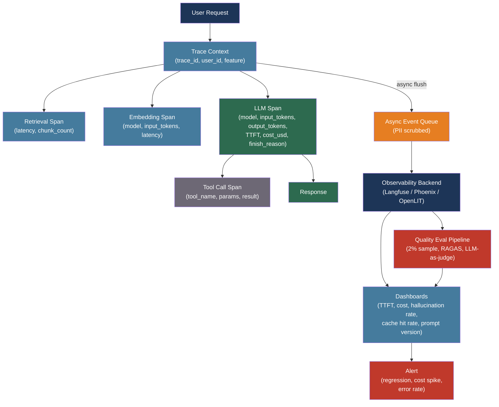

# [BEE-511] LLM Observability and Monitoring

:::info
HTTP 200 OK means the network call succeeded — it says nothing about whether the model hallucinated, selected the wrong tool, or consumed ten times the expected tokens. LLM observability requires a second layer of instrumentation that tracks quality, cost, and model-specific latency alongside the operational signals traditional monitoring already captures.
:::

## Context

Traditional observability (BEE-320) operates on the premise that a well-behaved system is one that responds quickly and without errors. An LLM-integrated system breaks this premise: the same prompt submitted twice produces different outputs; both may be 200 OK, one factually correct and one not. The "silent failure" problem is unique to probabilistic systems — an agent can return in 1.2 seconds with a hallucinated answer that satisfies the content-length check, then trigger expensive retries downstream before the error surfaces.

The industry has converged on two complementary metric categories. Operational metrics — TTFT (time-to-first-token), inter-token latency, error rates, token counts — tell you how the system is running. Quality metrics — faithfulness, hallucination rate, relevance, user correction signals — tell you whether the system is producing value. A system that is operationally healthy can be quality-degraded: model update changed a behavior, a prompt regression increased hallucination rate, a RAG pipeline started retrieving stale chunks. Neither signal alone is sufficient.

OpenTelemetry addressed the instrumentation gap in 2024 with the GenAI Semantic Conventions (opentelemetry.io/docs/specs/semconv/gen-ai/), a standardized attribute vocabulary for LLM spans. Attributes like `gen_ai.system`, `gen_ai.request.model`, `gen_ai.usage.input_tokens`, `gen_ai.usage.output_tokens`, and `gen_ai.response.finish_reason` give observability backends a consistent data model for LLM traces regardless of provider or framework. The spec is experimental but widely adopted across the platform ecosystem.

## Design Thinking

LLM observability has two structural differences from traditional service observability.

First, the unit of work is a token stream, not a request-response pair. A single user action may produce a RAG retrieval span, an embedding span, an LLM generation span, and multiple tool call spans — all nested under one parent trace. The cost and quality of the overall operation cannot be understood without decomposing it into these components.

Second, quality cannot be measured synchronously. Whether a response is faithful, relevant, and factually correct requires either a reference answer (offline evaluation) or an LLM-as-judge scorer running asynchronously against sampled production traffic. Online evaluation at 1–5% sampling is the practical compromise between coverage and cost.

The architecture that emerges: synchronous instrumentation captures operational signals and buffers them asynchronously; a background evaluation pipeline samples traces and scores them on quality dimensions; dashboards aggregate both signal types with time-aligned overlays so regressions appear as correlated drops across both planes.

## Best Practices

### Capture the LLM-Specific Latency Breakdown

Standard latency metrics understate the UX impact of LLM calls because the total round-trip time conceals the wait before the first byte of the response.

**MUST** track **TTFT (time-to-first-token)** separately from total latency. TTFT — the interval from request submission to the first output token — determines perceived responsiveness for streaming applications. A response that takes 8 seconds total but delivers the first token in 400ms feels faster than one that delivers 4 seconds of silence before streaming. Target P95 TTFT under 1 second for interactive applications.

**SHOULD** track **inter-token latency** (tokens/second) for streaming use cases. Throughput below 15 tokens/second feels stuttered in conversational interfaces.

```python
import time

def call_with_latency_metrics(client, messages, model, metadata: dict):
    start = time.monotonic()
    first_token_time = None
    tokens = []

    with client.messages.stream(model=model, messages=messages, max_tokens=1024) as stream:
        for chunk in stream:
            if first_token_time is None and chunk.type == "content_block_delta":
                first_token_time = time.monotonic()
                # TTFT = first_token_time - start
                record_metric("llm.ttft_seconds", first_token_time - start, metadata)
            tokens.append(chunk)

    total = time.monotonic() - start
    record_metric("llm.total_latency_seconds", total, metadata)
    # inter-token latency derived from usage response
```

### Instrument with OpenTelemetry GenAI Conventions

**SHOULD** use the OpenTelemetry GenAI semantic conventions as the standard attribute vocabulary for LLM spans. Standardized attribute names make traces portable across observability backends and enable cross-team dashboards without per-platform mapping.

Required attributes on every LLM span:
- `gen_ai.system`: provider family (`"openai"`, `"anthropic"`, `"aws.bedrock"`)
- `gen_ai.request.model`: exact model name (`"gpt-4o"`, `"claude-sonnet-4-6"`)
- `gen_ai.usage.input_tokens`: prompt token count
- `gen_ai.usage.output_tokens`: completion token count
- `gen_ai.response.finish_reason`: why generation stopped (`"stop"`, `"length"`, `"content_filter"`)

For multi-step pipelines, nest spans hierarchically: the parent span is the user-facing operation; child spans are the retrieval step, embedding step, and LLM generation step. This surfaces which stage dominates latency — retrieval is slow, embedding is expensive, generation is unexpectedly short.

**SHOULD** use a library that handles OpenTelemetry wiring automatically rather than instrumenting every call site manually. OpenLIT (`pip install openlit`) instruments OpenAI, Anthropic, LiteLLM, and 50+ providers with a single initialization call:

```python
import openlit

openlit.init(
    otlp_endpoint="http://otel-collector:4318",
    application_name="order-assistant",
    environment="production",
)
# All subsequent LLM calls are automatically traced
```

### Attribute Every Call to a Cost Center

Token costs compound silently. A feature that consumes 3,000 tokens per request is unnoticeable in development; at 100,000 requests per day it is a significant line item. Without attribution, cost spikes have no owner.

**MUST** tag every LLM API call with at minimum: `user_id`, `feature`, and `environment`. Most providers accept metadata headers or request parameters that pass through to billing dashboards and observability platforms.

**SHOULD** compute cost per request at instrumentation time rather than retrospectively:

```python
PRICING = {
    "gpt-4o": {"input": 2.50, "output": 10.00},        # $ per million tokens
    "gpt-4o-mini": {"input": 0.15, "output": 0.60},
    "claude-sonnet-4-6": {"input": 3.00, "output": 15.00},
}

def compute_cost(model: str, input_tokens: int, output_tokens: int) -> float:
    p = PRICING.get(model, {"input": 0, "output": 0})
    return (input_tokens * p["input"] + output_tokens * p["output"]) / 1_000_000
```

Record `cost_usd` as a span attribute alongside token counts. Dashboard by `feature` and `user_id` to identify the top cost drivers and detect anomalies (a user suddenly consuming 10x their typical tokens is either a bug or abuse).

**SHOULD** set soft cost budgets per tenant or user and alert when cumulative daily spend approaches the threshold. Hard limits require either middleware that rejects requests or provider-side spend limits.

### Run Quality Evaluation on Sampled Production Traffic

**MUST NOT** treat operational success (200 OK, latency within SLO) as a proxy for output quality. Silent failures — responses that are syntactically valid but factually wrong — will not appear in error rate dashboards.

**SHOULD** run asynchronous quality scoring on 1–5% of production traffic. Scoring 100% of traffic is expensive; sampling at 2% on a system handling 10,000 requests per hour evaluates 200 interactions per hour — sufficient for trend detection.

For RAG systems, run RAGAS metrics (BEE-506) on sampled traces: faithfulness, context recall, and answer relevance diagnose different failure modes independently.

**SHOULD** collect user feedback signals and align them with evaluation scores. Thumbs-down clicks, correction messages, and session abandonment are leading indicators of quality degradation that appear before structured metrics catch up.

**SHOULD** alert on quality metric regression against a rolling 7-day baseline. A faithfulness drop from 0.94 to 0.87 over 24 hours after a model update is a rollback signal, not a data point to wait out.

### Version Prompts and Detect Regressions

**MUST** store the prompt template version with every trace. A prompt change is a deployment event; treating it as a configuration edit without version tracking makes quality regressions impossible to diagnose.

**SHOULD** assign semantic versions to prompt templates (`order-extractor@v2.3`) and record the version as a span attribute. Segment dashboard views by prompt version to compare quality before and after changes:

```
Hallucination rate by prompt version:
  order-extractor@v2.2  →  1.8%
  order-extractor@v2.3  →  4.1%   ← regression, roll back
```

**SHOULD** gate prompt changes through a canary rollout: send 5% of traffic to the new prompt version for 24 hours, compare quality metrics against the control, then promote or roll back based on measured outcomes. This is the LLM equivalent of a staged deployment (BEE-361).

### Log Asynchronously and Scrub PII Before Sending

**MUST** buffer and flush trace data asynchronously. Synchronous logging adds latency to every LLM call; at P99, this can exceed the TTFT budget entirely. All major observability platforms (Langfuse, OpenLIT, Helicone) queue events in-process and flush in background threads.

**MUST** scrub or hash PII from prompt and completion text before sending to third-party observability platforms. System prompts often contain user names, emails, or account details that should not leave the trust boundary.

```python
import hashlib
import re

PII_PATTERNS = [
    (r'\b[A-Za-z0-9._%+-]+@[A-Za-z0-9.-]+\.[A-Z|a-z]{2,}\b', '<EMAIL>'),
    (r'\b\d{3}[-.]?\d{3}[-.]?\d{4}\b', '<PHONE>'),
]

def scrub_pii(text: str) -> str:
    for pattern, replacement in PII_PATTERNS:
        text = re.sub(pattern, replacement, text)
    return text

def hash_for_dedup(text: str) -> str:
    # Keep hash for deduplication without storing raw content
    return hashlib.sha256(text.encode()).hexdigest()[:16]
```

**SHOULD** implement tiered sampling for prompt storage: store the full prompt text for error traces (100% retention), store only the hash and token count for successful traces (1–10% full-text retention). This limits storage cost and data exposure while preserving debugging capability.

## Tool Landscape

| Platform | Type | Best for |
|----------|------|---------|
| [Langfuse](https://langfuse.com) | Open-source, self-hostable | Full stack: tracing, evaluation, prompt management, cost — OTEL-native |
| [Phoenix (Arize)](https://github.com/Arize-ai/phoenix) | Open-source, self-hostable | OTEL-based traces + evals; vendor-agnostic; strong LlamaIndex/LangChain support |
| [OpenLIT](https://github.com/openlit/openlit) | Open-source, Apache-2.0 | One-line OTEL instrumentation for 50+ providers; includes GPU monitoring |
| [Helicone](https://www.helicone.ai) | Managed (proxy-based) | Zero-code instrumentation via proxy; user-level cost attribution |
| [LangSmith](https://www.langchain.com/langsmith-platform) | Managed (LangChain) | Deep LangChain/LangGraph integration; A/B prompt testing |

**SHOULD** start with Langfuse or OpenLIT for teams that can self-host: both are Apache-licensed, OTEL-native, and avoid sending prompt data to a third-party SaaS. Add a managed platform (LangSmith, Helicone) when team scale or compliance requirements justify the cost.

## Visual



## Related BEEs

- [BEE-320](../Observability/320.md) -- The Three Pillars: Logs, Metrics, Traces: LLM observability extends the three-pillar model with a fourth dimension — quality — that requires separate instrumentation
- [BEE-506](506.md) -- Evaluating and Testing LLM Applications: RAGAS metrics and LLM-as-judge scoring used in offline evaluation apply equally to the online evaluation pipeline described here
- [BEE-324](../Observability/324.md) -- SLOs and Error Budgets: quality metrics (faithfulness > 0.90, hallucination rate < 2%) can be formalized as SLOs; error budgets determine how much quality degradation is acceptable before rollback
- [BEE-503](503.md) -- LLM API Integration Patterns: semantic caching reduces both cost and cache miss rate — the cache hit rate metric surfaced by observability informs cache tuning decisions
- [BEE-361](../CI and CD/361.md) -- Deployment Strategies: canary prompt rollouts follow the same traffic-splitting and rollback mechanics as software canary deployments

## References

- [OpenTelemetry. GenAI Semantic Conventions — opentelemetry.io](https://opentelemetry.io/docs/specs/semconv/gen-ai/)
- [OpenTelemetry. GenAI Spans Specification — opentelemetry.io](https://opentelemetry.io/docs/specs/semconv/gen-ai/gen-ai-spans/)
- [OpenTelemetry. LLM Observability blog post — opentelemetry.io, 2024](https://opentelemetry.io/blog/2024/llm-observability/)
- [NVIDIA. NIM LLM Benchmarking Metrics (TTFT, ITL) — docs.nvidia.com](https://docs.nvidia.com/nim/benchmarking/llm/latest/metrics.html)
- [Langfuse. Open-Source LLM Observability — langfuse.com](https://langfuse.com)
- [Phoenix (Arize). Open-Source LLM Observability — github.com/Arize-ai/phoenix](https://github.com/Arize-ai/phoenix)
- [OpenLIT. OpenTelemetry-Native LLM Observability — github.com/openlit/openlit](https://github.com/openlit/openlit)
- [Helicone. LLM Observability Platform — helicone.ai](https://www.helicone.ai)
- [LangSmith. AI Agent Observability Platform — langchain.com](https://www.langchain.com/langsmith-platform)
