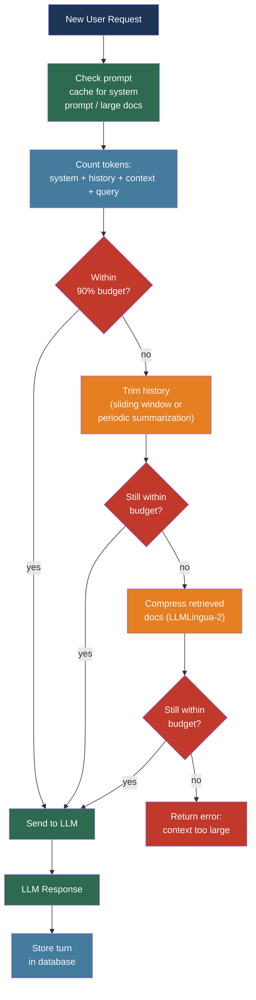

# [BEE-512] LLM Context Window Management

:::info
The context window is the one finite resource shared by every component of an LLM request — system prompt, conversation history, retrieved documents, and generated output. Managing it well determines cost, latency, and whether the model can actually find and use the information you put in front of it.
:::

## Context

Every transformer-based LLM has a maximum token budget for a single forward pass: the context window. Tokens represent both input (prompt + retrieved context + conversation history) and output (generated text). The advertised sizes — 128K tokens for GPT-4o, 1M tokens for Claude and Gemini 1.5 Pro — represent a hard upper bound enforced by the API. Exceeding it produces an error or silent truncation.

The practical picture is more constrained than the advertised numbers suggest. Liu et al. demonstrated in "Lost in the Middle: How Language Models Use Long Contexts" (arXiv:2307.03172, TACL 2024) that model performance follows a U-shaped curve across context position: information at the beginning and end of the context window is recalled far more reliably than information placed in the middle. Performance on multi-document question answering dropped more than 30% when the relevant document moved from a boundary position to the middle. This holds across all tested frontier models, though the severity decreases with newer models.

Two additional constraints compound the positional degradation. First, prefill latency — the time the model spends processing the input before generating the first token — scales linearly with input length. A 100K-token context has roughly 10× the TTFT of a 10K-token context. Second, input tokens are billed at provider pricing regardless of whether the model attends to them effectively. Stuffing a 200K-token context with documents that the model will partially ignore is not free: the cost is the same whether the model read and understood every paragraph or skimmed past 60% of them.

These three forces — positional recall degradation, prefill latency, and per-token cost — make context window management a first-class engineering concern, not a secondary optimization.

## Design Thinking

The context window is a fixed-capacity budget that must be allocated across competing demands:

```
Total context budget = system_prompt + history + retrieved_context + output_reserve
```

Every token allocated to one component is unavailable to others. A system prompt that grew to 15K tokens through accumulated instructions leaves 15K fewer tokens for conversation history. A RAG pipeline that stuffs 50 retrieved chunks leaves less room for model output.

The allocation problem has two regimes. For short conversations with small documents, the constraint is invisible — everything fits easily. For long-running conversations, large corpora, or document-processing pipelines, the constraint is binding and requires deliberate management: which history to keep, which documents to truncate, and when to summarize or compress.

The right mental model is memory management in a resource-constrained system. Like physical memory, context has a fixed capacity, items can be evicted, important items should be retained, and the access pattern (what the model was asked to do) should inform eviction policy.

## Best Practices

### Count Tokens Before Sending and Allocate a Budget

**MUST** count tokens before constructing the final request. APIs enforce the limit at submission time; discovering an overflow after assembling a multi-component prompt wastes the work of all preceding steps.

**SHOULD** use the provider's native tokenizer for accurate counts. OpenAI's `tiktoken` library counts tokens exactly for all OpenAI models:

```python
import tiktoken

def count_tokens(text: str, model: str = "gpt-4o") -> int:
    enc = tiktoken.encoding_for_model(model)
    return len(enc.encode(text))

def fits_in_budget(components: dict[str, str], model: str, limit: int) -> bool:
    total = sum(count_tokens(text, model) for text in components.values())
    return total <= limit * 0.90  # 10% safety margin
```

**SHOULD** define explicit token budgets for each component and enforce them independently. A budget that is never written down is a budget that will be violated:

| Component | Recommended allocation |
|-----------|----------------------|
| System prompt | 2–5K tokens (keep small; optimize ruthlessly) |
| Conversation history | 30–40% of remaining budget |
| Retrieved context (RAG) | 40–50% of remaining budget |
| Output reserve | 10–15% of remaining budget |
| Safety margin | 5–10% |

**MUST NOT** allocate the entire context window to input with no output reserve. Models that hit the context limit mid-generation truncate silently; the response ends without warning at the token boundary.

### Manage Conversation History Explicitly

Unbounded conversation history is the most common cause of context limit errors in production chat applications. After 20–30 turns, most conversations exceed the practical budget for history.

**SHOULD** implement one of four strategies based on application requirements:

**Sliding window**: Keep the last N turns verbatim, discard older messages. Simple to implement, bounded in memory, but loses early context. Appropriate for task-completion chatbots where the current task is the only relevant context.

**Periodic summarization**: After every K turns (or when history token count crosses a threshold), summarize the accumulated turns and replace them with the summary. Preserves semantic continuity at significantly lower token cost:

```python
SUMMARIZE_THRESHOLD = 0.70  # summarize when history uses 70% of history budget

def maybe_summarize_history(messages: list, budget: int, model: str) -> list:
    history_tokens = sum(count_tokens(m["content"], model) for m in messages)
    if history_tokens < budget * SUMMARIZE_THRESHOLD:
        return messages
    # Summarize the oldest 60% of turns, keep the newest 40% verbatim
    cutoff = len(messages) * 4 // 10
    to_summarize = messages[:-cutoff]
    summary = call_llm(
        "Summarize this conversation preserving key facts and decisions:\n\n"
        + format_turns(to_summarize)
    )
    return [{"role": "system", "content": f"[Earlier conversation summary]: {summary}"}] + messages[-cutoff:]
```

**Selective retention**: Always keep the system prompt, the first user message (establishes intent), and the most recent N turns. Drop mid-conversation messages. Appropriate for customer support where the opening request and recent state matter most.

**Database-backed state**: Store the full conversation in a database keyed by conversation ID. On each turn, load only what fits: recent turns plus any extracted semantic facts. This is the only strategy that scales to arbitrarily long conversations without information loss:

```sql
-- Conversations table tracks current token usage
CREATE TABLE conversations (
  id          UUID PRIMARY KEY,
  user_id     UUID NOT NULL,
  turns       JSONB DEFAULT '[]'::jsonb,
  summary     TEXT,
  token_count INT  DEFAULT 0,
  updated_at  TIMESTAMPTZ DEFAULT now()
);
```

**MUST NOT** store conversation state in application server memory. Server restarts, horizontal scaling, and session affinity issues all cause silent conversation loss.

### Use Prompt Caching for Large Static Content

Both OpenAI and Anthropic offer prompt caching that reuses the KV cache for identical prompt prefixes, reducing cost by up to 90% and latency by up to 80% on cache hits.

**SHOULD** structure prompts so that static content (system instructions, large reference documents, tool definitions) appears first and variable content (user query, session-specific context) appears last. Cache hits require exact prefix matching; any change in earlier content invalidates the cache for all subsequent content.

```python
# Anthropic: mark cacheable content with cache_control
response = anthropic.messages.create(
    model="claude-sonnet-4-6",
    system=[
        {
            "type": "text",
            "text": "You are a support agent for AcmeCorp.",
        },
        {
            "type": "text",
            "text": PRODUCT_DOCUMENTATION,  # 50K tokens, rarely changes
            "cache_control": {"type": "ephemeral"},  # cache this block
        },
    ],
    messages=conversation_turns,  # variable, not cached
    max_tokens=2048,
)
```

**SHOULD** use prompt caching when: the system prompt exceeds 2K tokens, a large document is reused across many requests (FAQ processing, code review over a large file), or tool definitions are lengthy.

**MUST NOT** place user-specific or request-specific content before the cached prefix. Cache invalidation happens at the first differing token; anything after an uncached token also misses the cache.

### Apply Context Compression for Large Documents

When a document or corpus is too large to fit within the available context budget even after history management, compression is preferable to truncation. Truncation discards content silently; compression preserves information density.

**SHOULD** use LLMLingua-2 (arXiv:2403.12968, ACL 2024) for token-level compression of documents before injection. It frames compression as a token classification problem (keep or drop), runs 3–6× faster than the original LLMLingua, and achieves near-lossless compression at ratios up to 6×:

```python
# LLMLingua-2 reduces document tokens by 4-6x
from llmlingua import PromptCompressor

compressor = PromptCompressor(
    model_name="microsoft/llmlingua-2-bert-base-multilingual-cased-meetingbank",
    use_llmlingua2=True,
)

compressed = compressor.compress_prompt(
    long_document,
    rate=0.33,           # keep 33% of tokens (3x compression)
    force_tokens=["\n"], # always preserve newlines (structural)
)
```

**SHOULD** compress older retrieved chunks before newer ones. Recent context tends to be more relevant to the current query; preserve it at full fidelity and compress the background material.

**SHOULD** prefer chunked summarization for documents that must be understood holistically rather than retrieved from:

```
Document (500K tokens) → split into 50 chunks of 10K
  → summarize each chunk to 200 tokens (50× compression per chunk)
  → 50 summaries = 10K tokens total
  → fits easily in context
```

### Place Critical Information at Context Boundaries

Given the U-shaped recall curve from Liu et al., the position of information within the context window is as important as the information itself.

**MUST** place the highest-priority information at the beginning or end of the context window. When assembling a prompt that includes both a system prompt and retrieved documents, the system prompt goes first (always), and the most relevant retrieved chunk goes immediately after or immediately before the user query.

**SHOULD** apply this structure for multi-document RAG:

```
[System prompt]          ← always first
[Most relevant chunk]    ← immediately after system prompt
[Supporting chunks]      ← middle (lower recall, acceptable for background)
[Conversation history]   ← end (recency bias helps here)
[User query]             ← last
```

**MUST NOT** inject retrieved chunks in arbitrary order. The order produced by a vector similarity search (most similar first) is not the optimal injection order. Rerank and then position the top result at the front, not in the middle of a list.

### Guard Against Context Overflow in Production

**MUST** validate token counts before every API call and handle overflow gracefully rather than propagating a 400 error to the user:

```python
MAX_CONTEXT = 128_000  # GPT-4o limit
SAFETY_MARGIN = 0.95   # use at most 95%

def send_with_overflow_guard(messages, system, model="gpt-4o"):
    total = count_tokens(system, model) + sum(
        count_tokens(m["content"], model) for m in messages
    )
    if total > MAX_CONTEXT * SAFETY_MARGIN:
        # Progressively reduce: compress, then trim history
        messages = trim_history(messages, target_tokens=MAX_CONTEXT * 0.60, model=model)
        total = count_tokens(system, model) + sum(
            count_tokens(m["content"], model) for m in messages
        )
    if total > MAX_CONTEXT * SAFETY_MARGIN:
        raise ContextOverflowError(f"Cannot fit request in {MAX_CONTEXT} tokens after reduction")
    return client.chat.completions.create(model=model, messages=messages, ...)
```

**SHOULD** emit a metric for every request: context utilization percentage, whether compression was applied, and TTFT. Alert when the P95 utilization exceeds 85% — approaching the limit consistently means a component's growth is unconstrained.

## Visual



## Related BEEs

- [BEE-509](509.md) -- RAG Pipeline Architecture: retrieved chunks are a major consumer of context budget; chunk size and reranking directly affect how many documents fit alongside conversation history
- [BEE-503](503.md) -- LLM API Integration Patterns: semantic caching and prompt caching are cost-reduction techniques that depend on stable prompt prefixes — context structure affects cache hit rate
- [BEE-511](511.md) -- LLM Observability and Monitoring: token count per request and context utilization percentage are key metrics to track; TTFT increases with context length and should be measured separately
- [BEE-504](504.md) -- AI Agent Architecture Patterns: long-running agents accumulate tool call history and intermediate results that can exhaust the context window; memory management patterns apply directly

## References

- [Nelson F. Liu et al. Lost in the Middle: How Language Models Use Long Contexts — arXiv:2307.03172, TACL 2024](https://arxiv.org/abs/2307.03172)
- [Huiqiang Jiang et al. LLMLingua: Compressing Prompts for Accelerated Inference of Large Language Models — arXiv:2310.05736, EMNLP 2023](https://arxiv.org/abs/2310.05736)
- [Zhuoshi Pan et al. LLMLingua-2: Data Distillation for Efficient and Faithful Task-Agnostic Prompt Compression — arXiv:2403.12968, ACL 2024](https://arxiv.org/abs/2403.12968)
- [Gemini Team. Gemini 1.5: Unlocking Multimodal Understanding Across Millions of Tokens of Context — arXiv:2403.05530, 2024](https://arxiv.org/abs/2403.05530)
- [Bertram Shi et al. Long Context vs. RAG for LLMs: An Evaluation — arXiv:2501.01880, 2025](https://arxiv.org/abs/2501.01880)
- [OpenAI. Prompt Caching — developers.openai.com](https://developers.openai.com/api/docs/guides/prompt-caching)
- [Anthropic. Prompt Caching — platform.claude.com](https://platform.claude.com/docs/en/build-with-claude/prompt-caching)
- [OpenAI. How to count tokens with tiktoken — cookbook.openai.com](https://cookbook.openai.com/examples/how_to_count_tokens_with_tiktoken)
- [Microsoft. LLMLingua project — github.com/microsoft/LLMLingua](https://github.com/microsoft/LLMLingua)
