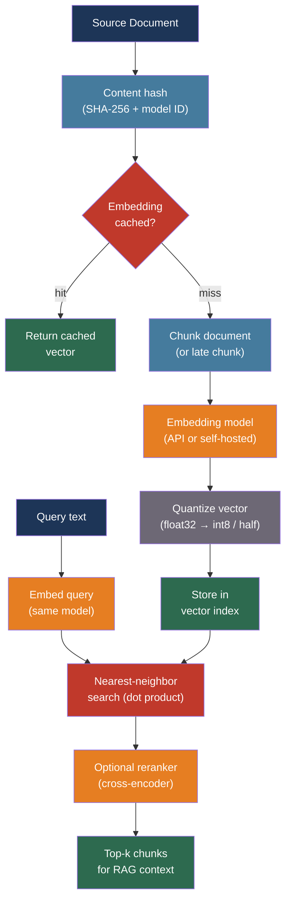

# [BEE-516] Embedding Models and Vector Representations

:::info
An embedding model converts text into a dense numeric vector such that semantically similar texts produce geometrically close vectors. Choosing the right model, dimensionality, distance metric, and caching strategy determines retrieval quality across the RAG pipeline, semantic search, and recommendation features that depend on it.
:::

## Context

Every transformer-based LLM produces internal vector representations of tokens. An embedding model is a transformer that is specifically fine-tuned to project an entire sequence of tokens — a sentence, a paragraph, a document — into a single dense vector that captures its semantic meaning. The geometry of this vector space encodes relationships: "machine learning" and "deep learning" produce nearby vectors; "machine learning" and "quarterly earnings" do not.

The practical consequence is that nearest-neighbor search in embedding space approximates semantic similarity. This underpins retrieval-augmented generation (RAG), semantic search, document clustering, anomaly detection, and recommendation systems. The quality of all these downstream applications is directly bounded by the quality of the embedding model.

Two pooling strategies are used to collapse per-token representations into a single vector. CLS-token pooling takes the representation of the first token (a special classification token prepended to every sequence). Mean pooling averages all token representations across the sequence. Mean pooling consistently outperforms CLS pooling on semantic similarity benchmarks and is the default for modern embedding models.

The Massive Text Embedding Benchmark (MTEB, arXiv:2210.07316, 2022) is the standard for comparing embedding models across 56 datasets and 8 task categories: classification, clustering, pair classification, reranking, retrieval, semantic textual similarity (STS), summarization, and bitext mining. The MTEB leaderboard at huggingface.co/spaces/mteb/leaderboard provides a continuously updated ranking. For retrieval-focused applications, NDCG@10 (normalized discounted cumulative gain at rank 10) on the BEIR benchmark is the most predictive metric.

## Design Thinking

Three decisions dominate embedding model selection:

**Quality vs. cost**: Larger models (7B+ parameters) top the MTEB leaderboard but cost more to run and produce higher-dimensional vectors that increase storage and index build time. For most production workloads, a model in the 400–600M parameter range achieves 90–95% of the leaderboard-topper's quality at a fraction of the inference cost.

**Hosted API vs. self-hosted**: Hosted embedding APIs (OpenAI, Cohere) require no infrastructure but introduce per-token cost, rate limits, and vendor lock-in at the data layer. Self-hosted models (BGE, E5) eliminate per-token cost but require GPU infrastructure. The crossover depends on request volume and document corpus size.

**General vs. domain-specific**: General embedding models trained on web-scale data cover most domains adequately. Specialized domains — biomedical, legal, code — benefit from models fine-tuned on domain-specific corpora, because general models may lack the vocabulary or register to distinguish closely related domain concepts.

## Best Practices

### Select a Model Against the MTEB Benchmark

**SHOULD** evaluate embedding model candidates on the MTEB retrieval subtask using a sample from your own document corpus and query distribution. The leaderboard reports average scores across many domains; your domain may behave differently.

Current leading models across the quality/cost spectrum:

| Model | Dimensions | Context | Best for |
|-------|-----------|---------|---------|
| NVIDIA NV-Embed-v2 | 4096 | 32K | Highest quality; GPU required |
| intfloat/e5-mistral-7b-instruct | 4096 | 32K | High quality; English; GPU required |
| openai/text-embedding-3-large | 3072 | 8K | Managed API; highest OpenAI quality |
| BAAI/bge-m3 | 1024 | 8192 | Multilingual; self-hostable; hybrid retrieval |
| openai/text-embedding-3-small | 1536 | 8K | Managed API; good quality/cost ratio |
| BAAI/bge-large-en-v1.5 | 1024 | 512 | English; self-hostable; no instruction needed |
| Jina embeddings v3 | 1024 | 8192 | Multilingual; late chunking support; Matryoshka |

**SHOULD** use the embedding model that produced the indexed documents to embed queries. Mixing embedding models across index and query produces garbage results — vectors from different models live in incompatible spaces.

**MUST NOT** switch the embedding model for a live index without re-embedding the entire document corpus first. Embedding drift — where query vectors and document vectors are produced by different model versions — silently degrades retrieval quality without throwing errors.

### Understand Distance Metrics and Normalize Vectors

**MUST** use the distance metric that matches how the embedding model was trained. Most modern embedding models are trained with cosine similarity; their vectors are L2-normalized before returning them.

For L2-normalized vectors, cosine similarity equals dot product:

```
cosine(a, b) = (a · b) / (|a| × |b|)
             = a · b   (when |a| = |b| = 1)
```

**SHOULD** prefer dot product over cosine similarity in production vector databases — the computation is equivalent for normalized vectors but dot product avoids the normalization step:

```python
import numpy as np

def embed(text: str, model) -> np.ndarray:
    vec = model.encode(text)
    return vec / np.linalg.norm(vec)  # L2 normalize if model doesn't do it

# Dot product search is equivalent to cosine for normalized vectors
def retrieve(query: str, index, model, top_k: int = 10):
    q_vec = embed(query, model)
    # In pgvector: SELECT * FROM docs ORDER BY embedding <#> $1 LIMIT 10
    # <#> is negative inner product (maximizing = finding nearest)
    return index.search(q_vec, top_k, metric="dot_product")
```

**SHOULD** use Euclidean (L2) distance only when the magnitude of the vector carries meaning — which is rare for text embeddings. Cosine/dot product is the default correct choice.

### Use Matryoshka Embeddings for Storage Efficiency

Matryoshka Representation Learning (MRL, arXiv:2205.13147, NeurIPS 2022) trains models so that the first N dimensions of a full-size embedding are themselves a valid lower-dimensional embedding. This enables truncating embedding dimensions without retraining:

**SHOULD** use Matryoshka-capable models (OpenAI text-embedding-3, Jina v3, bge-m3) and test whether truncating to half or quarter dimensions is acceptable for your quality requirements:

```python
from openai import OpenAI

client = OpenAI()

# Full 3072-dimensional embedding
full = client.embeddings.create(
    model="text-embedding-3-large",
    input="The circuit breaker pattern prevents cascading failures.",
)

# Truncated to 1024 dimensions — valid Matryoshka sub-embedding
compact = client.embeddings.create(
    model="text-embedding-3-large",
    input="The circuit breaker pattern prevents cascading failures.",
    dimensions=1024,   # reduces storage by 3x; OpenAI normalizes before truncating
)
```

For OpenAI text-embedding-3-large: truncating from 3072 to 1024 dimensions reduces storage by 3× while retaining approximately 95% of retrieval quality on most benchmarks. Truncating to 256 dimensions reduces by 12× with roughly 85% retention.

**SHOULD** evaluate truncated vs. full dimensions on a held-out retrieval benchmark before committing to a dimension choice. The optimal truncation point varies by domain.

### Apply Vector Quantization for Large Indexes

For indexes exceeding 10 million vectors, float32 storage becomes prohibitive:

| Format | Bytes/dimension | 1M × 1536-dim | Speed |
|--------|----------------|--------------|-------|
| float32 | 4 | 6.1 GB | baseline |
| float16 | 2 | 3.1 GB | ~1.5× |
| int8 | 1 | 1.5 GB | ~3.7× |
| binary | 0.125 | 192 MB | ~25× |

**SHOULD** use int8 scalar quantization as the default for large indexes. It reduces storage by 4× and query latency by approximately 3.7× with an accuracy loss typically below 2% on MTEB retrieval benchmarks:

```python
# pgvector: create index with int8 quantization (pgvector 0.7+)
CREATE INDEX ON documents
  USING hnsw (embedding vector_ip_ops)  -- inner product (for normalized vectors)
  WITH (m = 16, ef_construction = 64);

-- Or use halfvec type for automatic float16 storage:
ALTER TABLE documents ALTER COLUMN embedding TYPE halfvec(1536);
```

**MAY** use binary quantization (1 bit per dimension) for very large indexes where a two-pass retrieval is acceptable: binary search over the full index to get a large candidate set, then re-score with float32 vectors for the final top-k.

### Apply Late Chunking for Long Documents

Standard chunking — split document into chunks, embed each chunk independently — loses cross-chunk context. A chunk that contains "the aforementioned theorem" has no embedding-level access to what "aforementioned" refers to.

Late chunking (arXiv:2409.04701, 2024) inverts the order: embed the entire document first to get per-token representations with full context, then extract chunk embeddings by mean-pooling the token representations within each chunk boundary:

```python
# Jina late chunking via API parameter
import requests

response = requests.post(
    "https://api.jina.ai/v1/embeddings",
    headers={"Authorization": f"Bearer {JINA_API_KEY}"},
    json={
        "model": "jina-embeddings-v3",
        "input": [full_document],   # entire document, up to 8192 tokens
        "late_chunking": True,      # returns one embedding per chunk
        "task": "retrieval.passage",
    },
)
# Response contains one embedding per logical chunk, with cross-chunk context
chunk_embeddings = response.json()["data"]
```

**SHOULD** use late chunking for documents where chunks frequently reference entities, definitions, or conclusions from other parts of the same document. Technical specifications, legal contracts, and academic papers benefit most.

**SHOULD** consider Anthropic's contextual retrieval technique as an alternative when late chunking is unavailable: use a fast LLM call to prepend a context summary (generated from the full document) to each chunk before embedding. This adds one LLM call per chunk at indexing time but uses prompt caching to reduce cost. Anthropic reports a 49% reduction in retrieval failures, rising to 67% when combined with reranking.

### Cache Embeddings by Content Hash

Embedding the same text repeatedly wastes API quota and compute. Documents are re-embedded on every index rebuild unless the pipeline is idempotent.

**SHOULD** use content-addressed caching: hash the input text plus the model identifier; store the vector keyed by that hash:

```python
import hashlib
import json

def embed_with_cache(text: str, model: str, cache) -> list[float]:
    key = hashlib.sha256(f"{model}:{text}".encode()).hexdigest()
    cached = cache.get(key)
    if cached:
        return json.loads(cached)
    vec = embedding_api.embed(text, model=model)
    cache.set(key, json.dumps(vec), ex=86400 * 30)  # 30-day TTL
    return vec
```

**SHOULD** invalidate the cache on model version changes. A model version bump produces incompatible vectors; mixing cached vectors from an old model with new embeddings silently corrupts the index.

**MUST NOT** use input text alone as the cache key — always include the model identifier. Two models can produce the same cache key for the same input but return vectors in incompatible spaces.

### Handle Embedding Model Updates Safely

**MUST** treat an embedding model update as a breaking change to the index. Both document and query vectors must come from the same model. A safe update procedure:

1. Build a new index in parallel using the new model against the full document corpus
2. Run A/B retrieval evaluation comparing old and new indexes on a query benchmark
3. Switch query traffic to the new index atomically (blue/green deployment)
4. Decommission the old index after validation

**SHOULD** version-stamp every embedding with its model identifier and model version in the vector store metadata. This makes detecting mixed-model indexes mechanically detectable:

```sql
-- Detect index corruption: vectors from multiple model versions
SELECT embedding_model, COUNT(*) 
FROM document_embeddings 
GROUP BY embedding_model;
-- Should return exactly one row
```

## Visual



## Related BEEs

- [BEE-509](509.md) -- RAG Pipeline Architecture: embedding models are the core component of both the indexing and query pipelines in RAG; chunk size decisions interact directly with the model's context window
- [BEE-383](../Search/383.md) -- Vector Search and Semantic Search: ANN index structures (HNSW, IVF) and approximate search tradeoffs apply directly to embedding-based retrieval
- [BEE-513](513.md) -- AI Cost Optimization and Model Routing: embedding API calls have their own per-token cost that compounds at indexing scale; caching and quantization are cost levers
- [BEE-511](511.md) -- LLM Observability and Monitoring: embedding latency and cache hit rate should be tracked as separate metrics from generation latency in RAG systems

## References

- [Niklas Muennighoff et al. MTEB: Massive Text Embedding Benchmark — arXiv:2210.07316, EMNLP 2023](https://arxiv.org/abs/2210.07316)
- [Aditya Kusupati et al. Matryoshka Representation Learning — arXiv:2205.13147, NeurIPS 2022](https://arxiv.org/abs/2205.13147)
- [Michael Günther et al. Late Chunking: Contextual Chunk Embeddings Using Long-Context Embedding Models — arXiv:2409.04701, 2024](https://arxiv.org/abs/2409.04701)
- [Aamir Shakir et al. NV-Embed: Improved Techniques for Training LLMs as Generalist Embedding Models — arXiv:2405.17428, 2024](https://arxiv.org/abs/2405.17428)
- [MTEB Leaderboard — huggingface.co/spaces/mteb/leaderboard](https://huggingface.co/spaces/mteb/leaderboard)
- [OpenAI. Embeddings Guide — developers.openai.com](https://developers.openai.com/api/docs/guides/embeddings)
- [Cohere. Embed Documentation — docs.cohere.com](https://docs.cohere.com/docs/cohere-embed)
- [BAAI. bge-m3 Model Card — huggingface.co/BAAI/bge-m3](https://huggingface.co/BAAI/bge-m3)
- [JinaAI. Late Chunking in Long-Context Embedding Models — jina.ai](https://jina.ai/news/late-chunking-in-long-context-embedding-models/)
- [Anthropic. Contextual Retrieval — anthropic.com/news](https://www.anthropic.com/news/contextual-retrieval)
- [Hugging Face. Embedding Quantization — huggingface.co/blog](https://huggingface.co/blog/embedding-quantization)
