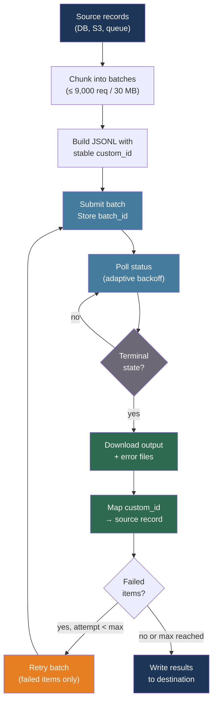

# [BEE-527] LLM Batch Processing Patterns

:::info
Batch processing APIs from OpenAI and Anthropic offer 50% cost discounts in exchange for up to 24-hour completion windows — the key engineering work is structuring JSONL inputs for idempotency, mapping custom IDs back to source records, and building retry logic that resubmits only failed items.
:::

## Context

Real-time LLM API calls are optimized for interactivity: low latency, immediate responses, high per-token pricing. Many production workloads do not need interactivity. Classifying 500,000 support tickets overnight, generating embeddings for a document corpus, enriching a product catalog with AI-written descriptions — these jobs are throughput-bound and latency-tolerant. Routing them through a real-time API path wastes money and competes with interactive traffic for rate limit quota.

Both OpenAI (launched in 2024) and Anthropic offer asynchronous batch APIs that exploit this asymmetry. OpenAI's Batch API offers 50% off input tokens with a 24-hour SLA and accepts up to 50,000 requests per batch at up to 200 MB. Anthropic's Message Batches API offers 50% off both input and output tokens with a typical completion time of one hour and a 24-hour ceiling, accepting up to 10,000 requests per batch. Batch rate limits are separate from synchronous API quota, so large batch jobs do not degrade interactive features.

The 50% discount compounds with other cost levers. Anthropic's discount stacks with prompt caching, enabling up to 95% total savings on repeated system prompts within a batch. At scale — one million classification requests per day — the difference between real-time and batch pricing is hundreds of dollars per day.

## Design Thinking

The batch vs. real-time routing decision should be made at workflow design time, not per-request. The primary criteria:

**Use batch** when: the result is consumed by a downstream job (not a waiting user), latency can be measured in hours, and the workload is large enough that the 50% discount is material.

**Use real-time** when: a human is waiting for the response, latency must be below seconds, or the workload is small enough that the discount does not justify the operational complexity.

The most common production pattern is a hybrid: real-time calls for interactive features (chat, autocomplete, instant classification), batch calls for all background enrichment, evaluation runs, and scheduled processing. These two paths share the same prompts and models but use different API endpoints and budgets.

## Best Practices

### Choose the Right Workloads for Batching

**SHOULD** route these workload types to batch APIs:

| Workload | Why batch fits |
|---|---|
| Document classification at scale | Latency-tolerant, high volume, deterministic prompts |
| Embedding generation for a corpus | Computationally expensive, benefits from throughput |
| Nightly data enrichment pipelines | Results consumed by next-day jobs |
| Evaluation dataset runs | Non-interactive, cost-sensitive |
| Bulk content generation | Marketing copy, product descriptions |

**MUST NOT** use batch APIs for interactive features where a user is waiting for a response, or for time-sensitive workflows where a 24-hour delay would violate an SLA.

### Structure JSONL Inputs for Idempotency

Every batch request must include a `custom_id` that maps the result back to its source record. This is the linchpin of idempotent batch processing: if a batch partially fails, the `custom_id` lets you identify exactly which records need to be resubmitted.

For OpenAI, each line in the input JSONL file has three required fields:

```python
import json
import hashlib

def build_openai_batch_request(record_id: str, text: str, system_prompt: str) -> dict:
    """
    custom_id: stable, deterministic identifier derived from the source record.
    Using a hash of the content (not just the DB ID) means re-running the same
    record with the same input produces the same custom_id — useful for deduplication.
    """
    content_hash = hashlib.sha256(f"{record_id}:{text}".encode()).hexdigest()[:16]
    return {
        "custom_id": f"rec-{record_id}-{content_hash}",
        "method": "POST",
        "url": "/v1/chat/completions",
        "body": {
            "model": "gpt-4o-mini",
            "messages": [
                {"role": "system", "content": system_prompt},
                {"role": "user", "content": text},
            ],
            "max_tokens": 256,
            "temperature": 0,   # Deterministic output for classification
        },
    }

def write_batch_jsonl(records: list[dict], system_prompt: str, path: str):
    with open(path, "w") as f:
        for record in records:
            line = build_openai_batch_request(record["id"], record["text"], system_prompt)
            f.write(json.dumps(line) + "\n")
```

For Anthropic, the structure uses a `params` field instead of direct API fields:

```python
def build_anthropic_batch_request(record_id: str, text: str, system_prompt: str) -> dict:
    return {
        "custom_id": f"rec-{record_id}",
        "params": {
            "model": "claude-haiku-4-5-20251001",
            "max_tokens": 256,
            "system": system_prompt,
            "messages": [{"role": "user", "content": text}],
        },
    }
```

### Submit and Poll Batches

**SHOULD** treat batch submission and polling as separate, resumable steps. Store the `batch_id` durably at submission time so the polling job can resume if interrupted:

```python
import time
from openai import OpenAI

client = OpenAI()

def submit_openai_batch(jsonl_path: str) -> str:
    """Upload file and create batch. Returns batch_id for polling."""
    with open(jsonl_path, "rb") as f:
        uploaded = client.files.create(file=f, purpose="batch")

    batch = client.batches.create(
        input_file_id=uploaded.id,
        endpoint="/v1/chat/completions",
        completion_window="24h",
    )
    # Persist batch.id to database before returning
    return batch.id

def poll_openai_batch(batch_id: str, poll_interval_seconds: int = 60) -> dict:
    """
    Poll until terminal state. Statuses:
    validating → in_progress → finalizing → completed | failed | expired
    """
    terminal = {"completed", "failed", "expired", "cancelled"}
    while True:
        batch = client.batches.retrieve(batch_id)
        if batch.status in terminal:
            return {
                "status": batch.status,
                "output_file_id": batch.output_file_id,
                "error_file_id": batch.error_file_id,
                "request_counts": batch.request_counts,
            }
        time.sleep(poll_interval_seconds)
```

For Anthropic:

```python
import anthropic

ac = anthropic.Anthropic()

def submit_anthropic_batch(requests: list[dict]) -> str:
    batch = ac.messages.batches.create(requests=requests)
    return batch.id  # Persist before returning

def poll_anthropic_batch(batch_id: str, poll_interval_seconds: int = 60) -> str:
    """Processing statuses: in_progress → ended (check results_url)."""
    while True:
        batch = ac.messages.batches.retrieve(batch_id)
        if batch.processing_status == "ended":
            return batch_id
        time.sleep(poll_interval_seconds)
```

**SHOULD** use exponential backoff on polling rather than a fixed interval. Batches submitted just before the end of a long queue may complete quickly; applying linear polling wastes API calls on early batches and delays detection on slow ones:

```python
def adaptive_poll(batch_id: str, initial_interval: int = 10, max_interval: int = 300):
    interval = initial_interval
    while True:
        status = client.batches.retrieve(batch_id).status
        if status in {"completed", "failed", "expired", "cancelled"}:
            return status
        time.sleep(interval)
        interval = min(interval * 1.5, max_interval)
```

### Download Results and Map Back to Source Records

**MUST** use `custom_id` to map each result back to its source record. Batch APIs return results in arbitrary order; index on `custom_id` before processing:

```python
import json
from collections import defaultdict

def parse_openai_results(output_file_id: str, error_file_id: str | None) -> dict:
    """
    Returns {"succeeded": {custom_id: response_text}, "failed": {custom_id: error}}.
    """
    succeeded = {}
    failed = {}

    content = client.files.content(output_file_id).text
    for line in content.strip().splitlines():
        result = json.loads(line)
        cid = result["custom_id"]
        if result["response"]["status_code"] == 200:
            body = result["response"]["body"]
            succeeded[cid] = body["choices"][0]["message"]["content"]
        else:
            failed[cid] = result["response"]["body"]

    if error_file_id:
        error_content = client.files.content(error_file_id).text
        for line in error_content.strip().splitlines():
            err = json.loads(line)
            failed[err["custom_id"]] = err.get("error", {})

    return {"succeeded": succeeded, "failed": failed}
```

For Anthropic, iterate the streaming results endpoint:

```python
def parse_anthropic_results(batch_id: str) -> dict:
    succeeded = {}
    failed = {}
    for result in ac.messages.batches.results(batch_id):
        cid = result.custom_id
        if result.result.type == "succeeded":
            succeeded[cid] = result.result.message.content[0].text
        else:
            failed[cid] = result.result.error
    return {"succeeded": succeeded, "failed": failed}
```

### Retry Only Failed Items

**MUST** retry only the records that failed, not the entire batch. Resubmitting succeeded records wastes compute and risks duplicate writes in downstream systems:

```python
async def process_batch_with_retry(
    records: list[dict],
    system_prompt: str,
    max_retries: int = 2,
) -> dict[str, str]:
    """
    Returns {record_id: result_text} for all records that eventually succeeded.
    """
    pending = {r["id"]: r for r in records}
    final_results = {}

    for attempt in range(max_retries + 1):
        if not pending:
            break

        # Build and submit batch for pending records only
        requests = [
            build_anthropic_batch_request(rid, r["text"], system_prompt)
            for rid, r in pending.items()
        ]
        batch_id = submit_anthropic_batch(requests)
        poll_anthropic_batch(batch_id)
        results = parse_anthropic_results(batch_id)

        for custom_id, text in results["succeeded"].items():
            record_id = custom_id.replace("rec-", "")
            final_results[record_id] = text
            pending.pop(record_id, None)

        # Records still in pending after this attempt will be retried
        if results["failed"] and attempt < max_retries:
            time.sleep(30 * (2 ** attempt))  # Backoff between retry batches

    return final_results
```

### Chunk Large Datasets

**MUST** split datasets that exceed API limits into multiple batches. OpenAI enforces 50,000 requests and 200 MB per batch; Anthropic enforces 10,000 requests and 32 MB:

```python
def chunk_records(records: list[dict], chunk_size: int) -> list[list[dict]]:
    return [records[i:i + chunk_size] for i in range(0, len(records), chunk_size)]

async def process_large_dataset(records: list[dict], system_prompt: str) -> dict[str, str]:
    """Submit multiple batches in sequence; collect all results."""
    results = {}
    for chunk in chunk_records(records, chunk_size=9_000):  # Stay under 10,000 limit
        chunk_results = await process_batch_with_retry(chunk, system_prompt)
        results.update(chunk_results)
    return results
```

**SHOULD** persist each `batch_id` and its associated record IDs to a durable store before polling. If the polling process crashes, the batch continues processing server-side and the IDs allow you to resume collection without resubmitting:

```python
# Pseudocode — adapt to your actual data store
batch_tracking = {
    "batch_id": batch_id,
    "record_ids": [r["id"] for r in chunk],
    "submitted_at": datetime.utcnow().isoformat(),
    "status": "in_progress",
}
db.batch_jobs.insert(batch_tracking)
```

### Monitor Batch Pipeline Health

**MUST** track these metrics per batch run:

| Metric | What it reveals |
|---|---|
| Success rate (succeeded / total) | Data quality and prompt correctness |
| Error rate by error type | Systemic prompt failures vs. transient API errors |
| Cost per batch (tokens × batch price) | Budget tracking and per-record cost |
| Completion time | Whether batches are finishing within SLA |
| Retry count distribution | Whether retries are effective or masking a structural problem |

**SHOULD** alert when a batch remains in `validating` or `finalizing` state longer than 30 minutes, or when the error rate on a batch exceeds 5%. Either signals a problem with the input JSONL format or the prompt template.

## Visual



## Related BEEs

- [BEE-503](503.md) -- LLM API Integration Patterns: retry and timeout patterns for the submission and polling steps; structured error handling for batch API responses
- [BEE-513](513.md) -- AI Cost Optimization and Model Routing: batch processing is the primary cost lever for offline workloads; the routing layer in BEE-513 should direct non-interactive requests to the batch path
- [BEE-526](526.md) -- LLM Caching Strategies: prompt caching stacks with batch discounts on Anthropic; the two layers together can reach 90-95% savings on repeated prompts at batch scale
- [BEE-487](487.md) -- Background Job and Task Queue Architecture: batch job orchestration follows the same durable job queue principles; batch_id tracking maps to job state machine patterns in BEE-487

## References

- [OpenAI. Batch API Guide — platform.openai.com](https://platform.openai.com/docs/guides/batch)
- [OpenAI. Batch API Reference — platform.openai.com](https://platform.openai.com/docs/api-reference/batch)
- [OpenAI. Batch API FAQ — help.openai.com](https://help.openai.com/en/articles/9197833-batch-api-faq)
- [Anthropic. Message Batches API — platform.claude.com](https://platform.claude.com/docs/en/build-with-claude/batch-processing)
- [Anthropic. Creating Message Batches — docs.anthropic.com](https://docs.anthropic.com/en/api/creating-message-batches)
- [OpenAI Cookbook. Batch Processing — cookbook.openai.com](https://cookbook.openai.com/examples/batch_processing)
