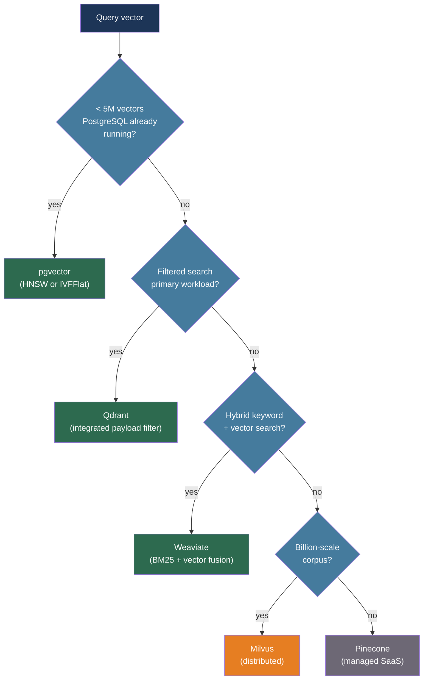

# [BEE-528] Vector Database Architecture

:::info
Vector databases store high-dimensional embeddings and answer approximate nearest neighbor queries in milliseconds — the key engineering decisions are which ANN algorithm to use, how to size memory for the index, and how to handle metadata filtering without breaking recall.
:::

## Context

Traditional databases index scalar values and answer exact equality or range queries. Semantic search, RAG pipelines, and recommendation systems need a different primitive: given a query vector, find the k vectors in the database most similar to it. Exhaustive comparison against every stored vector — the brute-force baseline — scales as O(n) per query and becomes impractical beyond a few hundred thousand records.

The theoretical foundation is the approximate nearest neighbor (ANN) problem. Indyk and Motwani (STOC 1998) showed that locality-sensitive hashing could answer nearest-neighbor queries sub-linearly, at the cost of returning approximate rather than exact results. The practical breakthrough was HNSW (Hierarchical Navigable Small World), published by Malkov and Yashunin (arXiv:1603.09320, IEEE TPAMI 2020). HNSW builds a layered graph where each vector is connected to its nearest neighbors; queries traverse the graph top-down, greedily following the closest neighbor at each layer until reaching the bottom layer. Query and insert complexity is O(log n), and HNSW consistently dominates the recall–QPS frontier on the ANN-benchmarks leaderboard (ann-benchmarks.com).

The embedding explosion — sparked by transformer models and popularized by OpenAI's `text-embedding-ada-002` in 2022 — created demand for purpose-built vector stores. Pinecone, Weaviate, Qdrant, and Milvus emerged as dedicated vector databases. PostgreSQL's `pgvector` extension brought vector search into an existing relational store. The choice between a dedicated vector database and pgvector involves a trade-off between operational simplicity and raw query performance.

## Design Thinking

Three decisions dominate vector database architecture:

**Algorithm selection** trades build time and memory for query recall and throughput. HNSW is the dominant choice for production: near-optimal recall at high QPS, at the cost of holding the entire graph in RAM. IVF (Inverted File Index) partitions vectors into Voronoi cells and searches a subset of cells at query time — lower memory than HNSW but requires a training pass and offers worse recall at the same QPS. Product Quantization (PQ) compresses vectors into short codes, reducing RAM by 4–8×, at a recall penalty that makes it better suited as a compression layer on top of IVF than as a standalone index.

**Filtering architecture** is the most common source of degraded recall in production. HNSW is a graph over all vectors; applying a metadata filter post-search discards results and can force the query to retrieve 10× more candidates than needed. Applying a filter pre-search disrupts graph traversal. The cleanest solution is an index that integrates metadata filtering into graph traversal — Qdrant's payload index and Weaviate's filtered search both do this. Without such integration, high-selectivity filters (< 5% of corpus matches) produce poor recall unless `efSearch` is tuned aggressively upward.

**Infrastructure placement** — dedicated vector store vs. pgvector — determines operational complexity. A team already running PostgreSQL can add pgvector and avoid a new operational dependency; the trade-off is lower throughput and a single-node HNSW index that holds everything in shared_buffers. Teams with more than a few million vectors or strict latency requirements under concurrent load should evaluate a dedicated vector database.

## Best Practices

### Match the Distance Metric to the Embedding Model

**MUST** use the distance metric that the embedding model was trained with. The embedding space is not isotropic: a model trained with cosine similarity loss produces embeddings where angular distance is meaningful; using L2 distance on those embeddings produces incorrect rankings.

| Metric | SQL / API operator | When to use |
|---|---|---|
| Cosine similarity | `<=>` (pgvector) | Text embeddings, NLP tasks |
| Inner product (dot product) | `<#>` (pgvector) | Relevance scoring, unit-normalized vectors |
| Euclidean / L2 | `<->` (pgvector) | Spatial data, image features, geometric models |

OpenAI's `text-embedding-3-*` and `text-embedding-ada-002` models use cosine similarity. Verify the model card before setting the index metric.

### Tune HNSW Parameters for Your Workload

HNSW has three parameters that govern the quality-throughput trade-off:

- **M**: Maximum bidirectional connections per node at each layer. Higher M → denser graph → better recall but more RAM and longer build time. Typical range: 8–64. Start at 16 for general workloads.
- **efConstruction**: Candidate queue size during index build. Higher efConstruction → better graph quality → better recall at query time, at the cost of slower indexing. Does not affect RAM usage after build. Typical range: 64–512.
- **efSearch** (query-time): Candidate queue size during search. The primary knob for tuning recall vs. latency at query time without rebuilding the index. Must be ≥ k (the number of neighbors to return).

**SHOULD** benchmark recall at your target latency percentile (p95) using a representative query sample from the ANN-benchmarks methodology. Raise `efSearch` until recall meets your target; raise `efConstruction` if a better index quality is needed without sacrificing query-time latency.

**MUST NOT** assume a fixed `efSearch` value is appropriate across all query types. High-selectivity filtered queries require a higher `efSearch` to maintain recall because many graph neighbors will be discarded by the filter.

### Use pgvector for Operational Simplicity at Moderate Scale

For teams already running PostgreSQL with fewer than 5–10 million vectors and p95 query latency requirements above 50 ms, pgvector eliminates a separate operational dependency:

```sql
-- Requires pgvector extension (v0.5.0+ for HNSW support)
CREATE EXTENSION IF NOT EXISTS vector;

-- Create a table with a 1536-dimensional vector column (OpenAI ada-002 / text-embedding-3-small)
CREATE TABLE documents (
    id          BIGSERIAL PRIMARY KEY,
    content     TEXT NOT NULL,
    metadata    JSONB,
    embedding   vector(1536)
);

-- Build an HNSW index with cosine distance (added in pgvector 0.5.0, 2023)
CREATE INDEX ON documents
    USING hnsw (embedding vector_cosine_ops)
    WITH (m = 16, ef_construction = 64);

-- Query: find 5 nearest neighbors by cosine distance
-- <=> is cosine distance; ORDER BY ASC returns most similar first
SET hnsw.ef_search = 100;

SELECT id, content, 1 - (embedding <=> $1::vector) AS similarity
FROM documents
ORDER BY embedding <=> $1::vector
LIMIT 5;

-- Filtered nearest-neighbor (tenant isolation via metadata)
SELECT id, content
FROM documents
WHERE metadata->>'tenant_id' = 'acme'
ORDER BY embedding <=> $1::vector
LIMIT 5;
```

**SHOULD** create a partial index or include the filter column in the index predicate when filtering on a low-cardinality column. pgvector does not integrate metadata filtering into graph traversal; without a partial index, filtered queries fall back to a sequential scan.

### Use a Dedicated Vector Database for High-Throughput Production

When concurrent query load exceeds what a single PostgreSQL instance can serve, or when index size exceeds available RAM, move to a dedicated vector database:

**Qdrant** (Rust, open-source, Apache 2.0): Integrates payload filtering into HNSW graph traversal, avoiding the pre-filter/post-filter dilemma. Scalar quantization (float32 → int8, ~4× compression) and product quantization (~8× compression) are built-in. Well-suited for filtered search at scale.

**Weaviate** (Go, open-source, Apache 2.0): Native hybrid search combining BM25 keyword ranking with vector search via Reciprocal Rank Fusion. Suitable for workloads that benefit from both lexical and semantic retrieval without a separate search engine.

**Milvus** (Go/C++, open-source, Apache 2.0): Disaggregated storage and compute; scales to billion-scale vector collections. Supports multiple index types (HNSW, IVF, DiskANN) and multi-tenancy via database → collection → partition hierarchy. Best for very large corpora requiring horizontal scaling.

**Pinecone** (managed SaaS): Serverless tier with pay-per-use; pod-based tier for predictable capacity. Eliminates all infrastructure management; suitable for teams that want vector search as a dependency rather than a service they operate.

**SHOULD** choose based on operational maturity and query pattern:
- New project, team runs PostgreSQL → pgvector
- Filtered search at scale, self-hosted → Qdrant
- Hybrid keyword + semantic search → Weaviate
- Billion-scale corpus, distributed → Milvus
- No infrastructure to manage → Pinecone

### Design Collections for Multi-Tenancy

**MUST NOT** store vectors for multiple tenants in a single collection with only a metadata field distinguishing them, then rely on post-filter to isolate tenants. At high selectivity (one tenant's data is 0.1% of the corpus), the ANN graph returns thousands of candidates from other tenants before finding k valid results.

**SHOULD** use namespace-per-tenant (Pinecone namespaces, Qdrant collections, Milvus partitions) for strong isolation. Each namespace is an independent ANN index; queries within a namespace never touch other tenants' data:

```python
# Qdrant example: one collection per tenant
from qdrant_client import QdrantClient
from qdrant_client.models import VectorParams, Distance, PointStruct

client = QdrantClient(url="http://localhost:6333")

def ensure_tenant_collection(tenant_id: str):
    collection_name = f"docs_{tenant_id}"
    if not client.collection_exists(collection_name):
        client.create_collection(
            collection_name=collection_name,
            vectors_config=VectorParams(size=1536, distance=Distance.COSINE),
        )
    return collection_name

def upsert_vectors(tenant_id: str, points: list[dict]):
    """points: list of {id, vector, payload}"""
    collection = ensure_tenant_collection(tenant_id)
    client.upsert(
        collection_name=collection,
        points=[
            PointStruct(id=p["id"], vector=p["vector"], payload=p.get("payload", {}))
            for p in points
        ],
    )

def search(tenant_id: str, query_vector: list[float], k: int = 5):
    collection = ensure_tenant_collection(tenant_id)
    return client.search(collection_name=collection, query_vector=query_vector, limit=k)
```

**MAY** use a shared collection with partition keys for tenants with small corpora (< 100k vectors each), where the overhead of per-tenant collection management outweighs isolation benefits.

### Size Memory Before Deployment

**MUST** provision enough RAM to hold the HNSW index entirely in memory. HNSW stores the full graph in RAM; evicting even a fraction to disk degrades query latency by orders of magnitude.

Approximate memory formula for an HNSW index:

```
index_size_bytes ≈ n_vectors × (vector_dim × 4 bytes) × 1.5 (graph overhead factor)
```

For 1 million vectors at 1536 dimensions with M=16:

```
1,000,000 × 1536 × 4 × 1.5 ≈ 9.2 GB
```

Add 20–30% headroom for the working set of active queries. With product quantization (int8 scalar), reduce the vector bytes by 4×:

```
1,000,000 × 1536 × 1 × 1.5 ≈ 2.3 GB (with scalar quantization)
```

**SHOULD** prototype with the Lantern HNSW memory calculator (lantern.dev/blog/calculator) to estimate memory requirements before selecting instance sizes.

## Visual



## When Not to Use a Vector Index

Not every similarity search requires ANN. Use a flat (exact) index when:

- The corpus has fewer than ~100,000 vectors and exact recall matters (e.g., deduplication).
- The query rate is low enough that O(n) exhaustive search fits within latency budget.
- The filtering selectivity is so high (< 0.1% of corpus) that building an ANN index over the full corpus wastes memory; a filtered brute-force scan over the matching subset is faster.

`pgvector` performs exact search by default when no index exists. This is acceptable for small tables and is useful during development before committing to an index type.

## Related BEEs

- [BEE-516](516.md) -- Embedding Models and Vector Representations: covers how embeddings are generated and the dimensionality choices that determine index memory requirements
- [BEE-509](509.md) -- RAG Pipeline Architecture: the vector database is the retrieval layer in every RAG system; collection design and filtering strategy directly affect RAG recall
- [BEE-517](517.md) -- Retrieval Reranking and Hybrid Search: hybrid BM25 + vector search is a native feature of Weaviate; the reranking stage sits downstream of the vector database retrieval
- [BEE-526](526.md) -- LLM Caching Strategies: semantic caching uses a vector index to detect near-duplicate queries; the same ANN infrastructure serves both purposes

## References

- [Malkov and Yashunin. Efficient and Robust ANN Search Using HNSW Graphs — arXiv:1603.09320, IEEE TPAMI 2020](https://arxiv.org/abs/1603.09320)
- [Jégou, Douze, Schmid. Product Quantization for Nearest Neighbor Search — arXiv:1102.3828, IEEE TPAMI 2011](https://arxiv.org/pdf/1102.3828)
- [Aumuller et al. ANN-Benchmarks: A Benchmarking Tool for ANN Algorithms — arXiv:1807.05614](https://arxiv.org/abs/1807.05614)
- [ANN-Benchmarks Leaderboard — ann-benchmarks.com](https://ann-benchmarks.com/)
- [pgvector: Open-Source Vector Similarity Search for PostgreSQL — github.com/pgvector/pgvector](https://github.com/pgvector/pgvector)
- [Crunchy Data. HNSW Indexes with Postgres and pgvector — crunchydata.com](https://www.crunchydata.com/blog/hnsw-indexes-with-postgres-and-pgvector)
- [Qdrant. Vector Search Filtering — qdrant.tech](https://qdrant.tech/articles/vector-search-filtering/)
- [Weaviate. Hybrid Search Documentation — docs.weaviate.io](https://docs.weaviate.io/weaviate/search/hybrid)
- [Milvus Architecture Overview — milvus.io](https://milvus.io/docs/architecture_overview.md)
- [Pinecone. Vector Database Multi-Tenancy — pinecone.io](https://www.pinecone.io/learn/series/vector-databases-in-production-for-busy-engineers/vector-database-multi-tenancy/)
