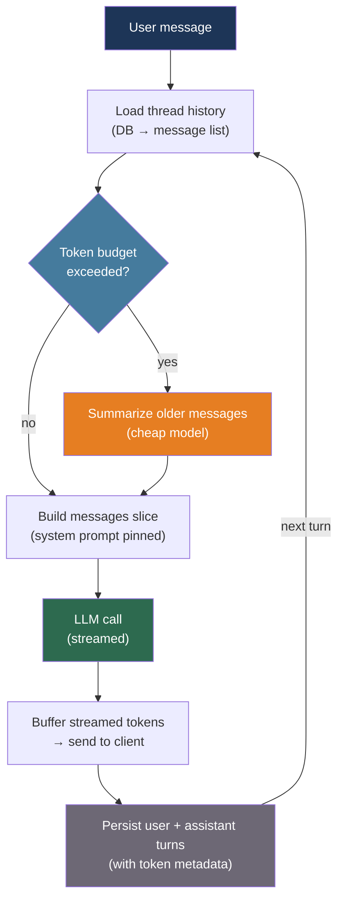

# [BEE-533] Conversational AI and Multi-Turn Dialog Architecture

:::info
A conversational AI backend is a stateful distributed system: each user turn must load prior context, send the accumulated history to the LLM, and persist the new exchange — while managing the context window that grows with every message until it must be pruned.
:::

## Context

Single-turn LLM calls are stateless HTTP requests. Conversations are not. Every turn in a multi-turn dialog depends on the full history of the exchange: the user's intent evolves, references resolve against prior messages, and the assistant must remain consistent with what it said two minutes ago.

The naive implementation stores messages in the client and replays them on every request. This works until the conversation grows beyond the model's context window, at which point the application silently truncates history, the model loses context, and quality degrades. Without active management, a model with a 200k-token context can accumulate enough conversation to overflow within a single long session.

Research quantifies the problem. An empirical study across 15 LLMs on 200,000+ simulated conversations (arXiv:2505.06120, 2025) found a 39% average performance drop from single-turn to multi-turn interactions. The dominant cause is the lost-in-the-middle effect: LLMs attend more strongly to the beginning and end of long inputs, causing crucial context in the middle to be missed.

The engineering response is a persistent session layer that decouples the message history in storage from the message slice sent to the model at each turn. The session layer owns three responsibilities: durable storage of the full conversation, selection of the relevant slice for each request, and compression of history when the slice would exceed the context budget.

## Design Thinking

A conversation has two timelines that must be managed separately:

- **Storage timeline**: the complete, append-only record of every message, tool call, and system event in the conversation. This never loses information and is the source of truth for analytics, audit, and branching.
- **Model timeline**: the message slice sent to the model at a given turn. This must fit the context window and should contain the messages most relevant to producing a correct response.

The gap between these timelines is managed by a **context selection strategy**. Four strategies compose in practice:

1. **Sliding window**: send the last N messages. Simple, predictable, but loses early context (including the system prompt if it is not pinned).
2. **Summarization**: when the window exceeds a token threshold, compress older messages into a summary and replace them. Wang et al. (arXiv:2308.15022, 2023) showed recursive summarization — feeding `old_summary + new_chunk → new_summary` — maintains coherence across very long sessions.
3. **Selective injection**: score each historical message by semantic similarity to the current turn and include only the high-scoring ones. Efficient but requires an embedding call per turn.
4. **Hybrid**: pin the system prompt + first user message, apply a sliding window to recent messages, and summarize the middle.

Most production systems start with a sliding window and add summarization when sessions grow beyond a few thousand tokens.

## Best Practices

### Store Conversations in a Thread-Keyed Table

**MUST** persist conversation history server-side, keyed by a `thread_id`. Storing history only in the client (browser localStorage, mobile state) loses context across devices and sessions, makes analytics impossible, and prevents server-side context management:

```python
import uuid
from datetime import datetime
from dataclasses import dataclass, field

@dataclass
class Message:
    role: str          # "user" | "assistant" | "system" | "tool"
    content: str
    created_at: datetime = field(default_factory=datetime.utcnow)
    metadata: dict = field(default_factory=dict)

# Minimal schema (PostgreSQL):
# CREATE TABLE conversation_threads (
#     thread_id UUID PRIMARY KEY DEFAULT gen_random_uuid(),
#     user_id   TEXT NOT NULL,
#     created_at TIMESTAMPTZ DEFAULT now(),
#     updated_at TIMESTAMPTZ DEFAULT now()
# );
#
# CREATE TABLE conversation_messages (
#     id         BIGSERIAL PRIMARY KEY,
#     thread_id  UUID REFERENCES conversation_threads(thread_id),
#     role       TEXT NOT NULL,
#     content    TEXT NOT NULL,
#     created_at TIMESTAMPTZ DEFAULT now(),
#     metadata   JSONB DEFAULT '{}'
# );
# CREATE INDEX ON conversation_messages (thread_id, created_at);

class ConversationStore:
    def __init__(self, db):
        self.db = db

    def create_thread(self, user_id: str) -> str:
        thread_id = str(uuid.uuid4())
        self.db.execute(
            "INSERT INTO conversation_threads (thread_id, user_id) VALUES ($1, $2)",
            thread_id, user_id,
        )
        return thread_id

    def append(self, thread_id: str, role: str, content: str, metadata: dict = None):
        self.db.execute(
            "INSERT INTO conversation_messages (thread_id, role, content, metadata) "
            "VALUES ($1, $2, $3, $4)",
            thread_id, role, content, metadata or {},
        )

    def load(self, thread_id: str, limit: int = 200) -> list[Message]:
        rows = self.db.fetch(
            "SELECT role, content, created_at, metadata FROM conversation_messages "
            "WHERE thread_id = $1 ORDER BY created_at ASC LIMIT $2",
            thread_id, limit,
        )
        return [Message(**r) for r in rows]
```

**SHOULD** store raw LLM usage metadata (input tokens, output tokens, model name) with each assistant message. This enables per-conversation cost accounting and is the data source for detecting runaway sessions.

### Pin the System Prompt and Apply a Sliding Window

**SHOULD** separate the system prompt from the conversation history and always include it regardless of which message window is selected. A sliding window that discards early messages can accidentally drop the system prompt if it is treated as just another message:

```python
import anthropic
from anthropic import Anthropic

client = Anthropic()

def build_messages_for_turn(
    thread_id: str,
    new_user_message: str,
    store: ConversationStore,
    system_prompt: str,
    max_history_messages: int = 20,
) -> tuple[str, list[dict]]:
    """
    Returns (system_prompt, messages_list) for the Anthropic API call.
    System prompt is pinned separately; history is windowed.
    """
    history = store.load(thread_id, limit=max_history_messages)

    # Build the messages array: history + current turn
    messages = []
    for msg in history:
        if msg.role in ("user", "assistant"):
            messages.append({"role": msg.role, "content": msg.content})

    messages.append({"role": "user", "content": new_user_message})

    # System prompt is passed as a top-level parameter, not in messages[]
    return system_prompt, messages

def chat_turn(
    thread_id: str,
    user_input: str,
    store: ConversationStore,
    system_prompt: str,
) -> str:
    # Persist the user turn before calling the model
    store.append(thread_id, "user", user_input)

    system, messages = build_messages_for_turn(
        thread_id, user_input, store, system_prompt
    )

    response = client.messages.create(
        model="claude-sonnet-4-6",
        max_tokens=1024,
        system=system,
        messages=messages,
    )
    assistant_content = response.content[0].text

    # Persist the assistant turn after the model responds
    store.append(
        thread_id, "assistant", assistant_content,
        metadata={
            "input_tokens": response.usage.input_tokens,
            "output_tokens": response.usage.output_tokens,
            "model": response.model,
        },
    )
    return assistant_content
```

**MUST NOT** store the system prompt as a row in `conversation_messages` and include it in the sliding window. It will be evicted when the window fills, silently removing persona and behavioral constraints.

### Compress History with Summarization Before the Window Overflows

**SHOULD** monitor the token count of the selected message slice and trigger summarization when it approaches the model's context limit. Wang et al. (arXiv:2308.15022, 2023) demonstrated that recursive summarization — compressing progressively older segments into a rolling summary — maintains coherence across sessions far longer than the model's native context:

```python
def estimate_tokens(messages: list[dict]) -> int:
    """Rough estimate: 1 token ≈ 4 characters."""
    return sum(len(m["content"]) // 4 for m in messages)

def summarize_older_messages(
    messages_to_summarize: list[dict],
    existing_summary: str | None,
) -> str:
    """
    Compress earlier conversation messages into a summary.
    If a prior summary exists, fold it in (recursive summarization).
    """
    prior = f"Prior summary:\n{existing_summary}\n\n" if existing_summary else ""
    transcript = "\n".join(
        f"{m['role'].upper()}: {m['content']}" for m in messages_to_summarize
    )
    response = client.messages.create(
        model="claude-haiku-4-5-20251001",  # Use a cheap model for summarization
        max_tokens=512,
        messages=[{
            "role": "user",
            "content": (
                f"{prior}Summarize the following conversation segment concisely, "
                f"preserving key facts, decisions, and user preferences:\n\n{transcript}"
            ),
        }],
    )
    return response.content[0].text

def build_messages_with_summarization(
    thread_id: str,
    store: ConversationStore,
    system_prompt: str,
    token_budget: int = 60_000,
    summary_threshold: int = 40_000,
) -> tuple[str, list[dict]]:
    """
    Load full history. If token count exceeds threshold, summarize
    the oldest half and replace with a summary injection.
    """
    all_messages = store.load(thread_id, limit=500)
    messages = [{"role": m.role, "content": m.content}
                for m in all_messages if m.role in ("user", "assistant")]

    if estimate_tokens(messages) <= summary_threshold:
        return system_prompt, messages

    # Split: summarize older half, keep recent half verbatim
    split = len(messages) // 2
    older, recent = messages[:split], messages[split:]

    summary = summarize_older_messages(older, existing_summary=None)

    # Inject summary as a system note at the top of the recent window
    compressed_messages = [
        {
            "role": "user",
            "content": f"[Conversation summary so far: {summary}]",
        },
        {"role": "assistant", "content": "Understood, I'll keep that context in mind."},
    ] + recent

    return system_prompt, compressed_messages
```

**SHOULD** use a smaller, cheaper model (e.g., `claude-haiku-4-5-20251001`) for summarization. The summary task does not require frontier-model capability, and summarization calls run frequently in long sessions.

### Buffer the Full Streaming Response Before Persisting

**MUST** buffer the complete streaming response before writing the assistant message to the conversation store. Saving partial content to the store on every chunk creates inconsistent history if the stream is interrupted:

```python
import anthropic

def streaming_chat_turn(
    thread_id: str,
    user_input: str,
    store: ConversationStore,
    system_prompt: str,
) -> str:
    store.append(thread_id, "user", user_input)

    system, messages = build_messages_for_turn(
        thread_id, user_input, store, system_prompt
    )

    full_response = ""
    input_tokens = 0
    output_tokens = 0

    with client.messages.stream(
        model="claude-sonnet-4-6",
        max_tokens=1024,
        system=system,
        messages=messages,
    ) as stream:
        for text in stream.text_stream:
            full_response += text
            yield text  # Stream to the caller (e.g., SSE or WebSocket)

        # Final message contains usage metadata
        final = stream.get_final_message()
        input_tokens = final.usage.input_tokens
        output_tokens = final.usage.output_tokens

    # Persist only after the full response is assembled
    store.append(
        thread_id, "assistant", full_response,
        metadata={"input_tokens": input_tokens, "output_tokens": output_tokens},
    )
```

**SHOULD** treat an interrupted stream (network drop, client disconnect) as an incomplete assistant turn. Store a partial turn with a `status: "interrupted"` metadata flag rather than silently discarding it, so that the next turn has accurate context about what was and was not delivered.

## Visual



## Context Strategy Comparison

| Strategy | Implementation cost | Information loss | Best for |
|---|---|---|---|
| Sliding window (last N messages) | Low | High (drops early context) | Short sessions, narrow tasks |
| Summarization (rolling summary) | Medium | Low (summary retains facts) | Long sessions, multi-topic |
| Selective injection (semantic scoring) | High (+embedding call/turn) | None (scores relevance) | Dense knowledge, RAG-heavy |
| Hybrid (pin + window + summarize) | Medium | Low | Production general-purpose chatbots |

## Related BEEs

- [BEE-512](512.md) -- LLM Context Window Management: token budgeting and content packing strategies that underpin the pruning decisions here
- [BEE-519](519.md) -- AI Memory Systems for Long-Running Agents: episodic and semantic memory stores that extend conversation memory beyond the context window
- [BEE-518](518.md) -- LLM Streaming Patterns: the server-sent events and WebSocket delivery layer that this article's streaming buffer writes into
- [BEE-529](529.md) -- AI Workflow Orchestration: multi-agent routing and LangGraph state machines that govern which agent handles each conversation turn

## References

- [Hu et al. Recursively Summarizing Enables Long-Term Dialogue Memory in Large Language Models — arXiv:2308.15022, 2023](https://arxiv.org/abs/2308.15022)
- [Zhong et al. LLMs Get Lost In Multi-Turn Conversation — arXiv:2505.06120, 2025](https://arxiv.org/abs/2505.06120)
- [Li et al. Context Branching for LLM Conversations — arXiv:2512.13914, 2024](https://arxiv.org/abs/2512.13914)
- [Anthropic. Using the Messages API — platform.claude.com](https://platform.claude.com/docs/en/build-with-claude/working-with-messages)
- [LangChain. Add message history (RunnableWithMessageHistory) — python.langchain.com](https://python.langchain.com/v0.1/docs/expression_language/how_to/message_history/)
- [Pinecone. Conversational Memory for LLMs with Langchain — pinecone.io](https://www.pinecone.io/learn/series/langchain/langchain-conversational-memory/)
- [Redis. Context Window Management for LLM Applications — redis.io](https://redis.io/blog/context-window-management-llm-apps-developer-guide/)
