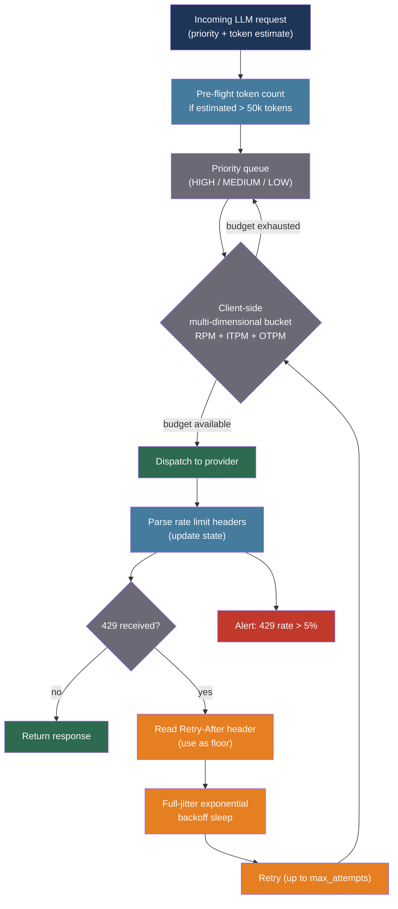

# [BEE-541] LLM Provider Rate Limiting and Client-Side Quota Management

:::info
LLM providers enforce multi-dimensional rate limits (requests per minute, input tokens per minute, output tokens per minute) using token bucket algorithms that punish bursts rather than averages — managing them requires pre-flight token estimation, provider-header-aware retry with full-jitter backoff, client-side token buckets that mirror provider enforcement, and priority queuing that gates on all limit dimensions simultaneously.
:::

## Context

Traditional HTTP rate limiting is one-dimensional: requests per second. Generic retry libraries handle 429s with a fixed delay and move on. LLM API rate limits are fundamentally different and require purpose-built management.

Anthropic enforces three independent dimensions per model class: Input Tokens Per Minute (ITPM), Output Tokens Per Minute (OTPM), and Requests Per Minute (RPM). A single request can trigger a 429 on any dimension independently — a batch job consuming 1.8M input tokens per minute may stay within RPM while exhausting ITPM. OpenAI further adds per-day dimensions (RPD, TPD). Google Vertex AI enforces concurrency limits alongside token limits. Each provider uses a token bucket algorithm internally, which replenishes continuously rather than resetting at fixed clock intervals. A limit of 60 RPM enforced as one request per second means a burst of four simultaneous requests at 00:00 produces three 429s even though no minute has elapsed.

The cost of a 429 error in an LLM application is not equivalent to a 429 in a REST API. An LLM request takes 2–60 seconds; in-flight streaming responses hold token bucket capacity for their full duration. A pool of long-running streaming requests can saturate OTPM even if no new requests are dispatched. And providers additionally apply acceleration limits — Anthropic explicitly warns that sharp traffic ramps trigger 429s even when the per-minute totals are within limit, making gradual warm-up mandatory for batch workloads.

Providers expose rate limit state through response headers (Anthropic: `anthropic-ratelimit-input-tokens-remaining`, `anthropic-ratelimit-tokens-reset`, and others; OpenAI: `x-ratelimit-remaining-requests`, `x-ratelimit-remaining-tokens`). A well-instrumented client reads these headers on every response and uses them to drive proactive throttling — not just reactive retry.

## Best Practices

### Read Provider Rate Limit Headers on Every Response

**MUST** inspect provider rate limit headers on every API response, not just on 429 errors. The remaining-tokens and reset-timestamp headers allow proactive throttling before the limit is exhausted:

```python
from dataclasses import dataclass, field
from datetime import datetime, timezone
import anthropic
import logging

logger = logging.getLogger(__name__)

@dataclass
class RateLimitState:
    """Tracks current observed rate limit state from provider response headers."""
    requests_limit: int = 0
    requests_remaining: int = 0
    requests_reset: datetime | None = None
    input_tokens_limit: int = 0
    input_tokens_remaining: int = 0
    input_tokens_reset: datetime | None = None
    output_tokens_limit: int = 0
    output_tokens_remaining: int = 0
    output_tokens_reset: datetime | None = None

    def utilization_pct(self) -> dict:
        """Fraction of each limit consumed. Used for proactive throttle decisions."""
        def frac(remaining, limit):
            return 1.0 - (remaining / limit) if limit > 0 else 1.0
        return {
            "requests": frac(self.requests_remaining, self.requests_limit),
            "input_tokens": frac(self.input_tokens_remaining, self.input_tokens_limit),
            "output_tokens": frac(self.output_tokens_remaining, self.output_tokens_limit),
        }

def parse_anthropic_headers(headers: dict) -> RateLimitState:
    """
    Parse Anthropic rate limit headers from a response.
    Anthropic returns RFC 3339 reset timestamps.
    """
    def parse_ts(v: str | None) -> datetime | None:
        if not v:
            return None
        try:
            return datetime.fromisoformat(v.replace("Z", "+00:00"))
        except ValueError:
            return None

    return RateLimitState(
        requests_limit=int(headers.get("anthropic-ratelimit-requests-limit", 0)),
        requests_remaining=int(headers.get("anthropic-ratelimit-requests-remaining", 0)),
        requests_reset=parse_ts(headers.get("anthropic-ratelimit-requests-reset")),
        input_tokens_limit=int(headers.get("anthropic-ratelimit-input-tokens-limit", 0)),
        input_tokens_remaining=int(headers.get("anthropic-ratelimit-input-tokens-remaining", 0)),
        input_tokens_reset=parse_ts(headers.get("anthropic-ratelimit-input-tokens-reset")),
        output_tokens_limit=int(headers.get("anthropic-ratelimit-output-tokens-limit", 0)),
        output_tokens_remaining=int(headers.get("anthropic-ratelimit-output-tokens-remaining", 0)),
        output_tokens_reset=parse_ts(headers.get("anthropic-ratelimit-output-tokens-reset")),
    )

# Thread-safe state shared across the application
_rate_state = RateLimitState()

def call_with_header_tracking(
    messages: list[dict],
    system: str,
    model: str = "claude-sonnet-4-20250514",
    max_tokens: int = 1024,
) -> str:
    """Make an API call and update the shared rate limit state from response headers."""
    global _rate_state
    client = anthropic.Anthropic()

    response = client.messages.create(
        model=model, max_tokens=max_tokens, system=system, messages=messages,
    )
    # Anthropic Python SDK exposes raw headers via response.http_response.headers
    if hasattr(response, "http_response") and response.http_response:
        _rate_state = parse_anthropic_headers(dict(response.http_response.headers))
        util = _rate_state.utilization_pct()
        logger.info("ratelimit_state", extra={
            "requests_util": round(util["requests"], 3),
            "input_tokens_util": round(util["input_tokens"], 3),
            "output_tokens_util": round(util["output_tokens"], 3),
        })
        # Proactive warning: log when any dimension exceeds 80% consumed
        if any(v > 0.80 for v in util.values()):
            logger.warning("ratelimit_approaching_threshold", extra=util)

    return response.content[0].text
```

**MUST** use the `retry-after` header value as the minimum wait floor when a 429 is received. Do not override it with a shorter computed backoff — the provider's value reflects actual bucket state:

```python
import time

def wait_for_retry_after(headers: dict) -> None:
    """Block for the time the provider specifies before retrying."""
    retry_after = headers.get("retry-after")
    if retry_after:
        try:
            wait = float(retry_after)
            logger.info("respecting_retry_after", extra={"wait_seconds": wait})
            time.sleep(wait)
        except ValueError:
            pass
```

### Estimate Token Count Before Dispatching Large Requests

**SHOULD** pre-flight token count requests before dispatch when operating near ITPM limits. This allows the dispatcher to delay oversized requests rather than consuming in-flight budget that results in a mid-stream 429:

```python
def count_tokens_preflight(
    messages: list[dict],
    system: str,
    model: str = "claude-sonnet-4-20250514",
    tools: list[dict] | None = None,
) -> int:
    """
    Call the token counting endpoint before dispatching.
    Subject to its own separate RPM limit (Tier 4: 8,000 RPM).
    Tool schemas and system prompts count toward the total.
    Use for requests estimated to be > 50,000 tokens.
    """
    client = anthropic.Anthropic()
    payload = {
        "model": model,
        "system": system,
        "messages": messages,
    }
    if tools:
        payload["tools"] = tools

    result = client.messages.count_tokens(**payload)
    return result.input_tokens

def should_defer_request(estimated_tokens: int, state: RateLimitState) -> bool:
    """
    Proactive deferral: hold the request if sending it would exhaust the
    input token bucket before the reset timestamp.
    """
    if state.input_tokens_limit == 0:
        return False   # No state yet; allow
    safe_threshold = state.input_tokens_limit * 0.05  # Reserve 5% headroom
    return estimated_tokens > (state.input_tokens_remaining - safe_threshold)
```

**SHOULD** use character-length heuristics for cheap pre-screening — approximately 4 characters per token for English prose — before calling the counting endpoint. Reserve the counting API call for requests that the heuristic flags as potentially oversized:

```python
def estimate_tokens_heuristic(text: str) -> int:
    """
    Fast offline estimate: ~4 bytes per token for English prose.
    Accuracy: ±15% depending on content type.
    Use to decide whether a precise count is worth requesting.
    """
    return len(text.encode("utf-8")) // 4

def needs_precise_count(messages: list[dict], system: str, threshold: int = 50_000) -> bool:
    total_chars = len(system)
    for m in messages:
        content = m.get("content", "")
        total_chars += len(content) if isinstance(content, str) else sum(
            len(block.get("text", "")) for block in content if isinstance(block, dict)
        )
    return estimate_tokens_heuristic(" " * total_chars) > threshold
```

### Implement a Client-Side Token Bucket

**SHOULD** maintain a client-side token bucket that mirrors the provider's enforcement. This enables smooth, proactive throttling that avoids 429s rather than recovering from them:

```python
import threading
import time

class TokenBucket:
    """
    Thread-safe token bucket that mirrors provider-side enforcement.
    Provides a separate bucket per rate-limit dimension (RPM, ITPM, OTPM).
    Refills continuously (not at fixed intervals), matching Anthropic's behavior.
    """

    def __init__(self, capacity: int, refill_rate: float):
        """
        capacity: maximum tokens in bucket (the per-minute limit)
        refill_rate: tokens added per second (= capacity / 60)
        """
        self.capacity = capacity
        self.refill_rate = refill_rate
        self._tokens = float(capacity)
        self._last_refill = time.monotonic()
        self._lock = threading.Lock()

    def _refill(self) -> None:
        now = time.monotonic()
        elapsed = now - self._last_refill
        self._tokens = min(self.capacity, self._tokens + elapsed * self.refill_rate)
        self._last_refill = now

    def acquire(self, amount: int, block: bool = True, timeout: float = 60.0) -> bool:
        """
        Acquire `amount` tokens. If block=True, waits until tokens are available.
        Returns False if timeout is exceeded.
        """
        deadline = time.monotonic() + timeout
        while True:
            with self._lock:
                self._refill()
                if self._tokens >= amount:
                    self._tokens -= amount
                    return True
            if not block or time.monotonic() >= deadline:
                return False
            # Wait proportionally to the deficit before retrying
            with self._lock:
                deficit = amount - self._tokens
            wait = max(0.01, deficit / self.refill_rate)
            time.sleep(min(wait, deadline - time.monotonic()))

    def available(self) -> float:
        with self._lock:
            self._refill()
            return self._tokens

class MultiDimensionalBucket:
    """
    Gates on RPM, ITPM, and OTPM simultaneously.
    All three must have capacity before a request is dispatched.
    """
    def __init__(self, rpm: int, itpm: int, otpm: int):
        self.requests = TokenBucket(capacity=rpm,  refill_rate=rpm / 60)
        self.input_tokens = TokenBucket(capacity=itpm, refill_rate=itpm / 60)
        self.output_tokens = TokenBucket(capacity=otpm, refill_rate=otpm / 60)

    def acquire(self, estimated_input_tokens: int, estimated_output_tokens: int) -> bool:
        """
        Acquire from all three buckets atomically.
        If any bucket denies, no tokens are consumed from any bucket.
        """
        # Check all three without blocking first
        if (self.requests.available() >= 1
                and self.input_tokens.available() >= estimated_input_tokens
                and self.output_tokens.available() >= estimated_output_tokens):
            # Deduct from all three
            self.requests.acquire(1, block=False)
            self.input_tokens.acquire(estimated_input_tokens, block=False)
            self.output_tokens.acquire(estimated_output_tokens, block=False)
            return True
        return False   # Caller should queue and retry

# Example initialization for Anthropic Tier 4 / claude-sonnet-4-20250514
sonnet_bucket = MultiDimensionalBucket(rpm=4_000, itpm=2_000_000, otpm=400_000)
```

### Retry 429 Errors with Full-Jitter Exponential Backoff

**MUST** use exponential backoff with full jitter when retrying after a 429. AWS research (2015) on retry strategies found that full jitter — `sleep = random(0, min(cap, base * 2^attempt))` — minimizes total work across all retrying clients and eliminates the thundering herd synchronization that no-jitter backoff produces:

```python
import random
import time
import anthropic
from anthropic import RateLimitError

def call_with_backoff(
    messages: list[dict],
    system: str,
    model: str = "claude-sonnet-4-20250514",
    max_tokens: int = 1024,
    max_attempts: int = 6,
    base_delay: float = 1.0,
    cap_delay: float = 60.0,
) -> str:
    """
    Full-jitter exponential backoff with Retry-After header floor.
    attempt 0: wait 0–1s, attempt 1: 0–2s, attempt 2: 0–4s, ..., cap at 60s.
    """
    client = anthropic.Anthropic()
    last_error = None

    for attempt in range(max_attempts):
        try:
            response = client.messages.create(
                model=model, max_tokens=max_tokens, system=system, messages=messages,
            )
            return response.content[0].text

        except RateLimitError as exc:
            last_error = exc
            # Honor Retry-After from provider; never retry sooner
            retry_after = getattr(exc, "response", None)
            retry_after_value = None
            if retry_after and hasattr(retry_after, "headers"):
                retry_after_value = retry_after.headers.get("retry-after")

            if retry_after_value:
                floor = float(retry_after_value)
            else:
                floor = 0.0

            # Full jitter: random in [0, min(cap, base * 2^attempt)]
            jitter_ceiling = min(cap_delay, base_delay * (2 ** attempt))
            computed = random.uniform(0, jitter_ceiling)
            sleep_duration = max(floor, computed)

            if attempt < max_attempts - 1:
                logger.warning(
                    "rate_limit_retry",
                    extra={"attempt": attempt + 1, "sleep": round(sleep_duration, 2)},
                )
                time.sleep(sleep_duration)

    raise RuntimeError(f"Failed after {max_attempts} attempts") from last_error
```

**MUST NOT** immediately retry a 429. Immediate retry under rate limit pressure creates thundering herd bursts that make the situation worse. Even a single 100ms sleep eliminates most synchronization effects.

**SHOULD** distinguish between RPM-triggered and TPM-triggered 429s from the provider's error response body. TPM exhaustion typically requires longer waits — if the ITPM bucket is depleted, the wait must span the replenishment interval, not just the time for one slot to open:

```python
import json

def classify_rate_limit_error(exc: RateLimitError) -> str:
    """
    Anthropic error bodies include a `type` and `error.message` that describe
    which dimension was exceeded. Distinguish "request limit exceeded" from
    "token limit exceeded" to apply appropriate backoff floors.
    """
    try:
        body = json.loads(exc.response.text) if exc.response else {}
        message = body.get("error", {}).get("message", "").lower()
        if "token" in message:
            return "token_limit"
        if "request" in message:
            return "request_limit"
    except Exception:
        pass
    return "unknown"
```

### Isolate and Prioritize with a Centralized Gateway

**SHOULD** route all internal LLM calls through a centralized gateway service that owns all provider credentials and enforces quota across the organization. Decentralized keys — one per microservice — cause each service to have a partial view of quota consumption; the first service to exhaust the shared limit causes 429s for all others with no visibility into why:

```python
import heapq
from dataclasses import dataclass, field
from enum import IntEnum
from threading import Lock, Event
from typing import Callable

class Priority(IntEnum):
    HIGH = 0    # Interactive user-facing requests
    MEDIUM = 1  # Near-real-time backend jobs
    LOW = 2     # Background batch enrichment

@dataclass(order=True)
class QueuedRequest:
    priority: Priority
    sequence: int                    # Tiebreaker: FIFO within same priority
    estimated_input_tokens: int = field(compare=False)
    estimated_output_tokens: int = field(compare=False)
    fn: Callable = field(compare=False)  # Callable that executes the request
    ready: Event = field(default_factory=Event, compare=False)
    result: str | None = field(default=None, compare=False)
    error: Exception | None = field(default=None, compare=False)

class PriorityLLMQueue:
    """
    Priority queue for LLM requests, gated by a multi-dimensional bucket.
    HIGH-priority requests are dispatched before LOW-priority ones.
    When approaching quota, LOW-priority work is deferred first.
    """
    def __init__(self, bucket: MultiDimensionalBucket):
        self.bucket = bucket
        self._heap: list[QueuedRequest] = []
        self._lock = Lock()
        self._seq = 0

    def submit(
        self,
        fn: Callable,
        estimated_input_tokens: int,
        estimated_output_tokens: int,
        priority: Priority = Priority.MEDIUM,
    ) -> QueuedRequest:
        """Submit a request to the queue and return the request object for waiting."""
        with self._lock:
            req = QueuedRequest(
                priority=priority,
                sequence=self._seq,
                estimated_input_tokens=estimated_input_tokens,
                estimated_output_tokens=estimated_output_tokens,
                fn=fn,
            )
            self._seq += 1
            heapq.heappush(self._heap, req)
        return req

    def dispatch_one(self) -> bool:
        """
        Dequeue and execute the highest-priority request that fits within budget.
        Returns True if a request was dispatched; False if budget was insufficient.
        """
        with self._lock:
            if not self._heap:
                return False
            candidate = self._heap[0]
            acquired = self.bucket.acquire(
                candidate.estimated_input_tokens,
                candidate.estimated_output_tokens,
            )
            if not acquired:
                return False  # Budget exhausted; caller should wait and retry
            heapq.heappop(self._heap)

        try:
            candidate.result = candidate.fn()
        except Exception as exc:
            candidate.error = exc
        finally:
            candidate.ready.set()

        return True
```

**SHOULD** alert when the 429 error rate exceeds 5% of requests. A sustained 429 rate indicates that the client-side bucket is misconfigured or that actual traffic exceeds the provisioned tier limit:

```python
from collections import deque

class RateLimitMonitor:
    """Sliding-window 429 error rate monitor."""
    def __init__(self, window_size: int = 100):
        self.calls = deque(maxlen=window_size)

    def record(self, was_rate_limited: bool) -> None:
        self.calls.append(1 if was_rate_limited else 0)

    def error_rate(self) -> float:
        if not self.calls:
            return 0.0
        return sum(self.calls) / len(self.calls)

    def should_alert(self, threshold: float = 0.05) -> bool:
        return self.error_rate() > threshold
```

## Visual



## Backoff Strategy Comparison

| Strategy | Sleep formula | Thundering herd risk | Recommended for |
|---|---|---|---|
| No jitter | `min(cap, base × 2^n)` | High — all clients retry at same time | Never |
| Full jitter | `random(0, min(cap, base × 2^n))` | Lowest — AWS research: minimizes total work | Default choice |
| Equal jitter | `cap/2 + random(0, cap/2)` | Low — guarantees minimum floor | When very short waits are unacceptable |
| Decorrelated | `random(base, min(cap, prev × 3))` | Low — similar to full jitter | Alternative to full jitter |

## Related BEEs

- [BEE-261](261.md) -- Retry Strategies and Exponential Backoff: the general retry pattern that LLM-specific backoff extends
- [BEE-266](266.md) -- Rate Limiting and Throttling: server-side rate limiting your own API (complementary to client-side provider quota management)
- [BEE-513](513.md) -- AI Cost Optimization and Model Routing: routing to cheaper models is a complementary strategy for reducing token consumption
- [BEE-526](526.md) -- LLM Caching Strategies: semantic caching reduces token consumption, directly easing ITPM pressure
- [BEE-527](527.md) -- LLM Batch Processing Patterns: batch APIs bypass real-time rate limits and are the correct choice for high-volume non-interactive workloads

## References

- [Anthropic. API Rate Limits — platform.claude.com](https://platform.claude.com/docs/en/api/rate-limits)
- [Anthropic. Token Counting — platform.claude.com](https://platform.claude.com/docs/en/build-with-claude/token-counting)
- [AWS. Exponential Backoff and Jitter — aws.amazon.com, 2015](https://aws.amazon.com/blogs/architecture/exponential-backoff-and-jitter/)
- [OpenAI. Handling Rate Limits — Cookbook — cookbook.openai.com](https://github.com/openai/openai-cookbook/blob/main/examples/How_to_handle_rate_limits.ipynb)
- [OpenAI. tiktoken — github.com](https://github.com/openai/tiktoken)
- [LiteLLM. Load Balancing — docs.litellm.ai](https://docs.litellm.ai/docs/proxy/load_balancing)
