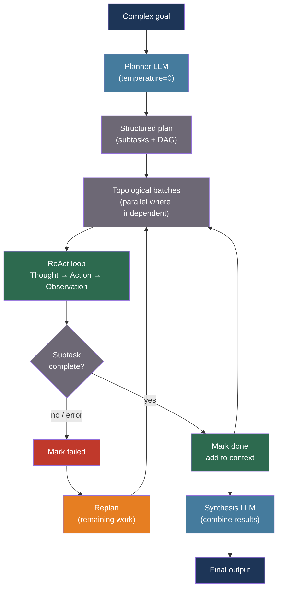

# [BEE-546] LLM Planning and Task Decomposition

:::info
Complex multi-step tasks require LLMs to explicitly plan before acting — decomposing work into atomic subtasks, representing dependencies as a directed acyclic graph, and replanning when subtasks fail — rather than attempting to complete a long task in a single forward pass where errors compound silently.
:::

## Context

A language model operating in autoregressive mode has no native ability to backtrack, reconsider, or revise decisions it made in prior tokens. Asking it to complete a complex multi-step task in one shot — "research, compare, and write a report on X" — leads to errors that propagate invisibly: the model skips steps it finds hard, conflates subtasks, or confidently hallucinates intermediate results that subsequent steps build on.

Research in 2022–2023 established a set of prompting and agent architectures that address this by separating planning from execution. Yao et al. (2022) introduced ReAct (Reason+Act) at ICLR 2023: a loop in which the model alternates between reasoning traces (explicit thought steps) and actions (tool calls with observable results), updating its plan at each step based on what it observes. ReAct showed a 34% absolute improvement over imitation learning baselines on ALFWorld and meaningful gains on Fever fact verification — specifically because the model could observe when a tool returned no result and replan.

Zhou et al. (2022) introduced Least-to-Most prompting at ICLR 2023: rather than asking the model to solve a complex question directly, first ask it to decompose the question into simpler sub-questions, then solve each in sequence using prior answers as context. This enabled GPT-3 to generalize to compositional problems harder than any in-context example — a capability linear chain-of-thought lacks.

Wang et al. (2023) showed that explicitly asking the model to create a plan first — Plan-and-Solve prompting — reduces three systematic error types in zero-shot chain-of-thought: calculation errors, missing-step errors, and semantic misunderstanding of the task. Yao et al. (2023) extended this further with Tree of Thoughts (NeurIPS 2023): explore multiple partial plans as a tree, evaluate each node with the model itself, and use BFS or DFS to find the best complete plan. Tree of Thoughts is substantially more expensive than linear planning but achieves state-of-the-art on tasks requiring lookahead and backtracking.

## Design Thinking

Task decomposition is appropriate when: (a) a task requires more than 3–4 sequential steps; (b) intermediate results need to be verified before later steps proceed; (c) some subtasks can run in parallel; or (d) the task requires heterogeneous capabilities (search, code execution, writing) that benefit from being handled by specialized sub-agents.

The key design decision is the representation of the plan. A flat list of steps is sufficient for sequential tasks. A directed acyclic graph (DAG) is required when subtasks have dependencies and some can run in parallel. A tree with evaluation at each node (Tree of Thoughts) is warranted only for tasks where the correct first step is genuinely ambiguous and exploration is cheaper than backtracking.

## Best Practices

### Elicit a Structured Plan Before Executing Subtasks

**MUST** separate the planning step from the execution step when the task has more than three sequential subtasks. A single prompt that asks the model to both plan and execute produces plans that are biased toward what the model finds easy to execute, skipping hard subtasks silently:

```python
import anthropic
import json

PLANNER_SYSTEM = """You are a task planner. Given a complex goal, produce a structured
execution plan as JSON.

Output format:
{
  "goal": "<restated goal>",
  "subtasks": [
    {
      "id": "t1",
      "description": "<what to do>",
      "depends_on": [],          // IDs of subtasks that must complete first
      "tool": "<tool_name>",     // which tool to use, or "llm" for reasoning
      "parallel": false          // true if this can run in parallel with siblings
    }
  ]
}

Rules:
- Each subtask must be atomic (one tool call or one reasoning step)
- Subtasks that can run in parallel MUST declare it
- Do not skip hard steps — if you do not know how to do a step, declare it as needing human input"""

async def plan_task(goal: str, available_tools: list[str]) -> dict:
    """
    Generate a structured execution plan for a complex goal.
    Returns a JSON plan with subtask dependencies.
    """
    client = anthropic.AsyncAnthropic()
    response = await client.messages.create(
        model="claude-sonnet-4-20250514",
        max_tokens=2048,
        temperature=0,   # Deterministic planning
        system=PLANNER_SYSTEM,
        messages=[{
            "role": "user",
            "content": (
                f"Goal: {goal}\n\n"
                f"Available tools: {', '.join(available_tools)}\n\n"
                "Produce the execution plan."
            ),
        }],
    )
    raw = response.content[0].text
    # Extract JSON from response
    import re
    match = re.search(r"\{.*\}", raw, re.DOTALL)
    return json.loads(match.group(0)) if match else {"goal": goal, "subtasks": []}
```

**SHOULD** use temperature=0 for the planning step and higher temperature for the execution steps. Planning is a deterministic reasoning task; execution involves tool calls that may need to adapt to unexpected results.

### Execute Subtasks in Dependency Order Using the ReAct Loop

**SHOULD** execute each subtask using the ReAct (Thought → Action → Observation) loop rather than asking the model to produce a complete answer without observing intermediate results. The observation at each step allows the model to detect failures and replan:

```python
from dataclasses import dataclass, field
from enum import Enum

class SubtaskStatus(Enum):
    PENDING = "pending"
    RUNNING = "running"
    DONE = "done"
    FAILED = "failed"
    SKIPPED = "skipped"

@dataclass
class SubtaskResult:
    subtask_id: str
    status: SubtaskStatus
    output: str
    error: str | None = None

async def execute_react_subtask(
    subtask: dict,
    prior_results: dict[str, SubtaskResult],
    tools: dict,   # name → callable
) -> SubtaskResult:
    """
    Execute a single subtask using the ReAct loop.
    Provides prior subtask results as context so the model can chain outputs.
    """
    client = anthropic.AsyncAnthropic()

    context = "\n".join(
        f"[{sid}] {r.output}" for sid, r in prior_results.items()
        if r.status == SubtaskStatus.DONE
    )

    react_prompt = f"""You are executing subtask {subtask['id']}: {subtask['description']}

Prior results:
{context if context else '(none)'}

Think step-by-step (Thought), then call the appropriate tool (Action).
After seeing the tool result (Observation), decide if the subtask is complete.
If complete, output: RESULT: <your conclusion>
If you need another tool call, issue it."""

    messages = [{"role": "user", "content": react_prompt}]
    max_iterations = 5

    for _ in range(max_iterations):
        response = await client.messages.create(
            model="claude-sonnet-4-20250514",
            max_tokens=1024,
            temperature=0.3,
            messages=messages,
        )
        reply = response.content[0].text
        messages.append({"role": "assistant", "content": reply})

        if "RESULT:" in reply:
            output = reply.split("RESULT:", 1)[1].strip()
            return SubtaskResult(subtask["id"], SubtaskStatus.DONE, output)

        # Detect a tool call in the reply and execute it
        tool_name = subtask.get("tool")
        if tool_name and tool_name in tools:
            try:
                observation = tools[tool_name](reply)
                messages.append({
                    "role": "user",
                    "content": f"Observation: {observation}",
                })
            except Exception as exc:
                messages.append({
                    "role": "user",
                    "content": f"Observation: Tool error — {exc}. Consider replanning.",
                })

    return SubtaskResult(
        subtask["id"], SubtaskStatus.FAILED, "",
        error="Max iterations reached without completing subtask",
    )
```

### Execute Independent Subtasks in Parallel

**SHOULD** identify subtasks with no unsatisfied dependencies and execute them concurrently. A research task that requires searching three independent databases, then synthesizing the results, can reduce wall-clock time by 3× by running the three searches in parallel:

```python
import asyncio

def topological_batches(subtasks: list[dict]) -> list[list[dict]]:
    """
    Yield batches of subtasks that can execute in parallel.
    Each batch depends only on subtasks in earlier batches.
    """
    id_to_task = {t["id"]: t for t in subtasks}
    remaining = set(t["id"] for t in subtasks)
    completed = set()
    batches = []

    while remaining:
        # Subtasks whose dependencies are all complete
        ready = [
            id_to_task[tid] for tid in remaining
            if all(dep in completed for dep in id_to_task[tid].get("depends_on", []))
        ]
        if not ready:
            raise ValueError(f"Circular dependency detected in subtasks: {remaining}")
        batches.append(ready)
        for t in ready:
            remaining.remove(t["id"])
            completed.add(t["id"])

    return batches

async def execute_plan(plan: dict, tools: dict) -> dict[str, SubtaskResult]:
    """Execute all subtasks in dependency order, parallelizing where possible."""
    results: dict[str, SubtaskResult] = {}
    batches = topological_batches(plan["subtasks"])

    for batch in batches:
        batch_results = await asyncio.gather(*[
            execute_react_subtask(task, results, tools)
            for task in batch
        ])
        for result in batch_results:
            results[result.subtask_id] = result

        # Replan if any subtask in this batch failed
        failed = [r for r in batch_results if r.status == SubtaskStatus.FAILED]
        if failed:
            # Log failures; upstream may replan or abort
            for f in failed:
                print(f"Subtask {f.subtask_id} failed: {f.error}")

    return results
```

### Replan When a Subtask Fails or Produces Unexpected Output

**SHOULD** trigger replanning when a subtask fails or its output deviates from what the plan assumed. Replanning feeds the current state (completed subtasks + their outputs + the failure) back to the planner and asks for a revised plan for the remaining work:

```python
async def replan(
    original_goal: str,
    completed: dict[str, SubtaskResult],
    failed_subtask: dict,
    failure_reason: str,
    available_tools: list[str],
) -> dict:
    """
    Request a revised plan for the remaining work given a subtask failure.
    """
    client = anthropic.AsyncAnthropic()
    completed_summary = "\n".join(
        f"[{sid}] {r.output[:200]}" for sid, r in completed.items()
        if r.status == SubtaskStatus.DONE
    )

    response = await client.messages.create(
        model="claude-sonnet-4-20250514",
        max_tokens=2048,
        temperature=0,
        system=PLANNER_SYSTEM,
        messages=[{
            "role": "user",
            "content": (
                f"Goal: {original_goal}\n\n"
                f"Completed so far:\n{completed_summary}\n\n"
                f"Failed subtask: {failed_subtask['description']}\n"
                f"Failure reason: {failure_reason}\n\n"
                f"Available tools: {', '.join(available_tools)}\n\n"
                "Produce a revised plan for the remaining work only."
            ),
        }],
    )
    raw = response.content[0].text
    import re
    match = re.search(r"\{.*\}", raw, re.DOTALL)
    return json.loads(match.group(0)) if match else {}
```

### Use Tree of Thoughts Only for Ambiguous First Steps

Tree of Thoughts (exploring multiple candidate first steps and evaluating them with the model before committing) is warranted only when: (a) the correct first action is genuinely ambiguous, (b) choosing wrong first is expensive to recover from, and (c) the exploration budget is available. **SHOULD NOT** apply Tree of Thoughts to sequential tasks where the first step is clear — the exploration overhead is not justified and increases cost by N× (number of candidate branches × depth):

```python
EVAL_PROMPT = """Rate the following partial plan for achieving the goal.
Score 1–10 (10 = excellent), then explain in one sentence.

Goal: {goal}
Partial plan: {plan}

Output: SCORE: <number>\nREASON: <sentence>"""

async def evaluate_partial_plan(goal: str, partial_plan: str) -> float:
    """LLM self-evaluator for Tree of Thoughts node scoring."""
    client = anthropic.AsyncAnthropic()
    r = await client.messages.create(
        model="claude-haiku-4-5-20251001",   # Cheaper evaluator
        max_tokens=128,
        temperature=0,
        messages=[{"role": "user", "content": EVAL_PROMPT.format(
            goal=goal, plan=partial_plan,
        )}],
    )
    import re
    match = re.search(r"SCORE:\s*(\d+)", r.content[0].text)
    return float(match.group(1)) / 10.0 if match else 0.5
```

## Visual



## Planning Pattern Comparison

| Pattern | Planning style | Backtracking | Cost | Best for |
|---|---|---|---|---|
| ReAct | Inline per-step | Via observation | Low | Sequential tool-use tasks |
| Plan-and-Solve | Upfront list | None (linear) | Low | Math and reasoning tasks |
| Least-to-Most | Sequential sub-questions | None | Low | Compositional problem solving |
| Plan → DAG execute | Upfront DAG | Via replan | Medium | Multi-tool parallel workflows |
| Tree of Thoughts | BFS/DFS exploration | Full backtrack | High | Ambiguous first-step tasks |

## Common Mistakes

**Planning in the same prompt as execution.** The model biases its plan toward what it has already started executing. Separation is not just a pattern — it is a causal necessity for the plan to be honest about difficulty.

**Not modeling subtask dependencies.** Treating a five-step task as five independent prompts causes each prompt to re-derive context that prior steps already produced. Pass prior results forward explicitly.

**Applying Tree of Thoughts to every task.** ToT costs O(branches × depth) LLM calls. Apply it only when first-step ambiguity is high and recovery from a wrong first step is expensive.

**Silently swallowing subtask failures.** A subtask that returns an error silently continues to the synthesis step, which hallucinates a result based on no actual output. Detect failures explicitly and either replan or abort with a clear error.

## Related BEEs

- [BEE-504](504.md) -- AI Agent Architecture Patterns: the agent architectures within which planning and task decomposition operate
- [BEE-520](520.md) -- LLM Tool Use and Function Calling Patterns: the mechanism by which ReAct actions invoke tools
- [BEE-537](537.md) -- AI Agent Safety and Reliability Patterns: agent budget caps and circuit breakers bound how long a planning loop may run
- [BEE-529](529.md) -- AI Workflow Orchestration: DAG-based orchestration for deterministic workflows complements LLM-generated dynamic plans
- [BEE-525](525.md) -- Chain-of-Thought and Extended Thinking Patterns: chain-of-thought is the per-subtask reasoning; planning is the cross-subtask structure

## References

- [Yao et al. ReAct: Synergizing Reasoning and Acting in Language Models — arXiv:2210.03629, ICLR 2023](https://arxiv.org/abs/2210.03629)
- [Wang et al. Plan-and-Solve Prompting: Improving Zero-Shot Chain-of-Thought — arXiv:2305.04091, ACL 2023](https://arxiv.org/abs/2305.04091)
- [Zhou et al. Least-to-Most Prompting Enables Complex Reasoning in Large Language Models — arXiv:2205.10625, ICLR 2023](https://arxiv.org/abs/2205.10625)
- [Yao et al. Tree of Thoughts: Deliberate Problem Solving with Large Language Models — arXiv:2305.10601, NeurIPS 2023](https://arxiv.org/abs/2305.10601)
- [Shen et al. HuggingGPT: Solving AI Tasks with ChatGPT and its Friends in Hugging Face — arXiv:2303.17580, 2023](https://arxiv.org/abs/2303.17580)
- [Valmeekam et al. LLMs Still Can't Plan — arXiv:2402.01817, 2024](https://arxiv.org/abs/2402.01817)
- [LangGraph Documentation — langchain.com](https://www.langchain.com/langgraph)
