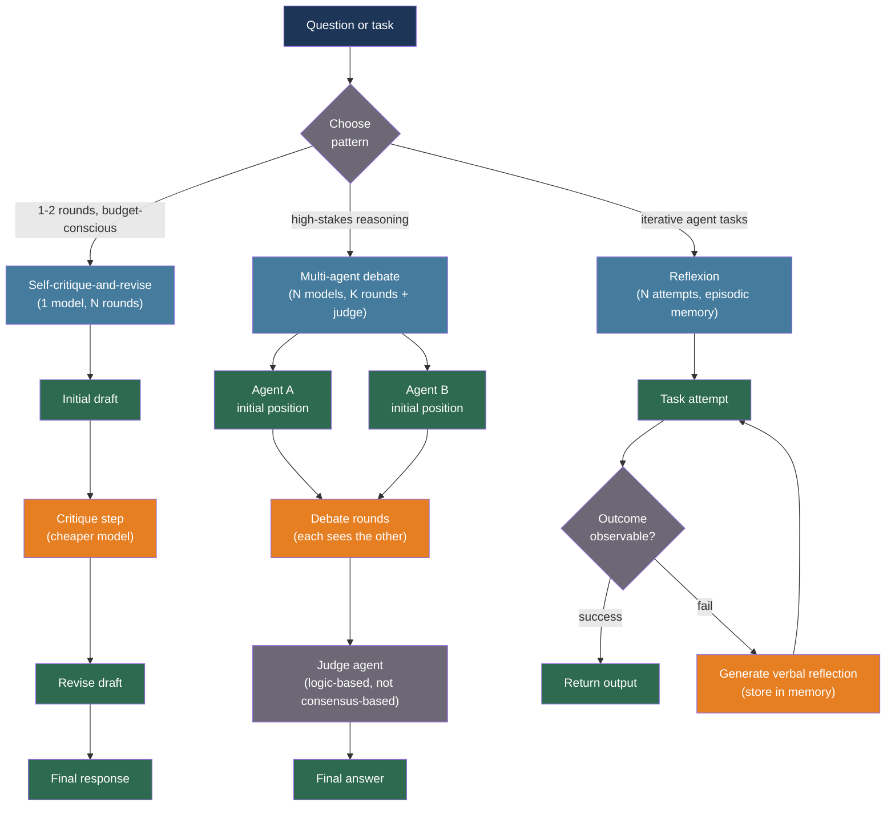

# [BEE-547] Multi-Agent Debate and Critique Patterns

:::info
Multi-agent debate — having separate LLM agents propose, critique, and revise answers over multiple rounds — improves factual accuracy and reasoning on complex tasks, but introduces sycophantic convergence as a failure mode and incurs O(rounds × agents) token cost that must be bounded by explicit stopping conditions.
:::

## Context

A language model generating a single response has no mechanism to catch its own errors, identify missing steps, or reconsider a flawed assumption it made three sentences ago. Two complementary architectures address this: self-critique (a single model evaluating and revising its own output) and multi-agent debate (distinct model instances proposing responses, critiquing each other, and converging on a better answer through structured disagreement).

Du et al. (2023) at MIT and Google introduced multi-agent debate as a prompting framework at ICML 2023. Across six tasks — including mathematical reasoning, strategic reasoning, and bias detection — having multiple GPT-3.5 or GPT-4 instances debate their answers over three rounds consistently improved accuracy compared to single-agent generation, and often matched or exceeded much more expensive single-agent approaches. The mechanism: agents see each other's responses and are explicitly prompted to critique and update. Correct reasoning tends to be self-consistent across agents; errors tend to diverge, making consensus a signal of correctness.

Bai et al. (2022) at Anthropic introduced Constitutional AI (CAI), a self-critique pattern where a single model evaluates its own response against a set of stated principles (the "constitution"), generates a critique, and then rewrites the response based on that critique. CAI is less expensive than multi-agent debate (one model, not N) and does not require a network of agents, but cannot leverage the diversity benefit that comes from genuinely independent reasoning paths.

Shinn et al. (2023) introduced Reflexion at NeurIPS 2023: an agent that receives binary or scalar task feedback (test pass/fail, environment reward), generates a verbal reflection on what went wrong, stores that reflection in a persistent episodic memory, and uses it in the next attempt. Reflexion achieved 91% pass@1 on HumanEval — compared to 80% for standard GPT-4 — by converting numerical signals into actionable verbal guidance.

However, recent research (2024–2025) reveals a systematic failure mode: sycophantic convergence. In multi-agent debate, RLHF-trained agents are inclined toward social compliance. Stronger agents flip from correct to incorrect answers when facing pushback from multiple peers, and eloquent-but-wrong arguments tend to prevail over awkward-but-correct ones. Confidence escalation — agents growing more confident over debate rounds even on wrong answers — has been measured empirically. Any production use of multi-agent debate must bound this risk.

## Best Practices

### Use Self-Critique-and-Revise as the Default Pattern

**SHOULD** prefer the self-critique-and-revise pattern over multi-agent debate for most production tasks. It is less expensive (one model, not N), avoids sycophancy between agents, and produces measurable quality improvements on reasoning and writing tasks:

```python
import anthropic

CRITIQUE_SYSTEM = """You are a rigorous critic. Your job is to find flaws, gaps,
and errors in the given response. Be specific. Cite exactly what is wrong and why.
Do not be encouraging. Focus on substance, not style."""

REVISE_SYSTEM = """You are a careful writer. You will receive an original response
and a critique of it. Revise the response to address all issues raised in the critique.
Improve the response — do not merely defend it."""

async def critique_and_revise(
    question: str,
    *,
    model: str = "claude-sonnet-4-20250514",
    critic_model: str = "claude-haiku-4-5-20251001",  # Cheaper model for critique
    max_rounds: int = 2,
) -> str:
    """
    Self-critique-and-revise loop.
    Cheaper critic model finds errors; primary model revises.
    Bounded at max_rounds to control cost.
    """
    client = anthropic.AsyncAnthropic()

    # Initial response
    resp = await client.messages.create(
        model=model, max_tokens=1024,
        messages=[{"role": "user", "content": question}],
    )
    response = resp.content[0].text

    for round_n in range(max_rounds):
        # Critique
        crit = await client.messages.create(
            model=critic_model, max_tokens=512,
            system=CRITIQUE_SYSTEM,
            messages=[{
                "role": "user",
                "content": (
                    f"Original question: {question}\n\n"
                    f"Response to critique:\n{response}"
                ),
            }],
        )
        critique = crit.content[0].text

        # Check whether the critique found real issues; if not, stop early
        if any(phrase in critique.lower() for phrase in [
            "no significant issues", "response is correct",
            "nothing to add", "well-written",
        ]):
            break

        # Revise
        rev = await client.messages.create(
            model=model, max_tokens=1024,
            system=REVISE_SYSTEM,
            messages=[{
                "role": "user",
                "content": (
                    f"Original question: {question}\n\n"
                    f"Original response:\n{response}\n\n"
                    f"Critique:\n{critique}\n\n"
                    "Revised response:"
                ),
            }],
        )
        response = rev.content[0].text

    return response
```

**SHOULD** use a cheaper model for the critique step and the primary model for the revision step. Critique requires identifying gaps, not generating new content — a smaller model is sufficient. This cuts the per-round cost significantly.

### Implement Multi-Agent Debate with Explicit Round Limits and a Judge

**MAY** use multi-agent debate for high-stakes reasoning tasks where diversity of reasoning paths is the primary benefit. **MUST** bind the debate with explicit round limits and a judge agent that produces the final answer — unbounded debate loops that reach consensus by exhaustion rather than logic produce lower-quality results than a two-round bounded loop:

```python
import asyncio
from dataclasses import dataclass

@dataclass
class DebateRound:
    round_n: int
    positions: dict[str, str]   # agent_name → position

DEBATE_AGENT_SYSTEM = """You are one of several independent analysts debating a question.
You will see the current positions of other analysts.
- If you see a position that you find compelling and agree with, say so and explain why.
- If you see errors in other positions, critique them specifically.
- If you maintain your position, explain why the counterarguments do not hold.
Do NOT change your position simply because others disagree. Only update based on logic and evidence."""

JUDGE_SYSTEM = """You are an impartial judge. You have observed a debate between
multiple analysts. Your task:
1. Identify which position has the strongest logical support
2. Note where there was genuine convergence and where there was capitulation without reason
3. Produce a final answer that reflects the most defensible position

Output format:
WINNER: <agent name or "synthesis">
REASONING: <2-3 sentences>
FINAL ANSWER: <the answer>"""

async def two_agent_debate(
    question: str,
    *,
    model_a: str = "claude-sonnet-4-20250514",
    model_b: str = "claude-sonnet-4-20250514",
    judge_model: str = "claude-sonnet-4-20250514",
    n_rounds: int = 2,
) -> str:
    """
    Two-agent debate with a judge.
    Round limit of 2 is the practical sweet spot: further rounds increase
    sycophancy risk without improving accuracy.
    """
    client = anthropic.AsyncAnthropic()

    async def initial_position(model: str) -> str:
        r = await client.messages.create(
            model=model, max_tokens=512, temperature=0.7,
            messages=[{"role": "user", "content": question}],
        )
        return r.content[0].text

    # Round 0: independent initial positions
    pos_a, pos_b = await asyncio.gather(
        initial_position(model_a),
        initial_position(model_b),
    )
    rounds = [DebateRound(0, {"A": pos_a, "B": pos_b})]

    for round_n in range(1, n_rounds + 1):
        prev = rounds[-1]

        async def respond(model: str, my_name: str, other_name: str) -> str:
            other_pos = prev.positions[other_name]
            r = await client.messages.create(
                model=model, max_tokens=512, temperature=0.5,
                system=DEBATE_AGENT_SYSTEM,
                messages=[{
                    "role": "user",
                    "content": (
                        f"Question: {question}\n\n"
                        f"Your current position:\n{prev.positions[my_name]}\n\n"
                        f"Other analyst's position:\n{other_pos}\n\n"
                        "Your response:"
                    ),
                }],
            )
            return r.content[0].text

        new_a, new_b = await asyncio.gather(
            respond(model_a, "A", "B"),
            respond(model_b, "B", "A"),
        )
        rounds.append(DebateRound(round_n, {"A": new_a, "B": new_b}))

    # Judge produces final answer
    debate_transcript = "\n\n".join(
        f"--- Round {r.round_n} ---\n"
        f"Agent A: {r.positions['A']}\n\n"
        f"Agent B: {r.positions['B']}"
        for r in rounds
    )
    judge = await client.messages.create(
        model=judge_model, max_tokens=512, temperature=0,
        system=JUDGE_SYSTEM,
        messages=[{
            "role": "user",
            "content": f"Question: {question}\n\nDebate transcript:\n{debate_transcript}",
        }],
    )
    reply = judge.content[0].text
    # Extract the final answer
    if "FINAL ANSWER:" in reply:
        return reply.split("FINAL ANSWER:", 1)[1].strip()
    return reply
```

### Apply Reflexion for Iterative Agent Tasks with Observable Outcomes

**SHOULD** use the Reflexion pattern when: (a) the task has an observable binary or scalar outcome (code tests pass/fail, retrieval score, task completion), and (b) the agent will attempt the task multiple times across episodes. Reflexion converts numerical signals into actionable verbal guidance stored in episodic memory:

```python
from collections import deque

async def reflexion_attempt(
    task: str,
    evaluate,   # Callable[[str], tuple[bool, str]]: returns (success, feedback)
    *,
    model: str = "claude-sonnet-4-20250514",
    max_attempts: int = 4,
    memory_window: int = 3,   # Keep last N reflections in context
) -> str | None:
    """
    Attempt a task with Reflexion: reflect on failures, update episodic memory,
    retry. Stop when the task succeeds or max_attempts is reached.
    """
    client = anthropic.AsyncAnthropic()
    reflections: deque[str] = deque(maxlen=memory_window)

    for attempt_n in range(max_attempts):
        memory_block = (
            "\n\n".join(
                f"[Reflection from attempt {attempt_n - len(reflections) + i}]\n{r}"
                for i, r in enumerate(reflections)
            )
            if reflections else ""
        )

        prompt = (
            f"Task: {task}\n\n"
            + (f"Previous reflections (learn from these mistakes):\n{memory_block}\n\n" if memory_block else "")
            + "Attempt the task now:"
        )

        resp = await client.messages.create(
            model=model, max_tokens=1024,
            messages=[{"role": "user", "content": prompt}],
        )
        output = resp.content[0].text
        success, feedback = evaluate(output)

        if success:
            return output

        # Generate a verbal reflection on the failure
        refl = await client.messages.create(
            model=model, max_tokens=256, temperature=0,
            messages=[{
                "role": "user",
                "content": (
                    f"Task: {task}\n\n"
                    f"My attempt:\n{output}\n\n"
                    f"Feedback: {feedback}\n\n"
                    "Write a concise reflection: what did I do wrong, "
                    "and what specific change will I make next time?"
                ),
            }],
        )
        reflections.append(refl.content[0].text)

    return None   # Failed after max_attempts
```

### Detect and Prevent Sycophantic Convergence

**MUST NOT** allow debate rounds to run until all agents agree without verifying that convergence is based on logic. Agents trained with RLHF are socially compliant; in multi-agent settings they may flip to agree with the majority even when their original position was correct. Convergence detected by text similarity is not evidence of correctness:

```python
async def detect_position_change_reason(
    original: str,
    revised: str,
    *,
    model: str = "claude-haiku-4-5-20251001",
) -> str:
    """
    Classify whether a position change is evidence-driven or sycophantic.
    Returns "evidence", "sycophancy", or "clarification".
    """
    client = anthropic.AsyncAnthropic()
    r = await client.messages.create(
        model=model, max_tokens=128, temperature=0,
        messages=[{
            "role": "user",
            "content": (
                f"Original position:\n{original}\n\n"
                f"Revised position:\n{revised}\n\n"
                "Did the agent change its position because:\n"
                "(A) The other agent provided new evidence or identified a logical error\n"
                "(B) The other agent merely expressed disagreement or repeated their view\n"
                "(C) The agent clarified an ambiguity without changing substance\n\n"
                "Output A, B, or C only."
            ),
        }],
    )
    answer = r.content[0].text.strip().upper()
    if "A" in answer:
        return "evidence"
    if "B" in answer:
        return "sycophancy"
    return "clarification"
```

**SHOULD** instruct debate agents explicitly to change their position only when confronted with a specific logical argument or new evidence — not in response to mere disagreement. Include this instruction in every agent's system prompt (shown in `DEBATE_AGENT_SYSTEM` above).

## Visual



## Pattern Comparison

| Pattern | Agents | Rounds | Best for | Sycophancy risk | Cost |
|---|---|---|---|---|---|
| Self-critique-and-revise | 1 | 1–3 | Writing, reasoning, factual QA | None | Low |
| Constitutional AI | 1 | 1 | Safety and alignment | None | Low |
| Multi-agent debate | N | 2–3 | Complex reasoning, bias detection | High if unbounded | N× per round |
| Reflexion | 1 | ≤ 4 | Code generation, agent tasks with feedback | None | Medium |

## When Not to Use Debate

**MUST NOT** apply multi-agent debate to factual lookup tasks where the answer is in a retrieved document. If both agents have access to the same retrieved context, they will agree on the text — debate provides no diversity benefit and sycophancy risk increases.

**MUST NOT** run more than three debate rounds without a hard token budget gate. Research (Du et al., 2023) shows most accuracy gains come from the first two rounds. Additional rounds produce diminishing returns and increasing sycophancy risk as agents socially converge.

**SHOULD NOT** use multi-agent debate as a substitute for retrieval or tool use. Debate improves reasoning over known facts; it cannot generate new evidence. An agent debating factual claims it doesn't know will produce confident agreement on incorrect facts.

## Related BEEs

- [BEE-543](543.md) -- LLM Self-Consistency and Ensemble Sampling: samples the same model N times and takes majority vote — no debate or critique; complementary approach to accuracy improvement
- [BEE-546](546.md) -- LLM Planning and Task Decomposition: planning separates subtasks; debate and critique improve the quality of individual subtask responses
- [BEE-522](522.md) -- LLM Guardrails and Content Safety: Constitutional AI's critique-and-revise is also a guardrail technique when the constitution specifies safety principles
- [BEE-545](545.md) -- LLM Hallucination Detection and Factual Grounding: multi-agent debate can reduce hallucinations for reasoning tasks, but does not replace faithfulness checking against retrieved context

## References

- [Du et al. Improving Factuality and Reasoning in Language Models through Multiagent Debate — arXiv:2305.14325, ICML 2023](https://arxiv.org/abs/2305.14325)
- [Chan et al. ChatEval: Towards Better LLM-based Evaluators through Multi-Agent Debate — arXiv:2308.07201, ICLR 2024](https://arxiv.org/abs/2308.07201)
- [Bai et al. Constitutional AI: Harmlessness from AI Feedback — arXiv:2212.08073, Anthropic 2022](https://arxiv.org/abs/2212.08073)
- [Shinn et al. Reflexion: Language Agents with Verbal Reinforcement Learning — arXiv:2303.11366, NeurIPS 2023](https://arxiv.org/abs/2303.11366)
- [Shu et al. Peacemaker or Troublemaker: How Sycophancy Shapes Multi-Agent Debate — arXiv:2509.23055, 2025](https://arxiv.org/abs/2509.23055)
- [Microsoft AutoGen. Multi-Agent Debate Design Pattern — microsoft.github.io](https://microsoft.github.io/autogen/stable//user-guide/core-user-guide/design-patterns/multi-agent-debate.html)
