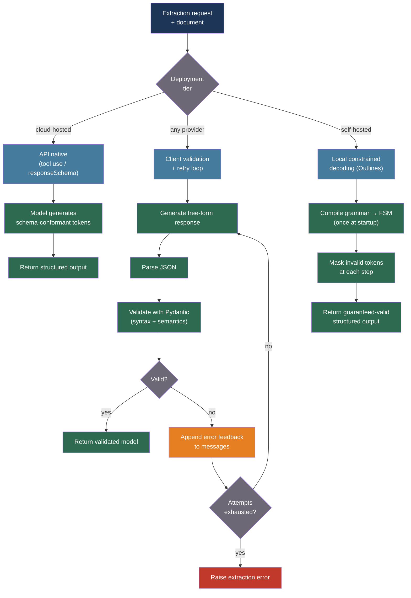

# [BEE-548] LLM Output Parsing and Structured Extraction Reliability

:::info
Converting LLM free-form text to schema-compliant structured data requires a layered reliability strategy: native API constraints for hard guarantees, client-side validation with retry loops for probabilistic enforcement, and local constrained decoding for self-hosted models — with semantic validators covering the domain logic that token-level constraints cannot express.
:::

## Context

Backend systems that consume LLM output require predictable structure: a JSON object with specific fields, a typed value, an enum member. A model that returns "Here is the extracted order: `{...}`" instead of a bare JSON object — or that emits syntactically valid JSON with a missing required field — breaks a downstream parser and turns an AI feature into a production incident.

Research quantifies the scope of the problem. LLMStructBench (arXiv:2602.14743, 2025) tested 22 models across five prompting strategies and found an 8–15% parse failure rate for naive "prompt for JSON" approaches on complex schemas, with GPT-4 producing invalid responses in 11.97% of cases on schemas with more than three levels of nesting. The failure modes are not random: they cluster around schema complexity, output token limits being hit mid-structure, and models hallucinating field names that do not exist in the target schema.

Three complementary reliability mechanisms exist. At the provider level, OpenAI Structured Outputs, Anthropic tool use with strict schemas, and Gemini `responseSchema` enforce JSON schema compliance during token generation — the model physically cannot emit an invalid token. This provides hard guarantees but creates vendor lock-in and does not cover semantic constraints. At the client level, libraries like Instructor (3M+ monthly downloads) generate unstructured output, validate against a Pydantic model, and feed the validation error back to the model as a corrective prompt for retry. This is provider-agnostic and supports arbitrary semantic validators but adds round-trip cost per failure. At the inference level, constrained decoding engines (Outlines, llama.cpp GBNF) compile target grammars to finite-state machines and mask invalid tokens at each generation step — hard guarantees with no retry overhead, but requiring self-hosted infrastructure.

Willard and Louf (arXiv:2307.09702, 2023) established the theoretical foundation for FSM-based constrained decoding: compile a regular or context-free grammar to a finite automaton at initialization, then at each generation step compute the set of tokens that keep the FSM in a valid state and set all others to −∞ logit. This makes invalid output structurally impossible without changing how the model reasons.

## Best Practices

### Layer the Reliability Architecture by Deployment Context

**SHOULD** select the appropriate reliability tier based on infrastructure and schema requirements. Do not apply all three tiers to every request — each has different cost profiles and operational dependencies:

| Tier | Mechanism | Guarantee | When to use |
|---|---|---|---|
| API native | Provider enforces schema during token generation | Hard | Cloud-hosted models, strict schema requirements |
| Client validation + retry | Parse → validate → retry with error feedback | Probabilistic | Any provider, semantic validation needed |
| Local constrained decoding | FSM masks invalid tokens during generation | Hard | Self-hosted models, batch processing |

For cloud-hosted models, use Anthropic tool use with a JSON Schema definition to get hard schema enforcement without client-side retry overhead:

```python
import anthropic
import json
from typing import Any

ORDER_SCHEMA = {
    "type": "object",
    "properties": {
        "order_id": {"type": "string"},
        "customer_email": {"type": "string", "format": "email"},
        "items": {
            "type": "array",
            "items": {
                "type": "object",
                "properties": {
                    "sku": {"type": "string"},
                    "quantity": {"type": "integer", "minimum": 1},
                    "unit_price_cents": {"type": "integer", "minimum": 0},
                },
                "required": ["sku", "quantity", "unit_price_cents"],
            },
        },
        "shipping_address": {"type": "string"},
    },
    "required": ["order_id", "customer_email", "items", "shipping_address"],
}

async def extract_order_native(document: str) -> dict[str, Any]:
    """
    Extract order data using Anthropic tool use for hard schema enforcement.
    The model cannot return a response that does not conform to ORDER_SCHEMA.
    """
    client = anthropic.AsyncAnthropic()
    response = await client.messages.create(
        model="claude-sonnet-4-20250514",
        max_tokens=1024,
        tools=[{
            "name": "extract_order",
            "description": "Extract the structured order data from the document.",
            "input_schema": ORDER_SCHEMA,
        }],
        tool_choice={"type": "tool", "name": "extract_order"},
        messages=[{
            "role": "user",
            "content": f"Extract the order information from this document:\n\n{document}",
        }],
    )
    for block in response.content:
        if block.type == "tool_use" and block.name == "extract_order":
            return block.input
    raise ValueError("Model did not call extract_order tool")
```

### Implement Client-Side Validation with Retry Feedback

**MUST** include validation error feedback in the retry prompt — not a bare retry. Retrying without telling the model what failed produces the same error at a higher cost:

```python
from pydantic import BaseModel, EmailStr, field_validator
from datetime import datetime
import asyncio

class OrderItem(BaseModel):
    sku: str
    quantity: int
    unit_price_cents: int

    @field_validator("quantity")
    @classmethod
    def quantity_positive(cls, v: int) -> int:
        if v < 1:
            raise ValueError(f"quantity must be at least 1, got {v}")
        return v

    @field_validator("unit_price_cents")
    @classmethod
    def price_non_negative(cls, v: int) -> int:
        if v < 0:
            raise ValueError(f"unit_price_cents must be non-negative, got {v}")
        return v

class Order(BaseModel):
    order_id: str
    customer_email: EmailStr
    items: list[OrderItem]
    shipping_address: str

async def extract_with_retry(
    document: str,
    *,
    model: str = "claude-sonnet-4-20250514",
    max_attempts: int = 3,
) -> Order:
    """
    Extract structured data with validation + retry loop.
    On validation failure, the error is fed back so the model can correct itself.
    """
    client = anthropic.AsyncAnthropic()
    messages = [{
        "role": "user",
        "content": (
            "Extract the order information from this document as JSON "
            "matching the Order schema. Return only the JSON object, no prose.\n\n"
            f"Document:\n{document}"
        ),
    }]

    last_error: Exception | None = None
    for attempt in range(max_attempts):
        response = await client.messages.create(
            model=model, max_tokens=1024,
            messages=messages,
        )
        raw = response.content[0].text.strip()

        # Strip markdown code fences if present
        if raw.startswith("```"):
            raw = raw.split("```")[1]
            if raw.startswith("json"):
                raw = raw[4:]
            raw = raw.strip()

        try:
            data = json.loads(raw)
            order = Order.model_validate(data)
            return order
        except (json.JSONDecodeError, ValueError) as e:
            last_error = e
            # Feed the error back as user message + previous assistant output
            messages.append({"role": "assistant", "content": response.content[0].text})
            messages.append({
                "role": "user",
                "content": (
                    f"Your response failed validation with this error:\n{e}\n\n"
                    "Please correct the JSON and return only the fixed JSON object."
                ),
            })

    raise ValueError(
        f"Failed to extract valid Order after {max_attempts} attempts. "
        f"Last error: {last_error}"
    )
```

**SHOULD** monitor per-schema error rates. If a schema's error rate exceeds 20% in production, retrying is not the fix — the schema is too complex and must be simplified or the deployment tier must change to constrained decoding.

### Separate Syntax Guarantees from Semantic Validation

**MUST NOT** rely on token-level constraints alone for domain correctness. A JSON Schema can enforce that `start_date` is a string formatted as a date, but it cannot enforce that `start_date` comes before `end_date`. Pydantic model validators cover semantic rules that grammars cannot express:

```python
from pydantic import BaseModel, model_validator
from datetime import date

class Reservation(BaseModel):
    reservation_id: str
    start_date: date
    end_date: date
    room_type: str
    guest_count: int

    @model_validator(mode="after")
    def end_after_start(self) -> "Reservation":
        if self.end_date <= self.start_date:
            raise ValueError(
                f"end_date ({self.end_date}) must be after start_date ({self.start_date})"
            )
        return self

    @model_validator(mode="after")
    def guest_count_reasonable(self) -> "Reservation":
        max_guests = {"single": 1, "double": 2, "suite": 4}.get(self.room_type, 2)
        if self.guest_count > max_guests:
            raise ValueError(
                f"guest_count {self.guest_count} exceeds maximum {max_guests} "
                f"for room_type '{self.room_type}'"
            )
        return self
```

**SHOULD** combine the two layers: use provider-native schema enforcement (or constrained decoding) for syntax, and Pydantic validators for semantics. This eliminates retry loops caused by syntax errors while catching domain violations that grammars cannot express.

### Apply Constrained Decoding for Self-Hosted Models

**SHOULD** use Outlines or a compatible constrained decoding engine when running local inference. FSM-based constraints compile the target grammar once at initialization and add only 5–15% latency overhead for simple schemas — substantially less than one retry:

```python
# Outlines constrained decoding (requires self-hosted inference)
import outlines
import outlines.models as models
from pydantic import BaseModel

class ExtractedEntity(BaseModel):
    name: str
    entity_type: str
    confidence: float

def build_extraction_generator(model_path: str):
    """
    Compile the Pydantic schema to an FSM once at startup.
    Each generation call is then guaranteed to return valid ExtractedEntity JSON.
    """
    model = models.transformers(model_path)
    generator = outlines.generate.json(model, ExtractedEntity)
    return generator

def extract_entity(generator, text: str) -> ExtractedEntity:
    """
    Constrained generation: the FSM ensures output always conforms to ExtractedEntity.
    No retry needed; no post-hoc JSON parsing errors.
    """
    result = generator(
        f"Extract the primary named entity from: {text}"
    )
    return result  # Already a validated ExtractedEntity instance
```

### Prevent Truncation at Token Limits

**MUST** reserve sufficient output tokens to complete the target structure. A JSON object truncated mid-field fails parsing even when every emitted token was valid:

```python
import tiktoken

def estimate_output_tokens(schema: dict, multiplier: float = 2.5) -> int:
    """
    Estimate max tokens needed to produce a JSON response for the given schema.
    Multiplier of 2.5 accounts for string values being longer than field names.
    """
    schema_str = json.dumps(schema)
    enc = tiktoken.get_encoding("cl100k_base")
    schema_tokens = len(enc.encode(schema_str))
    return int(schema_tokens * multiplier)

MAX_OUTPUT_RESERVE = 512   # Minimum reserve for any structured output call

def safe_max_tokens(schema: dict, context_limit: int = 200_000) -> int:
    estimated = estimate_output_tokens(schema)
    return max(estimated, MAX_OUTPUT_RESERVE)
```

## Visual



## Reliability Tier Comparison

| Tier | Schema guarantee | Semantic validation | Vendor lock-in | Retry overhead | Infrastructure |
|---|---|---|---|---|---|
| API native (tool use) | Hard | No | Yes | None | Cloud only |
| Client + Pydantic retry | Probabilistic | Yes | No | 1–3× per failure | Any |
| Outlines (FSM) | Hard | No | No | None | Self-hosted GPU |
| Combined (FSM + Pydantic) | Hard | Yes | No | None | Self-hosted GPU |

## Common Mistakes

**Retrying without error feedback.** A bare retry sends the same prompt to the model and receives the same error at double the cost. The retry prompt must include the failed output and the specific validation error.

**Using deep nesting in schemas.** Schemas with more than three levels of nesting correlate with significantly higher parse failure rates. Flatten to two levels and transform to the nested structure in application code after extraction.

**Treating syntax validity as semantic correctness.** A model that produces `{"quantity": -5}` passes JSON parsing but fails domain logic. Pydantic field validators are the mechanism for catching this; they are not optional for production systems.

**Not reserving output tokens.** Setting `max_tokens` to the context limit allows the model to start a JSON structure it cannot finish. Reserve at least 2× the estimated schema token count for the output field.

**Mixing reliability tiers per request.** If some requests use API native enforcement and others use retry, monitoring becomes noisy — the error rates are incomparable. Standardize on one tier per schema type.

## Related BEEs

- [BEE-508](508.md) -- Structured Output and Constrained Decoding: token-level grammar enforcement mechanisms that underpin the constrained decoding tier described here
- [BEE-520](520.md) -- LLM Tool Use and Function Calling Patterns: Anthropic tool use is the mechanism that provides native hard schema enforcement
- [BEE-545](545.md) -- LLM Hallucination Detection and Factual Grounding: hallucination detection and structured extraction are complementary; a validated schema does not guarantee factual correctness of extracted values
- [BEE-537](537.md) -- AI Agent Safety and Reliability Patterns: retry budgets and circuit breakers for extraction pipelines follow the same patterns as agent reliability controls

## References

- [Willard and Louf. Efficient Guided Generation for Large Language Models — arXiv:2307.09702, 2023](https://arxiv.org/abs/2307.09702)
- [LLMStructBench: Benchmarking Large Language Model Structured Data Extraction — arXiv:2602.14743, 2025](https://arxiv.org/abs/2602.14743)
- [Generating Structured Outputs from Language Models: Benchmark and Studies — arXiv:2501.10868, 2025](https://arxiv.org/html/2501.10868v1)
- [PARSE: LLM Driven Schema Optimization for Reliable Entity Extraction — arXiv:2510.08623, 2024](https://arxiv.org/abs/2510.08623)
- [Instructor: Structured Outputs for LLMs — python.useinstructor.com](https://python.useinstructor.com/)
- [Outlines: Structured Generation by dottxt-ai — github.com/dottxt-ai/outlines](https://github.com/dottxt-ai/outlines)
