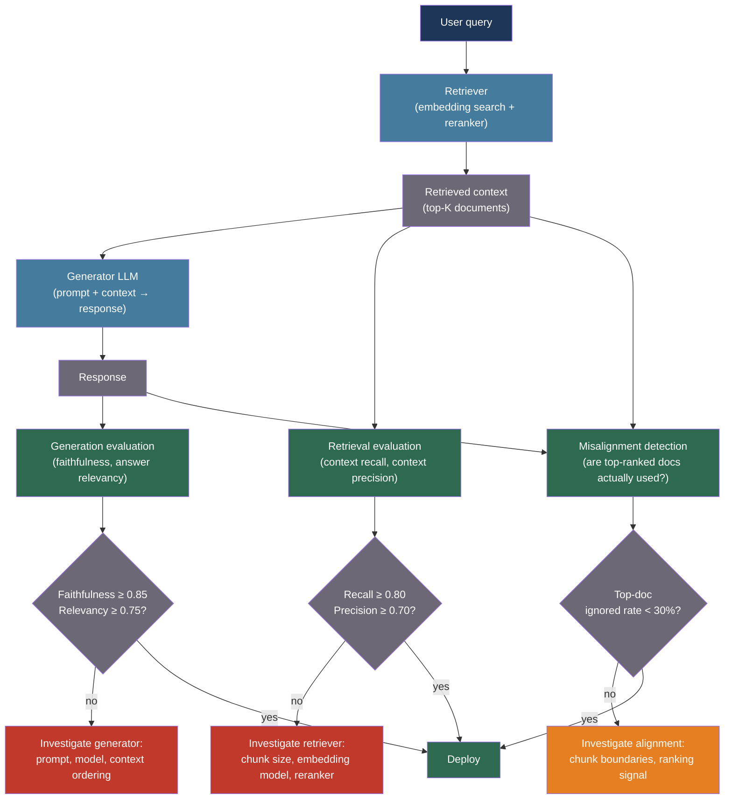

# [BEE-552] RAG Evaluation and Quality Measurement

:::info
RAG evaluation must decompose pipeline quality into two independent subproblems — retrieval (did we fetch the right documents?) and generation (did the model use them faithfully?) — because a failure in either component produces wrong answers, and an aggregate end-to-end score cannot distinguish which component to fix.
:::

## Context

A Retrieval-Augmented Generation pipeline has two distinct failure modes. The retriever can return irrelevant documents, incomplete coverage, or poorly ranked results — the model then either hallucinates from insufficient evidence or produces answers grounded in the wrong context. The generator can receive perfectly relevant documents and still fail — ignoring them, contradicting them, or producing answers that are factually faithful to the context but semantically off-topic. Without decomposed evaluation, a team debugging a wrong answer cannot determine whether to improve the embedding model, the reranker, the chunk size, or the generation prompt.

Es et al. (2023, arXiv:2309.15217, EACL 2024) introduced RAGAS, a reference-free evaluation framework that defines four metrics measured jointly across a retrieval-generation pair: context precision (are relevant chunks ranked above irrelevant ones?), context recall (does the retrieved context cover all information needed to answer?), faithfulness (are all claims in the response supported by the context?), and answer relevancy (does the response actually address the question?). The key design decision in RAGAS is that all four metrics can be computed using an LLM judge without requiring human-annotated ground-truth answers — making them applicable to production data without labeling cost.

Saad-Falcon et al. (2023, arXiv:2311.09476, NAACL 2024) introduced ARES, which goes further: train lightweight LLM classifiers (not zero-shot judges) on a small set of human annotations and use prediction-powered inference (PPI) to produce statistically valid confidence intervals for metric estimates. ARES achieves significantly lower variance than RAGAS on the same evaluation budget, at the cost of requiring 150–300 human-labeled examples per task.

Randl et al. (2026, arXiv:2601.21803) measured a critical failure mode in production RAG: 47–67% of queries show retriever-generator misalignment, where the generator ignores the top-ranked documents and relies on lower-ranked ones instead. This means a high retrieval recall score does not guarantee that the generator uses what was retrieved — the two components can each perform well in isolation while the integrated pipeline fails.

## Best Practices

### Measure Retrieval and Generation Independently

**MUST** evaluate retrieval quality and generation quality as separate metrics. A degradation in answer quality could be caused by a retrieval change (worse documents in context), a generation change (different prompt or model), or their interaction. Without separate metrics, you cannot attribute the failure:

```python
import anthropic
import json
import re

FAITHFULNESS_SYSTEM = """You are a fact-checking assistant. Given a context and a response,
extract all factual claims from the response and determine whether each claim is
supported, contradicted, or not mentioned in the context.

Output JSON:
{
  "claims": [
    {"claim": "<claim text>", "verdict": "supported" | "contradicted" | "not_in_context"}
  ],
  "faithfulness_score": <float 0.0 to 1.0>
}

faithfulness_score = (number of supported claims) / (total claims)
A contradicted claim is worse than a not_in_context claim, but both count as not supported."""

RELEVANCY_SYSTEM = """You are an evaluation assistant. Given a question and a response,
determine how well the response answers the question.

Output JSON:
{
  "addresses_question": true | false,
  "completeness": "full" | "partial" | "minimal",
  "relevancy_score": <float 0.0 to 1.0>
}

relevancy_score:
  1.0 = response fully addresses the question with appropriate scope
  0.5 = response addresses the question partially (key aspects missing)
  0.0 = response does not address the question"""

async def measure_faithfulness(
    context: str,
    response: str,
    *,
    judge_model: str = "claude-sonnet-4-20250514",
) -> dict:
    """
    Measure whether all claims in the response are supported by the retrieved context.
    Returns faithfulness_score: 1.0 = fully faithful, 0.0 = all claims unsupported.
    """
    client = anthropic.AsyncAnthropic()
    r = await client.messages.create(
        model=judge_model,
        max_tokens=1024,
        system=FAITHFULNESS_SYSTEM,
        messages=[{
            "role": "user",
            "content": (
                f"Context:\n{context}\n\n"
                f"Response:\n{response}"
            ),
        }],
    )
    text = r.content[0].text
    match = re.search(r"\{.*\}", text, re.DOTALL)
    if match:
        return json.loads(match.group(0))
    return {"faithfulness_score": 0.0, "claims": [], "parse_error": True}

async def measure_answer_relevancy(
    question: str,
    response: str,
    *,
    judge_model: str = "claude-sonnet-4-20250514",
) -> dict:
    """
    Measure whether the response actually addresses what the user asked.
    Note: relevancy is independent of faithfulness — a response can be faithful to
    the context but completely off-topic if the wrong documents were retrieved.
    """
    client = anthropic.AsyncAnthropic()
    r = await client.messages.create(
        model=judge_model,
        max_tokens=256,
        system=RELEVANCY_SYSTEM,
        messages=[{
            "role": "user",
            "content": f"Question: {question}\n\nResponse: {response}",
        }],
    )
    text = r.content[0].text
    match = re.search(r"\{.*\}", text, re.DOTALL)
    if match:
        return json.loads(match.group(0))
    return {"relevancy_score": 0.0, "parse_error": True}
```

### Compute Context Recall and Precision to Evaluate Retrieval

**SHOULD** use context recall and context precision to measure the retriever independently of the generator. These metrics require a reference answer or a set of reference facts — but they can be computed automatically using an LLM to extract reference facts from a ground-truth answer:

```python
RECALL_SYSTEM = """Given a reference answer and a retrieved context, identify which
statements from the reference answer are supported by the context.

Output JSON:
{
  "reference_statements": ["<stmt>", ...],
  "supported_statements": ["<stmt>", ...],
  "context_recall": <float 0.0 to 1.0>
}

context_recall = len(supported_statements) / len(reference_statements)
A statement is supported if the context contains information that entails it."""

PRECISION_SYSTEM = """Given a retrieved context and a question, evaluate each sentence
in the context for relevance to the question.

Output JSON:
{
  "total_sentences": <int>,
  "relevant_sentences": <int>,
  "context_precision": <float 0.0 to 1.0>
}

context_precision = relevant_sentences / total_sentences
A sentence is relevant if it contributes to answering the question."""

async def measure_context_recall(
    reference_answer: str,
    retrieved_context: str,
    *,
    judge_model: str = "claude-sonnet-4-20250514",
) -> float:
    """
    Measure how much of the reference answer is supported by the retrieved context.
    High recall = retriever found the documents needed to produce the correct answer.
    Low recall = relevant documents were missed (retriever failure).
    """
    client = anthropic.AsyncAnthropic()
    r = await client.messages.create(
        model=judge_model,
        max_tokens=1024,
        system=RECALL_SYSTEM,
        messages=[{
            "role": "user",
            "content": (
                f"Reference answer:\n{reference_answer}\n\n"
                f"Retrieved context:\n{retrieved_context}"
            ),
        }],
    )
    text = r.content[0].text
    match = re.search(r"\{.*\}", text, re.DOTALL)
    if match:
        return json.loads(match.group(0)).get("context_recall", 0.0)
    return 0.0

async def evaluate_rag_example(
    question: str,
    retrieved_context: str,
    response: str,
    reference_answer: str | None = None,
) -> dict:
    """
    Full RAGAS-style evaluation of a single RAG example.
    Returns all four metrics: context_recall, context_precision, faithfulness, answer_relevancy.
    context_recall requires a reference_answer; the others are reference-free.
    """
    import asyncio

    faithfulness_task = measure_faithfulness(retrieved_context, response)
    relevancy_task = measure_answer_relevancy(question, response)
    recall_task = (
        measure_context_recall(reference_answer, retrieved_context)
        if reference_answer else None
    )

    faith, relev = await asyncio.gather(faithfulness_task, relevancy_task)
    recall = await recall_task if recall_task else None

    return {
        "faithfulness": faith.get("faithfulness_score", 0.0),
        "answer_relevancy": relev.get("relevancy_score", 0.0),
        "context_recall": recall,  # None if no reference answer provided
        "claims": faith.get("claims", []),
    }
```

### Run Evaluation in CI/CD with Quality Thresholds

**SHOULD** enforce minimum quality thresholds per metric in the deployment pipeline. Different metrics indicate different failure modes and warrant different blocking thresholds:

```python
from dataclasses import dataclass

@dataclass
class RAGQualityThresholds:
    """
    Minimum quality thresholds for RAG pipeline deployment.
    Faithfulness < 0.85 means more than 15% of response claims are unsupported —
    this is a hallucination risk that warrants blocking.
    Context recall < 0.80 means 20% of facts needed to answer are missing from
    the retrieved context — a retriever problem.
    """
    faithfulness: float = 0.85       # Below: block — hallucination risk
    answer_relevancy: float = 0.75   # Below: block — responses off-topic
    context_recall: float = 0.80     # Below: investigate retriever
    context_precision: float = 0.70  # Below: too much noise in retrieved docs

def evaluate_pipeline_health(
    results: list[dict],
    thresholds: RAGQualityThresholds = RAGQualityThresholds(),
) -> dict:
    """
    Aggregate metrics across test cases and check against thresholds.
    Returns pass/fail per metric and overall pipeline verdict.
    """
    metrics = ["faithfulness", "answer_relevancy", "context_recall"]
    averages = {}
    for metric in metrics:
        values = [r[metric] for r in results if r.get(metric) is not None]
        averages[metric] = sum(values) / len(values) if values else None

    failures = []
    for metric, avg in averages.items():
        if avg is None:
            continue
        threshold = getattr(thresholds, metric)
        if avg < threshold:
            failures.append({
                "metric": metric,
                "average": avg,
                "threshold": threshold,
                "delta": avg - threshold,
            })

    return {
        "averages": averages,
        "failures": failures,
        "verdict": "PASS" if not failures else "FAIL",
        "recommendation": (
            "Safe to deploy"
            if not failures else
            f"Block deployment — {len(failures)} metric(s) below threshold: "
            + ", ".join(f["metric"] for f in failures)
        ),
    }
```

### Detect Retriever-Generator Misalignment

**SHOULD** monitor whether the generator is actually using the retrieved documents. Randl et al. (2026) found that in 47–67% of queries, the generator ignores top-ranked documents — meaning retrieval quality improvements do not translate to generation quality improvements:

```python
ATTRIBUTION_SYSTEM = """Given a retrieved context with numbered documents and a response,
identify which documents (by number) the response draws information from.

Output JSON:
{
  "used_documents": [<doc_numbers>],
  "ignored_top_ranked": <true | false>,
  "alignment_note": "<brief explanation>"
}

A document is 'used' if the response cites or is clearly informed by information in it.
'ignored_top_ranked' is true if document 1 (the top-ranked result) is not in used_documents."""

async def detect_misalignment(
    retrieved_docs: list[str],   # Ordered by retriever ranking: index 0 = most relevant
    response: str,
    *,
    judge_model: str = "claude-haiku-4-5-20251001",   # Cheap model sufficient
) -> dict:
    """
    Check whether the generator is using the documents the retriever ranked highest.
    If the top-ranked document is systematically ignored, the retriever and generator
    ranking criteria are misaligned — a signal to audit chunking or embedding strategy.
    """
    client = anthropic.AsyncAnthropic()
    numbered = "\n\n".join(
        f"[Document {i+1}]:\n{doc}"
        for i, doc in enumerate(retrieved_docs)
    )
    r = await client.messages.create(
        model=judge_model,
        max_tokens=256,
        system=ATTRIBUTION_SYSTEM,
        messages=[{
            "role": "user",
            "content": f"Context:\n{numbered}\n\nResponse:\n{response}",
        }],
    )
    text = r.content[0].text
    import re, json
    match = re.search(r"\{.*\}", text, re.DOTALL)
    if match:
        return json.loads(match.group(0))
    return {"used_documents": [], "ignored_top_ranked": None, "parse_error": True}
```

**SHOULD** track the `ignored_top_ranked` rate across a sample of production queries. A rate above 30% indicates that the retriever's ranking signal does not correspond to what the generator finds useful — candidates for investigation include chunk size, embedding model choice, and reranker calibration.

## Visual



## RAGAS Metric Reference

| Metric | What it measures | Reference needed | Failure indicates |
|---|---|---|---|
| Context recall | Fraction of reference facts covered by retrieved context | Yes (reference answer) | Retriever missing relevant documents |
| Context precision | Fraction of retrieved sentences relevant to the query | No | Retriever returning noisy, irrelevant chunks |
| Faithfulness | Fraction of response claims supported by context | No | Generator hallucinating beyond retrieved evidence |
| Answer relevancy | Degree to which response addresses the question | No | Off-topic responses despite correct retrieval |

## Common Mistakes

**Using end-to-end accuracy as the only metric.** An overall score of 75% correct tells you nothing about whether to fix the retriever or the generator. Decomposed metrics make the root cause visible.

**Not testing with oracle retrieval.** To isolate generation quality, run the generator with the ground-truth documents as context. If generation quality is poor even with perfect context, the prompt or model is the problem, not retrieval.

**Treating faithfulness as equivalent to correctness.** A response can be fully faithful to retrieved context that is itself wrong or outdated. Faithfulness measures consistency with context; correctness requires comparing to ground truth.

**Ignoring the misalignment rate.** Improving retrieval recall does not improve user outcomes if the generator ignores the retrieved documents. Track which documents the model actually uses, not just which documents were retrieved.

**Using identical test cases for retrieval and generation evaluation.** Retrieval should be tested with queries that have known-relevant documents in the corpus. Generation should be tested with fixed context to isolate the generation component. Mixing these produces uninterpretable results.

## Related BEEs

- [BEE-509](509.md) -- RAG Pipeline Architecture: the system architecture that this article evaluates; chunking, embedding, and retrieval strategy all affect these metrics
- [BEE-531](531.md) -- Advanced RAG and Agentic Retrieval Patterns: rerankers, query expansion, and hybrid search improve context recall and precision
- [BEE-545](545.md) -- LLM Hallucination Detection and Factual Grounding: faithfulness checking is a specialized form of hallucination detection applied to the retrieved context
- [BEE-551](551.md) -- LLM Evaluation Metrics and Automated Scoring Pipelines: the general evaluation infrastructure within which RAG-specific metrics run

## References

- [Es et al. Ragas: Automated Evaluation of Retrieval Augmented Generation — arXiv:2309.15217, EACL 2024](https://arxiv.org/abs/2309.15217)
- [Saad-Falcon et al. ARES: An Automated Evaluation Framework for Retrieval-Augmented Generation Systems — arXiv:2311.09476, NAACL 2024](https://arxiv.org/abs/2311.09476)
- [Chen et al. Benchmarking Large Language Models in Retrieval-Augmented Generation — arXiv:2309.01431, AAAI 2024](https://arxiv.org/abs/2309.01431)
- [Randl et al. RAG-E: Quantifying Retriever-Generator Alignment and Failure Modes — arXiv:2601.21803, 2026](https://arxiv.org/abs/2601.21803)
- [Thakur et al. BEIR: A Heterogenous Benchmark for Zero-shot Evaluation of Information Retrieval Models — arXiv:2104.08663, NeurIPS 2021](https://arxiv.org/abs/2104.08663)
- [Yu et al. Evaluation of Retrieval-Augmented Generation: A Survey — arXiv:2405.07437, 2024](https://arxiv.org/abs/2405.07437)
- [RAGAS Documentation — docs.ragas.io](https://docs.ragas.io/)
