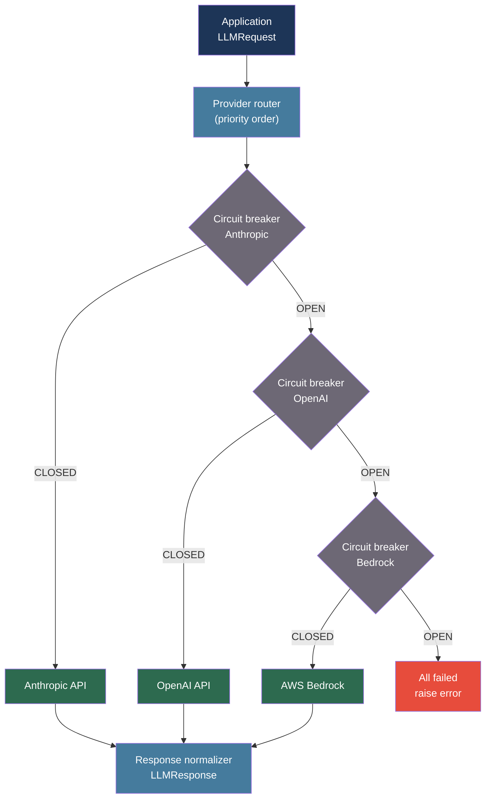

# [BEE-555] LLM Multi-Provider Resilience and API Fallback Patterns

:::info
Relying on a single LLM provider creates a single point of failure — outages, rate limit exhaustion, and model deprecations affect production without warning. Multi-provider routing with circuit breakers, provider-normalized clients, and health-aware fallback queues converts provider risk from a service dependency into a routing decision.
:::

## Context

LLM providers publish uptime SLAs of 99.5–99.9%, but real availability experienced at the API level is lower due to rate limiting, regional routing failures, and rolling model deprecations. A backend service that sends 1,000 requests per minute to a single provider will observe multiple timeout and 429 (Too Many Requests) events per hour at moderate traffic, and full outages several times per year.

The LiteLLM project (github.com/BerriAI/litellm, Apache 2.0) provides a unified interface over more than 100 LLM providers, normalizing incompatible API schemas (Anthropic's separate input/output token billing, OpenAI's combined usage field, Bedrock's signed request model) into a single call interface. LiteLLM supports fallback lists, provider health tracking, and cost normalization, making it the most widely deployed open-source multi-provider abstraction layer as of 2024.

Provider API differences create subtle correctness risks beyond availability. Anthropic bills input tokens (ITPM) and output tokens (OTPM) against separate rate limit buckets; OpenAI combines them into a single TPM limit. Anthropic requires the system prompt in a dedicated field; OpenAI accepts it as a `{"role": "system"}` message. Model parameter names diverge (`max_tokens` vs `max_completion_tokens` in newer OpenAI models). A naive fallback that swaps provider without normalizing the request will silently send the wrong schema.

Model deprecation is the least-discussed availability risk. Providers retire model versions with 3–6 months of notice, but a service that hardcodes `gpt-4-0613` or `claude-2.0` will start receiving 404 errors on the deprecation date with no graceful degradation. Version pinning must be paired with a deprecation monitoring strategy.

## Best Practices

### Normalize Provider Interfaces Behind a Unified Client

**MUST** abstract provider-specific API details before implementing fallback logic. Fallback between providers with mismatched schemas produces silent errors:

```python
from dataclasses import dataclass, field
from typing import Any
import anthropic
import openai

@dataclass
class LLMRequest:
    """Normalized request that maps to any provider's schema."""
    messages: list[dict]          # [{"role": "user"/"assistant", "content": str}]
    system: str = ""
    model: str = ""
    max_tokens: int = 1024
    temperature: float = 1.0
    extra: dict = field(default_factory=dict)

@dataclass
class LLMResponse:
    text: str
    input_tokens: int
    output_tokens: int
    model: str
    provider: str

async def call_anthropic(req: LLMRequest) -> LLMResponse:
    client = anthropic.AsyncAnthropic()
    resp = await client.messages.create(
        model=req.model or "claude-haiku-4-5-20251001",
        system=req.system,
        messages=req.messages,
        max_tokens=req.max_tokens,
        temperature=req.temperature,
    )
    return LLMResponse(
        text=resp.content[0].text,
        input_tokens=resp.usage.input_tokens,
        output_tokens=resp.usage.output_tokens,
        model=resp.model,
        provider="anthropic",
    )

async def call_openai(req: LLMRequest) -> LLMResponse:
    client = openai.AsyncOpenAI()
    # OpenAI: system prompt as first message, not a separate field
    messages = []
    if req.system:
        messages.append({"role": "system", "content": req.system})
    messages.extend(req.messages)

    resp = await client.chat.completions.create(
        model=req.model or "gpt-4o-mini",
        messages=messages,
        max_tokens=req.max_tokens,
        temperature=req.temperature,
    )
    usage = resp.usage
    return LLMResponse(
        text=resp.choices[0].message.content,
        input_tokens=usage.prompt_tokens,
        output_tokens=usage.completion_tokens,
        model=resp.model,
        provider="openai",
    )
```

### Implement Circuit Breaker with Provider Health Tracking

**MUST** use a circuit breaker per provider rather than retry-until-success against a failing provider. A provider returning 429s or 503s should be temporarily removed from the rotation:

```python
import asyncio
import time
from enum import Enum

class CircuitState(Enum):
    CLOSED = "closed"      # Normal: requests flow through
    OPEN = "open"          # Failing: requests rejected immediately
    HALF_OPEN = "half_open"  # Recovery: one probe request allowed

@dataclass
class CircuitBreaker:
    provider: str
    failure_threshold: int = 5      # Failures before opening
    recovery_timeout: float = 60.0  # Seconds before half-open probe
    success_threshold: int = 2      # Successes in half-open before closing

    _state: CircuitState = CircuitState.CLOSED
    _failures: int = 0
    _last_failure_time: float = 0.0
    _half_open_successes: int = 0

    def record_success(self) -> None:
        if self._state == CircuitState.HALF_OPEN:
            self._half_open_successes += 1
            if self._half_open_successes >= self.success_threshold:
                self._state = CircuitState.CLOSED
                self._failures = 0
                self._half_open_successes = 0
        elif self._state == CircuitState.CLOSED:
            self._failures = 0

    def record_failure(self) -> None:
        self._failures += 1
        self._last_failure_time = time.monotonic()
        if self._failures >= self.failure_threshold:
            self._state = CircuitState.OPEN
        elif self._state == CircuitState.HALF_OPEN:
            self._state = CircuitState.OPEN
            self._half_open_successes = 0

    def is_available(self) -> bool:
        if self._state == CircuitState.CLOSED:
            return True
        if self._state == CircuitState.OPEN:
            elapsed = time.monotonic() - self._last_failure_time
            if elapsed >= self.recovery_timeout:
                self._state = CircuitState.HALF_OPEN
                return True  # Allow probe
            return False
        return True  # HALF_OPEN allows one request

RETRYABLE_STATUS_CODES = {429, 500, 502, 503, 504}

async def call_with_fallback(
    req: LLMRequest,
    providers: list[tuple[str, callable, CircuitBreaker]],
    # providers: [(name, call_fn, circuit_breaker), ...]
) -> LLMResponse:
    """
    Try providers in order. Skip any whose circuit breaker is OPEN.
    Record success/failure to update circuit state.
    """
    last_error = None
    for name, call_fn, breaker in providers:
        if not breaker.is_available():
            continue
        try:
            response = await asyncio.wait_for(call_fn(req), timeout=30.0)
            breaker.record_success()
            return response
        except Exception as exc:
            breaker.record_failure()
            last_error = exc
            # Log: provider failed, trying next
    raise RuntimeError(f"All providers failed. Last error: {last_error}")
```

### Handle Model Deprecations Without Service Interruption

**MUST NOT** hardcode model version strings in application code. Use a configuration layer with fallback model aliases:

```python
MODEL_ALIASES = {
    # Canonical alias -> [primary, fallback1, fallback2]
    "fast": [
        ("anthropic", "claude-haiku-4-5-20251001"),
        ("openai", "gpt-4o-mini"),
    ],
    "balanced": [
        ("anthropic", "claude-sonnet-4-20250514"),
        ("openai", "gpt-4o"),
    ],
    "powerful": [
        ("anthropic", "claude-opus-4-6"),
        ("openai", "gpt-4o"),
    ],
}

def resolve_model(alias: str, provider: str) -> str:
    """
    Resolve a capability alias to a concrete model for a given provider.
    Update MODEL_ALIASES in config on deprecation — no code changes needed.
    """
    candidates = MODEL_ALIASES.get(alias, [])
    for prov, model in candidates:
        if prov == provider:
            return model
    raise ValueError(f"No model alias '{alias}' for provider '{provider}'")
```

**SHOULD** monitor provider deprecation announcements and update `MODEL_ALIASES` at least 30 days before the retirement date. Add an integration test that calls each configured model with a minimal prompt to detect 404 deprecation errors before production traffic hits them.

## Visual



## Common Mistakes

**Retrying the same provider on 429 errors.** Exponential backoff against a provider at its rate limit occupies the request thread and delays fallback. Open the circuit breaker after 3–5 consecutive 429s and switch to the next provider immediately.

**Not normalizing the system prompt field.** Anthropic takes `system` as a top-level parameter. OpenAI takes it as a `{"role": "system"}` message. Sending a blank system field to Anthropic or an extra system message to OpenAI produces subtly wrong behavior without raising an error.

**Hardcoding model version strings.** `claude-2.0`, `gpt-4-0613`, and other pinned versions will receive 404 errors on their deprecation dates. Use capability aliases and update them through configuration, not code.

**Logging provider errors without provider identity.** When a fallback cascade triggers, logs must record which provider failed and why. Aggregating error rates per provider separately from total error rate is the only way to identify degraded providers before circuit breakers activate.

**Treating all errors as transient.** A 400 (Bad Request) from a provider means the request schema is wrong — retrying or falling back will produce the same error from every provider. Only retry or fall back on 429, 5xx, and timeout errors.

## Related BEEs

- [BEE-260](260.md) -- Circuit Breaker Pattern: the three-state machine this article applies to LLM providers
- [BEE-261](261.md) -- Retry Strategies and Exponential Backoff: per-provider retry configuration
- [BEE-513](513.md) -- AI Cost Optimization and Model Routing: cost-aware routing across providers

## References

- [LiteLLM: Call 100+ LLMs using the OpenAI format — github.com/BerriAI/litellm](https://github.com/BerriAI/litellm)
- [Anthropic API Rate Limits — docs.anthropic.com](https://docs.anthropic.com/en/api/rate-limits)
- [OpenAI API Rate Limits — platform.openai.com](https://platform.openai.com/docs/guides/rate-limits)
- [PortKey AI Gateway — portkey.ai](https://portkey.ai)
- [Martin Fowler: Circuit Breaker Pattern — martinfowler.com](https://martinfowler.com/bliki/CircuitBreaker.html)
