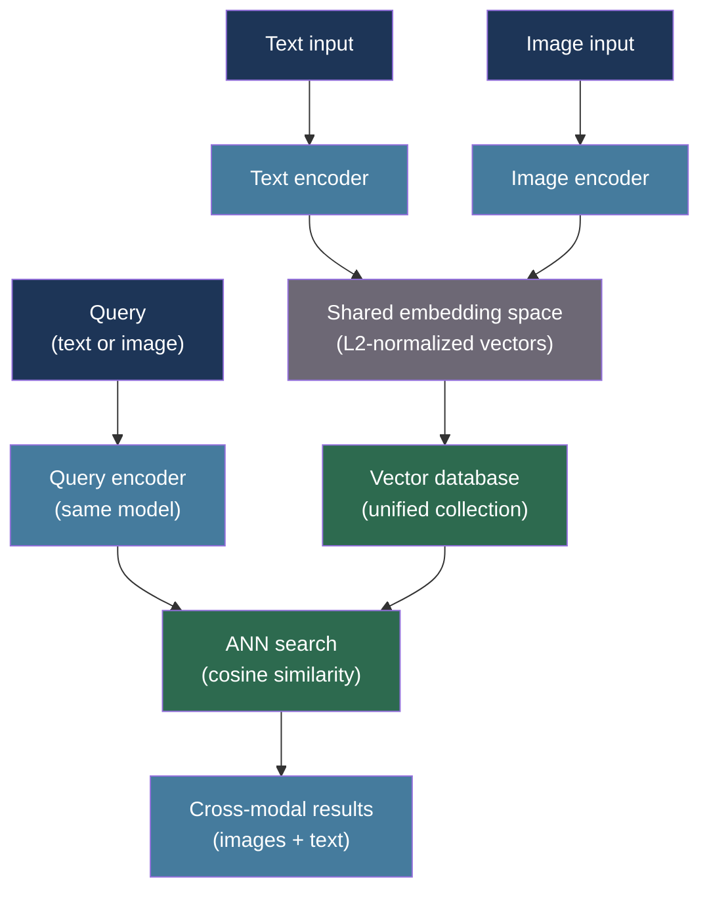

# [BEE-557] Multimodal Embeddings and Cross-Modal Retrieval

:::info
Multimodal embedding models project images, text, and other modalities into a shared vector space, enabling cross-modal retrieval: find images that match a text query, or find text documents similar to an image. The key architectural challenge is aligning embedding spaces across modalities so that semantically equivalent representations land near each other, regardless of the source modality.
:::

## Context

Single-modal embeddings (BEE-516) operate on one input type: text-to-text similarity requires text embeddings, image-to-image similarity requires image embeddings. Cross-modal retrieval — finding images from a text query, or text from an image — requires a shared embedding space where representations from different modalities are geometrically aligned.

Radford, Kim, Hallacy, Ramesh, Goh, Agarwal, Sastry, Askell, Mishkin, Clark, Krueger, and Sutskever (arXiv:2103.00020, "Learning Transferable Visual Models From Natural Language Supervision", ICML 2021) introduced CLIP (Contrastive Language-Image Pre-Training). CLIP trains an image encoder and a text encoder jointly using a contrastive loss: for a batch of (image, text) pairs, the model maximizes cosine similarity between matching pairs and minimizes it between non-matching pairs. After training on 400 million (image, text) pairs from the web, CLIP's shared embedding space enables zero-shot cross-modal retrieval with no task-specific fine-tuning.

Zhai, Kolesnikov, Houlsby, and Beyer (ICCV 2023, "Sigmoid Loss for Language Image Pre-Training") introduced SigLIP, which replaces CLIP's softmax-based contrastive loss with a per-pair sigmoid loss. SigLIP removes the dependency on large batch sizes that made CLIP's contrastive training unstable at small batch sizes, and achieves better accuracy per training compute on image-text alignment benchmarks.

Girdhar, El-Nouby, Liu, Singh, Alwala, Joulin, and Misra (arXiv:2305.05665, "ImageBind: One Embedding Space To Bind Them All", CVPR 2023) extend the CLIP paradigm to six modalities: images, text, audio, video, depth, and IMU sensor data. ImageBind uses image as a "binding" modality — it trains each non-image modality against the image space using paired (modality, image) data — achieving cross-modal retrieval between modality pairs that were never directly co-trained.

For backend engineers, deploying multimodal retrieval requires decisions about which embedding model to run, whether to host embeddings locally or call an API, and how to store and index both image and text vectors in a single vector database query path.

## Best Practices

### Encode Images and Text in the Same Embedding Space

**MUST** use a model trained with cross-modal alignment for cross-modal retrieval tasks. Separately trained image and text embedders produce incompatible vector spaces — cosine similarity between them is meaningless:

```python
from dataclasses import dataclass
import torch
import numpy as np
from PIL import Image

@dataclass
class MultimodalEmbedder:
    """
    Wraps a CLIP-family model (CLIP, SigLIP, OpenCLIP) for
    joint image+text embedding in a shared vector space.
    """
    model_name: str = "openai/clip-vit-base-patch32"
    device: str = "cpu"

    def __post_init__(self):
        from transformers import CLIPModel, CLIPProcessor
        self.model = CLIPModel.from_pretrained(self.model_name).to(self.device)
        self.processor = CLIPProcessor.from_pretrained(self.model_name)
        self.model.eval()

    def embed_text(self, texts: list[str]) -> np.ndarray:
        """Encode text strings to unit-normalized vectors."""
        inputs = self.processor(text=texts, return_tensors="pt", padding=True).to(self.device)
        with torch.no_grad():
            features = self.model.get_text_features(**inputs)
        # L2-normalize so cosine similarity == dot product
        features = features / features.norm(dim=-1, keepdim=True)
        return features.cpu().numpy()

    def embed_images(self, images: list[Image.Image]) -> np.ndarray:
        """Encode PIL images to unit-normalized vectors."""
        inputs = self.processor(images=images, return_tensors="pt").to(self.device)
        with torch.no_grad():
            features = self.model.get_image_features(**inputs)
        features = features / features.norm(dim=-1, keepdim=True)
        return features.cpu().numpy()

    def cross_modal_similarity(
        self,
        query_text: str,
        candidate_images: list[Image.Image],
    ) -> list[float]:
        """Return cosine similarity scores for text-to-image retrieval."""
        text_vec = self.embed_text([query_text])          # (1, D)
        image_vecs = self.embed_images(candidate_images)  # (N, D)
        # dot product of unit vectors == cosine similarity
        scores = (image_vecs @ text_vec.T).flatten()
        return scores.tolist()
```

**SHOULD** choose the embedding model based on your latency and accuracy requirements:

| Model | Embedding dim | Strengths | Inference |
|---|---|---|---|
| CLIP ViT-B/32 | 512 | Fast, widely supported | Local or API |
| CLIP ViT-L/14 | 768 | Better accuracy | Local, GPU recommended |
| SigLIP ViT-B/16 | 768 | Better small-batch training, good accuracy | Local |
| OpenCLIP (large variants) | 1024+ | Best open-source accuracy | GPU required |

### Store Image and Text Vectors Together in the Same Collection

**MUST** store image and text embeddings in the same vector collection when building a unified retrieval index. Splitting them into separate collections requires separate queries and a manual merge step:

```python
import uuid
from dataclasses import dataclass, field
from enum import Enum

class ModalityType(Enum):
    TEXT = "text"
    IMAGE = "image"

@dataclass
class MultimodalDocument:
    id: str = field(default_factory=lambda: str(uuid.uuid4()))
    modality: ModalityType = ModalityType.TEXT
    content_ref: str = ""    # Text content or image URL/path
    embedding: list[float] = field(default_factory=list)
    metadata: dict = field(default_factory=dict)

def build_unified_index(
    text_docs: list[str],
    image_paths: list[str],
    embedder: "MultimodalEmbedder",
    vector_store,   # pgvector, Qdrant, Weaviate, etc.
) -> None:
    """
    Embed both text and images and insert into the same collection.
    Both modalities share the embedding space, so cross-modal
    cosine similarity is directly meaningful.
    """
    from PIL import Image

    # Batch-embed text
    text_vecs = embedder.embed_text(text_docs)
    for doc, vec in zip(text_docs, text_vecs):
        vector_store.upsert(MultimodalDocument(
            modality=ModalityType.TEXT,
            content_ref=doc,
            embedding=vec.tolist(),
        ))

    # Batch-embed images
    images = [Image.open(p) for p in image_paths]
    image_vecs = embedder.embed_images(images)
    for path, vec in zip(image_paths, image_vecs):
        vector_store.upsert(MultimodalDocument(
            modality=ModalityType.IMAGE,
            content_ref=path,
            embedding=vec.tolist(),
        ))

def retrieve_cross_modal(
    query: str,
    embedder: "MultimodalEmbedder",
    vector_store,
    top_k: int = 5,
    filter_modality: ModalityType | None = None,
) -> list[MultimodalDocument]:
    """
    Embed the text query and find nearest neighbors across modalities.
    Set filter_modality=IMAGE to return only image results.
    """
    query_vec = embedder.embed_text([query])[0]
    results = vector_store.search(
        embedding=query_vec.tolist(),
        top_k=top_k,
        filter={"modality": filter_modality.value} if filter_modality else None,
    )
    return results
```

### Apply Modality-Specific Preprocessing

**MUST** resize and normalize images to the model's expected input dimensions before embedding. CLIP ViT-B/32 expects 224×224 pixels with ImageNet normalization; sending differently-sized images produces silently incorrect embeddings:

```python
from PIL import Image, ImageOps

def preprocess_image_for_clip(
    image: Image.Image,
    target_size: int = 224,
) -> Image.Image:
    """
    Resize and center-crop to the model's expected resolution.
    The CLIPProcessor handles normalization; this handles geometry.
    """
    # Resize shortest side to target_size, maintaining aspect ratio
    width, height = image.size
    scale = target_size / min(width, height)
    new_width = int(width * scale)
    new_height = int(height * scale)
    image = image.resize((new_width, new_height), Image.BICUBIC)
    # Center crop to target_size x target_size
    image = ImageOps.fit(image, (target_size, target_size), Image.BICUBIC)
    # Convert to RGB (handles RGBA, grayscale, palette images)
    return image.convert("RGB")
```

## Visual



## Common Mistakes

**Using separately trained image and text embedders for cross-modal search.** FAISS or pgvector will happily return similarity scores between vectors from different embedding spaces, but those scores are numerically meaningless. Both modalities must come from the same cross-modal training run.

**Not L2-normalizing embeddings before storing.** Cosine similarity requires unit-normalized vectors. Storing raw CLIP output without normalization and then computing dot products produces incorrect similarity scores. Always normalize after encoding.

**Ignoring image preprocessing requirements.** Feeding non-square or non-RGB images without preprocessing to CLIP produces embeddings that do not match the model's training distribution, degrading retrieval quality without raising an error.

**Storing images in the vector database.** Vector databases store embeddings, not images. Store image files in object storage (S3, GCS) and store the reference URL in metadata. The vector record holds the embedding and the pointer; retrieval returns the pointer for the application to fetch.

**Fine-tuning CLIP on small task-specific datasets without domain shift analysis.** CLIP's zero-shot performance on general image-text retrieval is strong. Fine-tuning on fewer than ~50,000 paired examples often causes the model to overfit to the narrow domain and lose general retrieval capability.

## Related BEEs

- [BEE-516](516.md) -- Embedding Models and Vector Representations: single-modal embedding fundamentals
- [BEE-528](528.md) -- Vector Database Architecture: storing and querying the embedding index
- [BEE-521](521.md) -- Multi-modal LLM Integration Patterns: using multimodal LLMs alongside retrieval

## References

- [Radford et al. Learning Transferable Visual Models From Natural Language Supervision (CLIP) — arXiv:2103.00020, ICML 2021](https://arxiv.org/abs/2103.00020)
- [Zhai et al. Sigmoid Loss for Language Image Pre-Training (SigLIP) — ICCV 2023](https://openreview.net/forum?id=FT1KM1hMbP)
- [Girdhar et al. ImageBind: One Embedding Space To Bind Them All — arXiv:2305.05665, CVPR 2023](https://arxiv.org/abs/2305.05665)
- [OpenCLIP — github.com/mlfoundations/open_clip](https://github.com/mlfoundations/open_clip)
- [HuggingFace CLIP documentation — huggingface.co/docs/transformers/model_doc/clip](https://huggingface.co/docs/transformers/model_doc/clip)
