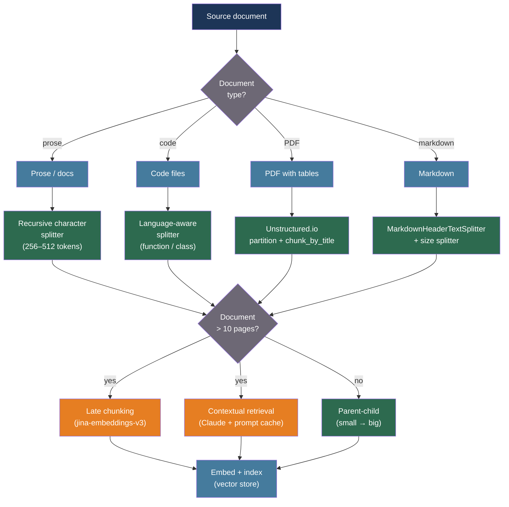

# [BEE-559] Chunking Strategies for RAG Systems

:::info
How a document is split into chunks is the single biggest controllable variable in RAG retrieval quality: too small and chunks lose context; too large and similarity scores are diluted by irrelevant content. Matching chunk size and boundary strategy to document type and query pattern — rather than defaulting to a fixed size — produces measurable improvements without changing the embedding model or retrieval algorithm.
:::

## Context

Retrieval-Augmented Generation systems (BEE-509) index document fragments as embedding vectors and retrieve the most similar fragments at query time. The unit of retrieval is the chunk. Chunks that are too small retrieve precise passages but lose the surrounding context needed for accurate generation; chunks that are too large dilute the query-specific signal with unrelated content, reducing retrieval recall.

Kamradt (2023, "5 Levels of Text Splitting") established a widely-adopted taxonomy of chunking complexity, from naive character splitting to LLM-driven agentic splitting. The taxonomy was later formalized and extended through empirical benchmark work. Bhat, Rudat, Spiekermann, and Flores-Herr (Fraunhofer IAIS, arXiv:2505.21700) measured chunk size effects across four datasets at eight sizes (64 to 2,048 tokens) and found no universal optimum: fact-based queries (SQuAD) peaked at 64–128 tokens with recall of 64.1%, while technical long-answer tasks (TechQA) grew monotonically from 4.8% recall at 64 tokens to 71.5% at 1,024 tokens. The embedding model also affects the optimum — decoder-based models favor larger chunks; encoder-based models favor smaller.

A common assumption is that semantic chunking — splitting at embedding-similarity breakpoints rather than fixed token counts — reliably outperforms fixed-size splitting. Qu, Tu, and Bao (Vectara, arXiv:2410.13070, NAACL Findings 2025) tested this across ten real-world retrieval benchmarks and found that fixed-size chunking matches or exceeds semantic chunking on realistic documents; semantic chunking only wins on artificially constructed benchmarks where heterogeneous topics are concatenated. The computational cost of semantic chunking (embedding every sentence for breakpoint detection) is rarely justified.

Context loss at chunk boundaries is the deeper architectural problem. When a chunk is embedded in isolation, pronouns and entity references that are resolved by surrounding text produce misleading vectors. Günther, Mohr, Williams, Wang, and Han Xiao (Jina AI, arXiv:2409.04701, 2024) introduced late chunking: pass the full document through the transformer to compute token-level attention across the whole document, then apply mean pooling per chunk boundary — so each chunk embedding carries full-document context. Anthropic's contextual retrieval (2024) solves the same problem at the text level: before embedding, Claude generates a 50–100 token summary situating each chunk within its source document, prepended to the chunk text.

## Best Practices

### Default to Recursive Character Splitting, Not Fixed-Size

**MUST NOT** use fixed character-count splitting as a default. Fixed splitting ignores sentence and paragraph boundaries, producing chunks that begin or end mid-sentence. Recursive character text splitting tries natural separators in priority order — `"\n\n"` (paragraph), `"\n"` (line), `" "` (word), `""` (character) — and recurses until chunks fall within the target size:

```python
from langchain_text_splitters import RecursiveCharacterTextSplitter

# Good general-purpose starting point for prose text
splitter = RecursiveCharacterTextSplitter(
    chunk_size=512,          # tokens (approximate — this is character-based)
    chunk_overlap=50,        # overlap in tokens to preserve cross-boundary context
    length_function=len,
    separators=["\n\n", "\n", " ", ""],
)

chunks = splitter.split_text(document_text)
```

**Chunk size starting points by content type** (from Fraunhofer IAIS arXiv:2505.21700 and Unstructured.io recommendations):

| Content type | Recommended size | Rationale |
|---|---|---|
| Short factoid Q&A (FAQ, support) | 64–128 tokens | Tight retrieval precision; single-fact answers |
| General prose / documentation | 256–512 tokens | Balanced; covers a single idea |
| Technical / long-answer queries | 512–1,024 tokens | Context needed; fact is part of larger explanation |
| Financial reports with tables | 1,024 tokens or page-level | Tables must stay together with their headers |
| Code files | Function / class boundary | Semantic unit; never split mid-function |

**Overlap:** Use 10–20% of chunk size. For a 512-token chunk, 50–100 tokens of overlap (Weaviate recommendation) preserves context across boundaries without duplicating most content. Larger overlaps increase storage cost without proportional retrieval gain.

### Choose Chunk Boundaries by Document Structure

**MUST** use document-aware splitting for content with explicit structure. Generic splitters destroy table rows, mid-function code, and cross-section references:

```python
from langchain_text_splitters import MarkdownHeaderTextSplitter

# For Markdown documentation: split on headers first
headers_to_split_on = [
    ("#", "h1"),
    ("##", "h2"),
    ("###", "h3"),
]
header_splitter = MarkdownHeaderTextSplitter(headers_to_split_on=headers_to_split_on)
header_chunks = header_splitter.split_text(markdown_text)

# Then apply size-based splitting within each section
size_splitter = RecursiveCharacterTextSplitter(chunk_size=512, chunk_overlap=50)
final_chunks = size_splitter.split_documents(header_chunks)
# Each chunk inherits {"h1": "...", "h2": "..."} metadata for filtering
```

```python
from langchain_text_splitters import PythonCodeTextSplitter

# For Python source: split at def/class/module level
code_splitter = PythonCodeTextSplitter(chunk_size=1024, chunk_overlap=0)
code_chunks = code_splitter.split_text(python_source)
```

**For PDFs with tables and figures:** Extract with a layout-aware tool before chunking. Generic PDF-to-text extraction merges table cells into word streams, destroying numeric relationships.

```python
# Unstructured.io: partition into typed elements first
from unstructured.partition.pdf import partition_pdf
from unstructured.chunking.title import chunk_by_title

elements = partition_pdf(
    filename="report.pdf",
    strategy="hi_res",              # layout detection for tables and figures
    infer_table_structure=True,     # extract tables as HTML
)
chunks = chunk_by_title(
    elements,
    max_characters=1000,            # hard size limit per chunk
    new_after_n_chars=500,          # soft target; break at next boundary after this
    combine_text_under_n_chars=100, # merge short fragments into the previous chunk
)
# Each chunk's .metadata.section_hierarchy preserves the heading path
```

### Decouple Retrieval Precision from Generation Context with Parent-Child Chunking

**SHOULD** store small child chunks for retrieval and return their larger parent chunk to the LLM for generation when content length varies widely. This resolves the fundamental tension: small chunks = precise similarity; large chunks = useful context:

```python
from llama_index.core import SimpleDirectoryReader, VectorStoreIndex
from llama_index.core.node_parser import HierarchicalNodeParser, get_leaf_nodes
from llama_index.core.retrievers import AutoMergingRetriever
from llama_index.core.storage.docstore import SimpleDocumentStore

# Build a three-level hierarchy: 2048 → 512 → 128 tokens
parser = HierarchicalNodeParser.from_defaults(chunk_sizes=[2048, 512, 128])
nodes = parser.get_nodes_from_documents(documents)

leaf_nodes = get_leaf_nodes(nodes)  # 128-token nodes — indexed for retrieval

docstore = SimpleDocumentStore()
docstore.add_documents(nodes)       # all levels stored for merging

# Build vector index over leaf nodes only
index = VectorStoreIndex(leaf_nodes)
base_retriever = index.as_retriever(similarity_top_k=6)

# AutoMergingRetriever: if most siblings from a parent are retrieved,
# return the parent instead (richer context, fewer fragments)
retriever = AutoMergingRetriever(
    base_retriever,
    storage_context=index.storage_context,
    verbose=False,
)
```

**SHOULD** also consider the sentence-window approach when retrieving individual sentences: embed and retrieve at sentence granularity, then expand to a ±2 sentence window for generation. LlamaIndex's `SentenceWindowNodeParser` + `MetadataReplacementPostProcessor` implements this pattern.

### Preserve Cross-Chunk Context for Long Documents

**SHOULD** apply late chunking or contextual retrieval for documents longer than a few pages, where chunk-boundary context loss measurably degrades retrieval quality.

**Late chunking** (requires a long-context embedding model such as `jina-embeddings-v3`):

```python
# Late chunking workflow:
# 1. Pass the whole document through the embedding model
# 2. Collect token-level output embeddings (before pooling)
# 3. Mean-pool only the tokens belonging to each desired chunk span
# The attention mechanism has already "seen" the full document,
# so each chunk's embedding carries full-document context.

# jina-embeddings-v3 supports late chunking natively:
import requests

# Chunk boundary offsets (token start, token end) — pre-computed
spans = [(0, 128), (100, 256), (230, 384)]   # with overlap if desired

response = requests.post(
    "https://api.jina.ai/v1/embeddings",
    headers={"Authorization": "Bearer <JINA_API_KEY>"},
    json={
        "model": "jina-embeddings-v3",
        "input": [document_text],
        "late_chunking": True,          # enables late chunking mode
    },
)
# Returns one embedding per token span defined by the model's chunker
```

**Contextual retrieval** (Anthropic, works with any embedding model):

```python
import anthropic

CONTEXT_PROMPT = """\
<document>
{document}
</document>
<chunk>
{chunk}
</chunk>
Please give a short succinct context (2-3 sentences) to situate this chunk \
within the overall document for improved search retrieval. Answer only with the context."""

async def add_chunk_context(
    document: str,
    chunk: str,
    client: anthropic.AsyncAnthropic,
) -> str:
    """
    Prepend document-level context to each chunk before embedding.
    Use Claude 3 Haiku (cheap/fast) + prompt caching so the
    document is processed once per document, not once per chunk.
    Cost: ~$1.02 per million document tokens with caching.
    """
    response = await client.messages.create(
        model="claude-haiku-4-5-20251001",
        max_tokens=150,
        system=[{
            "type": "text",
            "text": "You are a helpful assistant that generates retrieval context.",
            "cache_control": {"type": "ephemeral"},  # cache system prompt
        }],
        messages=[{
            "role": "user",
            "content": [
                {
                    "type": "text",
                    "text": document,
                    "cache_control": {"type": "ephemeral"},  # cache document body
                },
                {
                    "type": "text",
                    "text": CONTEXT_PROMPT.format(document="", chunk=chunk),
                }
            ],
        }],
    )
    context = response.content[0].text
    return f"{context}\n\n{chunk}"
```

Anthropic's benchmarks show contextual retrieval reduces top-20 retrieval failure rate from 5.7% to 3.7% (embeddings alone), 2.9% (embeddings + BM25), and 1.9% with reranking — a 67% reduction end-to-end.

## Visual



## Common Mistakes

**Using a fixed 512-token chunk for all documents.** Fraunhofer IAIS (arXiv:2505.21700) measured that 512 tokens is suboptimal for both short-fact retrieval (64–128 is better) and long technical content (1,024 is better). Benchmark your content type before picking a default.

**Assuming semantic chunking always outperforms fixed-size splitting.** The Vectara NAACL 2025 paper (arXiv:2410.13070) found that on real documents, fixed-size chunking matches semantic chunking on most benchmarks. Semantic chunking adds significant CPU/memory cost for breakpoint detection and is only beneficial when source documents mix highly heterogeneous topics with no structural markers.

**Not preserving chunk metadata.** The section header, page number, document title, and source URL should be stored alongside each chunk vector as filterable metadata. Retrieval without metadata filtering returns results from the wrong documents, wrong version, or wrong tenant.

**Splitting tables mid-row.** A recursive character splitter that sees a table as plain text will split at whitespace inside a row, corrupting numeric relationships. Always extract tables as structured text (HTML or Markdown) before size-based splitting.

**Ignoring chunk overlap.** Zero-overlap chunking silently drops context at every boundary. Ideas that span two adjacent chunks become unretrievable — neither chunk contains the complete thought. Use 10–20% overlap as a minimum.

**Using the same chunk size for both indexing and the context window budget.** Chunk size determines retrieval precision; the number of retrieved chunks times chunk size determines how much of the context window is consumed. Set chunk size for retrieval quality, then calculate how many chunks fit in the model's context budget, rather than working backward from context size.

## Related BEEs

- [BEE-509](509.md) -- RAG Pipeline Architecture: the overall retrieval pipeline that chunking feeds into
- [BEE-517](517.md) -- Retrieval Reranking and Hybrid Search: combining vector and BM25 retrieval after chunking
- [BEE-531](531.md) -- Advanced RAG and Agentic Retrieval Patterns: multi-hop retrieval that depends on chunk quality
- [BEE-553](553.md) -- LLM Tokenization Internals and Token Budget Management: chunk size in tokens requires tokenizer-accurate counting

## References

- [Bhat et al. Rethinking Chunk Size for Long-Document Retrieval — arXiv:2505.21700, Fraunhofer IAIS 2025](https://arxiv.org/html/2505.21700v2)
- [Qu, Tu, and Bao. Is Semantic Chunking Worth the Computational Cost? — arXiv:2410.13070, NAACL Findings 2025](https://aclanthology.org/2025.findings-naacl.114/)
- [Günther et al. Late Chunking: Contextual Chunk Embeddings Using Long-Context Embedding Models — arXiv:2409.04701, Jina AI 2024](https://arxiv.org/abs/2409.04701)
- [Anthropic. Contextual Retrieval — anthropic.com, 2024](https://www.anthropic.com/news/contextual-retrieval)
- [Kamradt. 5 Levels of Text Splitting — github.com/FullStackRetrieval-com, 2023](https://github.com/FullStackRetrieval-com/RetrievalTutorials/blob/main/tutorials/LevelsOfTextSplitting/5_Levels_Of_Text_Splitting.ipynb)
- [LlamaIndex. Optimizing: Basic Strategies — developers.llamaindex.ai](https://developers.llamaindex.ai/python/framework/optimizing/basic_strategies/basic_strategies/)
- [Unstructured.io. Chunking for RAG: Best Practices — unstructured.io](https://unstructured.io/blog/chunking-for-rag-best-practices)
