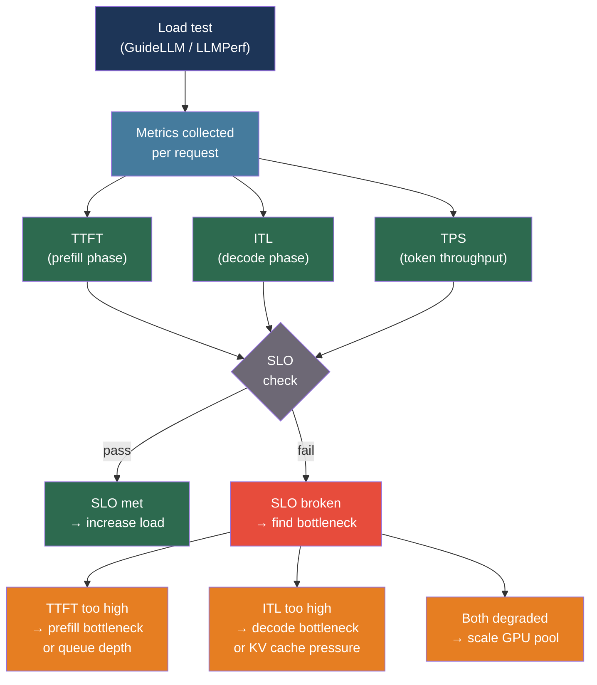

# [BEE-560] LLM Load Testing and Capacity Planning

:::info
LLM-backed services break the assumptions of traditional load testing: responses are priced and rate-limited by token count rather than request count, streaming responses require decomposing latency into distinct phases, and GPU KV cache memory — not CPU threads — is the binding concurrency constraint. Tools like JMeter and Locust measure the wrong things by default; capacity planning must be done in tokens, not requests.
:::

## Context

Traditional load testing tools — Apache JMeter, k6, Locust, Gatling — were designed for millisecond-latency REST APIs where response size is predictable and the server bottleneck is CPU, threads, or database connections. LLM inference breaks all three assumptions.

Response latency is measured in seconds, not milliseconds, because each output token requires a sequential forward pass over the full attention context. Response size varies by several orders of magnitude: a question-answering request might return 10 tokens; a code generation request might return 2,000. The binding resource is not CPU but GPU High Bandwidth Memory (HBM), consumed by the KV cache that grows with sequence length and batch size. As concurrency increases, TTFT can jump from 400 ms to 4,000 ms when the KV cache fills — a non-linear failure mode invisible to tools that only report error rates.

The Orca serving system (Yu et al., OSDI 2022) introduced iteration-level scheduling — treating each decode step as a schedulable unit rather than waiting for an entire batch to complete — and demonstrated 36.9× throughput improvement over naive batching. Kwon et al.'s PagedAttention (vLLM, SOSP 2023, arXiv:2309.06180) applied virtual paging to the KV cache, reducing memory waste to under 4% and achieving 2–4× throughput improvement over previous systems. Agrawal et al.'s Sarathi-Serve (OSDI 2024, arXiv:2403.02310) identified that prefill iterations (compute-bound, high GPU utilization) and decode iterations (memory-bandwidth-bound, low GPU utilization) should not share scheduling priority, achieving 2.6–5.6× higher serving capacity depending on model size. Zhong et al.'s DistServe (OSDI 2024, arXiv:2401.09670) went further: physically separating prefill and decode across GPU pools eliminates interference entirely, achieving 7.4× more requests or 12.6× tighter SLO compliance compared to colocated serving.

For backend engineers running applications on top of managed LLM APIs (Anthropic, OpenAI, AWS Bedrock), these serving internals are not directly controllable — but they directly explain the latency distributions you observe and the capacity planning math you need to do.

## Key Metrics

LLM benchmarking defines a distinct metric vocabulary from traditional load testing:

| Metric | Definition | Bottleneck signal |
|---|---|---|
| **TTFT** (Time to First Token) | Time from request submission to first output token | Queue depth; prefill throughput |
| **ITL** (Inter-Token Latency) | Mean time between consecutive output tokens after the first | Decode throughput; KV cache pressure |
| **E2E** (End-to-End latency) | Total time: `TTFT + ITL × (output_tokens - 1)` | Combined; hides which phase is degraded |
| **TPS** (Tokens per Second) | Output tokens generated per second, summed across all requests | Overall system throughput |
| **Goodput** | Requests per second that meet all defined SLOs | Production-meaningful throughput |

**TTFT** is the primary responsiveness signal for chat and copilot use cases. It scales with input prompt length because prefilling the attention over a long context is proportionally more expensive.

**ITL** (also called TPOT — Time Per Output Token) governs perceived "typing speed." At 50 ms/token the user observes roughly 20 tokens/second, which feels fluid. GenAI-Perf and GuideLLM measure ITL excluding TTFT: `(E2E - TTFT) / (output_tokens - 1)`. LLMPerf includes TTFT in the ITL calculation — the numbers are not directly comparable.

**E2E latency** conflates two operationally distinct signals. Report TTFT and ITL separately; E2E alone hides which phase is degraded.

**Goodput** is defined as the request rate that meets all SLO bounds simultaneously. A system with 90% of requests meeting the TTFT SLO and 80% meeting the ITL SLO has goodput equal to the rate at which requests satisfy both — not the average of the two. Wang et al. (arXiv:2410.14257) found that naive goodput definitions allow systems to game metrics by proactively rejecting borderline requests; "smooth goodput" corrects for this.

**Key empirical finding (Anyscale):** Output token reduction is approximately 100× more effective than input trimming for reducing E2E latency. One output token contributes ~30–60 ms to E2E time; one input token contributes ~0.3–0.7 ms.

## Best Practices

### Use Purpose-Built LLM Benchmarking Tools

**MUST NOT** use vanilla k6, JMeter, or Locust as the primary tool for LLM performance measurement. Their default latency metrics capture only total request duration — they cannot decompose TTFT from ITL or measure token throughput. They also hold the request thread/coroutine during the streaming response, creating measurement artifacts under high concurrency:

```bash
# GuideLLM: purpose-built, actively maintained, open source
# Installs as: pip install guidellm
# Supports: synchronous, concurrent, throughput, poisson, sweep modes

guidellm benchmark \
  --target "http://localhost:8000/v1" \    # OpenAI-compatible endpoint
  --model "meta-llama/Llama-3.1-8B-Instruct" \
  --rate-type sweep \                      # progressive load to find saturation
  --rate 1 10 \                            # 1 to 10 requests/second
  --num-prompts 500 \
  --data "dataset:sharegpt" \              # realistic prompt distribution
  --output-path ./benchmark-results/

# GuideLLM outputs:
# - TTFT percentiles (p50, p90, p95, p99)
# - ITL percentiles (excludes TTFT, consistent with GenAI-Perf convention)
# - E2E latency percentiles
# - Token throughput (tokens/sec)
# - Request throughput (requests/sec)
# - Full JSON/YAML/HTML report
```

**For OpenAI / Anthropic API testing** (external API, not self-hosted):

```python
import asyncio
import time
from dataclasses import dataclass

@dataclass
class LLMBenchmarkResult:
    ttft_ms: float         # time to first token
    itl_ms: float          # inter-token latency (avg, excl. TTFT)
    e2e_ms: float          # total duration
    output_tokens: int
    input_tokens: int

async def benchmark_streaming_request(
    client,
    prompt: str,
    model: str,
) -> LLMBenchmarkResult:
    """
    Measure TTFT and ITL separately for streaming LLM responses.
    TTFT = time to the first content delta.
    ITL = remaining time spread over remaining tokens.
    """
    t_start = time.perf_counter()
    t_first_token = None
    token_times = []
    output_tokens = 0

    async with client.messages.stream(
        model=model,
        max_tokens=512,
        messages=[{"role": "user", "content": prompt}],
    ) as stream:
        async for event in stream:
            if hasattr(event, "type") and event.type == "content_block_delta":
                t_now = time.perf_counter()
                if t_first_token is None:
                    t_first_token = t_now
                token_times.append(t_now)
                output_tokens += 1

    t_end = time.perf_counter()
    ttft_ms = (t_first_token - t_start) * 1000 if t_first_token else 0
    e2e_ms = (t_end - t_start) * 1000

    itl_ms = 0.0
    if len(token_times) > 1:
        # Exclude TTFT: measure only inter-token intervals after the first
        intervals = [
            (token_times[i] - token_times[i-1]) * 1000
            for i in range(1, len(token_times))
        ]
        itl_ms = sum(intervals) / len(intervals)

    return LLMBenchmarkResult(
        ttft_ms=ttft_ms,
        itl_ms=itl_ms,
        e2e_ms=e2e_ms,
        output_tokens=output_tokens,
        input_tokens=0,  # populate from response.usage
    )
```

### Use Open-Loop (Poisson) Traffic, Not Fixed Concurrency

**SHOULD** use Poisson-arrival load tests rather than fixed-concurrency tests when measuring SLO compliance. Fixed concurrency maintains exactly N outstanding requests, which bounds queue buildup. Real traffic arrives independently of whether previous requests have completed:

```python
import asyncio
import random

async def poisson_load_test(
    request_fn,                  # async callable: prompt -> result
    target_rps: float,           # requests per second
    duration_seconds: int,
    prompt_corpus: list[str],
) -> list[LLMBenchmarkResult]:
    """
    Open-loop load test: arrivals are Poisson-distributed.
    At saturation, queue builds up — this reveals SLO failures
    that fixed-concurrency tests hide.
    """
    results = []
    tasks = []
    start = asyncio.get_event_loop().time()
    t = start

    while asyncio.get_event_loop().time() - start < duration_seconds:
        # Poisson inter-arrival: exponential with mean 1/rate
        sleep_duration = random.expovariate(target_rps)
        await asyncio.sleep(sleep_duration)
        t += sleep_duration

        prompt = random.choice(prompt_corpus)
        task = asyncio.create_task(request_fn(prompt))
        tasks.append(task)

    results = await asyncio.gather(*tasks, return_exceptions=True)
    return [r for r in results if isinstance(r, LLMBenchmarkResult)]
```

**SHOULD** report goodput (fraction of requests meeting all SLO bounds simultaneously) rather than raw throughput or error rate. A system can have a low error rate while 30% of requests exceed the TTFT SLO silently.

### Use Realistic Prompt Distributions

**MUST NOT** benchmark with a single fixed prompt. A fixed prompt explores one point in the token-length distribution and enables caching that inflates performance numbers:

```python
from datasets import load_dataset

def load_sharegpt_prompts(n: int = 500) -> list[str]:
    """
    ShareGPT is the de facto standard for realistic LLM benchmarks.
    Used by vLLM CI, GuideLLM, LLMPerf, and most published serving papers.
    Natural distribution of prompt lengths: mean ~550 tokens, SD ~150.
    """
    dataset = load_dataset(
        "anon8231489123/ShareGPT_Vicuna_unfiltered",
        split="train",
    )
    prompts = [
        turn["value"]
        for row in dataset
        for turn in row.get("conversations", [])
        if turn.get("from") == "human"
    ]
    return prompts[:n]

# Synthetic alternative when ShareGPT is not available:
# Draw input length from Normal(mean=550, sd=150), clip to [50, 2000]
# Draw output length from Normal(mean=150, sd=20), clip to [10, 500]
# Populate with real text (Shakespeare, Wikipedia) to avoid tokenizer shortcuts
```

**SHOULD** include multi-turn conversation traffic by maintaining conversation history across successive requests. When context grows across turns, TTFT increases and KV cache consumption per request grows. Test with at least 3–5 turn conversations representative of your application's usage pattern.

### Plan Capacity in Tokens, Not Requests

**MUST** plan API capacity against provider token rate limits, not request counts. Anthropic's rate limits apply separately to input tokens (ITPM) and output tokens (OTPM):

```python
from dataclasses import dataclass

@dataclass
class TokenCapacityPlan:
    """
    Translate application requirements to provider API capacity needs.
    All Anthropic rate limits are token-based (ITPM/OTPM), not request-based.
    Cached tokens do NOT count toward ITPM — factor this into your plan.
    """
    avg_input_tokens: int     # per request
    avg_output_tokens: int    # per request
    target_rps: float         # requests/second at peak
    cache_hit_rate: float = 0.0  # fraction of input tokens served from cache

    @property
    def peak_itpm_needed(self) -> int:
        """Input tokens/minute that count against the ITPM rate limit."""
        uncached_fraction = 1.0 - self.cache_hit_rate
        return int(self.avg_input_tokens * uncached_fraction * self.target_rps * 60)

    @property
    def peak_otpm_needed(self) -> int:
        """Output tokens/minute needed."""
        return int(self.avg_output_tokens * self.target_rps * 60)

# Example: 50 rps, 800 input tokens per request, 200 output tokens,
# 60% cache hit rate (Anthropic cached tokens don't count toward ITPM)
plan = TokenCapacityPlan(
    avg_input_tokens=800,
    avg_output_tokens=200,
    target_rps=50,
    cache_hit_rate=0.60,
)
print(f"ITPM needed: {plan.peak_itpm_needed:,}")   # 960,000
print(f"OTPM needed: {plan.peak_otpm_needed:,}")   # 600,000
# Requires Anthropic Tier 3+ for Claude Sonnet 4 (2M ITPM, 400K OTPM limit)
# Cached tokens at 10% of base rate: additional cost savings of ~$0.72/M input tokens
```

**Anthropic Tier reference** (claude-sonnet-4 as of 2025):

| Tier | RPM | ITPM | OTPM | Monthly spend to qualify |
|---|---|---|---|---|
| 1 | 50 | 30,000 | 8,000 | Paid plan |
| 2 | 1,000 | 450,000 | 90,000 | $40+ |
| 3 | 2,000 | 800,000 | 160,000 | $200+ |
| 4 | 4,000 | 2,000,000 | 400,000 | $4,000+ |

**SHOULD** evaluate provisioned throughput (Anthropic's Priority API, OpenAI's Scale Tier, AWS Bedrock MUs) for applications where predictable capacity and lower latency at high load matter more than paying only for actual usage. Provisioned throughput eliminates rate-limit-driven throttling but requires upfront commitment.

### Define and Monitor SLOs Separately for Each Phase

**MUST NOT** define a single SLO on E2E latency. Chat applications and batch processing jobs have fundamentally different TTFT tolerance, and TTFT and ITL degrade independently:

```python
@dataclass
class LLMServiceSLO:
    """
    Define SLO targets per latency phase.
    Check compliance on each benchmark run and in production.
    """
    ttft_p90_ms: float     # e.g., 500ms for chat, 2000ms for batch
    itl_p90_ms: float      # e.g., 100ms for chat (visible streaming)
    e2e_p95_ms: float      # overall ceiling

    def check(self, results: list[LLMBenchmarkResult]) -> dict:
        ttfts = sorted(r.ttft_ms for r in results)
        itls = sorted(r.itl_ms for r in results if r.itl_ms > 0)
        e2es = sorted(r.e2e_ms for r in results)

        n = len(results)
        ttft_p90 = ttfts[int(n * 0.90)]
        itl_p90 = itls[int(len(itls) * 0.90)] if itls else 0
        e2e_p95 = e2es[int(n * 0.95)]

        return {
            "ttft_p90_ms": ttft_p90,
            "ttft_slo_met": ttft_p90 <= self.ttft_p90_ms,
            "itl_p90_ms": itl_p90,
            "itl_slo_met": itl_p90 <= self.itl_p90_ms,
            "e2e_p95_ms": e2e_p95,
            "e2e_slo_met": e2e_p95 <= self.e2e_p95_ms,
            "goodput": sum(
                1 for r in results
                if r.ttft_ms <= self.ttft_p90_ms
                and r.itl_ms <= self.itl_p90_ms
            ) / n,
        }
```

## Capacity Planning Reference

### KV Cache Memory Consumption

For self-hosted deployments, KV cache memory is the primary concurrency constraint:

```
KV_bytes = 2 × layers × head_dim × context_length × batch_size × bytes_per_element
```

Llama 3.1 70B (80 layers, FP16) at full context:

| Context | Batch 1 | Batch 8 | Batch 32 |
|---|---|---|---|
| 2K tokens | 2.5 GB | 20 GB | 80 GB |
| 8K tokens | 10 GB | 80 GB | 320 GB |
| 32K tokens | 40 GB | 320 GB | 1.28 TB |

At batch 32 and 8K context, KV cache alone consumes more GPU memory than the 70B model weights. Keep GPU KV cache utilization below 85% in steady state; above 95%, incoming requests queue and TTFT spikes.

### Instance Count Formula

```
instances = ceil(peak_TPS_target / (saturation_TPS × 0.65))
```

Apply a 0.65 factor (leave 35% headroom above the saturation-point throughput) to preserve headroom for spikes and for the non-linear degradation that occurs as KV cache fills.

### Self-Host vs. Managed API Decision

| Daily token volume | Recommendation |
|---|---|
| < 500K tokens/day | Managed API — no infra cost justification |
| 500K–2M tokens/day | Managed API with reserved capacity |
| 2M–10M tokens/day | Evaluate self-hosting 7B–13B models |
| > 10M tokens/day | Self-host; 70B production cluster costs $12K–$19K/month |

## Visual



## Common Mistakes

**Measuring only E2E latency.** E2E conflates TTFT (prefill, queueing) and ITL (decode, KV cache pressure). A TTFT spike from KV cache saturation at high concurrency is invisible if you report only E2E percentiles.

**Using a fixed-concurrency test to measure SLO.** Fixed-concurrency tests bound queue buildup — the system cannot fall behind because the test does not send the next request until one completes. Real traffic arrives independently. Use Poisson-arrival (open-loop) tests when measuring SLO compliance under load.

**Benchmarking with a single fixed prompt.** A fixed prompt enables prefix caching, making the benchmark represent the warm-cache case only. Use ShareGPT or a realistic distribution with variable prompt lengths.

**Planning capacity in requests per second, not tokens per second.** Provider rate limits are token-based. A request generating 2,000 output tokens consumes the OTPM budget 200× faster than a 10-token request. Cost scales with tokens, not with requests.

**Not accounting for prompt cache savings.** Anthropic's cached tokens do not count toward ITPM limits and cost 10% of the base rate. For applications with long system prompts repeated across requests, the effective ITPM budget is 5–10× higher than the nominal limit. Ignore this and you will significantly over-provision.

**Setting a single SLO threshold for all query types.** Batch summarization can tolerate 5–10 second TTFT; real-time chat cannot tolerate more than 500 ms. Mixed workloads need separate SLO profiles; a single threshold is either too strict (unnecessary cost) or too lax (poor user experience).

## Related BEEs

- [BEE-343](343.md) -- Load Testing and Benchmarking: general load testing methodology this article extends
- [BEE-324](324.md) -- SLOs and Error Budgets: SLO definition framework applied here to per-phase LLM metrics
- [BEE-513](513.md) -- AI Cost Optimization and Model Routing: token-budget cost optimization strategies
- [BEE-541](541.md) -- LLM Provider Rate Limiting and Client-Side Quota Management: managing rate limit exhaustion in production

## References

- [Yu et al. Orca: A Distributed Serving System for Transformer-Based Generative Models — OSDI 2022](https://www.usenix.org/conference/osdi22/presentation/yu)
- [Kwon et al. Efficient Memory Management for LLM Serving with PagedAttention (vLLM) — arXiv:2309.06180, SOSP 2023](https://arxiv.org/abs/2309.06180)
- [Agrawal et al. Taming Throughput-Latency Tradeoff with Sarathi-Serve — arXiv:2403.02310, OSDI 2024](https://arxiv.org/abs/2403.02310)
- [Zhong et al. DistServe: Disaggregating Prefill and Decoding for Goodput-optimized LLM Serving — arXiv:2401.09670, OSDI 2024](https://arxiv.org/abs/2401.09670)
- [Wang et al. Revisiting Service Level Objectives and System Level Metrics in LLM Serving — arXiv:2410.14257, 2024](https://arxiv.org/abs/2410.14257)
- [GuideLLM — github.com/vllm-project/guidellm](https://github.com/vllm-project/guidellm)
- [Anyscale. Reproducible Performance Metrics for LLM Inference — anyscale.com](https://www.anyscale.com/blog/reproducible-performance-metrics-for-llm-inference)
- [Anthropic API Rate Limits — platform.claude.com](https://platform.claude.com/docs/en/api/rate-limits)
