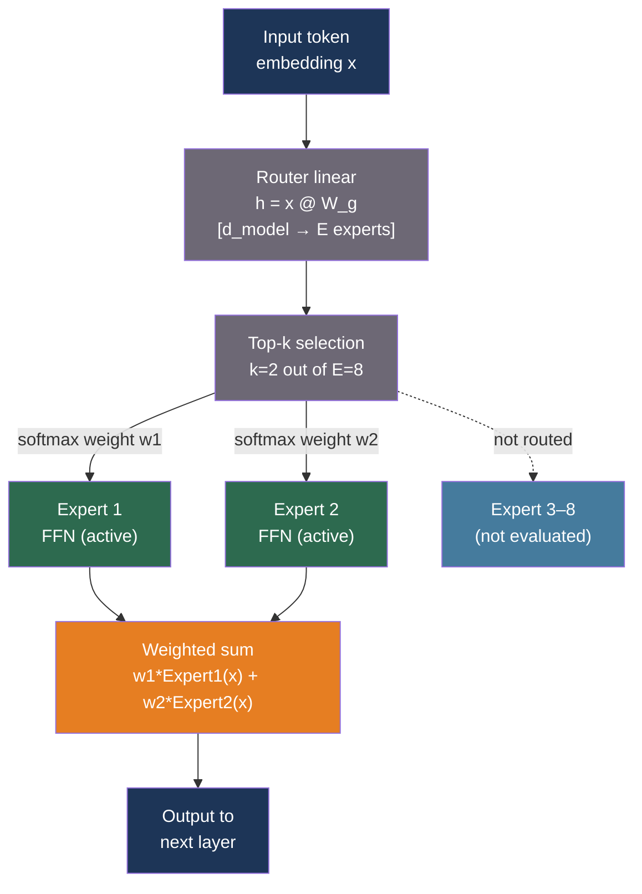

# [BEE-566] Mixture of Experts Architecture and Serving

:::info
Mixture of Experts (MoE) replaces dense feed-forward layers with a collection of specialist sub-networks (experts) and a router that selects only a small subset per token. The result is a model with large total parameter count but far fewer active parameters per forward pass — delivering dense-model quality at a fraction of the inference compute.
:::

## Context

Dense transformer models activate all parameters for every token. A 70B parameter model performs 70B-parameter-scale computation for each of the billions of tokens in a training run and for every inference token. As models grew toward trillion parameters, the compute cost of dense scaling became prohibitive.

Mixture of Experts addresses this by making feed-forward computation sparse. Each FFN layer is replaced by E expert FFNs plus a lightweight router. The router assigns each token to only k of the E experts (typically k=1 or k=2); the other E−k experts are not evaluated. Total parameter count grows with E but active compute per token grows with k, not E.

**Switch Transformer** (Fedus, Zoph, and Shazeer, arXiv:2101.03961, JMLR 2022) was the first large-scale sparse MoE LLM. It used top-1 routing (each token to exactly one expert), achieving 4× faster pre-training than T5-XXL at equivalent compute. It introduced two key mechanisms: a capacity factor that limits how many tokens any one expert processes per batch (excess tokens are dropped), and an auxiliary load-balancing loss that penalizes imbalanced expert routing. Without the auxiliary loss, experts collapse: a feedback loop causes the router to prefer a handful of experts, which train faster, become preferred further, and eventually the other experts stop learning.

**Mixtral 8x7B** (Jiang et al., arXiv:2401.04088, 2024) made MoE practical for open-source serving. Its architecture: 8 experts per FFN layer, top-2 routing (each token processed by 2 of 8 experts per layer), 46.7B total parameters but only 12.9B active per token. Mixtral outperforms LLaMA-2-70B on MMLU (70.6 vs 68.9) and HumanEval (40.2 vs 37.5) while using roughly 5× fewer active parameters per token, enabling approximately 6× faster inference than a dense model of equivalent quality.

**DeepSeek-V2** (arXiv:2405.04434, 2024) pushed MoE further with fine-grained expert segmentation: 160 routed experts per layer plus 2 always-active shared experts, top-6 routing, 236B total parameters and 21B active. It also introduced Multi-head Latent Attention (MLA), which compresses the KV cache into a low-rank latent representation, achieving 93.3% KV cache reduction and 5.76× throughput improvement over prior dense models of comparable quality. **DeepSeek-V3** (arXiv:2412.19437, 2024) scaled to 671B total / 37B active parameters and eliminated the auxiliary load-balancing loss in favor of bias-term adjustments on router logits, achieving frontier-class performance at a reported training cost of ~$5.5M on H800 GPUs.

## How Expert Routing Works

The routing mechanism in each MoE layer:

```
1. Router linear: h = x @ W_g        # x: [batch, seq, d_model], W_g: [d_model, E]
2. Top-k select:  scores, indices = topk(h, k)
3. Softmax:       weights = softmax(scores)           # normalized over selected k only
4. Dispatch:      for each expert i in indices: o_i = Expert_i(x)
5. Aggregate:     output = sum(weights_i * o_i for i in range(k))
```

The router is a single linear layer with no bias. It learns to specialize experts during training via the auxiliary loss, which penalizes the product of actual routing fractions and predicted routing probabilities:

```python
# Auxiliary load-balancing loss (Switch Transformer formulation)
# Minimizing this encourages uniform expert utilization
def load_balance_loss(router_logits, num_experts: int, alpha: float = 1e-2) -> float:
    """
    router_logits: [num_tokens, num_experts]
    f_i: fraction of tokens dispatched to expert i (from argmax routing)
    P_i: fraction of router probability assigned to expert i (from softmax)
    """
    import torch
    probs = torch.softmax(router_logits, dim=-1)          # P_i per token
    routing = torch.zeros_like(probs)
    top1 = router_logits.argmax(dim=-1)
    routing.scatter_(1, top1.unsqueeze(1), 1.0)           # f_i: one-hot dispatch

    # Mean over tokens
    f = routing.mean(dim=0)    # fraction dispatched to each expert
    P = probs.mean(dim=0)      # mean softmax probability for each expert

    return alpha * num_experts * (f * P).sum()
```

## Best Practices

### Choose between Expert Parallel and Tensor Parallel based on batch size

**SHOULD** use Expert Parallel (EP) when serving MoE models at scale, but understand the tradeoff: EP requires AllToAll communication (routing tokens to the GPU holding each expert), while Tensor Parallel uses AllReduce across all GPUs for every expert computation.

- **EP is better at high batch sizes** where AllToAll communication can be amortized across many tokens. EP allows each GPU to specialize in a subset of experts, eliminating redundant computation.
- **TP is better at very low batch sizes** (interactive latency) where AllToAll overhead per forward pass dominates.

```python
# vLLM: Expert Parallel with Tensor Parallel
from vllm import LLM

# 4 GPUs: TP=2, EP=2 — each GPU shard holds 2 complete experts (of 8 total)
llm = LLM(
    model="mistralai/Mixtral-8x7B-Instruct-v0.1",
    tensor_parallel_size=2,
    enable_expert_parallel=True,
    # Expert Parallel Load Balancer redistributes experts across EP ranks
    # to equalize compute across GPUs at runtime
    enable_eplb=True,
)
```

For serving DeepSeek-V2/V3 (MLA + many experts), vLLM recommends:

```bash
# High concurrency: DP=8 + EP (KV cache partitioning critical for MLA)
vllm serve deepseek-ai/DeepSeek-V2 \
  --data-parallel-size 8 \
  --enable-expert-parallel \
  --tensor-parallel-size 1
```

### Quantize MoE models to reduce memory pressure

**MUST** quantize Mixtral 8x7B to fit on practical GPU counts. At FP16, the model occupies ~90 GB requiring at minimum 2× A100 80GB. 4-bit quantization reduces this to ~28 GB:

```bash
# Run Mixtral 8x7B with 4-bit GPTQ on a single A100 80GB
vllm serve mistralai/Mixtral-8x7B-Instruct-v0.1-GPTQ \
  --quantization gptq \
  --dtype half \
  --gpu-memory-utilization 0.90
```

For consumer hardware (single 16 GB GPU), expert offloading can serve Mixtral at reduced throughput:

```bash
# Expert offloading: only the 2 active experts per token stay on GPU
# Remaining 6 experts per layer reside in CPU RAM
# Uses LRU caching to exploit sequential token locality
git clone https://github.com/dvmazur/mixtral-offloading
python mixtral_offloading/generate.py \
  --model-path mistralai/Mixtral-8x7B-Instruct-v0.1 \
  --offload-per-layer 6   # how many of 8 experts to offload per layer
```

**SHOULD NOT** use expert offloading for production traffic. PCIe bandwidth (CPU→GPU transfer per layer) limits generation to roughly 5–10× slower than full-GPU inference. Expert offloading is appropriate for personal or developer use only.

### Monitor expert utilization to detect routing imbalance

**SHOULD** track per-expert routing frequency in production to detect expert collapse or skewed utilization that degrades model quality:

```python
from collections import defaultdict
import torch

class ExpertLoadMonitor:
    """
    Track routing distribution across experts.
    Plug into the router's forward hook.
    """

    def __init__(self, num_experts: int) -> None:
        self.counts: dict[int, int] = defaultdict(int)
        self.num_experts = num_experts
        self.total = 0

    def record(self, routing_indices: torch.Tensor) -> None:
        """routing_indices: [num_tokens, top_k] — expert indices selected per token."""
        for idx in routing_indices.flatten().tolist():
            self.counts[int(idx)] += 1
            self.total += 1

    def utilization(self) -> dict[int, float]:
        """Returns fraction of routing decisions per expert."""
        return {e: self.counts[e] / max(self.total, 1) for e in range(self.num_experts)}

    def imbalance_ratio(self) -> float:
        """max_expert_load / ideal_load — >2.0 suggests problematic collapse."""
        u = self.utilization()
        ideal = 1.0 / self.num_experts
        return max(u.values()) / ideal if u else 0.0

# Alert if any expert handles >3x its fair share of tokens
monitor = ExpertLoadMonitor(num_experts=8)
# ... register as router forward hook ...
if monitor.imbalance_ratio() > 3.0:
    print(f"Expert imbalance detected: {monitor.utilization()}")
```

### Prefer MoE for throughput-limited workloads, dense for memory-constrained workloads

**SHOULD** use the following decision criteria:

| Scenario | Recommendation |
|---|---|
| Fixed training budget, maximize quality | MoE (more parameters per FLOP) |
| GPU cluster available, optimize inference throughput | MoE (fewer active FLOPs per token) |
| Single GPU or severe memory constraint | Dense (MoE requires full expert storage) |
| Ultra-low latency (p99 < 500ms), small batch | Dense (AllToAll overhead at small batch) |
| Long context with large KV cache (>32K tokens) | MoE + MLA (DeepSeek-style KV compression) |

## Visual



## Common Mistakes

**Confusing total parameters with active parameters when estimating compute.** Mixtral 8x7B has 46.7B total parameters but only 12.9B are active per token. Memory requirement scales with total parameters; inference compute scales with active parameters. A server must hold all 46.7B in VRAM but computes at ~12.9B-parameter density per forward pass.

**Forgetting the auxiliary load-balancing loss when fine-tuning MoE models.** When fine-tuning a pre-trained MoE on a narrow domain, the distribution shift often causes expert routing to collapse — the model learns to send all domain-specific tokens to one or two experts. Always keep `aux_loss_alpha` active during fine-tuning, even if reducing it relative to pre-training.

**Applying Expert Parallel at very low batch sizes.** AllToAll communication (routing tokens to expert-owning GPUs) has a fixed per-batch latency cost. At batch size 1–4, this overhead often exceeds the compute savings from expert specialization. For interactive latency-sensitive serving with small batches, pure Tensor Parallel with all GPUs jointly computing each expert is faster.

**Running expert offloading in production.** Expert offloading (CPU RAM residency for inactive experts) generates one CPU→GPU transfer per active expert per layer per forward pass. At 32 layers and 2 active experts per layer, that is 64 PCIe transfers per generation step. PCIe bandwidth (~64 GB/s peak) cannot sustain production traffic; GPU memory must hold all experts for production serving.

**Using the same GPU configuration for MoE as for dense models.** MoE models with large expert counts require different parallelism strategies. For Mixtral 8x7B on 4 GPUs: pure TP-4 is valid but EP-2/TP-2 may deliver higher throughput at large batch sizes. Profile both configurations on your specific workload before committing.

## Related BEEs

- [BEE-523](523.md) -- LLM Inference Optimization and Self-Hosting: the broader inference optimization landscape
- [BEE-562](562.md) -- Multi-LoRA Serving and Adapter Management: complementary adapter technique for dense and MoE models
- [BEE-563](563.md) -- LLM Quantization for Inference: quantization is essential to fit MoE total parameters into practical GPU counts

## References

- [Fedus, Zoph, Shazeer. Switch Transformers: Scaling to Trillion Parameter Models with Simple and Efficient Sparsity — arXiv:2101.03961, JMLR 2022](https://arxiv.org/abs/2101.03961)
- [Jiang et al. Mixtral of Experts — arXiv:2401.04088, 2024](https://arxiv.org/abs/2401.04088)
- [Dai et al. DeepSeekMoE: Towards Ultimate Expert Specialization in Mixture-of-Experts Language Models — arXiv:2401.06066, 2024](https://arxiv.org/abs/2401.06066)
- [DeepSeek-AI. DeepSeek-V2: A Strong, Economical, and Efficient Mixture-of-Experts Language Model — arXiv:2405.04434, 2024](https://arxiv.org/abs/2405.04434)
- [DeepSeek-AI. DeepSeek-V3 Technical Report — arXiv:2412.19437, 2024](https://arxiv.org/abs/2412.19437)
- [Eliseev and Mazur. Fast Inference of Mixture-of-Experts Language Models with Offloading — arXiv:2312.17238, 2023](https://arxiv.org/abs/2312.17238)
- [vLLM. Expert Parallel Deployment — docs.vllm.ai](https://docs.vllm.ai/en/latest/serving/expert_parallel_deployment/)
- [NVIDIA TensorRT-LLM. Expert Parallelism — nvidia.github.io](https://nvidia.github.io/TensorRT-LLM/advanced/expert-parallelism.html)
- [dvmazur. mixtral-offloading — github.com](https://github.com/dvmazur/mixtral-offloading)
