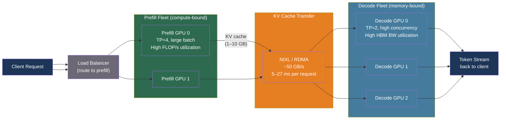

# [BEE-569] Disaggregated Prefill and Decode for LLM Serving

:::info
Prefill (processing the input prompt) and decode (generating output tokens one at a time) have opposite hardware utilization profiles — compute-bound vs memory-bandwidth-bound. Running them on the same GPU forces each to compromise. Disaggregated serving assigns them to separate instances, independently optimizing each phase and enabling a Pareto improvement in both throughput and tail latency.
:::

## Context

LLM inference consists of two distinct phases. **Prefill** processes the entire input prompt in a single forward pass, computing key-value (KV) tensors for every input token simultaneously. This is compute-intensive: it performs O(L²) attention operations for an L-token prompt and benefits from large batch sizes that saturate GPU arithmetic units.

**Decode** generates output tokens one at a time, each requiring a forward pass that attends over the full KV cache of the prompt plus all previously generated tokens. This is memory-bandwidth-bound: the KV cache must be read from HBM for each decode step, and the working compute per token is small regardless of batch size. Roofline analysis shows that for batch sizes below ~32 on an H100, decode throughput is limited entirely by memory bandwidth, not compute.

Running both phases on the same GPU creates structural interference. A large prefill request blocks decode steps for other sequences (head-of-line blocking), inflating TTFT. Decode-heavy workloads hold the GPU in a memory-bandwidth-bound regime, starving the compute capacity that prefill requires. Chunked prefill (BEE-567) mitigates the worst TTFT spikes but does not eliminate the fundamental resource contention.

Three papers in 2023–2024 formalized the case for **prefill-decode (P/D) disaggregation**:

- **Splitwise** (Patel et al., arXiv:2311.18677, Microsoft Research, 2023) proposed phase-splitting across machines, noting that prefill is better served by compute-optimized hardware while decode benefits from memory-bandwidth-optimized hardware, reporting 2–7× throughput improvements.
- **DistServe** (Zhong et al., arXiv:2401.09670, Peking University/UCSD, 2024) co-optimizes resource allocation and parallelism strategy per phase, placing instances according to cluster bandwidth topology. It serves 7.4× more requests and achieves 12.6× tighter SLO adherence than co-located serving at the same latency constraints.
- **Mooncake** (Qin et al., arXiv:2407.00079, Moonshot AI, 2024) extends disaggregation to a KV-cache-centric architecture that spills KV state across GPU HBM, DRAM, and NVMe tiers. In long-context scenarios it achieves up to 525% throughput improvement over co-located baselines.

## How Disaggregation Works

In a disaggregated system, prefill and decode run as separate server fleets. A request enters the prefill fleet, which processes the prompt and produces the full KV cache. That KV cache is then transferred over the network fabric to a decode instance, which continues generating tokens using the transferred state.

```
Client → Load Balancer
              ↓
        Prefill Fleet          Decode Fleet
   [P0] [P1] [P2] ...    [D0] [D1] [D2] ...
         ↑                        ↑
    compute-bound:           memory-bound:
    large batches            small batches
    TP=4 per instance        TP=2 per instance
         |                        |
         └─── KV Cache Transfer ──┘
              (RDMA / NCCL / NIXL)
```

**KV cache transfer mechanics**: After prefill, the KV tensors for the full prompt (size ≈ 2 × num_layers × num_kv_heads × head_dim × seq_len × dtype_bytes) are transmitted to the decode instance. For Llama-3 70B with a 4K-token prompt at BF16: `2 × 80 × 8 × 128 × 4096 × 2 bytes ≈ 1.34 GB`. Over an NDR InfiniBand link (400 Gb/s ≈ 50 GB/s), this transfers in ~27 ms — less than one 30–50 ms decode step.

Transfer protocols in practice:

| Protocol | Bandwidth | Latency | Use case |
|---|---|---|---|
| NVLink (intra-node) | 900 GB/s | ~1 ms | Same physical node |
| RDMA / InfiniBand NDR | ~50 GB/s | ~5–15 ms | Cross-node cluster |
| RoCE (RDMA over Ethernet) | ~25–50 GB/s | ~10–20 ms | Ethernet-based cluster |
| PCIe 5.0 | ~64 GB/s | ~15–30 ms | Budget deployment |

NVIDIA's **NIXL** (Inference Transfer Library) provides a unified transport API supporting RDMA, RoCE, NVMe-oF, and S3, with multipath scheduling that achieves ~245 GB/s on H20 GPU clusters.

## Best Practices

### Disaggregate only for large models and long contexts

**SHOULD** apply P/D disaggregation when the model exceeds ~70B parameters and average input sequence length exceeds ~4K tokens. The KV transfer cost is fixed; the benefit scales with context length and model size.

| Model size | ISL < 1K | ISL 4K–10K | ISL > 10K |
|---|---|---|---|
| < 20B | Co-location preferred | Co-location preferred | Disaggregation borderline |
| 70B | Co-location preferred | Disaggregation beneficial | Disaggregation strongly preferred |
| > 120B | Case by case | Disaggregation beneficial | Disaggregation strongly preferred |

**SHOULD NOT** disaggregate for small models (<20B) or short sequences (ISL < 512, OSL < 200). Transfer overhead exceeds compute savings for small KV caches.

### Tune parallelism independently per phase

**SHOULD** configure different tensor-parallel and pipeline-parallel degrees for prefill and decode instances, reflecting their different bottlenecks:

```bash
# Prefill instance: compute-bound, larger TP, higher batch size
vllm serve meta-llama/Llama-3-70b-hf \
  --tensor-parallel-size 4 \
  --max-num-batched-tokens 65536 \
  --kv-transfer-config '{
    "kv_connector": "NixlConnector",
    "kv_role": "kv_producer"
  }'

# Decode instance: memory-bound, smaller TP, lower batch size, higher concurrency
vllm serve meta-llama/Llama-3-70b-hf \
  --tensor-parallel-size 2 \
  --max-num-seqs 256 \
  --kv-transfer-config '{
    "kv_connector": "NixlConnector",
    "kv_role": "kv_consumer"
  }'
```

For Llama-3 70B: prefill saturates with TP=4 at batch size 64+; decode keeps inter-token latency low with TP=2 and up to 256 concurrent sequences.

### Size fleets based on the prefill-to-decode ratio

**MUST** provision prefill and decode GPU counts based on the workload's compute ratio, not 1:1. The decode phase typically requires 3–5× more GPU-seconds per request than prefill for typical workloads (ISL ~2K, OSL ~500), because decode generates hundreds of serial steps while prefill is a single large parallel computation.

```python
def compute_fleet_ratio(
    avg_input_len: int,
    avg_output_len: int,
    prefill_flops_per_token: float,
    decode_flops_per_token: float,
) -> float:
    """
    Estimate the ratio of decode GPUs to prefill GPUs needed.
    Simplified: assumes equal GPU throughput for both phases.
    """
    prefill_work = avg_input_len * prefill_flops_per_token
    decode_work = avg_output_len * decode_flops_per_token
    # decode_work >> prefill_work for typical ISL/OSL
    return decode_work / prefill_work

# Example: ISL=2048, OSL=512, compute-bound prefill vs memory-bound decode
# For a 70B model at BF16:
ratio = compute_fleet_ratio(
    avg_input_len=2048,
    avg_output_len=512,
    prefill_flops_per_token=2e12,   # MFU ~50% on H100
    decode_flops_per_token=4e11,    # ~5x slower per effective token at small batch
)
# ratio > 1.0 → need more decode GPUs than prefill GPUs
```

A practical starting point: 1 prefill GPU : 3 decode GPUs for ISL=2K, OSL=500 workloads. Calibrate with actual traffic profiling.

### Use RDMA or NIXL for KV transfer — avoid TCP

**MUST** use RDMA-capable transport for production P/D disaggregation. TCP-based KV transfer peaks at 5–10 GB/s on a 100 Gbps Ethernet link, adding 130–270 ms of transfer overhead for a 1.34 GB KV cache — exceeding several decode steps. RDMA eliminates CPU involvement and saturates the physical link:

```python
# vLLM NIXL connector configuration (recommended for production)
kv_transfer_config = {
    "kv_connector": "NixlConnector",
    "kv_role": "kv_producer",        # or "kv_consumer"
    "kv_rank": 0,                    # rank within the P/D pair
    "kv_parallel_size": 2,           # total P+D instances in the group
    "kv_buffer_size": 1e9,           # 1 GB transfer buffer
}

# Alternative: NCCL-based GPU-to-GPU (same cluster, no RDMA fabric needed)
kv_transfer_config_nccl = {
    "kv_connector": "P2pNcclConnector",
    "kv_role": "kv_consumer",
    "kv_rank": 1,
    "kv_parallel_size": 2,
}
```

### Monitor end-to-end TTFT including transfer time

**MUST** instrument KV transfer latency as a distinct metric component. In a co-located system, TTFT = queuing + prefill. In a disaggregated system, TTFT = queuing + prefill + KV transfer + decode scheduling. If transfer latency spikes (e.g., due to network congestion), TTFT increases proportionally and may violate SLOs even when prefill itself is fast.

```python
import time
from dataclasses import dataclass

@dataclass
class DisaggregatedTTFTBreakdown:
    queue_ms: float          # Time waiting in prefill queue
    prefill_ms: float        # Time computing KV cache
    transfer_ms: float       # Time transmitting KV cache to decode
    decode_sched_ms: float   # Time waiting for decode GPU slot

    @property
    def total_ttft_ms(self) -> float:
        return self.queue_ms + self.prefill_ms + self.transfer_ms + self.decode_sched_ms

    def is_transfer_dominant(self) -> bool:
        """Alert if KV transfer >20% of total TTFT."""
        return self.transfer_ms / self.total_ttft_ms > 0.20
```

## Visual



## Common Mistakes

**Expecting disaggregation to improve throughput unconditionally.** vLLM's own documentation notes that disaggregated prefill does not improve aggregate throughput — it improves tail inter-token latency (ITL) control by eliminating prefill-decode interference. Throughput gains require workloads where the two phases genuinely compete for different hardware resources (large model, long context). For homogeneous workloads on modest hardware, co-location with chunked prefill may outperform disaggregation.

**Using TCP for KV cache transfer in production.** Naive TCP socket transfer of a 1.34 GB KV payload at 10 GB/s (100 Gbps Ethernet effective rate) adds 134 ms — equivalent to 2–4 decode steps. This defeats the purpose of disaggregation. Use RDMA-capable fabric (InfiniBand, RoCE) or NIXL.

**Sizing the prefill fleet equal to the decode fleet.** Decode requires far more GPU-time per request than prefill for typical output lengths. A 1:1 fleet ratio leaves decode GPUs chronically overloaded and TPOT high, negating the latency benefit. Profile the actual ISL/OSL distribution and provision decode GPUs proportionally.

**Ignoring the transfer overhead in TTFT accounting.** Teams often benchmark prefill latency alone and project TTFT from that, then discover production TTFT is higher due to KV transfer time. Always measure the full TTFT pipeline in staging, including queue time at the decode fleet and KV transfer latency.

**Applying disaggregation to stateless short-session workloads.** If 90% of your requests have ISL < 512 and OSL < 100 (e.g., classification, extraction), the KV caches are small and the transfer cost is proportionally high. The architectural overhead — two separate fleets, a routing layer, KV transfer infrastructure — is not justified.

## Related BEEs

- [BEE-567](567.md) -- Continuous Batching and Iteration-Level Scheduling: chunked prefill partially mitigates the problem disaggregation solves
- [BEE-568](568.md) -- Tensor Parallelism and Pipeline Parallelism: prefill and decode may use different TP/PP configurations in a disaggregated setup
- [BEE-565](565.md) -- Prefix Caching and KV Cache Reuse: prefix cache hit rates on the prefill fleet reduce transfer volume and amortize KV transfer cost
- [BEE-523](523.md) -- LLM Inference Optimization and Self-Hosting: broader serving infrastructure context

## References

- [Patel et al. Splitwise: Efficient Generative LLM Inference Using Phase Splitting — arXiv:2311.18677, Microsoft Research 2023](https://arxiv.org/abs/2311.18677)
- [Zhong et al. DistServe: Disaggregating Prefill and Decoding for Goodput-Optimized Large Language Model Serving — arXiv:2401.09670, 2024](https://arxiv.org/abs/2401.09670)
- [Qin et al. Mooncake: A KVCache-centric Disaggregated Architecture for LLM Serving — arXiv:2407.00079, Moonshot AI 2024](https://arxiv.org/abs/2407.00079)
- [vLLM. Disaggregated Prefilling — docs.vllm.ai](https://docs.vllm.ai/en/latest/features/disagg_prefill/)
- [NVIDIA NIXL. Inference Transfer Library — github.com/ai-dynamo/nixl](https://github.com/ai-dynamo/nixl)
