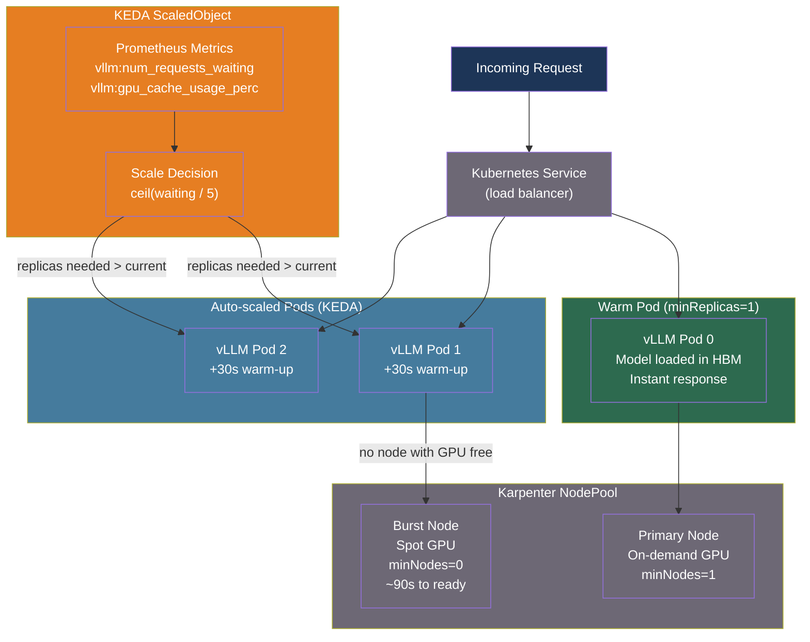

# [BEE-570] LLM Serving Autoscaling and GPU Cluster Management

:::info
GPU autoscaling for LLM serving differs fundamentally from CPU autoscaling: GPU node provisioning takes minutes rather than seconds, model loading adds another 1–10 minutes of cold-start penalty, and idle GPUs cost 3–10× more than idle CPUs. Effective GPU cluster management requires a purpose-built stack — GPU Operators for runtime configuration, Karpenter for fast node provisioning, KEDA for queue-depth scaling, and warm pool strategies to make scale-to-zero economically viable.
:::

## Context

Standard Kubernetes autoscaling was designed for stateless CPU workloads where container startup takes seconds. LLM inference breaks every assumption: a GPU node may take 2–8 minutes to become ready (node boot + CUDA driver initialization), model weights for a 70B-parameter model require 140 GB of storage and 1–10 minutes to load from object storage, and the GPU itself costs $1–10+ per hour versus $0.10–1 for a CPU core.

This creates a tension that does not exist in CPU-based services. Scale-to-zero eliminates idle GPU costs but imposes cold-start latencies that violate any real-time SLO. Over-provisioning ensures low latency but burns GPU budget on idle capacity. The engineering challenge is managing this trade-off systematically rather than through static configuration.

Three Kubernetes ecosystem tools address different layers of the problem:

- **NVIDIA GPU Operator** automates GPU driver installation, the container runtime, device plugin registration, and MIG partitioning across every cluster node — eliminating the per-node manual configuration that previously blocked GPU Kubernetes adoption.
- **Karpenter** provisions GPU cloud instances in seconds by communicating directly with cloud provider APIs, compared to the minutes required by the legacy Cluster Autoscaler that operates through Auto Scaling Groups.
- **KEDA (Kubernetes Event-Driven Autoscaling)** scales pod replicas based on application-level signals — queue depth, requests waiting, KV cache pressure — rather than CPU/memory thresholds that are poor predictors of LLM serving load.

## GPU Cluster Setup

### NVIDIA GPU Operator

The GPU Operator manages the full software stack required to run GPU workloads on Kubernetes. Without it, each node must have CUDA drivers, the NVIDIA Container Toolkit, and the Kubernetes device plugin installed and kept in sync manually. The Operator installs and manages all of these as Kubernetes DaemonSets:

```bash
# Install GPU Operator via Helm
helm repo add nvidia https://helm.ngc.nvidia.com/nvidia
helm repo update
helm install --wait --generate-name \
  -n gpu-operator --create-namespace \
  nvidia/gpu-operator
```

Once installed, every GPU-capable node in the cluster automatically exposes `nvidia.com/gpu` as a schedulable resource. The Operator also deploys DCGM (Data Center GPU Manager) exporters that publish per-GPU metrics (SM utilization, memory bandwidth, temperature) to Prometheus.

### MIG and GPU Time-Slicing for Small Models

When serving multiple small models (7B–13B parameters), a single A100 or H100 can host several workloads through **Multi-Instance GPU (MIG)** partitioning. MIG divides a GPU into up to 7 hardware-isolated instances, each with dedicated compute slices, L2 cache, and HBM bandwidth allocation. Isolation is enforced in hardware — one workload's OOM or CUDA error cannot affect other instances.

```yaml
# GPU Operator MIG configuration via ConfigMap
apiVersion: v1
kind: ConfigMap
metadata:
  name: mig-parted-config
  namespace: gpu-operator
data:
  config.yaml: |
    version: v1
    mig-configs:
      # 7 equal 1g.10gb instances on H100 80GB (7 × ~10GB HBM each)
      all-1g.10gb:
        - devices: all
          mig-enabled: true
          mig-devices:
            "1g.10gb": 7
      # 2 large + 4 small (heterogeneous)
      mixed-2g.20gb:
        - devices: all
          mig-enabled: true
          mig-devices:
            "2g.20gb": 2
            "1g.10gb": 4
```

**MIG vs time-slicing**: MIG provides guaranteed memory and compute isolation at the cost of requiring A100/H100 hardware and static partitioning. Time-slicing shares one GPU among multiple workloads through context switching and is available on all NVIDIA GPUs but provides no memory isolation — a single OOM kills all tenants.

| | MIG | Time-Slicing |
|---|---|---|
| Hardware | A100/H100 only | Any NVIDIA GPU |
| Memory isolation | Hardware-enforced | None |
| Latency predictability | Guaranteed | Variable |
| Partition change | Requires node drain | Dynamic |
| Use case | Production, SLO-bound | Dev/test, cost-sensitive |

## Node Autoscaling with Karpenter

Karpenter watches for unschedulable pods and directly calls cloud provider APIs to provision instances, bypassing the Auto Scaling Group layer that makes the legacy Cluster Autoscaler slow. Node provisioning latency drops from 3–5 minutes to 30–90 seconds for GPU instances.

```yaml
# NodePool for GPU workloads
apiVersion: karpenter.sh/v1
kind: NodePool
metadata:
  name: gpu-pool
spec:
  template:
    metadata:
      labels:
        workload-type: llm-inference
    spec:
      nodeClassRef:
        apiVersion: karpenter.k8s.aws/v1
        kind: EC2NodeClass
        name: gpu-nodeclass
      requirements:
        - key: karpenter.k8s.aws/instance-gpu-count
          operator: Gt
          values: ["0"]
        - key: karpenter.k8s.aws/instance-family
          operator: In
          values: [p4d, p4de, p5]    # A100 and H100 families
        - key: karpenter.sh/capacity-type
          operator: In
          values: [on-demand]        # spot for burst pool
  limits:
    nvidia.com/gpu: 64               # cluster-wide GPU limit
  disruption:
    consolidationPolicy: WhenEmptyOrUnderutilized
    consolidateAfter: 5m             # reclaim idle GPU nodes after 5 min
---
apiVersion: karpenter.k8s.aws/v1
kind: EC2NodeClass
metadata:
  name: gpu-nodeclass
spec:
  amiFamily: AL2
  role: KarpenterNodeRole
  subnetSelectorTerms:
    - tags:
        karpenter.sh/discovery: my-cluster
  securityGroupSelectorTerms:
    - tags:
        karpenter.sh/discovery: my-cluster
  blockDeviceMappings:
    - deviceName: /dev/xvda
      ebs:
        volumeSize: 500Gi            # large root volume for model cache
        volumeType: gp3
        iops: 16000
```

**Two-pool topology** for cost/latency balance:

| Pool | Capacity type | `minNodes` | Purpose |
|---|---|---|---|
| Primary | On-demand | 1 | Always-warm; handles all baseline traffic |
| Burst | Spot | 0 | Absorbs traffic spikes; accepts cold-start penalty |

The primary pool keeps one GPU node running at all times, holding model weights in memory. The burst pool scales from zero on overflow, accepting the 3–8 minute cold-start for non-interactive batch workloads.

## Pod Autoscaling with KEDA

HPA scales on CPU/memory, which are poor signals for LLM serving. A vLLM pod with 80% GPU cache full and 50 requests waiting may show minimal CPU usage. KEDA solves this by scaling on application-level Prometheus metrics.

```yaml
# KEDA ScaledObject using vLLM queue depth
apiVersion: keda.sh/v1alpha1
kind: ScaledObject
metadata:
  name: vllm-scaler
  namespace: inference
spec:
  scaleTargetRef:
    name: vllm-deployment
  minReplicaCount: 1          # never scale to zero (warm pod strategy)
  maxReplicaCount: 8
  cooldownPeriod: 300         # 5 min before scaling down (model unload cost)
  pollingInterval: 15
  triggers:
    # Scale up when requests are queuing
    - type: prometheus
      metadata:
        serverAddress: http://prometheus.monitoring:9090
        metricName: vllm_requests_waiting
        query: |
          sum(vllm:num_requests_waiting{namespace="inference"})
        threshold: "5"        # scale up at 5+ waiting requests per pod
    # Scale up when KV cache pressure is high
    - type: prometheus
      metadata:
        serverAddress: http://prometheus.monitoring:9090
        metricName: vllm_kv_cache_usage
        query: |
          max(vllm:gpu_cache_usage_perc{namespace="inference"})
        threshold: "0.85"     # scale up at 85% KV cache utilization
```

**Scaling decision logic**: KEDA calculates `desired_replicas = ceil(metric_value / threshold)`. With `threshold: "5"` and `sum(requests_waiting) = 23`, it targets `ceil(23/5) = 5` replicas. The cooldown period prevents thrashing: scaling down before a new model replica is fully warm causes a request spike as the terminating replica's load transfers to remaining pods.

## Best Practices

### Never scale LLM pods to zero without a warm standby

**MUST NOT** configure `minReplicaCount: 0` for production LLM workloads without a compensating warm-pool mechanism. A complete cold-start sequence — node provisioning (60–120s) + container image pull (30–60s) + model download from S3 (60–180s) + CUDA context initialization (5–30s) + weight transfer to HBM (10–60s) — totals 2–8 minutes. No interactive SLO survives this.

**SHOULD** keep `minReplicaCount: 1` in KEDA configuration to maintain one warm pod, and set `minNodes: 1` in Karpenter to prevent the GPU node from being reclaimed while the warm pod exists.

### Scale on queue depth and KV cache pressure, not CPU

**MUST** use application-level LLM metrics — not CPU utilization or memory usage — as the primary autoscaling signals:

```
Scale-up triggers (any one sufficient):
  vllm:num_requests_waiting > 5 (per-pod target)
  vllm:gpu_cache_usage_perc > 0.85
  vllm:time_to_first_token p95 > SLO_threshold

Scale-down conditions (all must be true for cooldown_period):
  vllm:num_requests_waiting == 0
  vllm:num_requests_running < target_batch_size / 2
  vllm:gpu_cache_usage_perc < 0.30
```

### Preload model weights from a warm cache layer

**SHOULD** cache model weights on the node's local NVMe SSD rather than downloading from object storage on every cold start. A 70B model at BF16 (140 GB) transferred from S3 over a 10 Gbps link takes ~115 seconds. From a local SSD (GP3 at 16,000 IOPS, 1 GB/s sustained), the same transfer takes ~140 seconds — but NVMe at full throughput (7 GB/s) reduces it to ~20 seconds.

```yaml
# Init container preloads model to NVMe-backed emptyDir before main container starts
initContainers:
  - name: model-preloader
    image: aws-cli:latest
    command:
      - sh
      - -c
      - |
        # Check if model already cached on this node
        if [ ! -f /model-cache/model.safetensors ]; then
          aws s3 cp s3://models/llama-3-70b/ /model-cache/ --recursive \
            --no-progress
        fi
    volumeMounts:
      - name: model-cache
        mountPath: /model-cache
volumes:
  - name: model-cache
    hostPath:
      path: /mnt/nvme/llm-model-cache   # node-local NVMe mount
      type: DirectoryOrCreate
```

**SHOULD NOT** use a shared NFS volume for model weights in high-scale clusters. NFS contention during simultaneous pod startups (e.g., 4 pods starting on the same node) serializes reads and increases cold-start time linearly.

### Set GPU resource requests equal to limits

**MUST** set `resources.requests.nvidia.com/gpu` equal to `resources.limits.nvidia.com/gpu`. The Kubernetes GPU device plugin does not support fractional GPU allocation — a GPU is exclusively assigned to one pod. Mismatched requests and limits cause scheduling failures or resource over-commitment:

```yaml
resources:
  requests:
    nvidia.com/gpu: "1"
    memory: "160Gi"          # HBM + system RAM for KV cache spill
    cpu: "8"
  limits:
    nvidia.com/gpu: "1"      # MUST equal requests for GPU resources
    memory: "160Gi"
    cpu: "32"
```

### Use consolidation with a drain grace period

**SHOULD** configure Karpenter's consolidation with a grace period long enough for in-flight requests to complete before the node is reclaimed. For LLM serving, a 30-second Kubernetes termination grace period is insufficient — a single long-context generation can run for 60–120 seconds.

```yaml
# In vLLM Deployment
spec:
  template:
    spec:
      terminationGracePeriodSeconds: 180  # allow 3 min for in-flight requests
      containers:
        - name: vllm
          lifecycle:
            preStop:
              exec:
                command: ["sh", "-c", "sleep 5"]  # allow readiness probe to fail first
```

## Visual



## Common Mistakes

**Treating GPU nodes like CPU nodes in autoscaling policy.** Setting an aggressive scale-down cooldown (e.g., 60 seconds) causes GPU nodes to be reclaimed and re-provisioned repeatedly during traffic lulls, incurring both cloud startup latency and model reload time on every scale event. GPU nodes need 5–15 minute consolidation windows to amortize provisioning costs.

**Using CPU/memory HPA triggers for LLM workloads.** A vLLM process under heavy inference load may show <30% CPU utilization while the GPU is saturated and 100 requests are queued. CPU-based HPA will not scale up. Always use KEDA with Prometheus scrapers pointed at vLLM metrics.

**Pulling large model weights from S3 on every pod start.** Without node-local caching, each cold-start downloads 14–140 GB over a network link. On concurrent scale-out (e.g., 4 pods starting on 2 new nodes), S3 bandwidth is shared and each download takes 2–4× longer. Cache model weights on local NVMe and only download when the cache misses.

**Mixing MIG and non-MIG workloads on the same node without GPU Operator configuration.** Enabling MIG on a node while running non-MIG workloads disrupts the existing CUDA contexts. The GPU Operator MIG Manager requires a node drain before changing MIG geometry. Plan MIG topology before nodes join the cluster and use separate NodePools for MIG vs non-MIG workloads.

**Setting `terminationGracePeriodSeconds` too short.** Kubernetes sends SIGTERM and waits for `terminationGracePeriodSeconds` before SIGKILL. If that period is shorter than the longest in-flight LLM generation, requests are killed mid-stream and clients receive connection errors. Set the grace period to at least 2× your p99 generation time.

## Related BEEs

- [BEE-567](567.md) -- Continuous Batching and Iteration-Level Scheduling: the per-pod scheduling that KEDA scales at the cluster level
- [BEE-569](569.md) -- Disaggregated Prefill and Decode: prefill and decode fleets have different autoscaling policies and node types
- [BEE-266](266.md) -- Rate Limiting and Throttling: queue-based rate limiting at the API gateway feeds the KEDA queue-depth signal
- [BEE-325](325.md) -- Health Checks and Readiness Probes: readiness probes gate when scaled pods begin receiving traffic after model load

## References

- [KEDA. Kubernetes Event-Driven Autoscaling — keda.sh](https://keda.sh/)
- [NVIDIA. GPU Operator — docs.nvidia.com](https://docs.nvidia.com/datacenter/cloud-native/gpu-operator/latest/index.html)
- [NVIDIA. MIG User Guide — docs.nvidia.com](https://docs.nvidia.com/datacenter/tesla/mig-user-guide/latest/)
- [Karpenter. Kubernetes Node Autoscaling — karpenter.sh](https://karpenter.sh/)
- [vLLM. Metrics — docs.vllm.ai](https://docs.vllm.ai/en/latest/design/metrics/)
- [kubernetes-sigs. Prometheus Adapter — github.com](https://github.com/kubernetes-sigs/prometheus-adapter)
- [Knative. Scale to Zero — knative.dev](https://knative.dev/docs/serving/autoscaling/scale-to-zero/)
