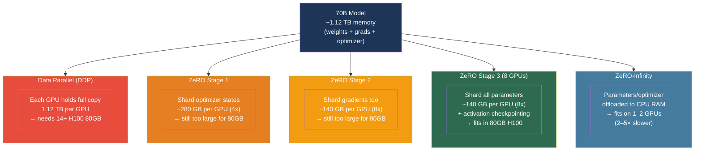

# [BEE-572] Distributed Training Infrastructure for Large Language Models

:::info
Training a 70B-parameter model requires ~1.4 TB of GPU memory per replica — more than any single cluster of A100s in existence. ZeRO optimizer sharding, gradient checkpointing, and mixed-precision training are the three orthogonal techniques that make trillion-parameter training feasible, each attacking a different component of the memory budget.
:::

## Context

Fine-tuning or training a large language model from scratch involves managing four distinct categories of GPU memory: model weights, gradients (one per weight), optimizer states (two FP32 tensors per weight for Adam: momentum and variance), and activations (intermediate tensors held during the forward pass for use in the backward pass). For a 70B-parameter model in FP32 with Adam:

```
Weights:          70B × 4 bytes =  280 GB
Gradients:        70B × 4 bytes =  280 GB
Adam momentum:    70B × 4 bytes =  280 GB
Adam variance:    70B × 4 bytes =  280 GB
─────────────────────────────────────────
Subtotal:                         1,120 GB  (before activations)
```

A single H100 80GB cannot hold even the weights alone. Standard **Data Parallel (DDP)** training replicates the full model on every GPU, which means a 70B model needs ~14 H100 80GBs just for weights before accounting for gradients and optimizer states.

The **ZeRO (Zero Redundancy Optimizer)** framework, introduced by Rajbhandari et al. at Microsoft in *ZeRO: Memory Optimizations Toward Training Trillion Parameter Models* (arXiv:1910.02054, 2019), eliminates this redundancy by partitioning optimizer states, gradients, and parameters across all data-parallel workers. The insight is that in DDP every worker holds an identical copy of optimizer states and gradients — ZeRO removes this redundancy while preserving the same computational semantics.

**Gradient checkpointing** (Chen et al., arXiv:1604.06174, 2016) attacks the activation memory problem orthogonally: instead of storing all intermediate activations during the forward pass, it discards them and recomputes them on demand during the backward pass. The trade-off is roughly 33% more compute in exchange for O(√n) rather than O(n) activation memory.

**Mixed-precision training** — using BF16 or FP16 for forward/backward passes while maintaining FP32 master weights for the optimizer — cuts memory further by halving the size of weight and gradient tensors without compromising training stability.

## ZeRO Memory Sharding

ZeRO defines three stages, each adding a new category of tensors to the partition:

| Stage | Shards | Memory reduction | Communication vs DDP |
|---|---|---|---|
| ZeRO-1 | Optimizer states only | 4× | Same |
| ZeRO-2 | + Gradients | 8× | Same |
| ZeRO-3 | + Parameters | Nd× (linear with DP degree) | +50% |

With 16-way data parallelism, ZeRO-3 achieves 16× memory reduction per GPU. The additional 50% communication overhead comes from the parameter all-gather before each forward pass and reduce-scatter after each backward pass, compared to DDP's single all-reduce of gradients.

**ZeRO-Infinity** extends ZeRO-3 to offload weights, gradients, and optimizer states to CPU DRAM or NVMe SSD. CPU offload reduces per-GPU memory to only the working set needed for the current micro-batch, at the cost of PCIe bandwidth (CPU→GPU transfer per forward pass). NVMe offload further reduces cost but is throughput-limited to the drive's sequential bandwidth.

## PyTorch FSDP vs DeepSpeed ZeRO

PyTorch's **Fully Sharded Data Parallel (FSDP)** implements the ZeRO-3 concept natively, without the DeepSpeed dependency. The sharding strategies map directly:

| FSDP strategy | Equivalent ZeRO stage |
|---|---|
| `NO_SHARD` | DDP (no sharding) |
| `SHARD_GRAD_OP` | ZeRO-2 (gradients + optimizer states) |
| `FULL_SHARD` | ZeRO-3 (parameters + gradients + optimizer states) |

FSDP's unit of sharding is the `FlatParameter`: all parameters in a given module are flattened into one tensor and sharded. This simplifies the implementation at the cost of requiring explicit `FSDPModule` wrapping in the model definition. DeepSpeed ZeRO-3 works by patching the model in-place without requiring structural changes, making it easier to apply to existing training code.

For models under ~10B parameters, FSDP `FULL_SHARD` typically achieves higher throughput than DeepSpeed ZeRO-3 because its parameter all-gathers are better fused with computation. For 70B+ models, the difference narrows as communication overhead dominates either way.

## Best Practices

### Combine ZeRO-3 with gradient checkpointing for 70B+ fine-tuning on 8 GPUs

**SHOULD** apply both techniques simultaneously to fit a 70B fine-tuning run on a single 8×H100 node. ZeRO-3 on 8 GPUs gives 8× memory reduction (1,120 GB → 140 GB); gradient checkpointing reduces activation memory to O(√L) where L is the number of layers:

```python
from torch.distributed.fsdp import FullyShardedDataParallel as FSDP
from torch.distributed.fsdp import ShardingStrategy
from torch.utils.checkpoint import checkpoint_wrapper, CheckpointImpl

# Wrap each transformer block with gradient checkpointing
def apply_checkpointing(model):
    for layer in model.model.layers:
        layer = checkpoint_wrapper(
            layer,
            checkpoint_impl=CheckpointImpl.NO_REENTRANT,  # preferred in modern PyTorch
        )
    return model

# Wrap with FSDP after checkpointing
model = apply_checkpointing(model)
model = FSDP(
    model,
    sharding_strategy=ShardingStrategy.FULL_SHARD,
    cpu_offload=None,              # keep on GPU for throughput
    auto_wrap_policy=transformer_auto_wrap_policy,
)
```

### Train in BF16 — not FP16 — for modern hardware

**SHOULD** use BF16 mixed precision on any hardware that supports it (A100, H100, B100). BF16 has the same exponent range as FP32 (8-bit exponent) and eliminates the loss scaling and FP32 master weights required by FP16:

```python
# DeepSpeed: BF16 mixed precision (no loss scaler needed)
ds_config = {
    "bf16": {"enabled": True},
    "zero_optimization": {
        "stage": 3,
        "offload_optimizer": {"device": "none"},
        "reduce_scatter": True,
        "allgather_partitions": True,
    },
    "gradient_clipping": 1.0,
    "train_micro_batch_size_per_gpu": 1,
    "gradient_accumulation_steps": 8,
}

# PyTorch FSDP: equivalent
from torch.distributed.fsdp import MixedPrecision
import torch

bf16_policy = MixedPrecision(
    param_dtype=torch.bfloat16,
    reduce_dtype=torch.bfloat16,   # gradient reduction in BF16
    buffer_dtype=torch.bfloat16,
)
model = FSDP(model, mixed_precision=bf16_policy, ...)
```

**MUST NOT** use FP16 without a loss scaler. FP16's limited dynamic range (max ~65,504) causes gradient underflow — gradients round to zero before the optimizer step, and training diverges silently. BF16 avoids this entirely on modern accelerators.

### Use gradient accumulation to decouple batch size from per-GPU memory

**SHOULD** use gradient accumulation when the target global batch size cannot fit in per-GPU memory. An effective batch of 512 sequences with micro-batch size 1 and 8 GPUs requires 64 accumulation steps:

```python
# Training loop with gradient accumulation
effective_batch_size = 512
micro_batch_size = 1
num_gpus = 8
accumulation_steps = effective_batch_size // (micro_batch_size * num_gpus)  # = 64

optimizer.zero_grad()
for step, batch in enumerate(dataloader):
    outputs = model(**batch)
    loss = outputs.loss / accumulation_steps      # normalize before accumulation
    loss.backward()

    if (step + 1) % accumulation_steps == 0:
        # Clip gradients only at the update step
        torch.nn.utils.clip_grad_norm_(model.parameters(), max_norm=1.0)
        optimizer.step()
        scheduler.step()
        optimizer.zero_grad()
```

**SHOULD NOT** accumulate gradients naively without normalizing the loss. Dividing by `accumulation_steps` ensures the gradient magnitude is consistent whether you use 1 step or 64 steps.

### Enable CPU offload only when GPU memory is the hard constraint

**MAY** use ZeRO-Infinity CPU offload when the model cannot fit in GPU memory even at ZeRO-3. The trade-off is significant: CPU offload adds PCIe round-trips (GPU→CPU for optimizer updates, CPU→GPU for parameter restore) and typically reduces training throughput by 2–5×:

```python
# DeepSpeed ZeRO-Infinity with CPU offload
ds_config = {
    "zero_optimization": {
        "stage": 3,
        "offload_optimizer": {
            "device": "cpu",              # optimizer states on CPU RAM
            "pin_memory": True,           # pinned memory for faster PCIe
        },
        "offload_param": {
            "device": "cpu",              # parameters on CPU RAM
            "pin_memory": True,
        },
        "overlap_comm": True,
        "contiguous_gradients": True,
        "sub_group_size": 1e9,
    },
}
```

**SHOULD** prefer adding more GPUs over CPU offload when throughput matters. CPU offload is most appropriate for one-off fine-tuning runs where wall-clock time is less critical than fitting the job in available hardware.

### Measure and target Model FLOPs Utilization (MFU)

**SHOULD** track MFU as the primary efficiency metric for distributed training. MFU = (achieved tokens/sec × FLOPs per token) / (theoretical peak FLOPs). On H100s, a well-optimized 70B training run achieves 40–55% MFU; below 30% indicates a communication bottleneck or suboptimal batch configuration:

```python
def compute_mfu(
    model_params: int,
    tokens_per_second: float,
    hardware_peak_flops: float,   # e.g., 989e12 for H100 BF16
) -> float:
    """
    Estimate MFU using the 6N approximation for transformer FLOPs per token.
    (2 multiply-adds per weight per forward+backward ≈ 6 × num_params)
    """
    flops_per_token = 6 * model_params
    return (tokens_per_second * flops_per_token) / hardware_peak_flops

# Example: 70B model, 400 tokens/sec on 8×H100 BF16 (989 TFLOPs/s each)
mfu = compute_mfu(
    model_params=70e9,
    tokens_per_second=400,
    hardware_peak_flops=8 * 989e12,
)
print(f"MFU: {mfu:.1%}")   # ~3.5% — indicates bottleneck (target: 40-55%)
# Low MFU on 8 GPUs → increase batch size or reduce ZeRO-3 overhead via gradient checkpointing tweaks
```

## Visual



## Common Mistakes

**Using FP16 mixed precision without a loss scaler.** FP16 gradients frequently underflow to zero for deep transformer layers. PyTorch's `GradScaler` must be enabled whenever FP16 is used; the scaler multiplies the loss by a large factor before backward, then divides gradients back before the optimizer step. BF16 eliminates this requirement entirely and should be preferred on A100/H100.

**Applying gradient checkpointing to every layer without benchmarking.** Checkpointing every layer recomputes every activation twice — once during the forward pass and once during the backward pass — adding 33% overhead. For models where activation memory is small relative to parameter memory (e.g., models with large hidden dimensions and short sequences), this overhead buys little. Profile activation memory before enabling checkpointing, and selectively checkpoint only the most memory-intensive layers.

**Setting micro-batch size to 1 without tuning gradient accumulation steps.** A micro-batch of 1 leaves the GPU underutilized during matrix multiplications — many CUDA kernels only reach peak throughput at larger batch sizes. Tune micro-batch size to the largest value that fits in GPU memory, then use gradient accumulation to reach the target effective batch size.

**Forgetting to normalize the loss in gradient accumulation.** Accumulating raw loss values rather than `loss / accumulation_steps` causes gradients to be proportional to the accumulation step count, inflating the effective learning rate and destabilizing training. Always divide the loss before calling `loss.backward()`.

**Mixing ZeRO stages between nodes.** All workers in a ZeRO training job must use the same sharding strategy. Assigning different stages to different machines causes gradient communication mismatches and training failure. Ensure the DeepSpeed or FSDP configuration is consistent across all nodes in the job.

## Related BEEs

- [BEE-514](514.md) -- Fine-Tuning and PEFT Patterns: LoRA and QLoRA reduce the number of trainable parameters, dramatically reducing the gradient and optimizer state footprint that ZeRO must shard
- [BEE-563](563.md) -- LLM Quantization for Inference: quantization reduces inference memory; during training QLoRA (4-bit base weights + LoRA in BF16) combines both techniques
- [BEE-568](568.md) -- Tensor Parallelism and Pipeline Parallelism: 3D parallelism combines ZeRO-based data parallelism with TP/PP for training at the largest scales
- [BEE-570](570.md) -- LLM Serving Autoscaling and GPU Cluster Management: the GPU cluster management principles for training overlap significantly with serving

## References

- [Rajbhandari et al. ZeRO: Memory Optimizations Toward Training Trillion Parameter Models — arXiv:1910.02054, Microsoft 2019](https://arxiv.org/abs/1910.02054)
- [Chen et al. Training Deep Nets with Sublinear Memory Cost — arXiv:1604.06174, 2016](https://arxiv.org/abs/1604.06174)
- [Micikevicius et al. FP8 Formats for Deep Learning — arXiv:2209.05433, NVIDIA 2022](https://arxiv.org/abs/2209.05433)
- [PyTorch. DistributedDataParallel — docs.pytorch.org](https://docs.pytorch.org/docs/stable/generated/torch.nn.parallel.DistributedDataParallel.html)
- [PyTorch. Fully Sharded Data Parallel — docs.pytorch.org](https://docs.pytorch.org/docs/stable/fsdp.html)
- [PyTorch. Activation Checkpointing — docs.pytorch.org](https://docs.pytorch.org/docs/stable/checkpoint.html)
- [DeepSpeed. ZeRO Stage 3 — deepspeed.readthedocs.io](https://deepspeed.readthedocs.io/en/latest/zero3.html)
- [NVIDIA Megatron-Core. Parallelism Guide — docs.nvidia.com](https://docs.nvidia.com/megatron-core/developer-guide/latest/user-guide/parallelism-guide.html)
