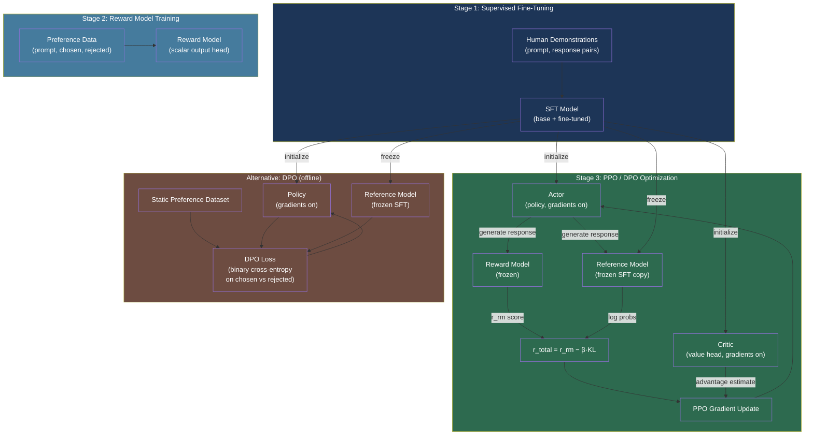

# [BEE-573] RLHF and Alignment Training Infrastructure

:::info
PPO-based RLHF requires four simultaneous model copies — actor, critic, reward model, and reference model — consuming more than 3× the GPU memory of supervised fine-tuning alone. DPO eliminates the reward model and critic, reducing to two copies and dropping training complexity to a single binary cross-entropy loss on preference pairs, at the cost of offline-only optimization.
:::

## Context

Training a capable LLM produces a base model that generates plausible text but does not reliably follow instructions, remain helpful, or avoid harmful outputs. **Reinforcement Learning from Human Feedback (RLHF)** is the alignment technique that converts a base or instruction-tuned model into one that behaves according to human preferences. Ouyang et al. (InstructGPT, arXiv:2203.02155, 2022) demonstrated that a 1.3B RLHF-trained model is preferred over a 175B base GPT-3 model by human raters, establishing RLHF as the dominant alignment technique.

The standard pipeline has three stages:

1. **Supervised Fine-Tuning (SFT):** Fine-tune the base model on high-quality human demonstrations to produce a well-behaved starting policy.
2. **Reward Model (RM) Training:** Collect human preference comparisons between pairs of model responses. Train a separate model to predict the preferred response, outputting a scalar reward score.
3. **RL Optimization (PPO):** Fine-tune the SFT model with Proximal Policy Optimization (PPO), using the reward model score as the learning signal.

The key infrastructure challenge is that PPO requires four model instances simultaneously:

| Role | Gradient | Purpose |
|---|---|---|
| Actor | Yes | Policy being trained; generates responses during each batch |
| Critic | Yes | Value network estimating expected reward; required for advantage estimation |
| Reward model | Frozen | Scores actor responses to produce the training signal |
| Reference model | Frozen | Frozen SFT checkpoint; used to compute KL divergence penalty |

The reward signal is not the raw reward model output. It is penalized by the KL divergence between the current policy and the frozen reference:

```
r_total = r_reward_model(x, y) - beta * KL(policy(y|x) || reference(y|x))
```

The KL term prevents **reward hacking** — the policy gaming the imperfect proxy reward model in ways that degrade actual quality. Gao et al. (arXiv:2210.10760, ICML 2023) formalized this as a scaling law: optimizing too aggressively against the proxy reward reduces gold-standard quality, and the degradation coefficient decreases as the reward model scales — larger reward models overoptimize more slowly.

## Alternatives to PPO: DPO and RLAIF

**Direct Preference Optimization (DPO)** (Rafailov et al., arXiv:2305.18290, NeurIPS 2023) derives a closed-form relationship between the optimal policy and the reward, allowing the RLHF objective to be solved with a simple binary cross-entropy loss on preference pairs — without training a reward model or running on-policy rollouts:

```python
# DPO training objective (simplified)
# chosen_logps: log probs of preferred response under policy
# rejected_logps: log probs of dispreferred response under policy
# ref_chosen_logps / ref_rejected_logps: same under frozen reference

def dpo_loss(
    chosen_logps: torch.Tensor,
    rejected_logps: torch.Tensor,
    ref_chosen_logps: torch.Tensor,
    ref_rejected_logps: torch.Tensor,
    beta: float = 0.1,
) -> torch.Tensor:
    chosen_rewards = beta * (chosen_logps - ref_chosen_logps)
    rejected_rewards = beta * (rejected_logps - ref_rejected_logps)
    loss = -F.logsigmoid(chosen_rewards - rejected_rewards)
    return loss.mean()
```

DPO reduces the infrastructure from four model copies to two (policy being trained + frozen reference). The trade-off is that DPO is an **offline method**: it trains on a static preference dataset and cannot generate new rollouts to explore the policy space. PPO's on-policy generation enables better exploration on complex tasks but requires the full four-model setup.

**RLAIF (Reinforcement Learning from AI Feedback)** (Lee et al., arXiv:2309.00267, 2023) replaces human annotators with an LLM to generate preference labels. The RL training infrastructure is identical to standard RLHF; only the data collection pipeline changes. The paper found RLAIF matches human-annotated RLHF on summarization (71% vs 73% win rate over SFT) while eliminating the annotation bottleneck.

**Constitutional AI (CAI)** (Bai et al., arXiv:2212.08073, Anthropic 2022) combines supervised revision (critiquing and rewriting outputs against a set of principles) with AI-generated preference labels for the RL stage — an early formalization of what RLAIF later benchmarked systematically.

## Best Practices

### Use TRL or OpenRLHF rather than a custom RLHF implementation

**SHOULD** use an established RLHF library. Implementing PPO correctly for LLMs is non-trivial: the "N+ Implementation Details of RLHF with PPO" (arXiv:2403.17031) documents over 13 correctness details that affect training stability. HuggingFace TRL (https://huggingface.co/docs/trl/en/index) and OpenRLHF (arXiv:2405.11143) incorporate these details and are the current standard implementations.

```python
# TRL PPOTrainer: SFT model becomes both actor and reference
from trl import PPOTrainer, PPOConfig, AutoModelForCausalLMWithValueHead

config = PPOConfig(
    model_name="meta-llama/Llama-3-8b-sft",
    learning_rate=1.41e-5,
    batch_size=128,
    mini_batch_size=16,
    gradient_accumulation_steps=1,
    optimize_cuda_cache=True,
    kl_coef=0.05,          # beta: KL penalty coefficient
    cliprange=0.2,          # PPO clip parameter
    vf_coef=0.1,            # value function loss coefficient
    num_ppo_epochs=4,
)

# AutoModelForCausalLMWithValueHead adds a scalar value head on top
model = AutoModelForCausalLMWithValueHead.from_pretrained(config.model_name)
ref_model = AutoModelForCausalLMWithValueHead.from_pretrained(config.model_name)

trainer = PPOTrainer(config=config, model=model, ref_model=ref_model,
                     tokenizer=tokenizer, dataset=dataset,
                     data_collator=collate_fn)
```

### Start with DPO for alignment tasks where on-policy exploration is not required

**SHOULD** default to DPO for instruction-following and general alignment tasks where a good preference dataset exists. DPO eliminates reward model training, on-policy generation, and the critic network — reducing wall-clock training time significantly and requiring only two model copies:

```python
from trl import DPOTrainer, DPOConfig

dpo_config = DPOConfig(
    model_name_or_path="meta-llama/Llama-3-8b-sft",
    beta=0.1,               # KL regularization strength
    loss_type="sigmoid",    # standard DPO loss (vs IPO: "ipo", KTO: "kto_pair")
    max_length=1024,
    max_prompt_length=512,
    per_device_train_batch_size=4,
    gradient_accumulation_steps=8,
    bf16=True,
)

# dataset must have: prompt, chosen, rejected columns
trainer = DPOTrainer(
    model=model,
    ref_model=ref_model,    # frozen reference; can be None with implicit reference
    args=dpo_config,
    train_dataset=preference_dataset,
    tokenizer=tokenizer,
)
trainer.train()
```

**SHOULD** use PPO over DPO when the task requires on-policy exploration — for example, code generation where the reward signal (test pass rate) cannot be pre-computed on a static dataset.

### Apply LoRA to reduce PPO memory from 4× to under 1× SFT

**SHOULD** use PEFT/LoRA on the actor and critic when running PPO to avoid the 3× memory overhead of full-parameter PPO. Santacroce et al. (arXiv:2309.00754) showed that LoRA-PPO fits within the memory budget of SFT alone while matching full-parameter PPO quality:

```python
from peft import LoraConfig, get_peft_model, TaskType

lora_config = LoraConfig(
    task_type=TaskType.CAUSAL_LM,
    r=16,
    lora_alpha=32,
    target_modules=["q_proj", "v_proj", "k_proj", "o_proj"],
    lora_dropout=0.05,
    bias="none",
)

# Apply LoRA to actor only; reference and reward remain frozen full-precision
model = get_peft_model(base_model, lora_config)
model = AutoModelForCausalLMWithValueHead(model)
```

**MUST NOT** apply LoRA to the reference model. The reference must be the original SFT weights to provide an accurate KL baseline; adapting it defeats the purpose of the KL penalty.

### Monitor KL divergence and proxy/gold reward gap throughout training

**MUST** track `objective/kl` (KL divergence from reference) and stop training or reduce the KL coefficient if the KL diverges beyond the intended budget. Per Gao et al. (arXiv:2210.10760), the proxy reward (RM score) and gold reward (true human preference) diverge as KL increases — the RM score will continue rising while the actual quality degrades:

```python
# Log key RLHF metrics to Weights & Biases / TensorBoard
def log_rlhf_metrics(stats: dict, step: int):
    wandb.log({
        "train/kl": stats["objective/kl"],          # should stay < 10 nats
        "train/reward": stats["ppo/mean_scores"],    # proxy reward — rising is expected
        "train/entropy": stats["objective/entropy"], # policy diversity
        "train/approxkl": stats["ppo/policy/approxkl"],
        "train/clipfrac": stats["ppo/policy/clipfrac"],  # > 0.2 → lr too high
    }, step=step)

    # Alert if KL exceeds budget
    if stats["objective/kl"] > 10.0:
        logger.warning(f"KL divergence {stats['objective/kl']:.2f} exceeds budget — "
                       f"consider reducing kl_coef or stopping early")
```

**SHOULD** hold out a separate evaluation set scored by a stronger model or human evaluators to track the gold/proxy reward gap throughout training. Evaluate at least every 500 PPO steps.

### Use OpenRLHF for 70B+ models requiring distributed four-model PPO

**MAY** use OpenRLHF (arXiv:2405.11143) when training 70B+ models with PPO. OpenRLHF distributes the four model roles across separate GPU groups using Ray, with vLLM handling actor generation. This avoids the memory contention of co-locating all four models on the same GPU set and achieves 2.3× speedup over DeepSpeed-Chat for 70B training:

```yaml
# OpenRLHF Ray cluster configuration for 70B PPO
# 32 × A800 80GB GPUs: 8 for actor+vLLM, 8 for ref, 8 for critic, 8 for reward

actor_num_nodes: 2
actor_num_gpus_per_node: 4
vllm_num_engines: 2          # vLLM for fast actor generation
vllm_tensor_parallel_size: 4 # TP across actor GPUs

critic_num_nodes: 2
critic_num_gpus_per_node: 4

ref_num_nodes: 2
ref_num_gpus_per_node: 4

reward_num_nodes: 2
reward_num_gpus_per_node: 4

# PPO hyperparameters
kl_target: 6.0               # adaptive KL controller target
init_kl_coef: 0.01
adap_kl_ctrl: true
```

## Visual



## Common Mistakes

**Omitting the KL penalty from the reward signal.** Running PPO with raw reward model scores and no KL divergence term causes the policy to exploit the proxy reward immediately — generations become repetitive, incoherent, or adversarially structured to score well. Always apply `r_total = r_rm - beta * KL` with a reasonable initial beta (0.05–0.1).

**Using the same model instance for actor and reference without freezing the reference.** TRL's `PPOTrainer` takes a separate `ref_model` argument for this reason. Updating the reference during training removes the KL anchor, causing reward hacking with no corrective signal.

**Training DPO on preference data collected from a policy far different from the one being trained.** DPO's derivation assumes the preference data distribution is close to the policy being trained. Using preferences collected from a much stronger model introduces distribution shift that degrades DPO convergence. Collect preferences from the same model family or use importance weighting.

**Stopping RLHF training on proxy reward alone.** The proxy RM score will continue rising even as quality degrades due to overoptimization. Always run independent evaluation (stronger model judge or human preference) and stop based on held-out quality metrics, not RM score.

**Forgetting the value function loss coefficient.** The PPO objective is a combination of policy loss and value function loss: `L = L_policy - vf_coef * L_value`. Setting `vf_coef=0` disconnects the critic from training — the advantage estimates degrade, causing high variance gradient updates and unstable training.

## Related BEEs

- [BEE-514](514.md) -- Fine-Tuning and PEFT Patterns: LoRA reduces the trainable parameter count that RLHF's actor and critic must update; LoRA-PPO cuts memory below SFT levels
- [BEE-572](572.md) -- Distributed Training Infrastructure for Large Language Models: ZeRO sharding and FSDP are applied to all four PPO model copies; OpenRLHF uses DeepSpeed ZeRO-3 for the critic, reward, and reference
- [BEE-507](507.md) -- Prompt Engineering vs RAG vs Fine-Tuning: RLHF and DPO are the primary alignment methods that operate after supervised fine-tuning
- [BEE-537](537.md) -- AI Agent Safety and Reliability Patterns: RLHF-aligned models are the foundation of safe agentic systems; reward model overoptimization is a reliability risk in deployed agents

## References

- [Ouyang et al. Training language models to follow instructions with human feedback (InstructGPT) — arXiv:2203.02155, 2022](https://arxiv.org/abs/2203.02155)
- [Rafailov et al. Direct Preference Optimization: Your Language Model is Secretly a Reward Model — arXiv:2305.18290, NeurIPS 2023](https://arxiv.org/abs/2305.18290)
- [Lee et al. RLAIF vs. RLHF: Scaling Reinforcement Learning from Human Feedback with AI Feedback — arXiv:2309.00267, 2023](https://arxiv.org/abs/2309.00267)
- [Bai et al. Constitutional AI: Harmlessness from AI Feedback — arXiv:2212.08073, Anthropic 2022](https://arxiv.org/abs/2212.08073)
- [Gao et al. Scaling Laws for Reward Model Overoptimization — arXiv:2210.10760, ICML 2023](https://arxiv.org/abs/2210.10760)
- [Santacroce et al. Efficient RLHF: Reducing the Memory Usage of PPO — arXiv:2309.00754, 2023](https://arxiv.org/abs/2309.00754)
- [Zheng et al. Secrets of RLHF in Large Language Models Part I: PPO — arXiv:2307.04964, 2023](https://arxiv.org/abs/2307.04964)
- [Hu et al. OpenRLHF: An Easy-to-use, Scalable and High-performance RLHF Framework — arXiv:2405.11143, 2024](https://arxiv.org/abs/2405.11143)
- [Yao et al. DeepSpeed-Chat: Easy, Fast and Affordable RLHF Training of ChatGPT-like Models — arXiv:2308.01320, Microsoft 2023](https://arxiv.org/abs/2308.01320)
- [HuggingFace. TRL: Transformer Reinforcement Learning — huggingface.co/docs/trl](https://huggingface.co/docs/trl/en/index)
- [HuggingFace. Illustrating Reinforcement Learning from Human Feedback — huggingface.co/blog/rlhf](https://huggingface.co/blog/rlhf)
