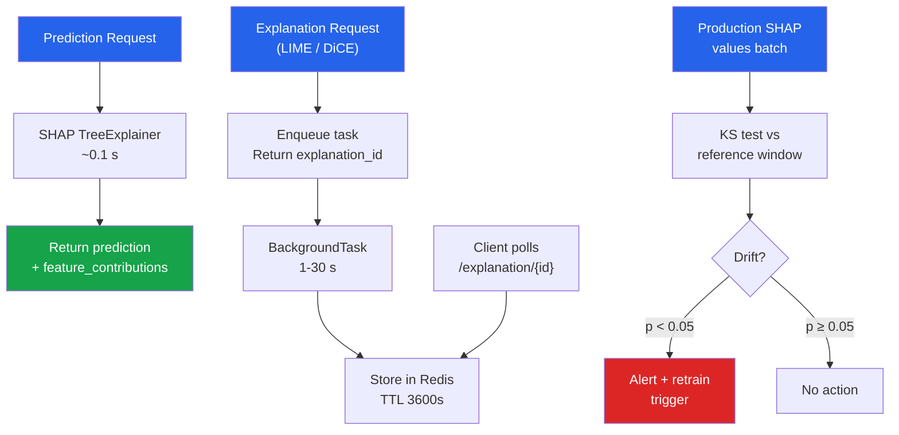

# [BEE-588] Model Explainability in Production

:::info
Model explainability translates a trained model's internal decision logic into human-readable attribution scores that answer "why did the model predict this?" for a specific input. Production explainability has two requirements that conflict: explanations must be accurate enough to satisfy regulatory audits (EU AI Act, GDPR Article 22) and fast enough to sit in a serving path without degrading latency budgets. Naive implementations fail both.
:::

## Context

GDPR Article 22 grants individuals the right to "meaningful information about the logic involved" in automated decisions that produce legal or similarly significant effects. The EU AI Act Article 13 requires high-risk AI systems to be transparent, and Article 86 grants a right to explanation for decisions made by AI systems. These requirements are not aspirational — non-compliance carries fines up to 4% of global turnover under GDPR and up to €30M under the EU AI Act.

The tooling landscape consolidates around three complementary methods: **SHAP** for attribution scores (unified with a solid theoretical foundation from Lundberg & Lee, NeurIPS 2017, arXiv:1705.07874), **LIME** for local linear approximations when model access is constrained, and **DiCE** for counterfactual explanations (what would need to change to flip the outcome). Each has a distinct latency profile that determines whether it can run synchronously in the serving path or must be deferred.

## Latency Profiles

| Method | Typical latency | Serving mode |
|---|---|---|
| SHAP TreeExplainer | ~0.1 s per sample | Synchronous (acceptable) |
| SHAP LinearExplainer | <1 ms | Synchronous |
| SHAP KernelExplainer | ~12 s | Async only |
| LIME LimeTabularExplainer | 1–5 s (5 000 samples) | Async only |
| DiCE counterfactuals | 1–30 s | Async only |

TreeExplainer is 133× faster than KernelExplainer on the same model. The difference is structural: TreeExplainer exploits the tree's conditional independence structure to compute exact Shapley values in O(TLD²) where T is tree count, L is max leaves, D is max depth. KernelExplainer estimates Shapley values by sampling permutations — exact but model-agnostic.

## SHAP: Production Attribution

```python
import shap
import numpy as np
from fastapi import FastAPI
from contextlib import asynccontextmanager

# Module-level explainer — initialize once, reuse across requests
_explainer: shap.TreeExplainer | None = None

@asynccontextmanager
async def lifespan(app: FastAPI):
    global _explainer
    model = load_model()                          # load your trained model
    _explainer = shap.TreeExplainer(
        model,
        feature_perturbation="tree_path_dependent",  # no background sample needed
    )
    yield

app = FastAPI(lifespan=lifespan)

@app.post("/predict-with-explanation")
async def predict_with_explanation(features: dict) -> dict:
    X = np.array([[features[f] for f in FEATURE_NAMES]])
    prediction = float(_explainer.model.predict_proba(X)[0, 1])

    # shap_values shape: (n_samples, n_features) for binary classification
    shap_values = _explainer.shap_values(X)
    values = shap_values[1][0] if isinstance(shap_values, list) else shap_values[0]

    feature_contributions = {
        name: round(float(val), 6)
        for name, val in zip(FEATURE_NAMES, values)
    }

    return {
        "prediction": prediction,
        "base_value": float(_explainer.expected_value[1]
                           if isinstance(_explainer.expected_value, list)
                           else _explainer.expected_value),
        "feature_contributions": feature_contributions,
    }
```

`feature_perturbation="tree_path_dependent"` eliminates the need for a background dataset by conditioning on the training distribution implicitly. For non-tree models, use `shap.LinearExplainer` (linear models, <1 ms) or `shap.Explainer` (auto-selects since v0.42+, falling back to KernelExplainer which MUST be async).

## Async Explanation Pattern

LIME and DiCE run in seconds — never in the synchronous serving path. The pattern: accept the request, enqueue explanation generation, return an `explanation_id`, let the client poll.

```python
import asyncio
import uuid
import redis.asyncio as redis
from fastapi import BackgroundTasks
import json
import lime.lime_tabular

redis_client = redis.Redis(host="localhost", port=6379, decode_responses=True)

async def _generate_lime_explanation(
    explanation_id: str, features: dict
) -> None:
    """Background task — stores result in Redis with 1-hour TTL."""
    explainer = lime.lime_tabular.LimeTabularExplainer(
        training_data=X_train_sample,
        feature_names=FEATURE_NAMES,
        mode="classification",
    )
    X = np.array([[features[f] for f in FEATURE_NAMES]])
    exp = explainer.explain_instance(
        X[0],
        predict_fn,
        num_features=10,
        num_samples=5000,   # fewer → faster but less stable; 5000 is the recommended default
    )
    result = {
        "explanation_id": explanation_id,
        "status": "ready",
        "local_weights": dict(exp.as_list()),
        "intercept": exp.intercept[1],
    }
    await redis_client.setex(
        f"explanation:{explanation_id}", 3600, json.dumps(result)
    )

@app.post("/explain/lime")
async def request_lime_explanation(
    features: dict, background_tasks: BackgroundTasks
) -> dict:
    explanation_id = str(uuid.uuid4())
    await redis_client.setex(
        f"explanation:{explanation_id}", 3600,
        json.dumps({"status": "pending"})
    )
    background_tasks.add_task(_generate_lime_explanation, explanation_id, features)
    return {"explanation_id": explanation_id, "status": "pending"}

@app.get("/explanation/{explanation_id}")
async def get_explanation(explanation_id: str) -> dict:
    raw = await redis_client.get(f"explanation:{explanation_id}")
    if raw is None:
        return {"status": "not_found"}
    return json.loads(raw)
```

## DiCE: Counterfactual Explanations

Counterfactual explanations answer the regulatory-friendly question: "what is the minimum change to this input that would flip the decision?" They are the most actionable explanation for end users and directly satisfy the GDPR Recital 71 standard of "meaningful information."

```python
import dice_ml

def generate_counterfactuals(
    instance: dict,
    features_to_vary: list[str],
    permitted_range: dict | None = None,
    num_cfs: int = 3,
) -> list[dict]:
    """
    features_to_vary: features the user can realistically change.
    permitted_range: {"income": [20000, 200000]} to bound the search.
    """
    d = dice_ml.Data(
        dataframe=training_df,
        continuous_features=CONTINUOUS_FEATURES,
        outcome_name="label",
    )
    m = dice_ml.Model(model=trained_model, backend="sklearn")
    exp = dice_ml.Dice(d, m, method="random")

    query = pd.DataFrame([instance])
    cfs = exp.generate_counterfactuals(
        query,
        total_CFs=num_cfs,
        desired_class="opposite",
        features_to_vary=features_to_vary,
        permitted_range=permitted_range or {},
    )
    return cfs.cf_examples_list[0].final_cfs_df.to_dict(orient="records")
```

`method="random"` (Wachter et al., 2017, arXiv:1711.00399) is fast but produces undiverse counterfactuals. `method="genetic"` (Mothilal et al., FAT* 2020, arXiv:1905.07697) optimizes for proximity, diversity, and actionability simultaneously — required for user-facing explanations. Always run DiCE in a background task via the async pattern above.

## Explanation Drift Detection

SHAP values double as a drift signal. If the distribution of feature attributions shifts, the model's decision logic has changed even if prediction accuracy remains stable. This catches silent model degradation earlier than accuracy-based monitoring.

```python
from scipy import stats

def detect_explanation_drift(
    reference_shap: np.ndarray,   # shape: (n_reference, n_features)
    current_shap: np.ndarray,     # shape: (n_current, n_features)
    feature_names: list[str],
    alpha: float = 0.05,
) -> dict:
    """
    KS test per feature on SHAP value distributions.
    Returns drifted features and their p-values.
    """
    drifted = {}
    for i, name in enumerate(feature_names):
        stat, p_value = stats.ks_2samp(
            reference_shap[:, i], current_shap[:, i]
        )
        if p_value < alpha:
            drifted[name] = {"ks_statistic": float(stat), "p_value": float(p_value)}
    return drifted
```



## Common Mistakes

**Initializing the explainer per request.** A `shap.TreeExplainer` loads the model internals on construction. Doing this per request adds hundreds of milliseconds and unnecessary GC pressure. Initialize once at server startup and share the instance across requests.

**Running LIME synchronously.** LIME with `num_samples=5000` takes 1–5 seconds. At p50 load this produces HTTP timeouts. Any explanation method that takes more than ~200 ms MUST use the async pattern.

**Explaining the wrong model.** Explanations describe the model, not ground truth. If the model is biased, the explanations faithfully explain the biased model. Explanation != correctness. Pair explainability with fairness audits; do not conflate them.

**Ignoring explanation staleness.** SHAP values stored in a cache become stale when the model is retrained. Cache entries MUST be keyed on model version, not just input hash. Purge the explanation cache on every model promotion.

**Using `feature_perturbation="interventional"` for correlated features.** Interventional Shapley values assume feature independence. When features are correlated (e.g., `income` and `age`), they produce unreliable attributions. Use `tree_path_dependent` (default) for tree models.

## Related BEEs

- [BEE-585 ML Monitoring and Drift Detection](585) — population-level drift complements per-prediction explanation drift
- [BEE-584 Shadow Mode and Canary Deployment for ML Models](584) — champion/challenger comparison should include explanation comparison
- [BEE-586 ML Experiment Tracking and Model Registry](586) — link explanation artifacts to MLflow runs via `mlflow.log_artifact()`
- [BEE-506 Evaluating and Testing LLM Applications](506) — LLM-specific evaluation patterns distinct from classical ML explainability

## References

- Lundberg, S. M., & Lee, S.-I. (2017). A unified approach to interpreting model predictions. NeurIPS 2017. arXiv:1705.07874. https://papers.nips.cc/paper/7062-a-unified-approach-to-interpreting-model-predictions
- Ribeiro, M. T., Singh, S., & Guestrin, C. (2016). "Why should I trust you?": Explaining the predictions of any classifier. KDD 2016. arXiv:1602.04938. https://dl.acm.org/doi/10.1145/2939672.2939778
- Mothilal, R. K., Sharma, A., & Tan, C. (2020). Explaining machine learning classifiers through diverse counterfactual explanations. FAT* 2020. arXiv:1905.07697. https://dl.acm.org/doi/10.1145/3351095.3372850
- Wachter, S., Mittelstadt, B., & Russell, C. (2017). Counterfactual explanations without opening the black box. arXiv:1711.00399. https://arxiv.org/abs/1711.00399
- EU AI Act, Article 13 (Transparency and provision of information to deployers). https://artificialintelligenceact.eu/article/13/
- EU AI Act, Article 86 (Right to explanation of individual decision-making). https://artificialintelligenceact.eu/article/86/
- GDPR, Article 22 (Automated individual decision-making). https://gdpr-info.eu/art-22-gdpr/
- SHAP documentation. https://shap.readthedocs.io/en/latest/
- DiCE (Diverse Counterfactual Explanations) GitHub repository. https://github.com/interpretml/DiCE
- LIME GitHub repository. https://github.com/marcotcr/lime
