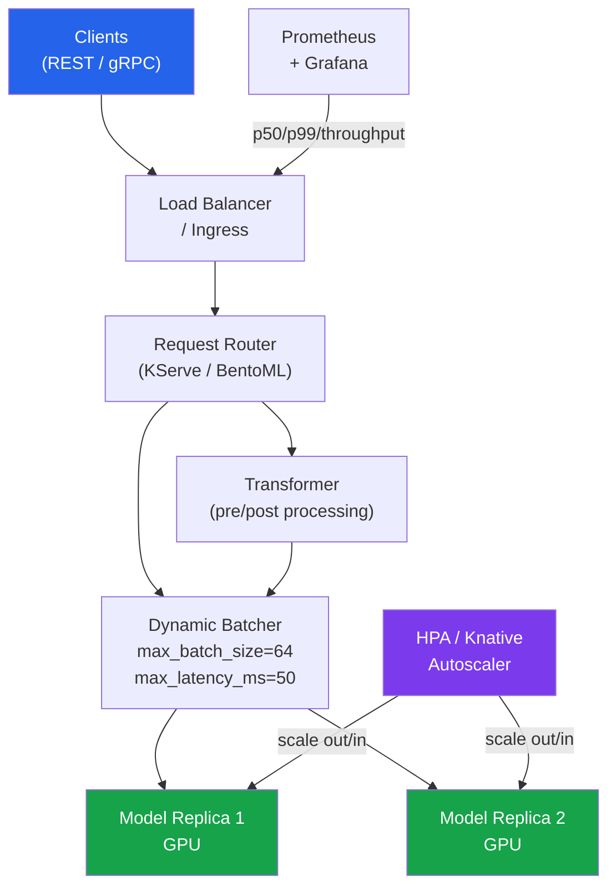

# [BEE-590] ML Model Serving Infrastructure

:::info
Model serving infrastructure translates a trained model artifact into a production service that handles concurrent inference requests with defined latency SLOs. Serving is not simply wrapping a model in a Flask handler — it involves dynamic batching to maximize GPU utilization, gRPC vs REST protocol selection, cold start mitigation for scale-to-zero deployments, and a multi-replica request routing layer. Getting this wrong produces either wasted GPU capacity (under-batching) or violated latency budgets (over-batching, cold starts).
:::

## Context

The gap between a working model and a production serving system is substantial. A batch-trained model that scores 94% AUC on a held-out test set can still fail in production if:

- It takes 800ms to score a single request because the model is loaded from disk per request
- GPU utilization is 3% because requests arrive one at a time with no batching
- Cold starts from scale-to-zero take 30 seconds because the image pulls a 4 GB model on first request
- The service falls over under load because threads block on model inference

The ecosystem has converged around four complementary tools: **BentoML** (Python-first, framework-agnostic), **KServe** (Kubernetes-native with InferenceService CRD), **NVIDIA Triton** (GPU-optimized batch inference), and **Ray Serve** (distributed inference for multi-model pipelines). They target different positions on the complexity vs. control spectrum.

## Dynamic Batching

Dynamic batching groups concurrent requests into a single GPU kernel call, amortizing the fixed overhead of GPU memory transfer and kernel launch across N inputs. A batch of 32 requests on a GPU may complete in the same wall time as a batch of 1, producing 32× throughput improvement with no latency increase — up to the point where the batch overflows L2 cache or exceeds memory bandwidth.

The trade-off: the first request in a batch waits up to `max_latency_ms` for the batch to fill. If the batch never fills within that window, it flushes with however many requests arrived. Optimal configuration:

```
max_latency_ms = target_p99_latency - model_inference_time_at_full_batch
```

For a model taking 20ms at batch size 32 with a 100ms p99 SLO, `max_latency_ms = 80ms`. At low traffic the batch rarely fills, so the effective latency is `max_latency_ms + inference_time ≈ 100ms`. At high traffic the batch fills faster and p99 improves.

## BentoML: Python-First Serving

BentoML (8.5k stars, github.com/bentoml/BentoML) is the lowest-friction path from a trained model to a containerized service. It requires no Kubernetes knowledge and handles containerization, dynamic batching, health checks, and Prometheus metrics automatically.

```python
import bentoml
import numpy as np
from bentoml.io import NumpyNdarray

# Save the trained model to BentoML's model store
bentoml.sklearn.save_model("fraud_classifier", trained_model)

@bentoml.service(
    resources={"cpu": "2", "memory": "4Gi"},
    traffic={"timeout": 10},
)
class FraudClassifierService:
    model_ref = bentoml.models.get("fraud_classifier:latest")

    def __init__(self):
        self.model = self.model_ref.load_model()  # loaded once at startup

    @bentoml.api(
        batchable=True,
        max_batch_size=64,
        max_latency_ms=50,        # flush batch after 50ms even if not full
        input_spec=NumpyNdarray(dtype="float32", shape=(-1, 30)),
        output_spec=NumpyNdarray(dtype="float32"),
    )
    def predict(self, inputs: np.ndarray) -> np.ndarray:
        # inputs: (batch_size, 30) — BentoML packs concurrent requests automatically
        return self.model.predict_proba(inputs)[:, 1]
```

```bash
bentoml build                   # packages service + model into a Bento
bentoml containerize fraud_classifier_service:latest  # builds Docker image
bentoml serve fraud_classifier_service:latest --port 3000
```

The `batchable=True` decorator is the key directive — BentoML accumulates concurrent calls to `predict()` into a single array and dispatches them together, then splits the results back to individual callers. The caller is unaware of batching.

## KServe: Kubernetes-Native Serving

KServe (5.3k stars, github.com/kserve/kserve) deploys models as Kubernetes Custom Resources using the `InferenceService` CRD. It integrates with Knative for scale-to-zero, implements the Open Inference Protocol (v2) for interoperability, and supports transformer/predictor/explainer composition.

```yaml
# infservice.yaml
apiVersion: serving.kserve.io/v1beta1
kind: InferenceService
metadata:
  name: fraud-classifier
  namespace: ml-serving
spec:
  predictor:
    minReplicas: 1      # prevent scale-to-zero cold starts for latency-sensitive models
    maxReplicas: 10
    scaleTarget: 100    # target 100 concurrent requests per replica before scaling
    sklearn:
      storageUri: s3://ml-models/fraud-classifier/v3/
      resources:
        requests:
          cpu: "1"
          memory: 2Gi
        limits:
          cpu: "2"
          memory: 4Gi
  transformer:
    containers:
      - name: transformer
        image: my-registry/fraud-transformer:v2
        env:
          - name: PREDICTOR_HOST
            value: fraud-classifier-predictor.ml-serving.svc.cluster.local
```

```bash
kubectl apply -f infservice.yaml
kubectl get inferenceservice fraud-classifier

# v2 inference protocol
curl -X POST \
  http://fraud-classifier.ml-serving.example.com/v2/models/fraud-classifier/infer \
  -H "Content-Type: application/json" \
  -d '{
    "inputs": [{
      "name": "features",
      "shape": [1, 30],
      "datatype": "FP32",
      "data": [0.1, 0.2, ...]
    }]
  }'
```

The Open Inference Protocol (v2) spec at https://kserve.github.io/website/docs/concepts/architecture/data-plane/v2-protocol standardizes health, metadata, and inference endpoints across KServe, Triton, and Seldon — enabling serving runtime portability.

## gRPC vs REST

| Dimension | gRPC | REST/HTTP |
|---|---|---|
| Serialization | Protocol Buffers (binary) | JSON (text) |
| Typical p50 latency | ~4 ms | ~12 ms |
| Throughput | ~50 000 req/s | ~20 000 req/s |
| Browser/CLI accessible | No (requires grpc-web proxy) | Yes |
| Streaming | Bidirectional | SSE/chunked only |

Use gRPC for internal service-to-service inference calls (model server ↔ application backend). Use REST for public-facing APIs and browser clients. KServe and Triton implement both under the Open Inference Protocol spec — the choice is per-client, not per-server.

```python
import grpc
from tritonclient.grpc import service_pb2, service_pb2_grpc
import numpy as np

channel = grpc.insecure_channel("triton-server:8001")
stub = service_pb2_grpc.GRPCInferenceServiceStub(channel)

# Prepare input tensor
input_tensor = service_pb2.ModelInferRequest.InferInputTensor(
    name="features",
    datatype="FP32",
    shape=[1, 30],
)
request = service_pb2.ModelInferRequest(
    model_name="fraud_classifier",
    model_version="3",
    inputs=[input_tensor],
)
# Set raw content bytes
request.raw_input_contents.append(
    np.array([[0.1, 0.2, ...]], dtype=np.float32).tobytes()
)

response = stub.ModelInfer(request)
```

## Cold Start Mitigation

Scale-to-zero (Knative default) eliminates idle GPU cost but introduces cold start latency. Cold start sequence: node provisioning → container init → image pull → model deserialization → GPU memory allocation → kernel compilation. For a 2 GB scikit-learn model, this is 5–15 seconds. For a 7B parameter LLM, it can exceed 60 seconds.

Mitigation strategies:

```yaml
# Set minReplicas=1 for latency-critical models
spec:
  predictor:
    minReplicas: 1   # one warm replica always running; scale-to-zero disabled

# Model image caching: embed model weights in the container image
# to eliminate S3 pull on startup (trade image size for cold start time)
```

```python
# Warm-up: send dummy requests during startup to compile CUDA kernels
# and trigger any lazy initialization
import httpx
import asyncio

async def warm_up_model(endpoint: str, n_warmup: int = 10) -> None:
    """Send dummy requests to pre-compile GPU kernels before serving live traffic."""
    dummy_input = {"inputs": [{"name": "features", "shape": [1, 30],
                                "datatype": "FP32", "data": [0.0] * 30}]}
    async with httpx.AsyncClient() as client:
        for _ in range(n_warmup):
            await client.post(f"{endpoint}/v2/models/fraud_classifier/infer",
                              json=dummy_input, timeout=30.0)
```

Kubernetes `readinessProbe` delays traffic routing until warm-up completes:

```yaml
readinessProbe:
  httpGet:
    path: /v2/health/ready
    port: 8080
  initialDelaySeconds: 30    # wait for model load before first check
  periodSeconds: 5
  failureThreshold: 6        # 30s grace period before considered failed
```

## SLOs and Capacity Planning

Standard latency targets for synchronous model serving:

| Traffic pattern | p50 target | p99 target | Notes |
|---|---|---|---|
| Real-time fraud scoring | < 20 ms | < 100 ms | Synchronous, blocking the payment |
| Product recommendation | < 50 ms | < 200 ms | User-facing, sync |
| Batch feature scoring | throughput | — | Offline, maximize GPU util |
| LLM inference (TTFT) | — | < 200 ms | Time to first token |

Capacity planning formula for GPU serving:

```
replicas = ceil(
    (requests_per_second * model_inference_latency_seconds)
    / (target_gpu_utilization * batch_size)
)
```

At 1000 req/s, 20ms inference latency, 80% target GPU utilization, and batch size 32:
```
replicas = ceil((1000 × 0.020) / (0.80 × 32)) = ceil(20 / 25.6) = ceil(0.78) = 1
```

Add headroom for burst: plan for 2× peak to avoid p99 degradation during traffic spikes.



## Common Mistakes

**Loading the model per request.** Every deserialization call (pickle.load, torch.load) reads from disk and initializes model state. A 200 MB sklearn model loads in ~300ms — unacceptable per request. Load the model once at service startup and store in a module-level or class-level variable.

**Setting max_batch_size without profiling.** A batch size of 256 sounds better than 32 but may exceed GPU memory, forcing partial batches and producing higher latency than smaller sizes. Profile with `perf_analyzer` (Triton) or `ab`/`wrk2` at each batch size before committing to a configuration.

**Exposing a model endpoint without a timeout.** Model inference can stall on resource contention. Without a timeout, stuck requests consume worker threads and cascade into a full service outage. Set timeouts at both the client (`httpx.timeout`, `grpc.timeout_in_seconds`) and the serving layer (`traffic.timeout` in BentoML, `spec.predictor.timeout` in KServe).

**Using scale-to-zero for latency-sensitive models.** Scale-to-zero eliminates idle cost but produces cold starts of 5–60+ seconds on first request. For any model with a p99 SLO < 500ms, set `minReplicas: 1`. Use scale-to-zero only for batch-scoring endpoints with no latency requirement.

**Ignoring output serialization cost.** A 4096-dimensional embedding vector serialized as JSON is ~40 KB per response. At 1000 req/s that is 40 MB/s of serialization CPU. Use Protocol Buffers or float32 binary format for high-dimensional outputs.

## Related BEEs

- [BEE-584 Shadow Mode and Canary Deployment for ML Models](584) — promote new model versions safely in the serving infrastructure
- [BEE-585 ML Monitoring and Drift Detection](585) — instrument the serving layer to detect prediction distribution shifts
- [BEE-523 LLM Inference Optimization and Self-Hosting](523) — LLM-specific serving (vLLM, TGI) with different batching semantics
- [BEE-302 Connection Pooling and Resource Management](302) — connection management principles that apply to model serving clients

## References

- KServe documentation. https://kserve.github.io/website/
- KServe Open Inference Protocol v2. https://kserve.github.io/website/docs/concepts/architecture/data-plane/v2-protocol
- Open Inference Protocol specification repository. https://github.com/kserve/open-inference-protocol
- BentoML documentation. https://docs.bentoml.com/
- BentoML services guide. https://docs.bentoml.com/en/latest/build-with-bentoml/services.html
- NVIDIA Triton Inference Server, dynamic batching documentation. https://docs.nvidia.com/deeplearning/triton-inference-server/user-guide/docs/user_guide/batcher.html
- Ray Serve documentation. https://docs.ray.io/en/latest/serve/index.html
- Ray Serve dynamic request batching. https://docs.ray.io/en/latest/serve/advanced-guides/dyn-req-batch.html
- Baseten, continuous vs. dynamic batching for AI inference. https://www.baseten.co/blog/continuous-vs-dynamic-batching-for-ai-inference/
- Moritz, P., et al. (2018). Ray: A Distributed Framework for Emerging AI Applications. OSDI 2018. https://www.usenix.org/system/files/osdi18-moritz.pdf
