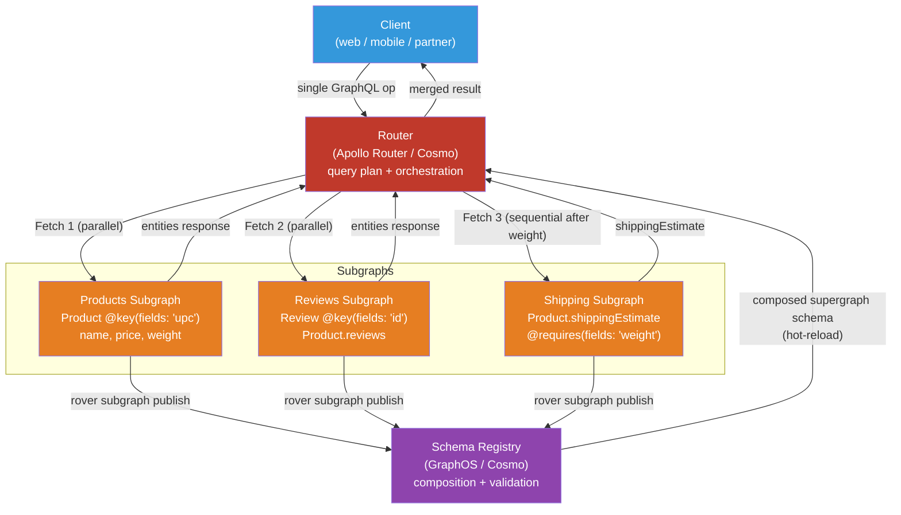

# [BEE-485] GraphQL Federation

:::info
GraphQL Federation is a protocol and architecture for composing multiple independently owned GraphQL services — subgraphs — into a single unified API surface — the supergraph — served through a router, without requiring a central schema team to own all types.
:::

## Context

When an organization adopts GraphQL across multiple teams, a structural tension emerges: each service team wants to own their schema, but clients want a single, coherent API. The naive solution is schema stitching — a gateway that manually merges schemas and writes custom resolver logic to join types across service boundaries. The gateway becomes a bottleneck: every cross-service relationship requires coordination with the gateway team, the merge logic is imperative and brittle, and there is no static contract between what a service promises and what the gateway expects.

Apollo introduced Federation on May 1, 2019, presenting it as a declarative alternative: subgraphs annotate their schemas with directives that encode the cross-service relationships, and a composition tool derives the unified schema from those annotations without gateway-level imperative code. The protocol standardizes two root fields on every subgraph — `Query._service { sdl }` for schema introspection during composition, and `Query._entities(representations: [_Any!]!): [_Entity]!` for entity resolution at runtime — creating a subgraph-router contract that any conforming implementation can fulfill.

Apollo Federation v2 (stable 2022) relaxed the v1 restriction that each field must have a single home subgraph, introduced `@shareable` for fields resolvable by multiple subgraphs, and added `@override` for zero-downtime field migrations between subgraphs. In September 2023, WunderGraph, Grafbase, and others published the Open Federation specification under MIT license — documenting the composition rules and gateway behavior that Apollo's own spec had left implicit — creating a vendor-neutral standard for the protocol.

By 2024, large-scale production deployments were public: Netflix operates 200+ DGS (Domain Graph Service) subgraphs fielding over a billion daily requests; Expedia reported a 50% compute reduction after migrating from schema stitching to Federation; Shopify, GitHub, and Twitter have all described federated GraphQL approaches internally.

## Design Thinking

### Subgraph, Supergraph, Router

**Subgraph**: An independently deployable GraphQL service that implements a portion of the unified schema. It exposes the federation protocol fields (`_service`, `_entities`) via a library (`buildSubgraphSchema` in Apollo Server, `graphql-kotlin-federation`, Netflix DGS, etc.). Teams own their subgraph schemas independently.

**Supergraph**: The composed unified schema produced offline by the composition tool (Rover CLI, GraphOS, Cosmo). It is not a separate service — it is a static artifact that the router uses as a routing blueprint. Clients interact with a schema that appears monolithic.

**Router**: The process that receives client operations and executes them against subgraphs. The Apollo Router (Rust, released November 2021) replaced the earlier Node.js Apollo Gateway; WunderGraph Cosmo Router (Apache 2.0) and The Guild's Hive Gateway are compatible open-source alternatives. The router:

1. Receives a client GraphQL operation.
2. Runs the query planner to decompose it into subgraph fetches.
3. Executes fetches — in parallel where independent, sequentially where data dependencies require it.
4. Merges results and returns a single response.

### Entities and the `@key` Directive

Types decorated with `@key` are **entities**: objects that can be referenced and resolved across subgraph boundaries. The `@key` directive specifies which field(s) uniquely identify an instance.

```graphql
# Products subgraph: owns the Product entity
type Product @key(fields: "upc") {
  upc: String!
  name: String!
  price: Float!
}
```

```graphql
# Reviews subgraph: references Product without owning it
# Adds a reviews field to the Product entity
type Product @key(fields: "upc") {
  upc: String!            # key field — must match owning subgraph
  reviews: [Review!]!
}
```

When the router needs fields from both subgraphs for a single `Product`, it fetches the Reviews subgraph first (if that's where the query root lands), collects the product `upc` keys, then fetches the Products subgraph using the `_entities` protocol:

```graphql
# Router sends to Products subgraph to resolve product.name for each review
query {
  _entities(representations: [{ __typename: "Product", upc: "abc" }]) {
    ... on Product { name price }
  }
}
```

The **reference resolver** (`__resolveReference` in JavaScript; `@DgsEntityFetcher` in Netflix DGS) accepts a representation containing `__typename` and key fields, and returns the full entity object.

### Query Planning: Parallel vs Sequential

The query planner composes a plan tree:

- **Fetch node**: execute a subgraph operation.
- **Parallel node**: children execute concurrently (independent fetches).
- **Sequence node**: children execute serially (B needs A's output).

`@requires` forces sequential execution. If the Shipping subgraph declares that `shippingEstimate` requires `weight` from the Products subgraph, the planner inserts a Sequence: fetch `weight` from Products first, then pass it as input to the Shipping fetch. Total latency becomes A + B rather than max(A, B). Use `@requires` only where the data dependency is genuine and unavoidable; denormalizing the required field into the extending subgraph's own store eliminates the sequential constraint.

## Best Practices

**MUST define entity keys on stable, immutable fields.** A `@key` field is the cross-subgraph join condition. If it changes (e.g., a UUID rotates), all subgraphs holding that key become inconsistent. Use surrogate primary keys, not mutable business attributes.

**MUST implement reference resolvers with DataLoader to prevent N+1 queries.** Without DataLoader, resolving 10 reviews' products issues 10 individual reference resolver calls — each potentially hitting the database. DataLoader coalesces them into a single batch query within one event loop tick. The resolver must return entities in the same order as the input representation array.

**MUST validate composition in CI before deploying a subgraph.** Use `rover subgraph check` (Apollo) or the Cosmo equivalent to run composition validation in the registry before a subgraph goes live. A composition error (conflicting types, missing `@external` fields, non-`@shareable` field in multiple subgraphs) prevents the supergraph from updating and surfaces the error to the deploying team, not to clients.

**SHOULD avoid `@requires` on hot query paths.** `@requires` converts parallel subgraph fetches into sequential ones, adding at minimum one round-trip latency. For read-heavy fields where the required data changes infrequently, consider storing a denormalized copy in the extending subgraph rather than requiring a live cross-subgraph fetch.

**SHOULD use `@override` for zero-downtime field migrations.** When moving a field from subgraph A to subgraph B: add `@override(from: "A")` in subgraph B, deploy B, then remove the field from A. During the rollout window, the router can resolve the field from either subgraph. Removing it from A before B is deployed causes a composition error.

**SHOULD version the subgraph schema contract through the registry, not through URL versioning.** GraphQL is designed for schema evolution via field addition and deprecation, not version bumps. Register schema changes with the registry and rely on composition validation and operation checks to detect breaking changes.

**MAY use `@inaccessible` to hide join keys from the public API schema.** A numeric `productId` used as the `@key` for federation can be excluded from the client-facing schema with `@inaccessible`, while still being available for entity resolution. This prevents leaking internal identifiers to external consumers.

**MAY use `@tag` and contracts to serve multiple API audiences from a single supergraph.** Tag schema elements by consumer segment (e.g., `@tag(name: "mobile")`, `@tag(name: "partner")`). Generate contract variants that include or exclude specific tags. Each contract variant produces a filtered supergraph schema served by a dedicated router endpoint.

## Visual



## Example

**Products subgraph — entity definition and reference resolver with DataLoader:**

```javascript
// products-subgraph/schema.graphql
const { gql } = require('graphql-tag');

const typeDefs = gql`
  extend schema
    @link(url: "https://specs.apollo.dev/federation/v2.3",
          import: ["@key", "@shareable"])

  type Query {
    product(upc: String!): Product
    topProducts(limit: Int = 5): [Product!]!
  }

  type Product @key(fields: "upc") {
    upc:   String!
    name:  String!
    price: Float!
    # weight is @shareable — Shipping subgraph can read it via @requires
    weight: Float! @shareable
  }
`;

const resolvers = {
  Query: {
    product: (_, { upc }) => db.products.findByUpc(upc),
    topProducts: (_, { limit }) => db.products.findTop(limit),
  },
  Product: {
    // Reference resolver: called by the router when it needs to resolve
    // a Product entity by its key (upc) from another subgraph's context
    __resolveReference(ref, { loaders }) {
      return loaders.productsByUpc.load(ref.upc);
    },
  },
};

// DataLoader: coalesces N reference resolver calls into one batched DB query
function createLoaders() {
  return {
    productsByUpc: new DataLoader(async (upcs) => {
      const rows = await db.products.findByUpcs(upcs);         // one query
      const byUpc = Object.fromEntries(rows.map(r => [r.upc, r]));
      // Return in exact input order — DataLoader requires this
      return upcs.map(upc => byUpc[upc] ?? new Error(`Unknown product: ${upc}`));
    }),
  };
}
```

**Reviews subgraph — extending Product with `@requires`:**

```graphql
# reviews-subgraph/schema.graphql
extend schema
  @link(url: "https://specs.apollo.dev/federation/v2.3",
        import: ["@key", "@external", "@requires"])

type Review @key(fields: "id") {
  id:     ID!
  body:   String!
  rating: Int!
  product: Product!
}

# Reviews subgraph adds fields to the Product entity.
# It does not own Product — the key field (upc) references the owning subgraph.
type Product @key(fields: "upc") {
  upc:     String!
  reviews: [Review!]!

  # @external: weight is owned by Products subgraph — we declare it here
  # only because @requires below needs to reference it
  weight: Float @external
  # @requires: shippingEstimate cannot be resolved until the router has
  # fetched `weight` from the Products subgraph — forces sequential fetch
  shippingEstimate: Float @requires(fields: "weight")
}
```

**Netflix DGS (Java/Spring Boot) entity fetcher:**

```java
// ProductsDataFetcher.java — DGS subgraph
@DgsComponent
public class ProductsDataFetcher {

    @Autowired
    private ProductService productService;

    // Reference resolver for the Product entity — maps to __resolveReference
    @DgsEntityFetcher(name = "Product")
    public CompletableFuture<Product> fetchProduct(
        Map<String, Object> representation,
        DataFetchingEnvironment env
    ) {
        String upc = (String) representation.get("upc");
        // DataLoader integration: DGS framework batches concurrent entity fetches
        DataLoader<String, Product> loader = env.getDataLoader("products-by-upc");
        return loader.load(upc);
    }

    @DgsQuery
    public List<Product> topProducts(@InputArgument Integer limit) {
        return productService.findTop(limit);
    }
}
```

**Composition validation in CI (GitHub Actions excerpt):**

```yaml
# .github/workflows/schema-check.yml
- name: Install Rover CLI
  run: |
    curl -sSL https://rover.apollo.dev/nix/latest | sh
    echo "$HOME/.rover/bin" >> $GITHUB_PATH

- name: Check subgraph composition
  env:
    APOLLO_KEY: ${{ secrets.APOLLO_KEY }}
    APOLLO_GRAPH_REF: my-graph@main
  run: |
    rover subgraph check $APOLLO_GRAPH_REF \
      --name products \
      --schema ./schema.graphql
    # Exits non-zero if: composition fails, or existing client operations break
```

## Implementation Notes

**Schema stitching vs federation**: Schema stitching (`graphql-tools` `stitchSchemas`) leaves subgraphs as standard, independently valid GraphQL services without protocol-specific requirements. The merge configuration lives in the gateway and is more flexible for unusual patterns. Federation's declarative model is more structured and enables static composition validation and managed schema registries. For organizations starting fresh, federation's CI-time composition checks and the distributed ownership model are advantages; for teams with existing stitching investments, The Guild's `graphql-tools` v7+ revitalized stitching into a viable alternative.

**Router alternatives**: The Apollo Router (Rust, open core, commercial enterprise features via GraphOS) is the reference implementation. WunderGraph Cosmo is a fully open-source (Apache 2.0) alternative with a self-hostable schema registry, analytics, and CI tools. The Guild's Hive Gateway extends beyond GraphQL subgraphs to REST/OpenAPI, gRPC, and database sources via GraphQL Mesh, useful for organizations with heterogeneous API estates.

**Subscriptions**: The core federation specification covers queries and mutations only. Subscription federation requires additional implementation (Apollo Router supports a subset of subscription patterns via SSE; full WebSocket-based subscription federation varies by router). Evaluate subscription support explicitly before committing to federation for real-time use cases.

**Key-set design**: Composite keys (`@key(fields: "orgId userId")`) are supported but add complexity to reference resolvers — the resolver must handle multi-field representations. When entity relationships map cleanly to a single stable identifier, prefer single-field keys. Multiple `@key` directives on the same type define alternative key sets that the router may use depending on which fields are available in context.

## Related BEEs

- [BEE-74](74.md) -- GraphQL vs REST vs gRPC: covers the GraphQL execution model and schema design fundamentals that federation builds on
- [BEE-461](../Distributed Systems/461.md) -- The N+1 Query Problem and Batch Loading: DataLoader is the required mitigation for N+1 in federated reference resolvers
- [BEE-71](71.md) -- API Versioning Strategies: GraphQL's additive evolution model applies at the subgraph level; federation contracts provide consumer-targeted schema variants
- [BEE-467](../Distributed Systems/467.md) -- Service-to-Service Authentication: the router-to-subgraph request path requires authentication just like any internal service call

## References

- [Apollo Federation Announcement — Apollo Blog (May 2019)](https://www.apollographql.com/blog/apollo-federation-f260cf525d21)
- [Apollo Federation v2 Announcement — Apollo Blog (November 2021)](https://www.apollographql.com/blog/announcement/backend/announcing-federation-2/)
- [Apollo Federation Directives Reference — Apollo Docs](https://www.apollographql.com/docs/graphos/schema-design/federated-schemas/reference/directives)
- [Apollo Router: GraphQL Federation Runtime in Rust — Apollo Blog](https://www.apollographql.com/blog/apollo-router-our-graphql-federation-runtime-in-rust)
- [N+1 Problem in Apollo Federation — Apollo Tech Note TN0019](https://www.apollographql.com/docs/technotes/TN0019-federation-n-plus-1)
- [Open Federation Specification Announcement — WunderGraph (September 2023)](https://wundergraph.com/blog/open_federation_announcement)
- [Open-Sourcing the Netflix Domain Graph Service Framework — Netflix TechBlog (2021)](https://netflixtechblog.com/open-sourcing-the-netflix-domain-graph-service-framework-graphql-for-spring-boot-92b9dcecda18)
- [Evolving Netflix's API with GraphQL Federation — InfoQ](https://www.infoq.com/articles/federated-GraphQL-platform-Netflix/)
- [Expedia: From Schema Stitching to Apollo Federation — Apollo Blog](https://www.apollographql.com/blog/expedia-improved-performance-by-moving-from-schema-stitching-to-apollo-federation)
- [WunderGraph Cosmo — GitHub (Apache 2.0)](https://github.com/wundergraph/cosmo)
- [Netflix DGS Framework — Documentation](https://netflix.github.io/dgs/)
