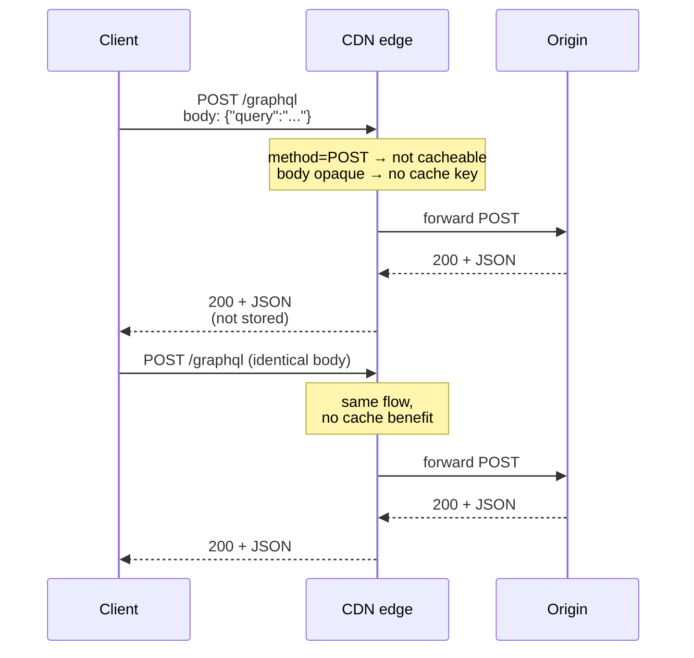
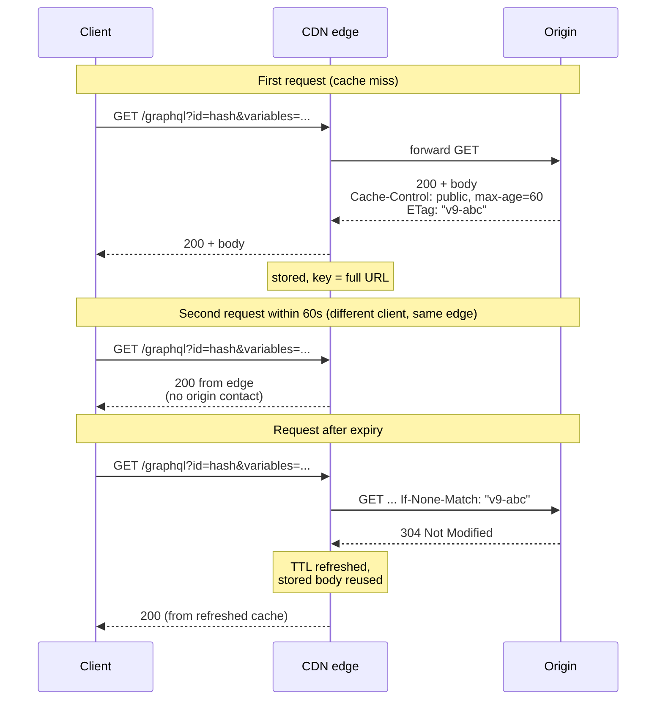
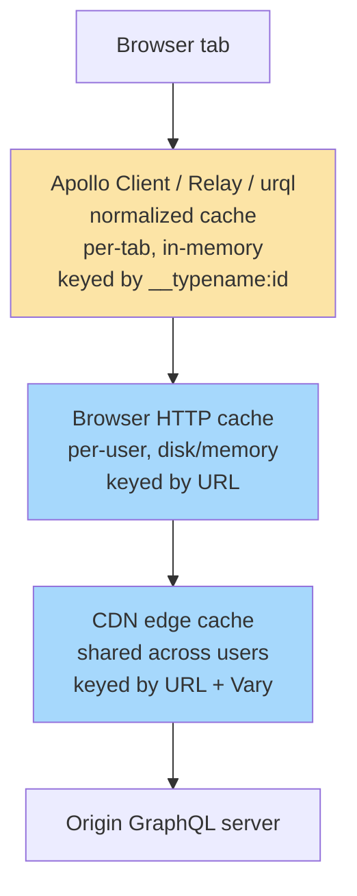

# [BEE-596] GraphQL HTTP-Layer Caching

:::info
GraphQL was not designed around HTTP caching, but it can participate in it. The path runs through GET-via-persisted-queries, response cache directives, and ETag revalidation, and through understanding why naive `POST /graphql` defeats every CDN.
:::

## Context

[BEE-205](../Caching/205.md) treats HTTP caching as the highest-leverage performance improvement available at the protocol layer. `Cache-Control` directives, conditional requests, and shared CDN caches deliver that improvement automatically for REST GET endpoints because the request URL is the natural cache key and GET is cacheable by default under [RFC 9111](https://www.rfc-editor.org/rfc/rfc9111.html).

GraphQL was designed around a different goal: letting clients ask for exactly the data they need from a single typed schema. Its canonical transport, established by convention and codified in the [GraphQL over HTTP](https://github.com/graphql/graphql-over-http) working draft, is `POST /graphql` with the query in the request body. Three properties of that design fight HTTP caching:

1. **POST is not generally cacheable.** RFC 9111 §2 permits caching of methods other than GET only when the method definition explicitly allows it AND a suitable cache key is defined. Browsers and commodity CDNs do not satisfy these conditions for POST. The default GraphQL request hits the disabled path.
2. **The cache key sits in the request body.** A CDN constructs cache keys from the request URL, optionally varied by headers. It does not parse JSON bodies. Two semantically distinct queries arrive at the CDN as identical `POST /graphql` requests with opaque payloads.
3. **Response shape varies per request.** Even for the same logical resource, two queries selecting different field subsets produce different responses. Cache entries fragment along query-shape lines.

Teams routinely deploy GraphQL behind a CDN, observe a hit rate near zero, and either give up on edge caching or reach for the GraphQL client's normalized cache and conflate the two. This article maps the HTTP-layer caching options for GraphQL and where each one stops working.

## Principle

To make GraphQL participate in HTTP caching, the request **MUST** be expressible as a stable, idempotent GET URL, which **SHOULD** be achieved through persisted queries that map a query hash to its registered text. Servers **SHOULD** emit `Cache-Control` and `ETag` headers per response, and clients **SHOULD** revalidate with `If-None-Match`. Teams **MUST NOT** conflate HTTP-layer caching (shared, network-edge, request-scoped) with GraphQL client-side normalized cache (per-client, in-memory, object-scoped). They solve different problems and are not substitutes.

## Why default `POST /graphql` defeats the HTTP cache

Three blockers act simultaneously.

**(a) Method-level cacheability.** RFC 9111 §2 establishes that POST responses may be stored only when the POST method definition explicitly permits caching for that resource and the response carries explicit freshness information. Mainstream CDNs and browser caches do not honor POST cacheability for arbitrary endpoints, so `POST /graphql` is treated as uncacheable by default.

**(b) Cache key resides in the request body.** CDN cache keys are built from the request URL plus headers named in `Vary`. They do not parse JSON request bodies. Two distinct GraphQL queries arrive at the edge as the same `POST /graphql` request with different opaque payloads, with no key entropy a CDN can use to distinguish them.

**(c) Response shape varies per query.** Even if the previous two blockers were solved, the response body for the same logical resource depends on which fields the client selected. This produces cache fragmentation along query-shape lines, addressed in a later section.

A short illustration of what a CDN actually sees:

```http
POST /graphql HTTP/1.1
Host: api.example.com
Content-Type: application/json
Content-Length: 45

{"query":"query { user(id:1) { name } }"}
```

From the CDN's perspective: method is POST so the cache path is disabled; the URL is `/graphql` for every query so there is no cache key entropy; the response carries no `Cache-Control` or `ETag` because the server has no incentive to emit them when nothing downstream will use them.

## GET-via-persisted-queries: making the request URL-addressable

The mechanism that unblocks all three failures is to register the query under a stable hash and address it by URL.

**Hash and registration.** The client computes the SHA-256 of the normalized query text. The server maintains a hash-to-query-text registry. Two registration strategies are common:

- **Build-time allowlist registration.** Every query the client is allowed to send is registered at build or deploy time. Unknown hashes are rejected. Strongest predictability and security; can also serve as a denial-of-service boundary by refusing arbitrary client queries.
- **Runtime auto-persist (round-trip on miss).** The client first sends the hash alone. If the server responds with a `PersistedQueryNotFound` error, the client retries with the full query text plus the hash, and the server registers it. Lower friction, weaker security posture (registration is open to whatever the client sends).

**Wire-level GET shape.** Once a query is registered, the request becomes a pure GET:

```http
GET /graphql?extensions=%7B%22persistedQuery%22%3A%7B%22version%22%3A1%2C%22sha256Hash%22%3A%22abc...%22%7D%7D&variables=%7B%22id%22%3A1%7D HTTP/1.1
```

The URL is now the full cache key. Query identity (via the hash) and arguments (via variables) are both URL-addressable, and a CDN can store and retrieve responses keyed on this URL the same way it handles any REST GET.

**Standards picture.** The GraphQL specification itself is silent on transport. The [GraphQL over HTTP working draft](https://github.com/graphql/graphql-over-http) is the active GraphQL Foundation effort to standardize HTTP transport details, including the requirement that servers `MUST` accept POST and `MAY` accept GET, and the convention that GET parameters are carried in the URL query string in `application/x-www-form-urlencoded` form. The draft does not currently specify a persisted-document protocol; persisted queries remain a server-implementation concern. Apollo's [Automatic Persisted Queries](https://www.apollographql.com/docs/apollo-server/performance/apq) protocol is the de-facto reference implementation. Equivalent functionality is available in [GraphQL Yoga](https://the-guild.dev/graphql/yoga-server/docs/features/response-caching), Hot Chocolate, Mercurius, and Netflix DGS.

Once requests are GET URLs, every standard CDN cache mechanism applies: browser cache, shared CDN cache, `Cache-Control`, `Vary`, and conditional revalidation. The remaining sections build on this foundation.

## Per-response cache directives

When requests are GET, the server can emit `Cache-Control` headers and the CDN will honor them. The question is what value to emit.

**Schema-level cache hints.** The dominant pattern, originated in Apollo and replicated in GraphQL Yoga and other servers, is a schema directive:

```graphql
type Product @cacheControl(maxAge: 300) {
  id: ID!
  name: String!
  price: Float! @cacheControl(maxAge: 30)
  inventory: Int! @cacheControl(maxAge: 5, scope: PRIVATE)
}

type Query {
  product(id: ID!): Product @cacheControl(maxAge: 60)
}
```

**The minimum-across-all-fields rule.** The server walks the resolved response and computes the lowest `maxAge` across all selected fields, plus the strictest scope. Apollo Server's documentation states this directly: "The response's `maxAge` equals the lowest `maxAge` among all fields. The response's `scope` is `PRIVATE` if any field's `scope` is `PRIVATE`."

The query `{ product(id:1) { name } }` produces `Cache-Control: public, max-age=60` (the Query.product hint dominates because the `name` field inherits its parent type's hint, which is 300, and 60 is lower). The query `{ product(id:1) { name inventory } }` produces `Cache-Control: private, max-age=5`. The single PRIVATE inventory field downgrades both axes.

**The scope-downgrade trap.** A single field marked `PRIVATE` (or, depending on server defaults, a field with no hint at all) downgrades the entire response to `Cache-Control: private`. This prevents shared-cache storage entirely, which is the most common reason a notionally cached GraphQL deployment shows zero CDN hit rate. Detection requires logging the emitted `Cache-Control` value per query, not auditing the schema directives in isolation.

## ETag and conditional revalidation in GraphQL

Once responses carry `Cache-Control`, ETag enables free revalidation when entries expire. The mechanism is identical to [BEE-205](../Caching/205.md), applied to a GraphQL URL.

**ETag generation strategies.**

- **Hash the JSON response body.** Cheap, always correct, no domain knowledge required. The cost is that the ETag changes whenever any selected field changes, even fields that downstream consumers do not depend on for cache validity. Recommended default. GraphQL Yoga's response cache plugin emits ETag this way out of the box.
- **Derive from underlying entity versions.** Compose the ETag from version vectors of every entity the resolver touched. More precise: a change to one field on one entity invalidates only the queries that touched that field. Requires entity-version tracking and is complicated by GraphQL's query-shape variance. Worth it only at scale.

**The `If-None-Match` flow.** When a cached entry exceeds its `max-age`, the cache (browser or CDN) sends:

```http
GET /graphql?extensions=...&variables=... HTTP/1.1
If-None-Match: "v9-abc123"
```

If the server's current ETag for that exact query-and-variables combination matches, it returns `304 Not Modified` with no body. The cache refreshes its TTL and serves the stored response. The MDN guide on [conditional requests](https://developer.mozilla.org/en-US/docs/Web/HTTP/Guides/Conditional_requests) describes the same handshake REST clients use; nothing about it is GraphQL-specific once the URL is stable.

**The honest caveat.** A GraphQL 304 means "the response to this exact query shape has not changed." It is coarser than REST's resource-level 304 in one direction: different queries on the same underlying resource do not share revalidation benefit because they have different cache keys and different ETags. It is finer in another direction: a query selecting a stable subset of fields can return 304 even if other fields on the resource changed. Treat this as a property to design around, not a bug.

## Cache fragmentation: the cost of query-shape granularity

A CDN holds one cache entry per `(persisted-query-hash, variables)` tuple. The same logical resource can appear in many cache entries.

If Alice's user record is queried in five distinct query shapes across the application — `{name}`, `{name, email}`, `{name, orders{id}}`, `{name, orders{id, total}}`, and `{name, orders{id, items{name, price}}}` — the CDN holds five cache entries representing one underlying resource. A change to Alice's name invalidates all five.

Three honest approaches address this trade-off, none of them fully eliminating it:

1. **Tagged invalidation.** Stamp each cache entry with a surrogate-key set listing the underlying entities it touched (`surrogate-key: user-1, order-101, order-102`). On write, purge by tag. Requires CDN support for surrogate keys; some commodity CDNs offer this through proprietary headers, others do not. Cleanest solution where supported.
2. **TTL-only acceptance.** Set a short `max-age` and accept that stale data persists until expiry. Operationally simple; trades freshness for engineering effort.
3. **Restrict to a small allowlisted query set.** When the client only sends queries from a build-time-registered allowlist of, say, ten operations, fragmentation is bounded by ten times the cardinality of variables. Composes well with build-time persisted-query registration.

This is a real trade-off. The cost of GraphQL's query-shape flexibility at the cache layer cannot be made to vanish.

## Brief contrast: client-side normalized cache

GraphQL clients (Apollo Client, Relay, urql) maintain a normalized in-memory cache in the browser tab. When a query response arrives, the client decomposes it into individual entities keyed by `__typename` and `id`, stores them in a flat map, and reconstitutes responses for subsequent queries from that map. Two different queries selecting overlapping fields on the same entity share storage and update each other when one of them refetches.

This is a different cache layer from HTTP caching. It is not a substitute.

| Property | HTTP cache (browser + CDN) | Client normalized cache |
|---|---|---|
| Scope | Shared across users (CDN) or per-browser (browser cache) | Per browser tab; dies on reload |
| Cache key | URL (with `Vary` headers) | Entity identity (`__typename:id`) |
| Storage location | Network edge / browser disk | Browser memory inside the GraphQL client |
| Invalidation | TTL (`max-age`), conditional revalidation (`ETag`), CDN purge | Explicit (`cache.evict`, `writeFragment`), or refetch |
| Protects against | Repeat network round-trips for the same URL | Repeat resolution work and prop-drilling within a session |
| Survives page reload | Yes | No |

Both layers can be wrong simultaneously, and both can be right simultaneously. They are complementary. Deep treatment of normalized client cache mechanics is out of scope for this article; it warrants its own future BEE.

## Visual

**V1: `POST /graphql` defeats the CDN.**



**V2: Persisted-query GET with ETag revalidation.**



**V3: HTTP cache vs client normalized cache (layer view).**



The two cache layers are stacked, not alternatives. The yellow layer is client-side; the blue layers are HTTP-layer. The article focuses on blue.

## Example

The same logical operation ("get user 1's name") in three states.

**State A: naive POST (uncacheable).**

```http
POST /graphql HTTP/1.1
Host: api.example.com
Content-Type: application/json

{"query":"query { user(id:1) { name } }"}
```

```http
HTTP/1.1 200 OK
Content-Type: application/json

{"data":{"user":{"name":"Alice"}}}
```

No `Cache-Control`, no `ETag`. The CDN cannot store this response. Every repeat hits the origin.

**State B: same operation as APQ GET, first call (registration round-trip).**

The first call sends only the hash:

```http
GET /graphql?extensions=%7B%22persistedQuery%22%3A%7B%22version%22%3A1%2C%22sha256Hash%22%3A%22abc...%22%7D%7D&variables=%7B%22id%22%3A1%7D HTTP/1.1
Host: api.example.com
```

The server has not seen this hash before:

```http
HTTP/1.1 200 OK
Content-Type: application/json

{"errors":[{"message":"PersistedQueryNotFound","extensions":{"code":"PERSISTED_QUERY_NOT_FOUND"}}]}
```

The client retries with both the hash and the full query text. The server registers the hash. From this point on, the bare-hash GET succeeds:

```http
HTTP/1.1 200 OK
Content-Type: application/json
Cache-Control: public, max-age=60
ETag: "v9-abc"

{"data":{"user":{"name":"Alice"}}}
```

The response is now cacheable at the CDN edge.

**State C: revalidation 60 seconds later.**

```http
GET /graphql?extensions=...&variables=... HTTP/1.1
Host: api.example.com
If-None-Match: "v9-abc"
```

```http
HTTP/1.1 304 Not Modified
ETag: "v9-abc"
Cache-Control: public, max-age=60
```

Zero body bytes. The cache refreshes its TTL and continues serving the stored response.

The progression — uncacheable POST, then cacheable GET with `Cache-Control` and `ETag`, then 304-revalidated cache hit — is the full HTTP-cache integration story for GraphQL.

## Common Mistakes

**1. "We put GraphQL behind a CDN, so it's cached" — but every request is `POST /graphql`.**

The CDN sees POST, refuses to cache, and forwards to the origin. The hit rate stays near zero regardless of how aggressive the CDN's settings are. The fix is persisted queries via GET, or accepting that the CDN is doing TLS termination only.

**2. Confusing client-side normalized cache with HTTP caching.**

The Apollo Client cache holding a result inside one browser tab is not the same thing as a CDN edge serving that result to thousands of users. The two layers protect against different problems and have different lifecycles. A team relying on one when they need the other is surprised when reload, multi-user load, or cross-device usage exposes the gap.

**3. Schema hints downgraded by a single sensitive field.**

A `@cacheControl(maxAge: 300)` on a public type is silently overridden when a query also selects a field with `PRIVATE` scope, or in some servers a field with no hint at all. The minimum-across-all-fields rule produces `Cache-Control: private` and prevents shared-cache storage. Detection requires logging the emitted `Cache-Control` value per query, not assuming the schema configuration is sufficient.

**4. ETag from response body hash with REST-shaped expectations.**

Two clients querying `{user(id:1){name}}` and `{user(id:1){name, email}}` get different responses, different ETags, and no shared revalidation benefit. This is correct behavior for hash-based ETags. Teams accustomed to REST resource-level ETags are surprised. Frame the trade-off explicitly in design discussions; it is a property of the model, not a defect to fix.

**5. Treating auto-persisted queries as a security mechanism.**

APQ in auto-register mode accepts any query the client sends on the registration round-trip. It is a caching mechanism, not an allowlist. Persisted queries as a denial-of-service or query-allowlist boundary requires build-time registration with rejection of unknown hashes, which is an operational topic rather than a caching topic.

## Related BEPs

- [BEE-205](../Caching/205.md) HTTP Caching and Conditional Requests — foundation; assumed prior reading for `Cache-Control` and `ETag` mechanics
- [BEE-74](74.md) GraphQL vs REST vs gRPC — high-level protocol comparison; this article deepens its single bullet on GraphQL caching
- [BEE-485](485.md) GraphQL Federation — adjacent operational concern in the GraphQL family
- [BEE-200](../Caching/200.md) Caching Fundamentals and Cache Hierarchy — TTL and invalidation concepts that underpin this article
- [BEE-304](../Performance and Scalability/304.md) CDN Architecture — how edge nodes consume `Cache-Control` directives
- [BEE-72](72.md) Idempotency in APIs — referenced for context on REST's HTTP-level idempotency mechanisms, which GraphQL must reinvent at the schema layer

## References

- [GraphQL Specification (October 2021)](https://spec.graphql.org/October2021/) — operation types (Query, Mutation, Subscription) and execution semantics; the spec is silent on HTTP transport.
- [GraphQL over HTTP — Working Draft](https://github.com/graphql/graphql-over-http) — GraphQL Foundation Stage-2 draft defining HTTP request/response conventions, including GET method support and `application/x-www-form-urlencoded` parameter encoding.
- [RFC 9111: HTTP Caching, §2 Overview of Cache Operation](https://www.rfc-editor.org/rfc/rfc9111.html#name-overview-of-cache-operation) — establishes that cacheable methods other than GET require both method-level allowance and a defined cache-key mechanism.
- [HTTP caching — MDN Web Docs](https://developer.mozilla.org/en-US/docs/Web/HTTP/Guides/Caching) — `Cache-Control` directives reference (`max-age`, `public`, `private`, `no-store`, `no-cache`, `immutable`).
- [HTTP conditional requests — MDN Web Docs](https://developer.mozilla.org/en-US/docs/Web/HTTP/Guides/Conditional_requests) — `ETag` + `If-None-Match` flow returning `304 Not Modified` with no body.
- [Apollo Server — Server-side caching with `@cacheControl`](https://www.apollographql.com/docs/apollo-server/performance/caching) — schema-directive pattern; the response's `maxAge` equals the lowest among selected fields, and `scope` becomes `PRIVATE` if any field is `PRIVATE`.
- [Apollo Server — Automatic Persisted Queries](https://www.apollographql.com/docs/apollo-server/performance/apq) — SHA-256 hash of query text, GET URL shape with `persistedQuery` extension, `PERSISTED_QUERY_NOT_FOUND` registration round-trip.
- [GraphQL Yoga — Response Caching plugin](https://the-guild.dev/graphql/yoga-server/docs/features/response-caching) — non-Apollo implementation of the `@cacheControl` pattern, with built-in `ETag` and `If-None-Match` → `304 Not Modified` support.
- [graphql-js Issue #3888 — CDN Caching recommendations](https://github.com/graphql/graphql-js/issues/3888) — GraphQL Foundation community discussion of the protocol-level mismatch between GraphQL's POST default and standard CDN GET-based caching.
