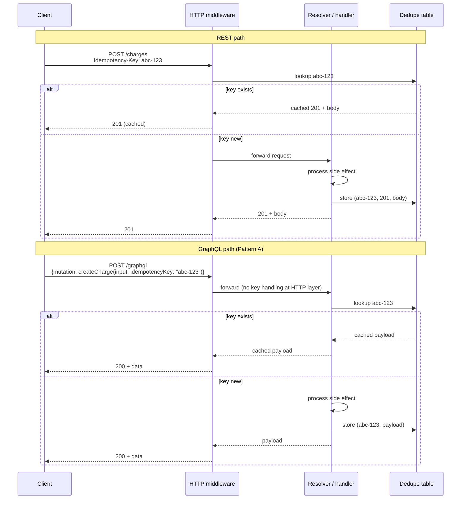
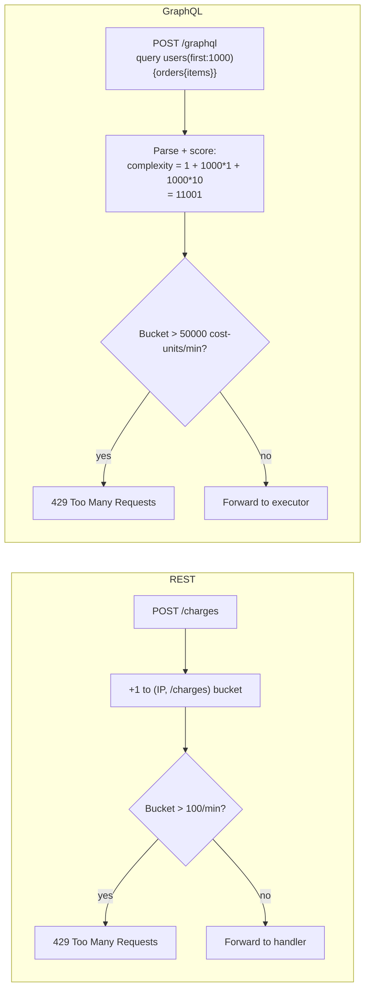

# [BEE-597] GraphQL vs REST: Request-Side HTTP Trade-offs

:::info
REST inherits caching, idempotency, and rate limiting from HTTP itself. GraphQL gets none of them by default and must rebuild each at the schema or middleware layer. This article covers the three request-side gaps and the default mitigations.
:::

## Context

[BEE-596](596.md) established the framing: GraphQL was not designed around HTTP. Its canonical transport is `POST /graphql` with the operation in the request body, served from a single endpoint regardless of which logical resource is being read or mutated. That design buys schema-driven flexibility but spends three things REST gets for free from HTTP itself.

1. A **cacheable URL for every read.** REST's GET URL is the cache key; HTTP intermediaries cache responses without any application code.
2. **Method-level idempotency semantics.** [RFC 9110 §9.2.2](https://httpwg.org/specs/rfc9110.html#idempotent.methods) declares GET, HEAD, OPTIONS, PUT, and DELETE idempotent by definition. Clients and proxies can reason about retry safety from the verb alone, without inspecting the request body.
3. **Per-route rate-limiting affordances.** Gateways limit per IP × URL pattern. The URL is the natural rate-limit key, and cost-per-request is uniform within a route.

A `POST /graphql` request is opaque to any HTTP intermediary on all three axes. The verb tells you nothing about side effects (is this a query or a mutation?); the URL is identical for every operation, so per-route rate limiting collapses; and the cacheability story requires the persisted-query work covered in BEE-596.

The article walks through each request-side gap, shows what teams actually do to close it, and recommends a default per gap. It is not a vendor comparison and not an argument that REST is "better." It is an enumeration of what GraphQL must rebuild and the engineering shape of that rebuild.

## Principle

Teams adopting GraphQL **MUST** implement idempotency, rate limiting, and cacheability as schema-level or middleware-level concerns; HTTP cannot do this work for them. Mutations **SHOULD** carry an idempotency identifier as a schema argument or a middleware-read header. Rate limits **SHOULD** be expressed in units that match the cost of the operation (query complexity points, not request count). Reads that benefit from CDN caching **SHOULD** follow the persisted-query pattern in [BEE-596](596.md). Treating these as transport-layer concerns rather than application-layer concerns leads to deployments that pass code review and fail under load.

## The three gaps at a glance

The rest of the article expands each row of the table below. The internal structure of each section is the same: REST baseline, GraphQL gap, mitigation pattern(s), recommendation.

| Concern | REST inherits from HTTP | GraphQL must build it |
|---|---|---|
| **Cacheable URL** | GET URL is the cache key; ETag/304 free at the edge | Persisted-query GET + `@cacheControl` + ETag (BEE-596) |
| **Idempotency** | RFC 9110 verbs + `Idempotency-Key` header | Idempotency key as schema argument or middleware-read header |
| **Rate limiting** | Per-IP × URL pattern at the gateway | Query depth limit + complexity scoring + per-resolver limits |

## Cacheability of reads

This section is intentionally short. Full treatment of GraphQL HTTP-layer caching lives in [BEE-596](596.md); the goal here is to install the gap in the reader's mind so the next two sections feel like the same shape.

**REST baseline.** A GET URL is the natural cache key. HTTP intermediaries cache for free, and ETag-based revalidation works out of the box.

```http
GET /products/42 HTTP/1.1

HTTP/1.1 200 OK
Cache-Control: public, max-age=300
ETag: "v9-abc"

{"id": 42, "name": "Widget", "price": 4999}
```

A CDN keys the response on the URL, serves it for 300 seconds, then revalidates with `If-None-Match` on the next request after expiry. The application code emits one header per response and benefits from the entire HTTP cache hierarchy.

**GraphQL gap.** The default `POST /graphql` defeats every CDN. Three blockers act simultaneously: POST is not generally cacheable per [RFC 9111 §2](https://www.rfc-editor.org/rfc/rfc9111.html#name-overview-of-cache-operation); the cache key sits in the JSON request body where CDNs cannot read it; and the response shape varies per query. BEE-596 explores each of these in depth.

**Mitigation pattern.** Restore URL-addressability via persisted queries: the client computes a SHA-256 of the normalized query text and sends `GET /graphql?extensions=...&variables=...`. Once the request is GET, schema-level cache hints (the `@cacheControl` directive, replicated across Apollo Server, GraphQL Yoga, and others) drive `Cache-Control` headers, and ETag enables conditional revalidation. The full mechanism, including the cache-fragmentation cost across query shapes, is in BEE-596.

The alternative is to accept that reads will hit origin and skip CDN integration entirely. This is reasonable for low-traffic APIs where the engineering effort would not pay for itself in saved round trips.

**Recommendation.** Default to persisted-query GET for any read served at scale (defined as: read traffic high enough that a CDN hit rate of even 30–40% would meaningfully reduce origin load). For low-traffic reads, accept POST and put the engineering effort elsewhere. Never claim "we have caching" without measuring CDN hit rate per query — the configuration is easy to get wrong, and the failure mode is invisible without instrumentation.

## Idempotency and retry semantics

This is the deepest section. [BEE-72](72.md) covers REST's canonical pattern but does not address GraphQL.

**REST baseline.** [RFC 9110 §9.2.2](https://httpwg.org/specs/rfc9110.html#idempotent.methods) defines GET, HEAD, OPTIONS, PUT, and DELETE as idempotent by their method definition. POST and PATCH are not. For non-idempotent operations, the [Stripe-pioneered `Idempotency-Key` header](https://docs.stripe.com/api/idempotent_requests) lets clients attach a UUID v4 to each operation; the server stores the result against the key for a 24–72 hour window and returns the cached response on retry. The pattern's storage layer is documented in BEE-72: a `(user_id, key)` primary-key table with atomic-insert handling for concurrent duplicates.

The IETF httpapi working group has been standardizing the header field as [`draft-ietf-httpapi-idempotency-key-header`](https://datatracker.ietf.org/doc/draft-ietf-httpapi-idempotency-key-header/), most recently revision -07 in October 2025. The draft is currently expired and has not progressed to RFC, so the field remains a de-facto convention rather than a formal standard, even though the engineering pattern is well-established.

The crucial property: in REST, the header is invisible to application code in many frameworks. Middleware reads `Idempotency-Key`, looks up the dedupe table, and either short-circuits with the cached response or forwards to the handler. Application authors do not need to design idempotency into every endpoint.

**GraphQL gap.** Four facts shape the gap:

1. The GraphQL specification says queries SHOULD be side-effect-free. This is convention, not enforcement; a schema author can write a side-effecting query resolver and the spec will not stop them.
2. Mutations may have side effects. The spec is silent on idempotency, retry semantics, and deduplication.
3. Multiple mutations in a single request execute *sequentially*, per the spec — but this gives partial atomicity only *within* a single request, not across requests or retries.
4. The HTTP `Idempotency-Key` header is invisible to GraphQL resolvers in most server libraries unless the team specifically wires middleware to read it.

The consequence: every team adopting GraphQL must engineer idempotency themselves. There is no spec-level or framework-level default, and the de-facto IETF draft for the header field cannot help without explicit server-side wiring.

**Pattern A: idempotency key as a mutation argument.** The dominant approach. The mutation declares the key as part of its signature:

```graphql
mutation CreateOrder($input: OrderInput!, $idempotencyKey: ID!) {
  createOrder(input: $input, idempotencyKey: $idempotencyKey) {
    id
    status
  }
}
```

The resolver checks an in-storage dedupe table keyed on `idempotencyKey`. On a hit, it returns the cached payload without re-executing the side effect. On a miss, it executes the mutation, stores the result, and returns it. The storage layer is the same one BEE-72 specifies for REST.

Strengths: the contract is schema-explicit and visible in introspection, every consumer sees the requirement, and the pattern works over any transport including WebSocket subscriptions. Weakness: every mutation must carry the argument from day one. Retrofitting an existing GraphQL API is invasive because every client and every mutation signature changes.

**Pattern B: HTTP `Idempotency-Key` header read by middleware.** A secondary approach that mirrors the REST pattern. The client sends the key in an HTTP header alongside the GraphQL request:

```http
POST /graphql HTTP/1.1
Idempotency-Key: 550e8400-e29b-41d4-a716-446655440000
Content-Type: application/json

{"query":"mutation { createOrder(input: {...}) { id } }"}
```

Server middleware reads the header before invoking the executor; on a key miss, it executes the operation and writes through to the dedupe table. On a hit, it returns the cached HTTP response without invoking the resolver.

Strengths: the mental model matches REST, no schema change is required, and a team running both REST and GraphQL can adopt one middleware that covers both surfaces. Weaknesses: the contract is invisible from the schema (a developer reading the SDL has no signal that idempotency is wired up), the pattern only works when the server is HTTP-fronted and not over WebSocket subscriptions or Server-Sent Events, and the dedupe granularity is per-request rather than per-mutation. A single GraphQL request carrying multiple sequential mutations gets one key for all of them, which silently breaks the retry contract for the inner mutations.



**Recommendation.** Default to Pattern A (schema argument) for any mutation that creates non-idempotent side effects. The schema-explicit contract pays for itself in code review and onboarding clarity. Reserve Pattern B for retrofit scenarios where amending every mutation signature is cost-prohibitive — for example, a large existing GraphQL surface migrating from no-idempotency to idempotency without breaking clients. Either way, reuse the BEE-72 dedupe table; do not invent a new storage layer for GraphQL idempotency. Multi-mutation requests need one key per mutation argument (Pattern A handles this naturally) rather than one key for the entire request (Pattern B's failure mode).

## Rate limiting

This is the dimension where the GraphQL gap most often produces production incidents.

**REST baseline.** Gateways enforce rate limits per IP × URL pattern, returning `429 Too Many Requests` with a `Retry-After` header when a client exceeds the budget. Cost-per-request is roughly uniform within a route — `GET /products/:id` does about the same work each time — so a rate limit of "100 requests per minute per IP" maps to a predictable origin-load envelope. The unit (requests-per-window) and the cost-per-unit (one route's worth of work) align.

**GraphQL gap.** Every request is `POST /graphql`, so per-route limiting collapses to "per-IP requests per minute" with no further granularity. A per-IP limit of 100 requests per minute does not protect the origin because one expensive query can do the work of thousands of requests. A worst-case query:

```graphql
query {
  users(first: 1000) {
    orders(first: 100) {
      items(first: 50) {
        product {
          reviews(first: 100) {
            author {
              followers(first: 100) { name }
            }
          }
        }
      }
    }
  }
}
```

One HTTP request, potentially billions of resolver invocations. The request-counting rate limiter says "fine, you've used 1 of 100." The database falls over.

**Layer 1: query depth limit.** Reject queries deeper than N levels at parse time. Cheap, blunt, catches obvious abuse — the example above has depth 7. Default values of 10–15 cover most legitimate schemas. Plugins ship with most server libraries: Apollo Server, GraphQL Yoga via Envelop, and the standalone [graphql-armor](https://github.com/Escape-Technologies/graphql-armor) library that wraps multiple servers.

**Layer 2: query complexity scoring.** The load-bearing layer. Each field is annotated with a cost; the parser sums the cost across the resolved query and rejects if it exceeds a budget. The directive pattern, popularized by IBM's GraphQL Cost Directive specification and adopted by Apollo's [Demand Control](https://www.apollographql.com/docs/graphos/routing/security/demand-control) feature, looks like this:

```graphql
type Query {
  users(first: Int!): [User!]! @cost(complexity: 1, multipliers: ["first"])
  product(id: ID!): Product @cost(complexity: 5)
}

type User {
  orders(first: Int!): [Order!]! @cost(complexity: 1, multipliers: ["first"])
}
```

A `users(first: 1000) { orders(first: 100) { items } }` query would score in the millions and be rejected. Frame this as the GraphQL analog of REST's per-IP requests per minute: the unit is *cost units per minute per IP*, not requests.

The pattern has been productionized at scale. [GitHub's public GraphQL API](https://docs.github.com/en/graphql/overview/rate-limits-and-query-limits-for-the-graphql-api) caps each user at 5,000 points per hour with a secondary 2,000-points-per-minute throttle. Their cost formula sums the requests needed to fulfill each unique connection (assuming `first` and `last` arguments hit their maximums), divides by 100, and rounds to the nearest whole number, with a minimum of 1 point per query. A real-world query in their docs scores 51 points.



The critical implementation point: set the budget by *measuring your existing query catalog's cost distribution*, not by guessing. Run the cost analyzer over production query logs, then set the per-window budget at the 99th percentile of legitimate cost-per-window plus a safety margin. Adjust as the catalog evolves.

Library options are mature. Apollo's Demand Control covers Apollo Server and the Apollo Router. graphql-armor provides query-cost, depth, and rate-limit plugins that work across Apollo Server, GraphQL Yoga, and Envelop-based servers. The Envelop ecosystem ships `useResourceLimitations` for cost analysis independent of any specific server library.

**Layer 3: per-resolver rate limiting.** Specific expensive fields — search, ML inference, anything that calls an external API — get their own limits independent of overall query cost. Use the same backend (Redis token bucket) as your REST rate limiter; just key by `(user, field)` instead of `(user, route)`. This layer is scalpel-targeted at known-expensive operations that the cost score may underestimate.

**Recommendation.** All three layers stack. Depth limit catches accidental cycles cheaply (default 10–15). Complexity scoring is the load-bearing layer; pick the budget by measurement. Per-resolver limits handle the fields that fall outside the cost model. A per-IP request rate limit is still useful as a coarse outer envelope but does not replace any of the above. Persisted-query allowlists (deferred to a future article on operational patterns) bound the worst case but only work when the client surface is fully under your control. For public APIs accepting arbitrary client queries, layers 1 through 3 are mandatory; for internal APIs with a known client set, persisted-query allowlists can replace layers 1 and 2 and leave only layer 3 for known-expensive fields.

## Common Mistakes

**1. Treating per-IP request rate limits as adequate protection for GraphQL.**

A `100 requests/minute/IP` limit lets one bad actor send 100 maximum-complexity queries per minute. Each can do the work of a thousand REST requests. Throughput-based dashboards look fine; CPU and database connection pools alarm. The fix is a complexity-scored budget (Layer 2 above) plus per-resolver limits on the fields the cost model under-estimates.

**2. Implementing GraphQL idempotency in a separate storage layer from REST.**

Teams running both protocols often build a second dedupe table for GraphQL mutations, splitting operations on the same logical entity (e.g., "create charge") across two storage paths. Use one table (BEE-72), keyed on whatever identifier the client sends, regardless of transport. The storage layer has nothing to do with the protocol; the only difference is how the key arrives.

**3. Reading `Idempotency-Key` from HTTP headers without considering multi-mutation requests.**

Pattern B treats one HTTP request as one idempotent unit. A single GraphQL request can carry multiple sequential mutations. Replay-protecting only the outer request leaves the inner mutations re-executable on retry, which silently breaks the contract for any consumer that expected per-mutation idempotency. Either reject multi-mutation requests at the middleware boundary, or fall back to Pattern A for those operations.

**4. Setting a query complexity budget without measuring the existing query catalog.**

Picking a budget number out of the air either rejects legitimate dashboards or admits abusive queries, depending on which side you erred on. Run the cost analyzer over your existing client queries first; set the budget at the 99th percentile of legitimate cost-per-window plus a safety margin. Re-measure as the schema and client surface evolve.

**5. Equating "we serve GraphQL over HTTP" with "we benefit from HTTP infrastructure."**

Cloudflare, CloudFront, or Akamai sit in front of the GraphQL endpoint; the team checks the box "we have a CDN and a WAF." Neither helps with the gaps in this article. The CDN does not cache POST. The WAF can rate-limit per IP but cannot score query cost. HTTP infrastructure is necessary; it is not sufficient. Plan the schema-layer and middleware-layer work explicitly.

## Related BEPs

**Caching cluster:**

- [BEE-596](596.md) GraphQL HTTP-Layer Caching — full treatment of the caching gap; this article references it
- [BEE-205](../Caching/205.md) HTTP Caching and Conditional Requests — REST baseline
- [BEE-74](74.md) GraphQL vs REST vs gRPC — high-level decision tree

**Idempotency cluster:**

- [BEE-72](72.md) Idempotency in APIs — REST canonical treatment; this article reuses its dedupe-table schema and concurrent-duplicate handling
- [BEE-473](../Distributed Systems/473.md) Idempotency Key Implementation Patterns — practical implementation patterns
- [BEE-261](../Resilience and Reliability/261.md) Retry Strategies and Exponential Backoff — client-side complement

**Rate-limiting cluster:**

- [BEE-266](../Resilience and Reliability/266.md) Rate Limiting and Throttling — algorithm reference (token bucket, sliding window)
- [BEE-449](../Distributed Systems/449.md) Distributed Rate Limiting Algorithms — distributed implementation concerns
- [BEE-402](../Multi-Tenancy/402.md) Tenant-Aware Rate Limiting and Quotas — multi-tenant analog

## References

- [GraphQL Specification (October 2021)](https://spec.graphql.org/October2021/) — operation types (Query, Mutation, Subscription) and execution semantics; the spec is silent on idempotency, rate limiting, and HTTP transport.
- [GraphQL over HTTP — Working Draft](https://github.com/graphql/graphql-over-http) — GraphQL Foundation Stage-2 draft; addresses GET method support and parameter encoding, silent on idempotency and rate limiting.
- [RFC 9110 §9.2.2 — Idempotent Methods](https://httpwg.org/specs/rfc9110.html#idempotent.methods) — defines GET, HEAD, OPTIONS, PUT, DELETE as idempotent by method definition.
- [RFC 9111 §2 — Overview of Cache Operation](https://www.rfc-editor.org/rfc/rfc9111.html#name-overview-of-cache-operation) — establishes that cacheable methods other than GET require both method-level allowance and a defined cache-key mechanism.
- [Stripe — Idempotent Requests](https://docs.stripe.com/api/idempotent_requests) — pioneering practical reference for the `Idempotency-Key` header and 24-hour TTL.
- [IETF httpapi WG — `draft-ietf-httpapi-idempotency-key-header-07`](https://datatracker.ietf.org/doc/draft-ietf-httpapi-idempotency-key-header/) — in-progress IETF standardization of the header field; revision -07 from October 2025 is currently expired, indicating the field remains a de-facto convention.
- [Apollo GraphOS — Demand Control](https://www.apollographql.com/docs/graphos/routing/security/demand-control) — Apollo's query cost analysis feature, based on the IBM GraphQL Cost Directive specification.
- [graphql-armor (Escape Technologies)](https://github.com/Escape-Technologies/graphql-armor) — MIT-licensed, actively maintained vendor-neutral middleware providing depth limit, complexity scoring, and rate limiting across Apollo Server, GraphQL Yoga, and Envelop-based servers.
- [Envelop — useResourceLimitations plugin](https://the-guild.dev/graphql/envelop/plugins/use-resource-limitations) — non-Apollo cost analysis and rate limiting via The Guild's plugin system used by GraphQL Yoga.
- [GitHub Docs — Rate limits and query limits for the GraphQL API](https://docs.github.com/en/graphql/overview/rate-limits-and-query-limits-for-the-graphql-api) — production reference: 5,000 points per hour per user, 2,000 points per minute secondary limit, public cost calculation formula.
