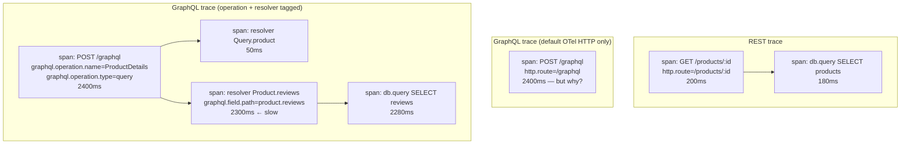
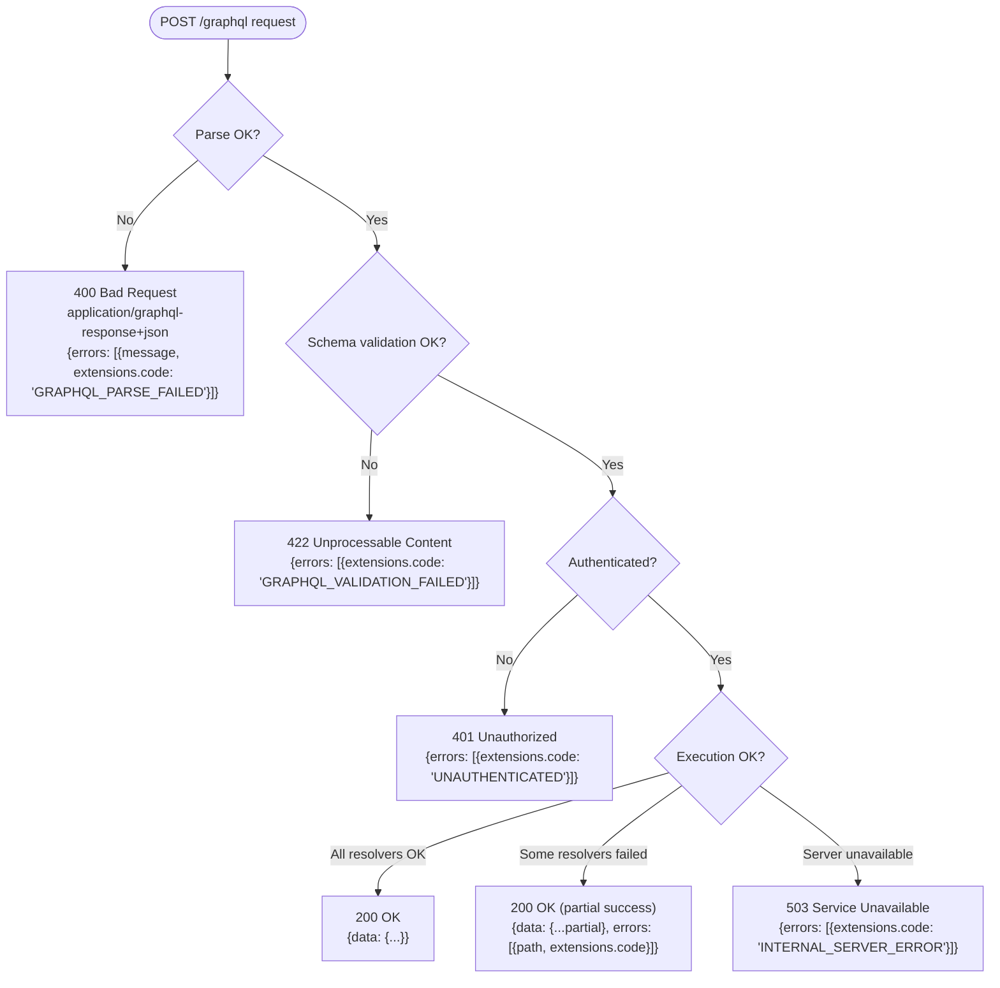

# [BEE-598] GraphQL vs REST: Response-Side HTTP Trade-offs

:::info
REST inherits status-code-driven errors, per-route observability, and URL-based authorization from HTTP itself. GraphQL collapses all three to a single endpoint and must rebuild each at the schema or middleware layer. This article covers the three response-side gaps and the default mitigations.
:::

## Context

[BEE-597](597.md) covered the request-side gaps where REST inherits HTTP infrastructure and GraphQL must rebuild it. This article covers the response-side counterpart. The same thesis applies: a single `POST /graphql` endpoint collapses three things HTTP delivers to REST for free.

1. **Status-code-driven error semantics.** REST signals failure category through HTTP status codes. Every HTTP-aware tool in the stack (load balancers, monitoring dashboards, CDN logs, client retry libraries) relies on this signal. GraphQL's default response is `200 OK` regardless of whether the operation succeeded, with errors reported in a JSON `errors[]` array inside the response body.
2. **Per-route observability.** REST's URL pattern is the natural label for metrics, traces, and logs (`http.route="/api/products/:id"`). GraphQL traffic appears at one URL — `POST /graphql` — so the natural label collapses, and per-operation insight requires schema-aware instrumentation that emits operation name, field-level spans, and resolver-level latency separately.
3. **URL-based authorization.** REST gateways enforce ACLs and RBAC policies per URL pattern, often without invoking application code. GraphQL has one URL, so authorization moves into the schema: each field can have its own visibility and access rules, evaluated per-resolver per-request.

The article walks each gap, shows what teams actually do, and recommends a default per gap. It is not a vendor comparison and not an argument that REST is "better." It enumerates what GraphQL must rebuild and the engineering shape of that rebuild.

## Principle

Teams adopting GraphQL **MUST** implement error signaling, observability, and authorization as schema-level or middleware-level concerns. HTTP intermediaries cannot do this work for them. Error responses **SHOULD** map application-level failure categories to HTTP status codes per the [GraphQL over HTTP](https://github.com/graphql/graphql-over-http) draft, and **SHOULD** carry machine-readable error codes in the `errors[].extensions.code` field analogous to REST's [Problem Details](https://www.rfc-editor.org/rfc/rfc9457.html) ([BEE-75](75.md)). Observability **MUST** tag every span and metric with the GraphQL operation name; the URL `/graphql` carries no information. Authorization **SHOULD** be enforced at the resolver layer using a declarative directive or a centralized policy engine, never at the URL layer alone.

## The three gaps at a glance

The rest of this article expands each row of the table below. Each section follows the same internal structure: REST baseline, GraphQL gap, mitigation patterns, recommendation.

| Concern | REST inherits from HTTP | GraphQL must build it |
|---|---|---|
| **Error semantics** | HTTP status code + RFC 9457 Problem Details (BEE-75) | GraphQL-over-HTTP status code mapping + `errors[].extensions.code` + partial-success contract |
| **Observability** | Per-route metrics, traces, logs labeled by URL pattern | Operation-name tagging + per-resolver spans + schema-aware metrics |
| **Authorization** | URL/method ACLs at the gateway (RBAC/ABAC) | Schema directives + centralized policy engine + per-resolver enforcement |

## Observability

**REST baseline.** The URL pattern is the natural label. `http.route="/products/:id"` is the standard span attribute defined by W3C HTTP semantic conventions and emitted by every OpenTelemetry HTTP instrumentation library. One label scopes metrics, traces, and logs simultaneously. Per-route latency dashboards are a default, not a project. See [BEE-322](../Observability/322.md) for the W3C trace context and span model that all of this builds on.

**GraphQL gap.** All traffic at one URL. Default OTel HTTP instrumentation produces a single span labeled `POST /graphql` for every request. Latency dashboards show "GraphQL is slow today" with no further granularity. Distributed traces lose the per-operation view that lets you locate the slow query.

Three derived problems:

1. **Operation indistinguishability.** Without operation-name tagging, `mutation CreateOrder` and `query DashboardData` appear identical in metrics.
2. **Resolver-level invisibility.** Per-route latency does not reveal that 90% of the time was spent in one nested resolver fanning out to a slow downstream service.
3. **Persisted-query opacity.** Persisted-query GETs ([BEE-596](596.md)) make the URL even less useful. `/graphql?id=hash` is a label for one query, but only if the observability stack maps hashes back to operation names.

**Layer 1: Operation-name tagging.** The [OpenTelemetry Semantic Conventions for GraphQL](https://opentelemetry.io/docs/specs/semconv/graphql/graphql-spans/) define three Recommended span attributes (currently in Development status): `graphql.document`, `graphql.operation.name`, and `graphql.operation.type` (well-known values: `query`, `mutation`, `subscription`). Server middleware reads the operation name from the request and adds these attributes at the request span boundary. Apollo Server's tracing plugin and the Envelop ecosystem's [`@envelop/opentelemetry`](https://the-guild.dev/graphql/envelop/plugins/use-open-telemetry) plugin both implement this pattern.

**Layer 2: Per-resolver spans.** The OTel semconv currently standardizes only operation-level attributes; per-resolver tracing is left to the implementation. Apollo Server's traces produce one span per resolved field with attributes for type, field, and arguments; the Envelop OpenTelemetry plugin can be configured to emit similar resolver spans. The cost is non-trivial because wrapping every resolver invocation has measurable overhead, so production deployments typically sample at the operation level: full per-resolver spans on N% of requests, operation-level spans on the rest.



The middle pane shows what default OTel HTTP instrumentation captures: one span, no useful labels, no causality. The bottom pane shows the same request after operation-name tagging and per-resolver wrapping.

**Layer 3: Schema-aware metrics.** Counters and histograms keyed on `graphql.operation.name` rather than HTTP route. Plus a separate "slow resolver" alert: histogram of per-resolver latency keyed on the field path attribute (vendor-specific until the OTel semconv extends to per-resolver attributes).

**Recommendation.** Layer 1 (operation-name tagging) is non-negotiable. Without it, GraphQL observability is roughly useless because every span carries the same label. Layer 2 (per-resolver spans) ships sampled. 1–10% of operations get full resolver tracing; the rest get operation-level spans only. Layer 3 (schema-aware metrics) replaces per-route histograms with per-operation histograms; the dashboard layout that worked for REST mostly translates if the label dimension is `graphql.operation.name` instead of `http.route`. Persisted-query deployments need a hash-to-operation-name lookup table maintained by the build pipeline; without it, observability dashboards show opaque hashes and the operation-name tagging buys nothing.

## Authorization granularity

**REST baseline.** Authorization at the URL/method layer. Gateway-level RBAC ([BEE-14](../Authentication and Authorization/14.md)) maps `(role, URL pattern, method)` to allow/deny, often without invoking application code. ABAC policies (Open Policy Agent, AWS Verified Permissions) evaluate `(subject, resource, action)` at the gateway. Resource ownership checks happen in the handler. The two layers compose: the gateway gates by role; the application gates by ownership. See [BEE-10](../Authentication and Authorization/10.md) for the AuthN-vs-AuthZ baseline.

**GraphQL gap.** All traffic at one URL means gateway-level URL/method ACLs collapse. The only meaningful gateway gate is "is the user authenticated for the GraphQL endpoint at all?" Everything finer must be enforced inside the schema.

Three derived problems:

1. **Field-level visibility.** A `User` type with both `email` (sensitive) and `name` (public) cannot be controlled by a URL ACL — both arrive through the same `POST /graphql`.
2. **Per-argument access rules.** `query { users(filter: {role: "admin"}) }` may be allowed for some users but not others, depending on filter arguments. URL patterns cannot express this.
3. **N+1 on per-resolver authorization checks.** A query selecting 100 entities, each with 10 protected fields, naively performs 1,000 authorization checks per request unless the policy engine is batched or operates at the operation level instead of per-resolver.

**Pattern A: Schema directives.** Declarative `@auth(requires: ROLE_ADMIN)` directives on fields. Apollo Server, [graphql-shield](https://github.com/dimatill/graphql-shield) (a long-standing GraphQL middleware-based permissions library), and graphql-armor all implement this. The directive is enforced by middleware before the resolver runs.

```graphql
type Query {
  users: [User!]! @auth(requires: ROLE_ADMIN)
  publicProducts: [Product!]!
}

type User {
  id: ID!
  name: String!                                       # public
  email: String! @auth(requires: ROLE_SELF_OR_ADMIN)  # sensitive
}
```

Schema-explicit, introspection-visible. Limitation: directive arguments are static. Dynamic policies (e.g., "only the resource owner can read this field") still need imperative checks in the resolver.

**Pattern B: Centralized policy engine.** A resolver wrapper or middleware delegates authorization decisions to a policy engine. [Open Policy Agent's GraphQL integration](https://www.openpolicyagent.org/docs/graphql-api-authorization) takes a different tack from per-resolver wrapping: the GraphQL server sends the entire query (schema + query text + user identity + variables) to OPA's `/v1/data/graphqlapi/authz` endpoint per request. OPA parses the query into an AST in Rego using `graphql.parse()`, traverses it, and returns one allow/deny decision for the whole operation. AWS Verified Permissions and Cerbos offer similar centralized models.

Pros: consistency across REST and GraphQL surfaces, audit-friendly, supports complex ABAC. Cons: more infrastructure; the per-operation OPA call still adds latency, mitigated by policy result caching keyed on the query hash and user identity. The per-operation OPA pattern sidesteps the per-resolver N+1 issue entirely; per-resolver policy wrappers (the pattern Pattern A directives use under the hood) require batch evaluation to avoid it.

**Pattern C: Per-resolver imperative checks.** Each resolver embeds its own auth logic. Easiest to start, hardest to audit. Acceptable for small APIs; becomes unmaintainable past ~50 mutations.

**Recommendation.** Default to Pattern A (schema directives) for static role checks. Schema directives surface the access policy in introspection and code review, and the directive-based enforcement runs once during query analysis rather than per-resolver-invocation. Layer Pattern B (centralized policy engine) on top for any dynamic policy that depends on resource attributes; OPA's per-operation pattern is the cleanest fit for centralized policies because it avoids the per-resolver N+1 problem by design. Reserve Pattern C (per-resolver imperative) for genuinely one-off cases. One implementation detail matters: any per-resolver policy engine must support batch evaluation (one call with N field-resource pairs, not N calls); without batching, the N+1 authorization problem will be the article's first production incident.

## Error semantics

**REST baseline.** HTTP status code is the canonical failure signal: 4xx for client errors, 5xx for server errors, with [RFC 9457 Problem Details](https://www.rfc-editor.org/rfc/rfc9457.html) ([BEE-75](75.md)) providing the machine-readable error body in the `application/problem+json` media type. The status code drives every HTTP-aware tool: load balancer health checks, retry libraries, monitoring dashboards, CDN logs. The body provides field-level detail and a correlation ID. The two channels — status code for category, body for detail — are the contract HTTP infrastructure depends on.

**GraphQL gap.** Default behavior is `200 OK` regardless of failure mode, with errors in `data.errors[]`. This is the same "200 with success flag in body" anti-pattern BEE-75 calls out as the most damaging error-handling mistake, because it breaks every HTTP-aware tool simultaneously.

Three sub-problems compound:

1. **HTTP infrastructure cannot see failures.** Load balancers see all-200 traffic; monitoring sees all-200 traffic; client retry libraries do not trigger. The CDN cheerfully caches the error response (if it is cacheable) and serves it as the success path.
2. **Errors are not standardized at the schema level.** The GraphQL specification defines `message` and `path`; everything else is server-defined `extensions`. Common conventions exist (Apollo Server's `extensions.code` field, with codes like `BAD_USER_INPUT` and `INTERNAL_SERVER_ERROR`) but they are not part of the spec.
3. **Partial-success is uniquely GraphQL.** A query selecting 10 fields can succeed for 7 and fail for 3. The response carries both `data` (with 7 populated, 3 null) and `errors[]` (3 entries pointing to the failed paths). REST has no analog except HTTP 207 Multi-Status, which is rarely used.

**Mitigation A: GraphQL-over-HTTP status code mapping.** The [GraphQL over HTTP working draft](https://github.com/graphql/graphql-over-http) defines per-failure-category status codes for the `application/graphql-response+json` media type. Clients opt in by sending `Accept: application/graphql-response+json` and get differentiated status codes; clients sending `Accept: application/json` get the legacy all-200 behavior for backward compatibility. The selection is by client Accept header, not automatic protocol detection.

The draft specifies (paraphrased from the Status Codes section):

| Failure | HTTP status code |
|---|---|
| Successful execution (including partial success) | 200 |
| Document parse failure | 400 |
| Document validation failure | 422 (Unprocessable Content) |
| Authentication required | 401 / 403 / similar |
| Unsupported media type in `Accept` | 415 |
| Server unable to process (overload, maintenance) | 503 |

Apollo Server 4+, GraphQL Yoga, and Mercurius implement this content-negotiation behavior.



**Mitigation B: `extensions.code` conventions.** Independent of HTTP status, every error in `errors[]` should carry a stable machine-readable code in `extensions.code`. This is the GraphQL analog of [RFC 9457's `type` URI and `errors[].code`](75.md). [Apollo Server's defaults](https://www.apollographql.com/docs/apollo-server/data/errors) include `GRAPHQL_PARSE_FAILED`, `GRAPHQL_VALIDATION_FAILED`, `BAD_USER_INPUT`, `PERSISTED_QUERY_NOT_FOUND`, `OPERATION_RESOLUTION_FAILURE`, `BAD_REQUEST`, and `INTERNAL_SERVER_ERROR`. Application-level codes like `UNAUTHENTICATED`, `FORBIDDEN`, `INSUFFICIENT_FUNDS`, or `ORDER_ALREADY_SHIPPED` are application-defined conventions; Apollo's defaults do not include them. Treat codes like API paths: stable, documented, never changed once published.

**Mitigation C: Partial-success handling.** GraphQL's distinctive failure mode, with no clean REST analog. Best practice:

- Return as much `data` as resolvable; null out failed fields.
- Each null in `data` MUST correspond to an entry in `errors[]` with a `path` array pointing to the null location.
- Clients MUST check `errors[]` even when `data` is non-null and looks complete.
- Critical fields should be marked non-nullable in the schema (`String!` not `String`). A non-nullable field's failure propagates upward to the nearest nullable ancestor and nulls the whole subtree, communicating "this part of the response is unusable."
- In a federated GraphQL setup (multiple subgraphs joined by a router), errors from one subgraph propagate to the federated response in `errors[]` for that subgraph's fields; the rest of the response continues. The exact propagation behavior is router-specific.

**Recommendation.** Adopt the GraphQL-over-HTTP status code mapping for new APIs and during major version bumps; the operational benefit is recovering the HTTP-aware tools (load balancers, monitoring, retries, CDN logs) that the legacy 200-only behavior disables. Always emit `extensions.code` on every error. Make it a server-middleware default that no resolver can bypass. Design schemas with deliberate non-null usage: critical, must-have fields are non-null; partial-success-friendly fields are nullable. For partial-success responses, document the contract explicitly: clients must inspect `errors[]` regardless of `data` shape. Cross-link to BEE-75 for the REST treatment of error design. The principles transfer; only the wire format differs.

## Common Mistakes

**1. Returning `200 OK` from `POST /graphql` when the request fundamentally failed.**

Parse errors, schema validation errors, authentication failures — all return 200 with an `errors[]` body in the legacy convention. Every HTTP-aware tool sees success: load balancer health checks pass, monitoring dashboards show green, client retry libraries do not trigger, the CDN may even cache the error. Adopt the GraphQL-over-HTTP status code mapping (400 for parse, 422 for validation, 401/403 for auth, 503 for server unavailable, 200 only for executed operations including partial success) and serve `application/graphql-response+json` to opt-in clients.

**2. Treating `extensions.code` as optional or inventing per-error codes ad hoc.**

A non-standardized error code surface is unparseable by client retry logic. Adopt a closed vocabulary at the server level (the Apollo defaults plus your application-specific extensions like `UNAUTHENTICATED`, `FORBIDDEN`, `INSUFFICIENT_FUNDS`), document it like API paths, and never change codes once published. Treat the absence of `extensions.code` on any error as a code review failure.

**3. Default OTel HTTP instrumentation as the entire observability story.**

With only HTTP-level instrumentation, every span is labeled `POST /graphql`. Latency dashboards show the 99th percentile of "GraphQL" with no further dimension. The GraphQL operation name MUST be added as a span attribute (`graphql.operation.name`) at the server boundary; without it, observability is nominally present but practically unusable.

**4. Field-level authorization implemented only in resolvers, with no batch evaluation.**

A query selecting 100 entities, each with 10 protected fields, performs 1,000 sequential authorization checks per request. Latency goes up linearly with response size. Either use a directive-based scheme (Pattern A) that runs at parse time before resolution, switch to a per-operation policy engine (OPA's GraphQL integration evaluates the whole query once), or wire the per-resolver policy engine for batch evaluation. Per-field synchronous policy calls are the GraphQL authorization N+1 problem.

**5. Forgetting that partial-success responses still need clients to inspect `errors[]`.**

A non-null `data` field plus a non-empty `errors[]` is GraphQL's standard success-with-degradation signal. Clients that only check `data != null` silently render incorrect or partial information to users. The contract MUST be documented at the API level: clients always inspect `errors[]`, regardless of `data` shape; nulls in `data` correspond to entries in `errors[]` keyed by `path`.

## Related BEPs

**Error semantics cluster:**

- [BEE-75](75.md) API Error Handling and Problem Details — REST canonical treatment; this article references its anti-pattern enumeration directly
- [BEE-72](72.md) Idempotency in APIs — RFC 9110 verb semantics underlie REST status codes
- [BEE-597](597.md) GraphQL vs REST: Request-Side HTTP Trade-offs — sibling article (rate limiting section discusses 429 + Retry-After)

**Observability cluster:**

- [BEE-322](../Observability/322.md) Distributed Tracing — W3C trace context, span model, sampling
- [BEE-321](../Observability/321.md) Structured Logging — correlation IDs, JSON log format
- [BEE-320](../Observability/320.md) The Three Pillars: Logs, Metrics, Traces — framework foundation

**Authorization cluster:**

- [BEE-10](../Authentication and Authorization/10.md) Authentication vs Authorization — definitional baseline
- [BEE-14](../Authentication and Authorization/14.md) RBAC vs ABAC Access Control Models — REST authorization patterns
- [BEE-12](../Authentication and Authorization/12.md) OAuth 2.0 and OpenID Connect — token-based auth context
- [BEE-499](../Security Fundamentals/499.md) Broken Object Level Authorization (BOLA) — adjacent security concern

## References

- [GraphQL Specification (October 2021)](https://spec.graphql.org/October2021/) — operation types (Query, Mutation, Subscription); spec defines `errors[]` with `message`, `path`, `extensions`; spec is silent on HTTP transport.
- [GraphQL over HTTP — Working Draft](https://github.com/graphql/graphql-over-http) — defines the per-failure-category status code mapping for `application/graphql-response+json` (parse → 400, validation → 422, server unavailable → 503, etc.); legacy `application/json` keeps all-200 behavior.
- [RFC 9457 — Problem Details for HTTP APIs](https://www.rfc-editor.org/rfc/rfc9457.html) — the REST baseline for machine-readable error bodies via `application/problem+json`.
- [RFC 9110 — HTTP Semantics](https://httpwg.org/specs/rfc9110.html) — status code categories and method-level semantics.
- [Apollo Server — Error Handling](https://www.apollographql.com/docs/apollo-server/data/errors) — default `extensions.code` set: GRAPHQL_PARSE_FAILED, GRAPHQL_VALIDATION_FAILED, BAD_USER_INPUT, PERSISTED_QUERY_NOT_FOUND, OPERATION_RESOLUTION_FAILURE, BAD_REQUEST, INTERNAL_SERVER_ERROR. Application errors extend the default set via `GraphQLError` instances.
- [OpenTelemetry Semantic Conventions for GraphQL — Server Spans](https://opentelemetry.io/docs/specs/semconv/graphql/graphql-spans/) — defines three Recommended span attributes (currently in Development status): `graphql.document`, `graphql.operation.name`, `graphql.operation.type` (values: query / mutation / subscription).
- [Envelop — useOpenTelemetry plugin](https://the-guild.dev/graphql/envelop/plugins/use-open-telemetry) — non-Apollo OpenTelemetry instrumentation for GraphQL Yoga and other Envelop-based servers; npm package `@envelop/opentelemetry`.
- [graphql-shield](https://github.com/dimatill/graphql-shield) — MIT-licensed permissions middleware for GraphQL, GraphQL-Middleware-based, compatible with all GraphQL servers; rule API with `rule()`, `and()`, `or()`, `allow`, `deny` combinators.
- [graphql-armor (Escape Technologies)](https://github.com/Escape-Technologies/graphql-armor) — MIT-licensed, actively maintained vendor-neutral middleware providing query-cost analysis, depth limit, and rate limiting; covers Apollo Server, GraphQL Yoga, and Envelop.
- [Open Policy Agent — GraphQL API Authorization](https://www.openpolicyagent.org/docs/graphql-api-authorization) — first-party documentation for using OPA as a per-operation GraphQL policy engine; policies parse the query AST in Rego via `graphql.parse()` and return a single allow/deny decision per request.
- [Marc-André Giroux — GraphQL Observability](https://xuorig.medium.com/graphql-observability-faa08d1b5099) — practitioner article on instrumenting GraphQL at three levels (request, execution, dependency) with discussion of CPU vs I/O bottlenecks, selected-field-count and depth histograms.
