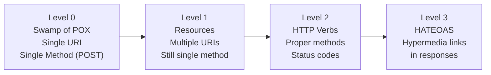
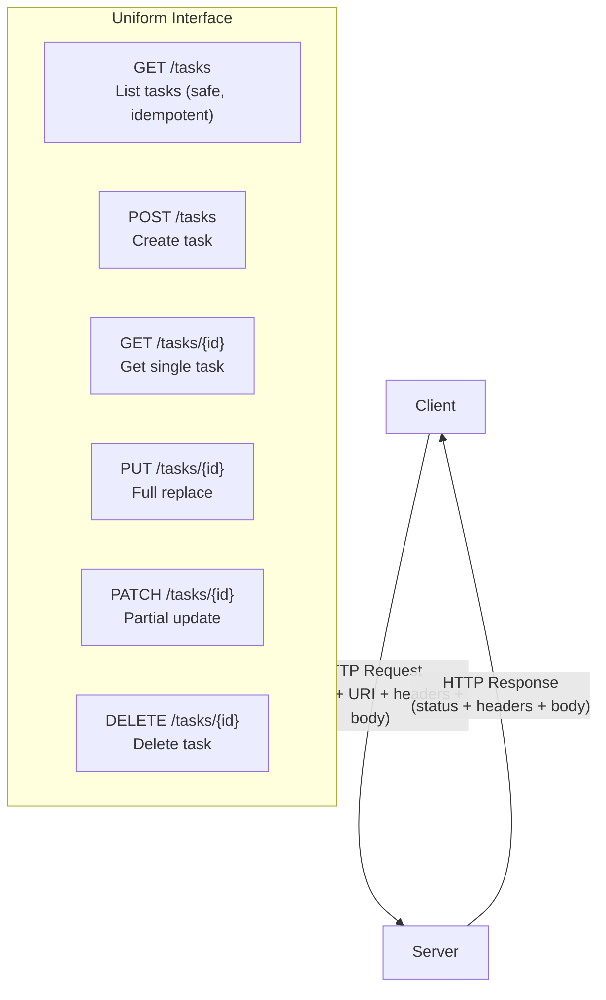

# [BEE-70] REST API Design Principles

:::info
REST architectural constraints, resource-oriented design, HTTP method semantics, and status code usage.
:::

:::tip Deep Dive
For comprehensive API design guidelines including naming conventions, error design, and governance, see [ADP (API Design Principles)](https://alivedise.github.io/api-design-principle-beta/).
:::

## Context

REST (Representational State Transfer) is an architectural style defined by Roy Fielding in his 2000 doctoral dissertation. It is not a protocol or standard, but a set of constraints that, when applied to a distributed hypermedia system, produce desirable properties: scalability, visibility, reliability, and portability.

The majority of modern HTTP APIs claim to be "RESTful", yet many violate the constraints that give REST its beneficial properties. Understanding the original constraints — not just the surface conventions — is what separates well-designed APIs from poorly-designed ones.

## Principle

### REST Architectural Constraints

Fielding defines six constraints. An API that satisfies all of them is RESTful.

**1. Client-Server**

The client and server are separated by a uniform interface. The server provides resources; the client consumes them. Neither knows the internal implementation of the other. This separation improves portability of the client and scalability of the server.

**2. Stateless**

Each request from client to server MUST contain all the information needed to understand and process the request. Session state is kept entirely on the client. The server MUST NOT store client session state between requests. This improves visibility (any request can be understood in isolation), reliability (partial failures are easier to recover from), and scalability (any server can handle any request).

**3. Cacheable**

Responses MUST declare whether they are cacheable or not. When a response is cacheable, clients and intermediaries MAY reuse that response for equivalent subsequent requests. Cacheability reduces server load and improves perceived latency.

**4. Uniform Interface**

This is the central constraint that distinguishes REST from other styles. It has four sub-constraints:

- **Identification of resources**: Resources are identified by stable URIs. The URI identifies the resource, not the representation of the resource.
- **Manipulation through representations**: Clients interact with resources through representations (e.g., JSON, XML). A representation plus metadata is sufficient to modify or delete the resource.
- **Self-descriptive messages**: Each message includes enough information to describe how to process it (e.g., `Content-Type` header).
- **HATEOAS** (Hypermedia as the Engine of Application State): Clients discover available actions through hypermedia links embedded in responses, rather than through out-of-band documentation.

**5. Layered System**

A client MUST NOT be able to tell whether it is connected directly to the end server or to an intermediary (load balancer, proxy, CDN, gateway). This enables scalability through layered caches and enforces security through firewalls and gateways.

**6. Code on Demand (Optional)**

Servers MAY extend client functionality by sending executable code (e.g., JavaScript). This is the only optional constraint.

---

### Resource-Oriented Design

Resources are the nouns of a REST API. Design resources around the domain entities that matter to clients, not around operations or database tables.

**Resource naming rules:**

- URIs MUST identify resources using nouns, not verbs.
- Collection resources SHOULD use plural nouns: `/tasks`, `/users`, `/orders`.
- Sub-resources SHOULD express hierarchy: `/users/{userId}/orders`.
- URIs SHOULD use lowercase letters and hyphens (`-`) for word separation, not underscores or camelCase.
- URIs MUST NOT use file extensions (`.json`, `.xml`) to express format; use `Accept` headers instead.

| Correct | Incorrect |
|---------|-----------|
| `GET /tasks` | `GET /getTasks` |
| `POST /tasks` | `POST /createTask` |
| `DELETE /tasks/{id}` | `POST /deleteTask` |
| `GET /users/{id}/orders` | `GET /getOrdersByUser?userId={id}` |

---

### HTTP Methods and Their Semantics

RFC 9110 (HTTP Semantics) defines method properties: **safe** methods have no observable side effect; **idempotent** methods produce the same server state when called multiple times with the same input.

| Method | Semantics | Safe | Idempotent | Common Use |
|--------|-----------|------|------------|------------|
| GET | Retrieve a resource or collection | Yes | Yes | Fetch task, list tasks |
| HEAD | Same as GET but no response body | Yes | Yes | Check existence, get metadata |
| POST | Create a new resource (non-idempotent) | No | No | Create task |
| PUT | Replace a resource completely | No | Yes | Full update |
| PATCH | Partial update of a resource | No | No* | Partial update |
| DELETE | Remove a resource | No | Yes | Delete task |
| OPTIONS | Describe communication options | Yes | Yes | CORS preflight |

*PATCH can be made idempotent depending on the patch document format.

**Key rules:**

- GET requests MUST NOT have side effects. Never modify state in a GET handler.
- PUT MUST replace the entire resource. Use PATCH for partial updates.
- DELETE SHOULD be idempotent: deleting an already-deleted resource SHOULD return `404` or `204`, not `500`.
- POST MUST NOT be used as a catch-all for operations that fit other methods.

---

### HTTP Status Code Categories

| Range | Category | When to Use |
|-------|----------|-------------|
| 1xx | Informational | Protocol-level signaling (rarely used in APIs) |
| 2xx | Success | Request succeeded |
| 3xx | Redirection | Resource has moved; client must follow |
| 4xx | Client Error | The client made a bad request |
| 5xx | Server Error | The server failed to fulfill a valid request |

**Commonly used status codes:**

| Code | Name | Use |
|------|------|-----|
| 200 | OK | Successful GET, PUT, PATCH, DELETE with body |
| 201 | Created | Successful POST creating a resource; include `Location` header |
| 204 | No Content | Successful DELETE or PUT/PATCH with no response body |
| 400 | Bad Request | Malformed request syntax, invalid parameters |
| 401 | Unauthorized | Missing or invalid authentication credentials |
| 403 | Forbidden | Authenticated but not authorized |
| 404 | Not Found | Resource does not exist |
| 409 | Conflict | Request conflicts with current state (e.g., duplicate create) |
| 422 | Unprocessable Entity | Syntactically valid but semantically invalid request |
| 429 | Too Many Requests | Rate limit exceeded |
| 500 | Internal Server Error | Unexpected server-side failure |
| 503 | Service Unavailable | Server temporarily unable to handle requests |

---

### Richardson Maturity Model

The Richardson Maturity Model (RMM) is a framework for measuring the maturity of a REST API across four levels.



- **Level 0 (Swamp of POX)**: A single endpoint that handles all operations via POST. Many RPC-style APIs and early SOAP services operate at this level.
- **Level 1 (Resources)**: Different URIs for different resources, but all operations still use POST (or GET for everything).
- **Level 2 (HTTP Verbs)**: Resources are accessed with the appropriate HTTP method and status codes. This is the minimum level most APIs should reach.
- **Level 3 (HATEOAS)**: Responses include hypermedia links that tell clients what they can do next. Clients do not need to hardcode URLs.

Most production REST APIs operate at Level 2. Level 3 (HATEOAS) is theoretically the "true REST" but is rarely implemented in full due to client complexity.

---

### HATEOAS

HATEOAS means the response body contains links to related actions and resources. The client does not need to know URLs in advance — it starts from a root resource and follows links.

Example response for `GET /tasks/42`:

```json
{
  "id": 42,
  "title": "Write BEE-70",
  "status": "in_progress",
  "_links": {
    "self": { "href": "/tasks/42" },
    "complete": { "href": "/tasks/42/complete", "method": "POST" },
    "owner": { "href": "/users/7" },
    "collection": { "href": "/tasks" }
  }
}
```

---

### Content Negotiation

Clients SHOULD specify the desired response format using the `Accept` header. Servers SHOULD specify the response format using the `Content-Type` header.

```
GET /tasks/42
Accept: application/json

POST /tasks
Content-Type: application/json
Accept: application/json
```

If the server cannot produce any of the requested formats, it MUST return `406 Not Acceptable`.

---

## Visual



---

## Example

A CRUD API for a `tasks` resource demonstrating correct REST usage:

### List Tasks

```
GET /tasks
Accept: application/json

HTTP/1.1 200 OK
Content-Type: application/json

{
  "data": [
    { "id": 1, "title": "Design schema", "status": "done" },
    { "id": 2, "title": "Write tests", "status": "pending" }
  ]
}
```

### Create Task

```
POST /tasks
Content-Type: application/json

{
  "title": "Write BEE-70",
  "assignee_id": 7
}

HTTP/1.1 201 Created
Location: /tasks/42
Content-Type: application/json

{
  "id": 42,
  "title": "Write BEE-70",
  "assignee_id": 7,
  "status": "pending",
  "created_at": "2026-04-07T10:00:00Z"
}
```

### Get Task

```
GET /tasks/42
Accept: application/json

HTTP/1.1 200 OK
Content-Type: application/json

{
  "id": 42,
  "title": "Write BEE-70",
  "assignee_id": 7,
  "status": "pending",
  "created_at": "2026-04-07T10:00:00Z"
}
```

### Partial Update

```
PATCH /tasks/42
Content-Type: application/json

{
  "status": "in_progress"
}

HTTP/1.1 200 OK
Content-Type: application/json

{
  "id": 42,
  "title": "Write BEE-70",
  "assignee_id": 7,
  "status": "in_progress",
  "created_at": "2026-04-07T10:00:00Z"
}
```

### Delete Task

```
DELETE /tasks/42

HTTP/1.1 204 No Content
```

### Task Not Found

```
GET /tasks/999

HTTP/1.1 404 Not Found
Content-Type: application/json

{
  "type": "https://example.com/errors/not-found",
  "title": "Task not found",
  "status": 404,
  "detail": "No task with id 999 exists."
}
```

---

## Common Mistakes

**1. Using verbs in URIs**

Embedding the operation in the URI is the most common REST violation. The HTTP method IS the verb.

```
# Wrong
GET  /getTask/42
POST /deleteTask/42
POST /updateTaskStatus

# Correct
GET    /tasks/42
DELETE /tasks/42
PATCH  /tasks/42
```

**2. Using POST for everything**

Defaulting to POST for all operations (Level 0 in RMM) discards the semantics of HTTP and breaks caching, idempotency, and tooling.

```
# Wrong
POST /api  { "action": "getTask", "id": 42 }

# Correct
GET /tasks/42
```

**3. Returning 200 with an error in the body**

This breaks any HTTP-aware tooling, proxies, and monitoring that rely on status codes to detect failures.

```json
// Wrong: status 200, but it's an error
HTTP/1.1 200 OK
{ "success": false, "error": "Task not found" }

// Correct
HTTP/1.1 404 Not Found
{ "status": 404, "title": "Task not found" }
```

**4. GET requests with side effects**

GET is defined as safe by RFC 9110. Browsers, proxies, and crawlers may issue GET requests freely. A GET that creates, modifies, or deletes data will produce unexpected behavior.

```
# Wrong
GET /tasks/42/delete
GET /tasks/generateReport
```

**5. Overusing 200 and 500**

Returning `200` for every success (ignoring `201`, `204`) and `500` for every server-side issue (ignoring `503`, `409`, `422`) deprives clients of information they need to make decisions.

---

## Related BEPs

- [BEE-52](../Networking Fundamentals/52.md) HTTP Protocol Fundamentals
- [BEE-71](71.md) API Versioning Strategies
- [BEE-72](72.md) Idempotency in APIs
- [BEE-73](73.md) Pagination Patterns
- [BEE-75](75.md) API Error Handling and Problem Details

---

## References

- Fielding, R.T. 2000. "Architectural Styles and the Design of Network-based Software Architectures". Chapter 5: Representational State Transfer (REST). https://ics.uci.edu/~fielding/pubs/dissertation/rest_arch_style.htm
- Fielding, R.T., and Reschke, J. 2022. "HTTP Semantics". RFC 9110. https://www.rfc-editor.org/rfc/rfc9110
- Microsoft. "Microsoft REST API Guidelines". https://github.com/microsoft/api-guidelines/blob/master/Guidelines.md
- Google. "Google API Design Guide: Resource-Oriented Design". https://docs.cloud.google.com/apis/design
- Richardson, L., and Ruby, S. 2007. "RESTful Web Services". O'Reilly Media.
