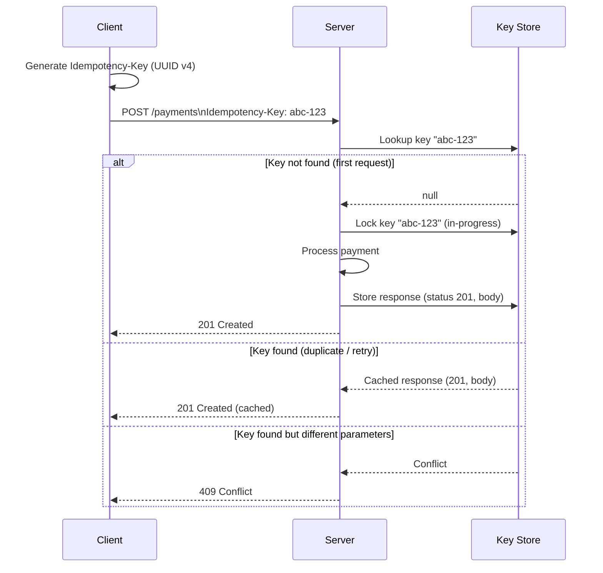

# [BEE-72] Idempotency in APIs

:::info
Idempotency keys, safe vs idempotent methods, and retry-safe API design.
:::

## Context

Distributed systems fail. Networks drop connections mid-request, clients time out waiting for responses, and servers crash after committing a transaction but before sending the reply. In all these scenarios, a client faces the same dilemma: was the request processed? Should I retry?

Without idempotency guarantees, retrying a non-idempotent operation—like charging a payment—can duplicate side effects and corrupt data. Idempotency gives clients a safe retry contract: sending the same request multiple times produces the same observable result as sending it once.

This principle is codified in [RFC 9110 Section 9.2.2](https://httpwg.org/specs/rfc9110.html#idempotent.methods):

> "A request method is considered 'idempotent' if the intended effect on the server of multiple identical requests with that method is the same as the effect for a single such request."

:::tip Deep Dive
For API-level idempotency design patterns and governance, see [ADP (API Design Principles)](https://alivedise.github.io/api-design-principle-beta/).
:::

## Principle

**Design every mutating operation with an explicit idempotency contract. For POST requests that are not naturally idempotent, require clients to supply an idempotency key.**

## Safe vs Idempotent Methods

RFC 9110 distinguishes two related but distinct properties:

| Property | Definition | Examples |
|---|---|---|
| **Safe** | No server state is modified | GET, HEAD, OPTIONS |
| **Idempotent** | Repeated calls produce the same effect | GET, HEAD, PUT, DELETE |
| **Neither** | May create new state on each call | POST, PATCH |

All safe methods are also idempotent—reading a resource twice has the same effect as reading it once. But idempotency does not imply safety: `DELETE /orders/123` modifies state, yet calling it twice leaves the server in the same final state (order absent).

**POST is neither safe nor idempotent by default.** `POST /payments` called twice creates two separate charges. This is the core problem idempotency keys solve.

```
Method    Safe?   Idempotent?   Notes
GET       YES     YES           Pure read
HEAD      YES     YES           Pure read, no body
OPTIONS   YES     YES           Pure read
DELETE    NO      YES           Resource absent after any number of calls
PUT       NO      YES           Full replacement; same body = same state
POST      NO      NO            Creates new resources; needs idempotency key
PATCH     NO      NO*           Depends on operation semantics
```

*A PATCH using absolute values (set balance to 100) can be idempotent; one using relative values (increment balance by 10) cannot.

## Idempotency Keys for POST Requests

An idempotency key is a client-generated unique identifier attached to a request. The server uses it to detect duplicate submissions and return the cached response instead of re-executing the operation.

[Stripe's idempotency key design](https://docs.stripe.com/api/idempotent_requests) pioneered this pattern for payment APIs and remains the industry reference. The header convention Stripe established is now widely adopted:

```http
POST /v1/payments HTTP/1.1
Content-Type: application/json
Idempotency-Key: 550e8400-e29b-41d4-a716-446655440000

{
  "amount": 5000,
  "currency": "usd",
  "customer_id": "cust_abc123"
}
```

### Key Generation Rules

- Use a V4 UUID or another random string with sufficient entropy (at minimum 128 bits)
- Generate the key **client-side before sending**—never derive it from server-generated IDs
- Scope the key to the logical operation, not the HTTP request (so retries reuse the same key)
- Do not include sensitive data (email addresses, PII) in the key value
- Maximum length: 255 characters is a reasonable limit

## Idempotency Key Flow



## Server-Side Implementation

### Storage Schema

Store idempotency records in a dedicated table, not in-memory cache. In-memory storage is lost on restart, which defeats the purpose.

```sql
CREATE TABLE idempotency_keys (
    key             VARCHAR(255) NOT NULL,
    user_id         BIGINT NOT NULL,
    request_hash    VARCHAR(64) NOT NULL,   -- SHA-256 of method + path + body
    response_status SMALLINT,
    response_body   TEXT,
    created_at      TIMESTAMPTZ NOT NULL DEFAULT NOW(),
    locked_at       TIMESTAMPTZ,
    PRIMARY KEY (user_id, key)
);
```

### Processing Logic

```
function handleRequest(userId, idempotencyKey, request):
    record = db.findIdempotencyKey(userId, idempotencyKey)

    if record exists:
        if record.requestHash != hash(request):
            return 409 Conflict  // Same key, different parameters

        if record.responseStatus is set:
            return cachedResponse(record)  // Already completed

        // In-progress: another thread is processing
        return 409 Conflict or 503 with Retry-After

    // First time: lock the key atomically
    db.insertIdempotencyKey(userId, idempotencyKey, hash(request))

    try:
        result = processRequest(request)
        db.storeResponse(userId, idempotencyKey, result.status, result.body)
        return result
    catch error:
        db.deleteIdempotencyKey(userId, idempotencyKey)  // Allow retry
        raise error
```

The `INSERT` must be atomic with a unique constraint on `(user_id, key)`. If two concurrent requests attempt to insert the same key, the database rejects one—preventing double-processing.

### Expiry

Idempotency records must not accumulate forever. [Stripe expires keys after 24 hours](https://docs.stripe.com/api/idempotent_requests); [Brandur Leach recommends 72 hours](https://brandur.org/idempotency-keys) to allow debugging of deployed bugs. Choose a window that covers your client's retry timeout plus buffer.

Run a scheduled cleanup job:

```sql
DELETE FROM idempotency_keys
WHERE created_at < NOW() - INTERVAL '72 hours';
```

After expiry, reusing the same key initiates a new request—the client must regenerate a new key for truly new operations.

## Race Conditions with Concurrent Duplicates

A subtle failure mode occurs when two identical requests arrive simultaneously before either has stored a response. Without a proper lock, both proceed to process the operation in parallel.

Mitigations:

1. **Unique constraint at insert**: The database rejects the second insert with a conflict error. Return `409 Conflict` or `503 Service Unavailable` to the second caller.
2. **Serializable isolation**: Use `SERIALIZABLE` transaction isolation for idempotency key lookups and inserts. Postgres will abort one transaction if both see no existing key and both try to insert.
3. **Optimistic locking**: Add a version column; the second writer's update fails if the version has changed.

The safe rule: **one and only one** request may hold a lock on a given key at any time. All others get a non-2xx response and must retry after a brief delay.

## Payment API Example

### First Request (processed normally)

```http
POST /v1/charges HTTP/1.1
Idempotency-Key: f47ac10b-58cc-4372-a567-0e02b2c3d479

{ "amount": 2000, "currency": "usd" }
```

```http
HTTP/1.1 201 Created
Idempotency-Key: f47ac10b-58cc-4372-a567-0e02b2c3d479

{ "id": "ch_abc", "amount": 2000, "status": "succeeded" }
```

### Retry with Same Key (cached response returned)

```http
POST /v1/charges HTTP/1.1
Idempotency-Key: f47ac10b-58cc-4372-a567-0e02b2c3d479

{ "amount": 2000, "currency": "usd" }
```

```http
HTTP/1.1 201 Created                    ← same status as original
Idempotency-Key: f47ac10b-58cc-4372-a567-0e02b2c3d479

{ "id": "ch_abc", "amount": 2000, "status": "succeeded" }   ← same body
```

No second charge is created. The server recognized the key and returned the stored result.

### Same Key, Different Parameters (conflict)

```http
POST /v1/charges HTTP/1.1
Idempotency-Key: f47ac10b-58cc-4372-a567-0e02b2c3d479

{ "amount": 9999, "currency": "usd" }   ← different amount
```

```http
HTTP/1.1 409 Conflict

{
  "error": {
    "type": "idempotency_error",
    "message": "Idempotency key already used with different request parameters."
  }
}
```

## Common Mistakes

### 1. Non-idempotent DELETE

A common mistake is returning `404 Not Found` when deleting an already-deleted resource. This breaks idempotency: a client that retried a successful DELETE would receive an error and might incorrectly infer the deletion failed.

```http
# Wrong: second DELETE returns 404
DELETE /orders/123 → 204 No Content
DELETE /orders/123 → 404 Not Found   ← breaks idempotency

# Correct: second DELETE returns 204 (or 200) regardless
DELETE /orders/123 → 204 No Content
DELETE /orders/123 → 204 No Content  ← idempotent
```

### 2. Server-Generated IDs as Idempotency Keys

Using a database-assigned record ID as the idempotency key is circular: the ID does not exist until the server processes the request, so there is no key to send on the first call.

```
# Wrong: ID is only known after creation
POST /orders → { "id": "ord_123" }
# Now use "ord_123" as idempotency key? Too late.

# Correct: client generates key before sending
client generates: "idem_f47ac10b"
POST /orders
Idempotency-Key: idem_f47ac10b
```

### 3. No Expiry on Stored Responses

Without a TTL or cleanup job, the idempotency key table grows without bound. Enforce expiry—24 to 72 hours is a practical range for most APIs.

### 4. Short or Predictable Keys

A short numeric key (e.g., 6-digit PIN) is easy to collide with, whether by accident or by a malicious actor trying to claim another user's cached response. Use at minimum 128 bits of entropy (UUID v4 is 122 bits of random data).

### 5. No Handling of Concurrent Duplicates

If you check for the key's existence and then insert it in two separate steps without a transaction, two simultaneous requests can both pass the existence check before either inserts. Always use an atomic `INSERT ... ON CONFLICT` or equivalent.

## Related BEPs

- **BEE-70** — REST API Design Principles: HTTP method semantics and resource modeling
- **BEE-164** — Idempotency in Messaging: applying the same guarantees to async message queues
- **BEE-261** — Retry Strategies: exponential backoff, jitter, and client-side retry budgets

## References

- [RFC 9110 Section 9.2.2 — Idempotent Methods](https://httpwg.org/specs/rfc9110.html#idempotent.methods)
- [Stripe — Idempotent Requests](https://docs.stripe.com/api/idempotent_requests)
- [Brandur Leach — Implementing Stripe-like Idempotency Keys in Postgres](https://brandur.org/idempotency-keys)
