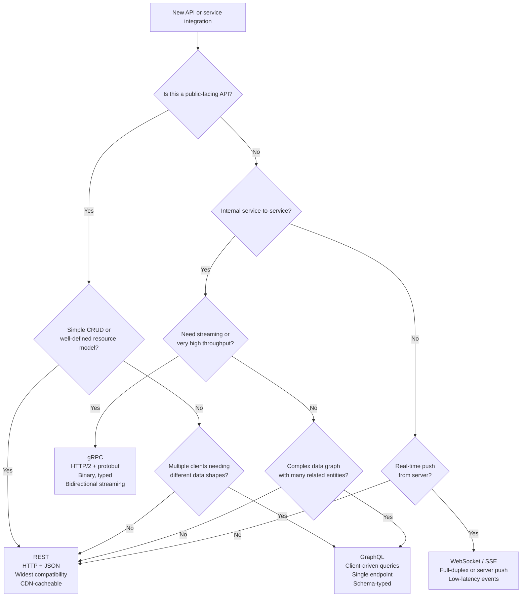

# [BEE-74] GraphQL vs REST vs gRPC

:::info
Protocol comparison: REST, GraphQL, and gRPC — their strengths, trade-offs, and when to choose each.
:::

## Context

Most backend engineers learn REST first. As systems grow — more clients, more services, tighter latency budgets — REST's uniform-interface model starts showing limitations: over-fetching data that mobile clients do not need, under-fetching requiring multiple round trips, and significant serialization overhead in high-throughput internal services.

GraphQL and gRPC were invented to address different subsets of these problems. Neither is a universal replacement for REST. The decision is about matching the protocol's properties to the problem at hand.

A fourth option — WebSocket and Server-Sent Events (SSE) — is briefly covered for real-time push scenarios that polling-based protocols handle poorly.

## Principle

### REST

REST (Representational State Transfer) is an architectural style built on HTTP. Its defining properties are a uniform interface using standard HTTP methods (GET, POST, PUT, PATCH, DELETE), stateless requests, resource-oriented URIs, and leveraging existing HTTP infrastructure: caches, proxies, CDNs, and browsers.

See [BEE-70](70.md) for the full treatment of REST architectural constraints and HTTP method semantics.

**Strengths:**
- Universal tooling support: every HTTP client, browser, and language can consume REST APIs without a code-generation step.
- Transparent caching: GET responses are cacheable by CDNs and browser caches using standard `Cache-Control` headers.
- Human-readable: JSON over HTTPS is debuggable with `curl` and any network inspector.
- Widely understood contract: no schema language to learn, no binary format to decode.

**Weaknesses:**
- Over-fetching: the server defines the response shape; the client gets what the endpoint returns, not what it needs.
- Under-fetching: complex data graphs may require N sequential requests (`/users/1`, then `/users/1/orders`, then `/orders/42/items`).
- No standard for real-time: polling and webhooks are workarounds, not native capabilities.

---

### GraphQL

GraphQL is a query language for APIs and a server-side runtime for executing those queries, originally developed at Facebook in 2012 and open-sourced in 2015. It is now governed by the GraphQL Foundation (a Linux Foundation project).

The core idea: the client sends a typed query describing exactly the data it needs, and the server returns exactly that shape — no more, no less.

**Schema and type system**

Every GraphQL API is defined by a schema written in the Schema Definition Language (SDL):

```graphql
type User {
  id: ID!
  name: String!
  email: String!
  orders: [Order!]!
}

type Order {
  id: ID!
  total: Float!
  items: [OrderItem!]!
}

type Query {
  user(id: ID!): User
}
```

The schema is the contract. Clients and servers can be independently validated against it.

**Client-driven queries**

A client asks for exactly what it needs:

```graphql
query {
  user(id: "1") {
    name
    orders {
      id
      total
    }
  }
}
```

The response contains only the requested fields. A mobile client can request a minimal payload; a dashboard can request a rich one — same endpoint, same schema, different queries.

**The N+1 problem in resolvers**

GraphQL's flexibility shifts the performance problem inward. When the server resolves a list of users each with their orders, a naive implementation fires one database query per user — N+1 queries for a list of N users. This is addressed using the DataLoader pattern (request batching and caching within a single request execution).

**Strengths:**
- Eliminates over-fetching and under-fetching.
- Single endpoint, all queries go to `POST /graphql`.
- Schema is machine-readable; tooling (GraphiQL, Codegen) generates typed clients automatically.
- Strongly typed introspection: clients can discover the full API surface at runtime.
- Well-suited to complex data graphs with multiple related entities.

**Weaknesses:**
- N+1 resolver problem requires DataLoader or equivalent.
- One expensive query can consume disproportionate server resources; rate-limiting individual queries requires query complexity analysis, not just a per-request rate limit.
- No standard HTTP caching (POST requests are not cached by CDNs); caching requires persisted queries or a CDN-aware GraphQL layer.
- Overhead is not worth it for simple CRUD with 1–2 entity types.

---

### gRPC

gRPC is an open-source Remote Procedure Call framework developed at Google, using Protocol Buffers (protobuf) as the Interface Definition Language and HTTP/2 as the transport.

See [BEE-52](52.md) for HTTP/2 fundamentals including multiplexing and header compression, which gRPC relies on.

**Protocol Buffers**

Services and messages are defined in `.proto` files:

```protobuf
syntax = "proto3";

service UserService {
  rpc GetUser (GetUserRequest) returns (UserResponse);
  rpc ListUserOrders (GetUserRequest) returns (stream OrderResponse);
}

message GetUserRequest {
  string user_id = 1;
}

message UserResponse {
  string id = 1;
  string name = 2;
  string email = 3;
}

message OrderResponse {
  string id = 1;
  float total = 2;
}
```

The `protoc` compiler generates strongly typed client and server stubs in Go, Java, Python, TypeScript, and many other languages. The wire format is binary — more compact and faster to parse than JSON.

**Communication patterns**

gRPC supports four communication patterns:

| Pattern | Description |
|---------|-------------|
| Unary | Client sends one request, receives one response |
| Server streaming | Client sends one request, server streams multiple responses |
| Client streaming | Client streams multiple requests, server sends one response |
| Bidirectional streaming | Both sides stream concurrently |

Streaming is built into the protocol over HTTP/2, not bolted on.

**Strengths:**
- Binary serialization via protobuf: smaller payloads, faster parsing, less CPU overhead than JSON.
- Strongly typed contracts with code generation across languages: eliminates an entire class of integration bugs.
- HTTP/2 multiplexing: multiple streams over a single connection, no head-of-line blocking.
- Bidirectional streaming for real-time use cases (event feeds, telemetry, chat).
- Built-in deadlines and cancellation propagated across service boundaries.

**Weaknesses:**
- Binary format is not human-readable; debugging requires tooling (`grpcurl`, Wireshark with protobuf plugin).
- Browser clients cannot call gRPC directly over HTTP/2 — a `grpc-web` proxy is required.
- Proto schema changes require coordinating client and server deployments carefully (though protobuf has backward-compatible evolution rules).
- Higher initial setup cost: protobuf toolchain, code generation, build pipeline integration.

---

### WebSocket and SSE (Real-Time Fourth Option)

For scenarios requiring low-latency server-to-client push (live dashboards, collaborative editing, notifications, multiplayer games), neither REST polling nor gRPC unary fits naturally.

- **WebSocket**: Full-duplex, persistent TCP connection. Use when the client also sends frequent messages to the server (chat, multiplayer state sync).
- **SSE (Server-Sent Events)**: One-directional server-to-client push over HTTP/1.1 or HTTP/2. Use when the server pushes events and the client rarely sends data (live feeds, progress bars, audit logs).

Both protocols are outside the REST/GraphQL/gRPC decision, but mentioning them prevents teams from reaching for polling as the only alternative.

---

## Visual

Decision tree for choosing the right protocol:



---

## Example

The same operation — "get user 1 with their orders" — in all three protocols.

### REST

```
GET /users/1
Accept: application/json

HTTP/1.1 200 OK
Content-Type: application/json

{
  "id": "1",
  "name": "Alice",
  "email": "alice@example.com"
}
```

Orders require a second request:

```
GET /users/1/orders
Accept: application/json

HTTP/1.1 200 OK
Content-Type: application/json

{
  "data": [
    { "id": "101", "total": 49.99, "items": [...] },
    { "id": "102", "total": 120.00, "items": [...] }
  ]
}
```

Two round trips. The user response includes `email` even if the client does not need it.

---

### GraphQL

```graphql
# Request: POST /graphql
# Content-Type: application/json

{
  "query": "query GetUserWithOrders($id: ID!) {
    user(id: $id) {
      name
      orders {
        id
        total
      }
    }
  }",
  "variables": { "id": "1" }
}
```

```json
HTTP/1.1 200 OK
Content-Type: application/json

{
  "data": {
    "user": {
      "name": "Alice",
      "orders": [
        { "id": "101", "total": 49.99 },
        { "id": "102", "total": 120.00 }
      ]
    }
  }
}
```

One round trip. Only `name` is returned (not `email`). The response shape is exactly what the client asked for.

---

### gRPC

Proto definition:

```protobuf
service UserService {
  rpc GetUserWithOrders (GetUserRequest) returns (UserWithOrdersResponse);
}

message GetUserRequest { string user_id = 1; }
message Order { string id = 1; float total = 2; }
message UserWithOrdersResponse {
  string name = 1;
  repeated Order orders = 2;
}
```

Generated client call (Go example):

```go
resp, err := client.GetUserWithOrders(ctx, &pb.GetUserRequest{UserId: "1"})
// resp.Name == "Alice"
// resp.Orders == [{Id:"101", Total:49.99}, {Id:"102", Total:120.00}]
```

One RPC call. Binary wire format. Strongly typed at compile time. No JSON parsing.

---

## Common Mistakes

**1. Using GraphQL for simple CRUD**

If the API has 3–4 flat resources and one client type, GraphQL adds a schema layer, a resolver layer, DataLoader complexity, and a custom caching strategy — all without benefit. REST is simpler.

**2. Exposing gRPC directly to browser clients**

Browsers cannot make HTTP/2 gRPC calls natively. A `grpc-web` proxy (e.g., Envoy) is required to translate browser HTTP/1.1 requests into gRPC. Plan for this in the deployment architecture. If a browser is the primary client, REST or GraphQL is simpler.

**3. Not rate-limiting GraphQL queries by complexity**

A single GraphQL query can request deeply nested data across many resolvers. A per-IP request rate limit does not protect against one expensive query. Use query depth limits and query complexity scoring (available in Apollo Server, Strawberry, and most GraphQL frameworks) to reject queries above a cost threshold.

**4. Choosing based on hype instead of use case**

gRPC is excellent for internal microservice communication with tight latency budgets. GraphQL is excellent for product APIs with multiple consumer types. REST is excellent for public APIs, simple CRUD, and anything that benefits from HTTP caching. Mixing all three in a single service boundary for no technical reason creates maintenance overhead without proportional benefit.

**5. Mixing protocols without a gateway**

Running REST, GraphQL, and gRPC endpoints from different services without an API gateway (e.g., Kong, Apigee, AWS API Gateway) means authentication, rate limiting, observability, and routing are implemented independently in each service. Centralize cross-cutting concerns at the gateway layer.

---

## Related BEPs

- [BEE-52](52.md) HTTP/2 and Transport Fundamentals (underpins gRPC)
- [BEE-70](70.md) REST API Design Principles
- [BEE-76](76.md) Webhooks and Callback Patterns (async communication)

---

## References

- GraphQL Foundation. "GraphQL Specification". https://spec.graphql.org/October2021/
- GraphQL Foundation. "Introduction to GraphQL". https://graphql.org/learn/
- gRPC Authors. "Introduction to gRPC". https://grpc.io/docs/what-is-grpc/introduction/
- gRPC Authors. "Core concepts, architecture and lifecycle". https://grpc.io/docs/what-is-grpc/core-concepts/
- WunderGraph. "When to use GraphQL vs Federation vs tRPC vs REST vs gRPC vs AsyncAPI vs WebHooks — A 2024 Comparison". https://wundergraph.com/blog/graphql-vs-federation-vs-trpc-vs-rest-vs-grpc-vs-asyncapi-vs-webhooks
- Arora, V. "REST vs. gRPC vs. GraphQL: A Comparative Analysis with Real-World Company Data". https://medium.com/@reachvivek.arora/rest-vs-grpc-vs-graphql-a-comparative-analysis-with-real-world-company-data-33ee430b7619
- Java Code Geeks. "GraphQL vs. REST vs. gRPC: The 2026 API Architecture Decision". https://www.javacodegeeks.com/2026/02/graphql-vs-rest-vs-grpc-the-2026-api-architecture-decision.html
