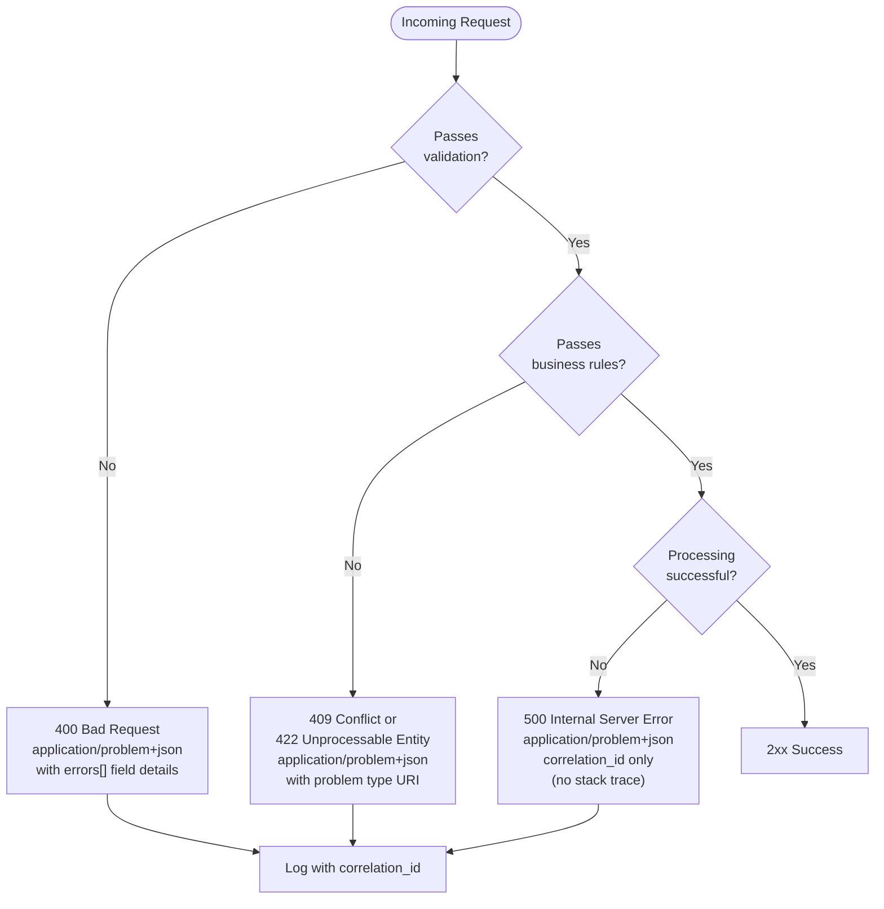

# [BEP-75] API Error Handling and Problem Details

:::info
HTTP status codes as the primary error signal, RFC 9457 Problem Details format, and consistent machine-readable error responses.
:::

:::tip Deep Dive
For comprehensive API error design patterns and error taxonomy, see [ADP (API Design Principles)](https://alivedise.github.io/api-design-principle-beta/).
:::

## Context

Error handling is one of the most neglected aspects of API design. Many APIs return `200 OK` for every response and embed a success flag in the body, leak internal stack traces in production, or produce wildly inconsistent error shapes across endpoints. These patterns harm API consumers: their error-handling code becomes fragile, debugging is slow, and client developers cannot build reliable retry or alerting logic.

RFC 9457 (Problem Details for HTTP APIs), published by the IETF in 2023 as a successor to RFC 7807, defines a standard JSON representation for error details. Stripe, Google, and most well-designed public APIs have independently converged on the same principles: use HTTP status codes correctly, return structured machine-readable errors, include enough context to act on the error, and never expose implementation internals.

The guiding rule is simple: **the HTTP status code tells the client *category* of failure; the response body tells it *what happened* and *what to do next*.**

## Principle

### HTTP Status Codes as the Primary Error Signal

HTTP defines status code semantics in RFC 9110. Status codes are not optional metadata — they are the canonical channel for communicating request outcome. Every HTTP-aware component in the stack (load balancers, proxies, monitoring tools, CDNs, client libraries) inspects status codes. Bypassing them breaks the entire ecosystem.

| Range | Category | Client Action |
|-------|----------|---------------|
| 2xx | Success | Proceed normally |
| 4xx | Client error | Fix the request; do not retry blindly |
| 5xx | Server error | The server failed; retry with backoff is often appropriate |

**Required status codes for error scenarios:**

| Code | Name | When to Use |
|------|------|-------------|
| 400 | Bad Request | Malformed syntax, missing required fields, invalid parameter types |
| 401 | Unauthorized | Missing or invalid authentication credentials |
| 403 | Forbidden | Authenticated but lacks permission |
| 404 | Not Found | Resource does not exist |
| 409 | Conflict | Request conflicts with current resource state (duplicate, version mismatch) |
| 410 | Gone | Resource existed but was permanently deleted |
| 422 | Unprocessable Entity | Syntactically valid but semantically invalid (business rule violation) |
| 429 | Too Many Requests | Rate limit exceeded; include `Retry-After` header |
| 500 | Internal Server Error | Unexpected server-side failure |
| 503 | Service Unavailable | Temporary overload or maintenance; include `Retry-After` header |

The distinction between `400` and `422` matters: `400` is for structurally malformed requests (unparseable JSON, wrong content type); `422` is for requests that parse correctly but violate a business rule or semantic constraint.

---

### RFC 9457 Problem Details Format

RFC 9457 defines the `application/problem+json` media type. A problem details object is a JSON object with five standard members. All members are optional by the spec, but in practice `type`, `title`, `status`, and `detail` should always be present.

| Field | Type | Description |
|-------|------|-------------|
| `type` | URI | Identifies the problem type. SHOULD resolve to human-readable documentation. Use a stable URL under your domain. |
| `title` | string | Short, human-readable summary of the problem type. SHOULD NOT change between occurrences. |
| `status` | integer | The HTTP status code. Included for convenience (clients should trust the actual HTTP status). |
| `detail` | string | Human-readable explanation of *this specific occurrence*. May be shown to end users. |
| `instance` | URI | A URI reference that identifies *this specific occurrence*. MAY be a correlation ID or log URL. |

Extensions are allowed: add any additional members you need (e.g., `errors` for field-level validation detail, `correlation_id` for tracing).

The media type for a problem details response is:

```
Content-Type: application/problem+json
```

---

### Validation Errors: Field-Level Detail

When a request fails validation, the 400 response MUST identify which fields are invalid and why. A generic "invalid request" response forces the client developer to guess — or send a second support ticket.

Extend the standard Problem Details object with an `errors` array:

```json
HTTP/1.1 400 Bad Request
Content-Type: application/problem+json

{
  "type": "https://api.example.com/problems/validation-error",
  "title": "Validation Error",
  "status": 400,
  "detail": "The request contains invalid fields.",
  "instance": "/requests/a3f5d812-...",
  "errors": [
    {
      "field": "email",
      "code": "INVALID_FORMAT",
      "message": "Must be a valid email address."
    },
    {
      "field": "due_date",
      "code": "DATE_IN_PAST",
      "message": "due_date must be a future date."
    }
  ]
}
```

The `code` field in each error item is machine-readable and stable across API versions. Client code can `switch` on `errors[n].code` without parsing the human-readable `message`.

---

### Business Logic Errors: Semantic Failures

Business rule violations use `409 Conflict` or `422 Unprocessable Entity`. The `type` URI distinguishes the specific problem, allowing clients to handle it programmatically.

```json
HTTP/1.1 409 Conflict
Content-Type: application/problem+json

{
  "type": "https://api.example.com/problems/task-already-completed",
  "title": "Task Already Completed",
  "status": 409,
  "detail": "Task 42 cannot be reassigned because it was completed on 2026-03-15.",
  "instance": "/requests/b7e1c402-...",
  "task_id": 42,
  "completed_at": "2026-03-15T09:41:00Z"
}
```

The extension fields `task_id` and `completed_at` give the client everything it needs to surface a meaningful message or take corrective action — without any string parsing.

---

### Internal Errors: Do Not Leak Stack Traces

When an unexpected error occurs, the server MUST return `500 Internal Server Error`. The response MUST NOT include:

- Stack traces
- SQL queries or ORM error messages
- Internal file paths or class names
- Database connection strings or credentials
- Third-party service error details that expose topology

Instead, return a minimal problem details object with a correlation ID. The correlation ID is the bridge between what the client sees and what the server logs contain.

```json
HTTP/1.1 500 Internal Server Error
Content-Type: application/problem+json

{
  "type": "https://api.example.com/problems/internal-error",
  "title": "Internal Server Error",
  "status": 500,
  "detail": "An unexpected error occurred. Use the correlation_id to report this issue.",
  "correlation_id": "req-7f3a9b21-4e2d-11ef-8c3a-0a9b1c2d3e4f"
}
```

Log the full error (exception, stack trace, request context) internally, keyed to the same `correlation_id`. When a client reports an error, the correlation ID is the only piece of information needed to find the full diagnostic trail. See [BEP-321](../../Observability and Reliability/321.md) for structured logging conventions.

---

### Correlation IDs

Every request SHOULD be assigned a unique correlation ID at the API gateway or entry point. The ID MUST be:

- Propagated through all downstream service calls
- Included in all log entries for that request
- Returned in the error response (as `correlation_id` or in the `instance` URI)

When a client receives an error, they attach the correlation ID to a bug report. The on-call engineer queries logs with that ID and sees the complete picture immediately — no guessing, no log archaeology across services.

```
X-Correlation-ID: req-7f3a9b21-4e2d-11ef-8c3a-0a9b1c2d3e4f
```

Some APIs use `X-Request-ID` or embed the ID in the `instance` field. The exact mechanism matters less than the guarantee: every error response contains a traceable identifier.

---

### Rate Limiting: Retry-After

`429 Too Many Requests` MUST include a `Retry-After` header. Without it, clients have no basis for choosing a retry interval and will either back off arbitrarily (poor user experience) or hammer the server again immediately (amplifying the problem).

```
HTTP/1.1 429 Too Many Requests
Content-Type: application/problem+json
Retry-After: 30

{
  "type": "https://api.example.com/problems/rate-limit-exceeded",
  "title": "Rate Limit Exceeded",
  "status": 429,
  "detail": "You have exceeded 100 requests per minute. Retry after 30 seconds.",
  "retry_after": 30,
  "limit": 100,
  "window": "60s"
}
```

`Retry-After` accepts either a delta-seconds integer or an HTTP-date. Use delta-seconds for simplicity.

---

### Machine-Readable vs Human-Readable Errors

Every error response serves two audiences simultaneously:

| Audience | Field | Requirements |
|----------|-------|--------------|
| Client code | `type`, `errors[].code`, `status` | Stable, versioned, documentable |
| Human developer | `title`, `detail`, `errors[].message` | Clear, specific, actionable |
| Support / on-call | `correlation_id`, `instance` | Unique, traceable |

The `type` URI and error `code` values are the machine-readable contract. They MUST NOT change once published (treat them like API paths). The `detail` string and `message` strings are human-readable and may be localized or improved over time.

---

## Visual



---

## Example

### Good: RFC 9457 Validation Error

```
POST /tasks
Content-Type: application/json

{
  "title": "",
  "due_date": "2020-01-01"
}

HTTP/1.1 400 Bad Request
Content-Type: application/problem+json
X-Correlation-ID: req-a1b2c3d4

{
  "type": "https://api.example.com/problems/validation-error",
  "title": "Validation Error",
  "status": 400,
  "detail": "The request body contains 2 invalid fields.",
  "instance": "/requests/req-a1b2c3d4",
  "errors": [
    {
      "field": "title",
      "code": "REQUIRED_FIELD_EMPTY",
      "message": "title must not be blank."
    },
    {
      "field": "due_date",
      "code": "DATE_IN_PAST",
      "message": "due_date must be a future date; received 2020-01-01."
    }
  ]
}
```

### Good: RFC 9457 Business Logic Error

```
POST /tasks/42/complete
Content-Type: application/json

HTTP/1.1 409 Conflict
Content-Type: application/problem+json

{
  "type": "https://api.example.com/problems/task-already-completed",
  "title": "Task Already Completed",
  "status": 409,
  "detail": "Task 42 is already in state 'completed' and cannot transition again.",
  "instance": "/requests/req-b5e7f001",
  "task_id": 42,
  "current_state": "completed"
}
```

### Bad: 200 with error in body (anti-pattern)

```
POST /tasks
Content-Type: application/json

HTTP/1.1 200 OK
Content-Type: application/json

{
  "success": false,
  "error": "Something went wrong",
  "code": -1
}
```

Problems with this pattern:
- HTTP status `200` tells every proxy, monitor, and client library the request succeeded.
- The `code: -1` is meaningless to a client; there is no stable contract.
- There is no correlation ID, no field detail, no actionable guidance.
- The `error` string is not stable — any rewording breaks client parsing.

### Bad: Leaking internal details (anti-pattern)

```json
HTTP/1.1 500 Internal Server Error
Content-Type: application/json

{
  "error": "NullPointerException at com.example.service.TaskService.complete(TaskService.java:142)",
  "caused_by": "org.postgresql.util.PSQLException: ERROR: deadlock detected",
  "stack": "com.example.service.TaskService.complete(TaskService.java:142)\n  com.example.controller..."
}
```

This exposes class names, line numbers, database type, and query failure details. An attacker uses this to map the codebase and identify injection targets.

---

## Common Mistakes

**1. Returning 200 for errors**

The most damaging anti-pattern. Every HTTP-aware tool — monitoring dashboards, load balancer health checks, client retry libraries — relies on the status code. Returning `200` for an error corrupts the signal that the entire infrastructure depends on.

**2. Leaking stack traces in production**

Stack traces in API responses expose internal class structure, database queries, infrastructure topology, and sometimes credentials. They provide almost no benefit to the API consumer (who cannot fix the server code) and significant benefit to an attacker.

**3. Inconsistent error shapes across endpoints**

When each endpoint invents its own error format (`{"message": ...}` vs `{"error": ...}` vs `{"errors": [...]}`) client developers must write bespoke parsing for every endpoint. A single `application/problem+json` shape means one error-handling path handles everything.

**4. No correlation ID**

Without a correlation ID, tracing an error across service boundaries requires matching timestamps across multiple log streams — a process that takes minutes at best and fails when clocks are skewed. A correlation ID makes this instant.

**5. Generic messages without actionable detail**

"Something went wrong" or "Internal error" tell the developer nothing. At minimum, for 4xx errors, tell them: what was wrong, which field or parameter caused it, and what a valid value looks like. For 5xx errors, give them the correlation ID so they can file a meaningful support ticket.

---

## Related BEPs

- [BEP-70](70.md) REST API Design Principles
- [BEP-31](../../Data Management and Storage/31.md) Input Validation
- [BEP-321](../../Observability and Reliability/321.md) Structured Logging

---

## References

- Nottingham, M., and Wilde, E. 2023. "Problem Details for HTTP APIs". RFC 9457. https://www.rfc-editor.org/rfc/rfc9457.html
- Fielding, R.T., et al. 2022. "HTTP Semantics". RFC 9110. https://www.rfc-editor.org/rfc/rfc9110
- Stripe. "Error Handling". Stripe API Reference. https://docs.stripe.com/api/errors/handling
- Google. "AIP-193: Errors". Google API Improvement Proposals. https://google.aip.dev/193
- Redocly. "RFC 9457: Better information for bad situations". https://redocly.com/blog/problem-details-9457
- Swagger. "Problem Details (RFC 9457): Doing API Errors Well". https://swagger.io/blog/problem-details-rfc9457-doing-api-errors-well/
