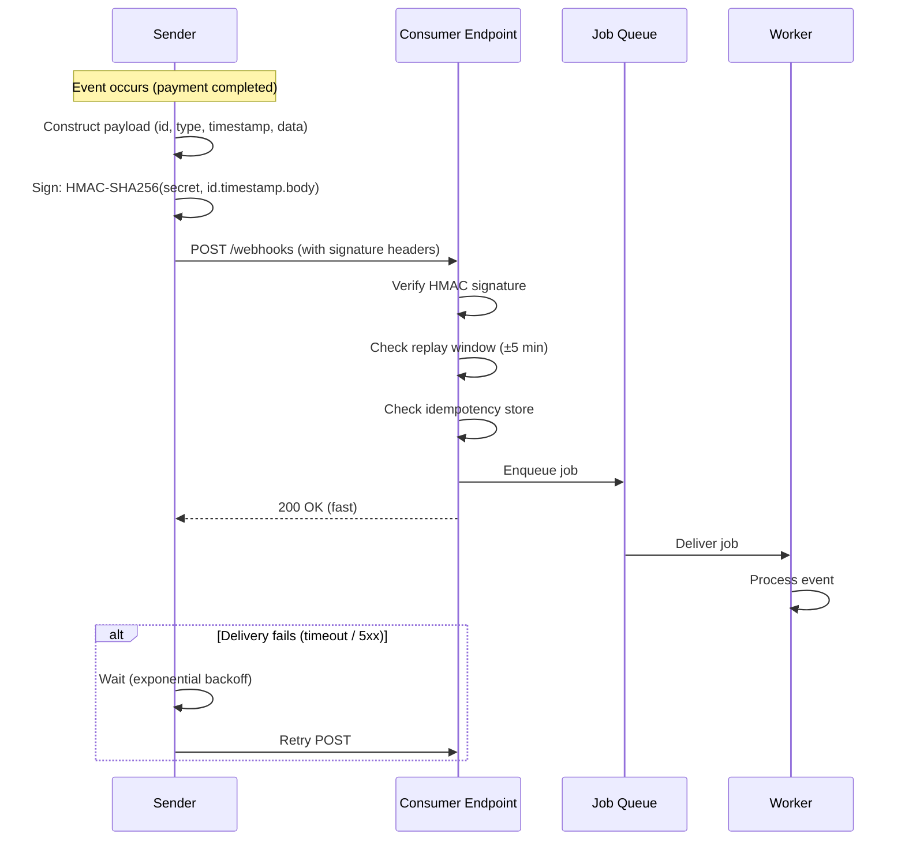

# [BEP-76] Webhooks and Callback Patterns

:::info
Push-based server-to-server integration: payload design, signature verification, retry policies, and delivery guarantees.
:::

## Context

Modern distributed systems frequently need to react to events that originate in external services. The naive solution is polling: periodically ask "did anything change?" However, polling wastes resources, introduces latency proportional to the polling interval, and scales poorly when many consumers watch many resources.

Webhooks solve this with a push model. When an event occurs in the source system, it immediately sends an HTTP POST to a registered consumer URL. The consumer receives near-real-time notification without continuous querying.

This pattern is now ubiquitous: payment processors (Stripe), version control hosts (GitHub, GitLab), communication platforms (Twilio, SendGrid), and hundreds of SaaS products deliver events via webhooks. The [Standard Webhooks initiative](https://www.standardwebhooks.com/) — backed by Svix, Zapier, Twilio, Supabase, Kong, and others — formalizes a common specification to reduce fragmentation across these implementations.

## Principle

**Design webhooks for reliability, security, and idempotent consumption.** The sender must sign every delivery and implement exponential backoff on failure. The receiver must verify signatures, respond quickly with 2xx, process asynchronously, and handle duplicate deliveries without side effects.

## Webhook vs. Polling

| Dimension | Webhooks (Push) | Polling (Pull) |
|---|---|---|
| Latency | Near real-time | Bounded by poll interval |
| Resource cost (sender) | Low — only sends on event | High — responds to all polls |
| Resource cost (receiver) | Low — only wakes on event | High — continuously polls |
| Reliability | Needs retry logic | Receiver controls retry |
| Missed events | Possible if receiver is down | Rare if poll interval is short |
| Operational complexity | Higher (endpoint exposure, secrets) | Lower |

**Recommendation:** Use webhooks as the primary delivery mechanism and supplement with a polling or reconciliation endpoint for catch-up after downtime. Never rely on webhooks alone for correctness-critical flows.

## Payload Design

A well-structured webhook payload contains everything the consumer needs to understand and process the event without an additional API call.

### Required fields

```json
{
  "webhook-id": "msg_2NWaIqfQwBtaOvXOeRmkMN5G1A4",
  "type": "payment.completed",
  "timestamp": "2026-04-07T08:30:00Z",
  "data": {
    "payment_id": "pay_abc123",
    "amount": 9900,
    "currency": "USD",
    "status": "completed",
    "customer_id": "cus_xyz789"
  }
}
```

- **`webhook-id`** — Unique identifier for this specific delivery. Serves as the idempotency key. If the same `webhook-id` arrives twice, the consumer can safely discard the duplicate.
- **`type`** — Dot-delimited event name following a `resource.action` convention (e.g., `payment.completed`, `user.deleted`).
- **`timestamp`** — ISO 8601 UTC time when the event occurred in the source system. Different from delivery time.
- **`data`** — Snapshot of the resource at the time of the event. Include enough context that consumers rarely need to call back.

### Size budget

Keep payloads under 20 KB. Very large payloads should include a reference URL the consumer can call to retrieve full details — this also avoids transmitting sensitive data unnecessarily.

## Signature Verification

Without signature verification, any actor that discovers a webhook endpoint can send forged events. Signature verification is non-negotiable.

### Standard Webhooks headers

Following the [Standard Webhooks spec](https://github.com/standard-webhooks/standard-webhooks/blob/main/spec/standard-webhooks.md):

| Header | Value |
|---|---|
| `webhook-id` | Unique message identifier |
| `webhook-timestamp` | Unix timestamp (seconds since epoch) |
| `webhook-signature` | Space-delimited list of `v1,<base64-signature>` values |

### HMAC-SHA256 signing (sender side)

```
signed_content = webhook-id + "." + webhook-timestamp + "." + raw_body
signature = base64(HMAC-SHA256(secret, signed_content))
header = "v1," + signature
```

The secret is a shared symmetric key, distributed to the consumer out-of-band (e.g., via a secrets manager, never in source code or logs).

### Verification (consumer side)

```typescript
import { createHmac, timingSafeEqual } from "crypto";

function verifyWebhookSignature(
  rawBody: string,
  webhookId: string,
  webhookTimestamp: string,
  webhookSignature: string,
  secret: string // base64-encoded, without "whsec_" prefix
): void {
  // 1. Replay protection: reject if timestamp is outside 5-minute window
  const tsSeconds = parseInt(webhookTimestamp, 10);
  const nowSeconds = Math.floor(Date.now() / 1000);
  if (Math.abs(nowSeconds - tsSeconds) > 300) {
    throw new Error("Webhook timestamp out of tolerance window");
  }

  // 2. Reconstruct signed content
  const signedContent = `${webhookId}.${webhookTimestamp}.${rawBody}`;

  // 3. Compute expected signature
  const secretBytes = Buffer.from(secret, "base64");
  const expectedSig = createHmac("sha256", secretBytes)
    .update(signedContent)
    .digest("base64");

  // 4. Compare against each signature in the header (supports key rotation)
  const signatures = webhookSignature.split(" ");
  const verified = signatures.some((sig) => {
    const [scheme, value] = sig.split(",");
    if (scheme !== "v1") return false; // ignore unknown schemes
    return timingSafeEqual(
      Buffer.from(expectedSig),
      Buffer.from(value)
    );
  });

  if (!verified) {
    throw new Error("Webhook signature verification failed");
  }
}
```

Key points:
- Use **constant-time comparison** (`timingSafeEqual`) to prevent timing attacks.
- Reject signatures with unknown schemes (prevents downgrade attacks).
- The header can contain multiple signatures separated by spaces to support **zero-downtime secret rotation**: the sender signs with both old and new secrets during a transition window.

## Retry Policy and Delivery Guarantees

Webhooks operate under **at-least-once delivery** semantics. The sender retries until it receives a 2xx response or exhausts its retry budget. This means consumers must be idempotent (see [BEP-72](/en/API%20Design%20and%20Communication%20Protocols/72)).

### Recommended retry schedule

| Attempt | Delay after previous failure |
|---|---|
| 1 (immediate) | — |
| 2 | 5 minutes |
| 3 | 30 minutes |
| 4 | 2 hours |
| 5 | 24 hours |

After the final attempt, move the event to a dead-letter queue for manual inspection rather than silently dropping it.

### What counts as a failure

- HTTP 4xx responses (except 429 Too Many Requests, which should trigger backoff)
- HTTP 5xx responses
- TCP connection failure or timeout
- Response not received within the timeout window (commonly 10–15 seconds)

Do not retry on 4xx client errors that indicate a permanent misconfiguration (e.g., 401 Unauthorized with an invalid signature), unless the error could be transient.

## Consumer Endpoint Design

### Respond fast, process async

The single most important rule: **respond 2xx immediately, then process**.

```typescript
// Express example
app.post("/webhooks/payments", async (req, res) => {
  // 1. Verify signature first — this is fast
  try {
    verifyWebhookSignature(
      req.rawBody,
      req.headers["webhook-id"] as string,
      req.headers["webhook-timestamp"] as string,
      req.headers["webhook-signature"] as string,
      process.env.WEBHOOK_SECRET!
    );
  } catch {
    return res.status(401).json({ error: "Invalid signature" });
  }

  // 2. Check idempotency — have we already processed this delivery?
  const webhookId = req.headers["webhook-id"] as string;
  if (await idempotencyStore.has(webhookId)) {
    return res.status(200).json({ status: "already_processed" });
  }

  // 3. Enqueue for async processing — do not block here
  await queue.enqueue("process-payment-event", req.body);

  // 4. Respond immediately
  res.status(200).json({ status: "accepted" });
});
```

If processing takes more than 10 seconds, the sender will likely time out and retry. Always offload work to a queue (see [BEP-220](/en/API%20Design%20and%20Communication%20Protocols/220)).

### Idempotency key tracking

Store processed `webhook-id` values in a fast lookup store (Redis, database) with a TTL matching the sender's maximum retry window (e.g., 72 hours). On duplicate delivery, return 200 without re-processing.

### CSRF exemption

Webhook endpoints must be excluded from CSRF middleware. Webhooks are machine-to-machine — they will never have a browser session cookie.

## Webhook Delivery Flow



## Security Checklist

1. **Verify signatures on every request.** Never process a webhook payload without first confirming the HMAC signature matches.
2. **Enforce timestamp tolerance.** Reject deliveries with timestamps more than 5 minutes old to prevent replay attacks.
3. **Use HTTPS only.** Never accept webhook deliveries over plain HTTP. Enforce TLS 1.2+.
4. **Track idempotency keys.** Store processed `webhook-id` values to detect and skip duplicates.
5. **IP allowlisting (defense-in-depth).** Where the sender publishes a list of source IP ranges (Stripe, GitHub), configure your firewall to allow only those ranges in addition to signature verification.
6. **Rotate secrets periodically.** Compromise of a webhook secret allows an attacker to forge arbitrary events. Rotate secrets on a schedule and immediately after any suspected exposure.
7. **Never log the raw secret.** Log the `webhook-id` and event type for debugging, but never the signing secret or the full `webhook-signature` header value in plaintext.

## Common Mistakes

### 1. Processing synchronously (blocking the response)

**Wrong:** Running database writes, sending emails, or calling downstream APIs before responding.

**Impact:** The sender times out after 10–15 seconds and retries, causing duplicates and load amplification.

**Fix:** Enqueue immediately, respond 2xx, process in a background worker.

### 2. Not verifying webhook signatures

**Wrong:** Accepting any POST to the webhook URL without checking the signature header.

**Impact:** An attacker can forge arbitrary events — fake payments, unauthorized account changes, data exfiltration triggers.

**Fix:** Always verify `webhook-signature` using constant-time HMAC comparison before touching the payload.

### 3. No idempotency handling

**Wrong:** Processing every delivery without checking whether it was already handled.

**Impact:** At-least-once delivery means the same event will arrive more than once during retries. Double-charging a customer, sending duplicate emails, or double-crediting an account.

**Fix:** Record `webhook-id` on first successful processing. Check before processing. Return 200 on duplicate.

### 4. Relying solely on webhooks for correctness

**Wrong:** Treating webhooks as the only source of truth for critical state.

**Impact:** If your endpoint is down during delivery and you exhaust retries, the event is lost. There is no catch-up.

**Fix:** Provide a polling or reconciliation endpoint (e.g., `GET /payments?updated_since=<timestamp>`). Run periodic reconciliation jobs.

### 5. Exposing secrets in logs or error responses

**Wrong:** Logging `req.headers` verbatim, or including the signature in error messages.

**Impact:** Secrets leak into log aggregation systems, violating least-privilege and enabling forgery.

**Fix:** Log only the `webhook-id`, event type, and sanitized diagnostic fields. Never log full headers containing secrets.

## The Standard Webhooks Initiative

[Standard Webhooks](https://www.standardwebhooks.com/) is an open specification co-authored by Svix, Zapier, Twilio, Supabase, Kong, Lob, Mux, and ngrok. It standardizes:

- Header names (`webhook-id`, `webhook-timestamp`, `webhook-signature`)
- Signature algorithm (`v1` for HMAC-SHA256, `v1a` for Ed25519)
- Signed content format (`id.timestamp.body`)
- Replay protection window
- Secret format (`whsec_<base64>` for symmetric, `whpk_`/`whsk_` for asymmetric)

Adopters include OpenAI, Brex, Clerk, Resend, and 25+ other platforms. If you are building a new webhook sender, adopting Standard Webhooks reduces integration friction for consumers and enables use of shared verification libraries across languages.

Reference libraries: Python, TypeScript/JavaScript, Go, Rust, Java/Kotlin, Ruby, PHP, C#, Elixir — all available at [github.com/standard-webhooks](https://github.com/standard-webhooks/standard-webhooks).

## Related BEPs

- [BEP-34](/en/Security%20and%20Resilience/34) — HMAC cryptographic primitives
- [BEP-72](/en/API%20Design%20and%20Communication%20Protocols/72) — Idempotency in APIs
- [BEP-220](/en/API%20Design%20and%20Communication%20Protocols/220) — Messaging patterns and async processing
- [BEP-261](/en/Reliability%20and%20Operations/261) — Retry strategies and exponential backoff

## References

- Standard Webhooks specification: [https://github.com/standard-webhooks/standard-webhooks/blob/main/spec/standard-webhooks.md](https://github.com/standard-webhooks/standard-webhooks/blob/main/spec/standard-webhooks.md)
- Standard Webhooks initiative: [https://www.standardwebhooks.com/](https://www.standardwebhooks.com/)
- Stripe webhook documentation: [https://docs.stripe.com/webhooks](https://docs.stripe.com/webhooks)
- GitHub webhook best practices: [https://docs.github.com/en/webhooks/using-webhooks/best-practices-for-using-webhooks](https://docs.github.com/en/webhooks/using-webhooks/best-practices-for-using-webhooks)
- Svix receiving webhooks guide: [https://docs.svix.com/receiving/introduction](https://docs.svix.com/receiving/introduction)
