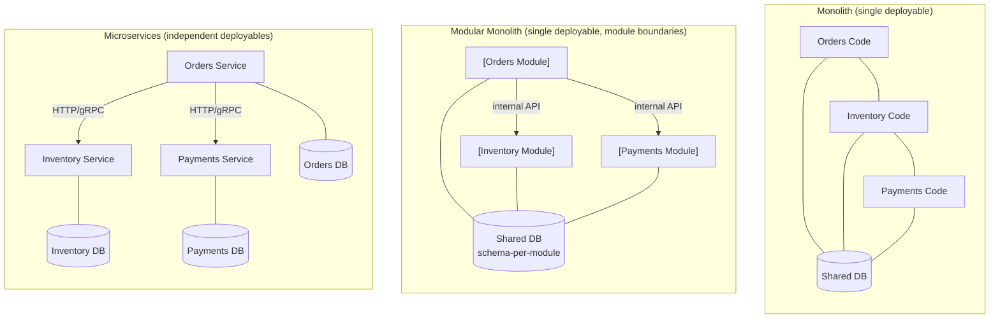

# [BEE-100] Monolith vs Microservices vs Modular Monolith

:::info
Tradeoffs between deployment styles, when each is appropriate, and migration paths between them.
:::

## Context

One of the most consequential architectural decisions for any backend system is how to partition and deploy code. Three dominant approaches have emerged: the **monolith** (a single deployable unit), **microservices** (many independently deployable services), and the **modular monolith** (a single deployable unit with strong internal module boundaries).

Each approach carries real tradeoffs. The industry has collectively over-corrected toward microservices, then back toward monoliths, and back again. The right answer depends on team size, domain maturity, and operational capability -- not on what is fashionable.

Martin Fowler observed that almost every successful microservices adoption started as a monolith first, while systems that began as microservices from day one routinely encountered serious trouble. DHH's "Majestic Monolith" essay made the case that a well-structured monolith is not a stepping stone to something better -- it *is* the right architecture for most teams. Shopify's engineering blog documented a middle path: evolving a 2.8-million-line Rails monolith into a modular monolith rather than decomposing it into separate services.

## Principle

### Monolith

A monolith packages all application functionality into a single deployable artifact. All modules share a runtime, a database, and a deployment pipeline.

**Strengths:**
- Simple to develop, test, and deploy early on
- No network hops between modules -- function calls are fast and transactional
- Easier cross-module refactoring and code navigation
- One CI/CD pipeline, one observability target
- ACID transactions span the entire domain trivially

**Weaknesses:**
- Scaling requires scaling the entire application, not just hot paths
- Long-term coupling risk: without discipline, modules become entangled (the "big ball of mud" anti-pattern)
- Large teams working in a single codebase generate merge conflicts and coordination overhead
- Deployment of any change requires redeploying the entire application

A monolith SHOULD be the default starting point for new systems. Teams MUST NOT treat "monolith" as a synonym for "bad architecture."

### Microservices

Microservices decompose the system into small, independently deployable services. Each service owns its data store, exposes a well-defined API, and is deployed by a small team.

**Strengths:**
- Independent deployment: a team can ship a change without coordinating with other teams
- Independent scaling: high-traffic services scale without affecting others
- Technology heterogeneity: each service can choose appropriate language and storage
- Fault isolation: a failing service does not necessarily take down the whole system

**Weaknesses:**
- Distributed systems complexity: network partitions, latency, and partial failure are now first-class concerns
- Data consistency requires eventual consistency patterns (sagas, outbox, etc.) instead of database transactions
- Operational overhead: each service needs its own CI/CD pipeline, health checks, observability, and on-call rotation
- Service discovery, API gateways, and inter-service authentication add infrastructure burden
- Conway's Law dependency: microservices only unlock team autonomy if the team topology actually matches the service boundaries

Teams MUST NOT adopt microservices before they understand their domain boundaries well. Services MUST own their own data -- a shared database across microservices negates the primary benefits of the architecture.

### Modular Monolith

A modular monolith keeps a single deployable unit but enforces hard module boundaries inside the codebase. Modules communicate through defined internal APIs and MAY NOT directly access each other's internal data structures or database tables.

**Strengths:**
- Retains the operational simplicity of a monolith (one deploy, one database, ACID transactions)
- Forces domain boundary thinking without the distributed systems tax
- Easier to refactor module boundaries compared to changing microservice APIs and data ownership
- Clear migration path to microservices: each module, once stable, can be extracted with a known API contract

**Weaknesses:**
- Requires tooling and team discipline to enforce module isolation (e.g., package visibility rules, linting, architecture tests)
- Scaling still requires scaling the whole deployment unit
- Does not provide team deployment autonomy

The modular monolith SHOULD be the architecture of choice for most growing systems. It provides the boundary discipline of microservices at a fraction of the operational cost.

## Visual

Three architectures applied to the same e-commerce domain (orders, inventory, payments):

Key differences at a glance:

| Dimension | Monolith | Modular Monolith | Microservices |
|---|---|---|---|
| Deployment units | 1 | 1 | N (one per service) |
| Database | 1 shared | 1 shared, schema boundaries | N (one per service) |
| Team autonomy | Low | Medium | High (if org matches) |
| Ops complexity | Low | Low | High |
| Transactions | ACID trivial | ACID trivial | Saga / eventual |
| Scaling granularity | Whole app | Whole app | Per service |
| Boundary enforcement | Social/convention | Tooling-enforced | Network boundary |

## Example

**Same domain, three styles:**

*Monolith* -- `OrderService` directly calls `InventoryRepository` and `PaymentGateway` as in-process function calls. Everything lives in one package tree. Simple to reason about at day one; becomes a coupling risk by year two without discipline.

*Modular monolith* -- An `Orders` module exposes `OrderService` as its public interface. The `Inventory` and `Payments` modules each expose their own interfaces. `Orders` depends only on the interfaces, not the implementations. Database tables are namespaced: `orders_*`, `inventory_*`, `payments_*`. A linting rule (e.g., ArchUnit, Deptrac, or Go's internal package rules) forbids cross-module direct access.

*Microservices* -- `orders-service` calls `inventory-service` via gRPC to check stock, and calls `payments-service` via an async message to process charges. The order confirmation uses the Saga pattern: if payment fails, a compensating transaction releases reserved inventory. Each service has its own database, its own Kubernetes deployment, and its own on-call rotation.

Shopify chose the modular monolith path for their core Rails app: rather than decomposing 2.8 million lines of Ruby into services, they introduced component boundaries enforced by tooling and kept a single deployment. This gave them domain boundary thinking without the distributed systems tax.

## Common Mistakes

1. **Starting with microservices before understanding the domain.** If you do not know where the boundaries are, your services will be wrong. Wrong microservice boundaries are far more expensive to fix than wrong module boundaries inside a monolith. Build the monolith first, find the seams, then extract.

2. **The distributed monolith.** Services that share a database, or that require coordinated deployments, or that cannot be deployed independently -- these are monoliths with network overhead and none of the benefits of microservices. This is the worst of both worlds. If services cannot be deployed independently, they are not microservices.

3. **Shared database across microservices.** When two services share a database table, they are coupled at the data layer. Schema changes require coordinating both teams. This eliminates service autonomy and reintroduces the tight coupling microservices were meant to solve.

4. **No module boundaries in a monolith (big ball of mud).** A monolith without enforced boundaries will accumulate cross-cutting dependencies. Every module calls every other module directly. Refactoring becomes impossible. Testing requires the whole world. This is not an argument against monoliths; it is an argument for the modular monolith.

5. **Premature decomposition.** Splitting a system into microservices before the domain is understood forces teams to make service boundary decisions that will later be wrong. Extracting a service after the domain is understood is straightforward when module boundaries already exist. Splitting too early means rewriting inter-service contracts as the domain evolves.

## Migration Paths

### Monolith to Modular Monolith

1. Identify domain boundaries by drawing a map of what calls what and where data lives.
2. Introduce namespace conventions (package structure, schema prefixes) for each prospective module.
3. Add architecture tests (Deptrac, ArchUnit, Go `internal`, etc.) that fail on cross-module direct access.
4. Incrementally move cross-module calls to the defined module interfaces.
5. Verify that each module can be tested in isolation without the others.

### Modular Monolith to Microservices

When a specific module requires independent scaling, team autonomy, or technology heterogeneity, it is a candidate for extraction. Use the Strangler Fig pattern (see [BEE-10](10.md)4) to extract the module incrementally:

1. Define the module's external API contract (HTTP, gRPC, or async events).
2. Deploy the new service behind the strangler facade.
3. Migrate traffic gradually; run both implementations in parallel until the old module is idle.
4. Migrate the module's database tables to the new service's database.
5. Remove the module from the monolith.

Because module boundaries were already defined and enforced, step 1 is largely documentation of what already exists.

### Team Size as a Decision Factor

| Team size | Recommended starting point |
|---|---|
| 1--5 engineers | Monolith or modular monolith |
| 5--20 engineers | Modular monolith |
| 20+ engineers | Modular monolith with selective service extraction where team boundaries naturally align |
| Multiple autonomous teams | Microservices, where team topology matches service ownership |

Microservices deliver their autonomy benefits only when the team structure matches the service structure (Conway's Law). A single team running many microservices gains distributed complexity without gaining team autonomy.

## Related BEPs

- [BEE-101](101.md) -- Domain-Driven Design Essentials: using bounded contexts to identify module and service boundaries
- [BEE-104](104.md) -- Strangler Fig Pattern: incremental migration from monolith to services
- [BEE-105](105.md) -- Sidecar and Service Mesh Concepts: infrastructure for microservice communication

## References

- Fowler, M. 2015. "MonolithFirst". https://martinfowler.com/bliki/MonolithFirst.html
- Fowler, M. & Lewis, J. 2014. "Microservices". https://martinfowler.com/articles/microservices.html
- Shopify Engineering. 2019. "Deconstructing the Monolith". https://shopify.engineering/deconstructing-monolith-designing-software-maximizes-developer-productivity
- Shopify Engineering. 2020. "Under Deconstruction: The State of Shopify's Monolith". https://shopify.engineering/shopify-monolith
- Heinemeier Hansson, D. 2016. "The Majestic Monolith". https://signalvnoise.com/svn3/the-majestic-monolith/
- Newman, S. 2021. "Building Microservices" (2nd ed.). O'Reilly Media.
