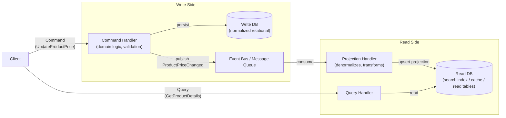

# [BEE-102] CQRS

:::info
Separate read and write models for systems where reads and writes have fundamentally different scaling, complexity, or performance requirements.
:::

## Context

Most applications start with a single model that serves both reads and writes. A `Product` entity is fetched from the database, mutated by business logic, and persisted back. The same representation is also queried and returned to API consumers. This works well for simple CRUD.

As systems grow, the read path and the write path often diverge sharply:

- Reads are far more frequent than writes (product catalog: thousands of reads per second, dozens of writes per minute).
- Reads need denormalized, pre-joined data optimized for specific views; writes need normalized, consistent data with strong validation.
- Reads can tolerate some staleness; writes require strict consistency guarantees.
- Read queries grow complex -- multi-table joins, full-text search, aggregations -- while write operations remain focused on a single aggregate.

Forcing both through the same model means the write model is polluted with query conveniences, and the read model is burdened with write-side invariants. Neither is done well.

Command Query Responsibility Segregation (CQRS) addresses this by using separate models: one for writes (commands) and one for reads (queries). The pattern was named and developed by Greg Young around 2010, drawing on Bertrand Meyer's earlier Command Query Separation (CQS) principle at the method level. Martin Fowler's CQRS article on his bliki is the canonical concise reference.

### Command Query Separation (CQS) -- the Foundation

CQS is a method-level principle: a method should either perform an action (command, which changes state) or return data (query, which does not change state) -- but never both.

```
// Violates CQS: mutates state AND returns the new value
int incrementAndReturn(int x) { return ++x; }

// CQS-compliant: separate operations
void increment(int x) { ... }     // command
int getValue() { return x; }      // query
```

CQRS scales this principle to the architectural level: separate models, separate stacks, sometimes separate services.

## Principle

### The Two Models

**The write model** (command side) owns:
- Domain logic and invariants
- Validation and authorization
- Aggregate state mutations
- Event publication

**The read model** (query side) owns:
- Denormalized, pre-computed projections
- Query-optimized storage (may differ from the write store)
- No business logic -- it assembles views

Commands flow to the write model. Queries flow to the read model. The two never mix at runtime.

### CQRS Without Event Sourcing (the Simple Form)

CQRS does not require event sourcing. In the simplest form:

1. A command is handled by the write model, which updates a relational write database.
2. An event or message (e.g., `ProductPriceChanged`) is published.
3. A projection handler consumes the event and updates a read database (which may be the same database in a separate table or a separate store such as Redis or Elasticsearch).
4. Queries read from the read database.

This form adds meaningful complexity; adopt it only when the problem justifies it.

### CQRS With Event Sourcing (the Full Form)

When combined with event sourcing (see BEE-223), the write model never stores current state directly. Instead:

1. Commands produce domain events (`PriceChanged { productId, oldPrice, newPrice, timestamp }`).
2. Events are appended to an immutable event log (the event store).
3. Aggregate state is reconstructed by replaying events.
4. Projections consume the event stream to build read models.

Event sourcing provides a complete audit log and enables replaying history to rebuild projections or create new ones. It also introduces significant complexity. Use the full form only when you need the audit log or temporal query capabilities, not merely because you are using CQRS.

### Eventual Consistency Between Models

The read model is updated asynchronously after the write model commits. There is a window -- typically milliseconds to seconds -- where the read model does not yet reflect the latest write. This is **eventual consistency**, and it is inherent to the pattern.

This is not a defect; it is a design trade-off. Teams must understand and communicate it. User interfaces may need to optimistically update client-side state to mask the lag, or show stale-data indicators.

### Materialized Views and Projections

A **projection** is a purpose-built read model for a specific query. Rather than one denormalized "everything" table, build projections for each consumer:

- `product_search_view` -- optimized for full-text search, includes category path and tag array
- `product_pricing_view` -- only `id`, `price`, `currency`, `effective_from` -- for pricing checks
- `product_admin_view` -- full detail for backoffice editing

Each projection is rebuilt by replaying the event stream (or re-consuming change events). Multiple projections can coexist for the same write-side aggregate.

## Visual

CQRS architecture with event-driven projection update:



## Example

**Product catalog: price change flowing through CQRS**

Suppose a product manager raises the price of a product from $29.99 to $34.99.

**Write side (command flow):**

```
POST /commands/update-product-price
{
  "productId": "prod-8821",
  "newPrice": 34.99,
  "currency": "USD",
  "effectiveFrom": "2026-04-07T00:00:00Z"
}
```

The command handler:
1. Loads the `Product` aggregate from the write DB.
2. Validates: price must be positive, user must have pricing permission.
3. Applies the change: `product.updatePrice(34.99, USD, effectiveFrom)`.
4. Persists the updated row in the relational write DB.
5. Publishes `ProductPriceChanged { productId, oldPrice: 29.99, newPrice: 34.99, currency, effectiveFrom }` to the event bus.

**Read side (projection update):**

The projection handler receives `ProductPriceChanged` and updates two read models:

```sql
-- Update the pricing projection (used by checkout service)
UPDATE product_pricing_view
SET price = 34.99, effective_from = '2026-04-07T00:00:00Z'
WHERE product_id = 'prod-8821';

-- Update the search index document (used by catalog API)
-- Elasticsearch upsert with new price field
```

**Query (read flow):**

```
GET /products/prod-8821
```

The query handler reads directly from `product_search_view` in the read store, returning the denormalized document with category path, images, tags, and the updated price -- no joins required.

**The consistency window:** A customer who queries within 50--200 ms of the command completing may still see the old price. This is acceptable for a product catalog. It would not be acceptable for a bank balance. Know your consistency requirements before adopting CQRS.

## When CQRS Pays Off

Apply CQRS when at least one of the following is true:

| Condition | Why CQRS helps |
|---|---|
| Read/write ratio is highly asymmetric (e.g., 1000:1 reads) | Scale the read model independently; avoid burdening the write model with query performance |
| Read queries are complex (multi-join, full-text, aggregation) | Maintain a purpose-built read model; avoid query complexity in the domain model |
| Write-side domain is complex with rich invariants | Keep the write model focused on correctness; do not pollute it with read conveniences |
| You need multiple representations of the same data | Build multiple projections from one event stream |
| You need an audit trail of all state changes | Combine with event sourcing (BEE-223) |

## Common Mistakes

1. **Using CQRS for simple CRUD.** A user settings screen with a handful of fields does not need CQRS. The overhead of two models, an event bus, and asynchronous projections is unjustified. Apply CQRS selectively, to subsystems with genuine read/write asymmetry or domain complexity.

2. **Expecting immediate consistency between read and write models.** The read model is updated asynchronously. If a user submits a form and immediately re-fetches the page, they may see the old state. Teams that do not plan for this produce confusing bugs. Design the UI and API contracts with eventual consistency in mind.

3. **CQRS without understanding eventual consistency implications.** Teams adopt CQRS for its performance story but do not think through which operations genuinely require consistency. Not all queries can tolerate stale data (post-payment confirmation, inventory reservation checks). Identify these up front and either route them to the write store or design compensating mechanisms.

4. **Coupling CQRS with event sourcing when you don't need event sourcing.** CQRS and event sourcing are separate patterns that pair well, but neither requires the other. Dragging in event sourcing (aggregate replay, snapshot strategies, projection rebuilds) for a system that only needs a faster read path adds months of complexity for no gain.

5. **One giant read model instead of purpose-built projections.** Building a single `everything_view` with all fields flattened together recreates the original single-model problem on the read side. Build projections for specific consumers: the checkout service projection, the search API projection, the admin dashboard projection. Each is small, focused, and independently evolvable.

## Related BEPs

- [BEE-101](101.md) -- DDD Essentials: domain events produced by aggregates are the natural feed for CQRS projections
- [BEE-103](103.md) -- Hexagonal Architecture: command handlers and query handlers are application services; hexagonal architecture defines where they live
- [BEE-163](163.md) -- Saga Pattern: sagas orchestrate multi-step commands; CQRS applies within each step
- [BEE-223](223.md) -- Event Sourcing: the full form of CQRS uses an event store as the authoritative write side

## References

- Fowler, M. 2011. "CQRS." https://martinfowler.com/bliki/CQRS.html
- Fowler, M. 2005. "CommandQuerySeparation." https://martinfowler.com/bliki/CommandQuerySeparation.html
- Young, G. 2010. "CQRS and Event Sourcing." http://codebetter.com/gregyoung/2010/02/13/cqrs-and-event-sourcing/
- Microsoft. 2023. "CQRS Pattern." https://learn.microsoft.com/en-us/azure/architecture/patterns/cqrs
- Microsoft. 2023. "Applying CQRS and CQS approaches in a DDD microservice." https://learn.microsoft.com/en-us/dotnet/architecture/microservices/microservice-ddd-cqrs-patterns/eshoponcontainers-cqrs-ddd-microservice
