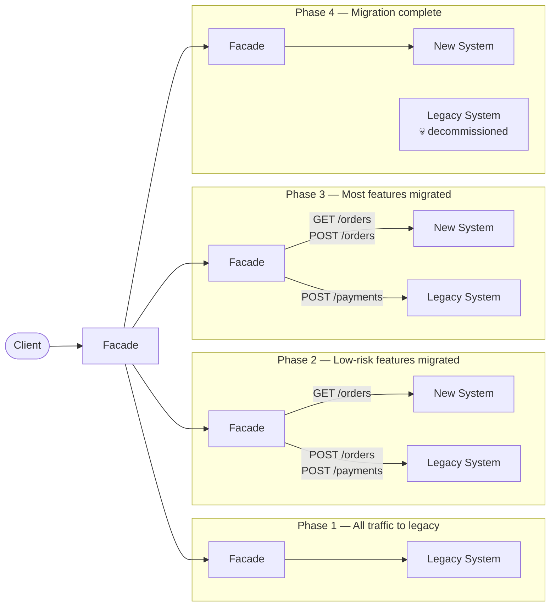

# [BEP-104] Strangler Fig Pattern

:::info
Incrementally replace a legacy system by growing a new system around it -- route by route, feature by feature -- until the old system can be decommissioned.
:::

## Context

Large backend systems accumulate years of business logic, tribal knowledge, and undocumented behavior. At some point the cost of changing that system exceeds the cost of replacing it. The instinctive response is a "big-bang rewrite": freeze the old system, build the new one from scratch, then cut over on a fixed date.

Big-bang rewrites almost always fail or exceed budget. The new system re-discovers every edge case the old system handled by accident. The cutover date slips. The business loses confidence. Teams end up maintaining both systems indefinitely anyway, but without a plan.

Martin Fowler coined the term **Strangler Fig Application** in 2004 after observing how strangler fig plants behave in Australian rainforests: a fig seed germinates in the canopy of a host tree, grows roots down to the soil, and over years wraps the host completely. Eventually the host dies and rots away, leaving the fig standing in its place. The host never experiences a single catastrophic event -- the fig simply grows until the host is no longer needed.

The same strategy works for software systems. The new system grows alongside the old, handling more traffic over time, until the old system handles nothing and can be shut down safely.

## Principle

**Route traffic through a facade. Migrate feature by feature. Decommission when migration is complete.**

Three mechanisms work together:

1. **Facade (proxy layer)** -- A routing layer sits in front of both systems. Clients call the facade; the facade decides whether to forward each request to the legacy system or the new system. Clients are unaware any migration is happening.

2. **Incremental migration** -- Functionality moves to the new system one bounded slice at a time: one endpoint, one domain capability, one service. Each migration is independent and can be rolled back by updating the facade's routing rules.

3. **Decommission as the final step** -- Migration is not done until the old system is off. Running both systems indefinitely is not a success state -- it doubles operational burden and maintenance cost.

### Migration Phases

| Phase | Traffic distribution | State |
|-------|---------------------|-------|
| 1 | 100% legacy | Facade deployed, no routing changes yet |
| 2 | Mix -- new handles low-risk features | Incremental migration in progress |
| 3 | Mix -- new handles most features | Late migration, legacy handles residual |
| 4 | 100% new | Legacy decommissioned |

The boundary between phases is not a single date. Each feature moves on its own schedule, and the system as a whole drifts from Phase 1 toward Phase 4 over weeks or months.

## Diagram



## Example: Order Processing System Migration

An e-commerce platform runs a monolithic order processing system that handles order listing, order creation, and payment processing. The team wants to migrate to a new system without a big-bang cutover.

### Migration order: risk-driven

Start with the lowest-risk capability and finish with the highest.

| Step | Capability | Risk | Reason |
|------|-----------|------|--------|
| 1 | Read-only order listing | Low | Read-only; rollback is trivial |
| 2 | Order creation | Medium | Writes; requires data sync |
| 3 | Payment processing | High | Money movement; maximum care |

### Phase 1: Facade deployed, all traffic to legacy

```yaml
# proxy routing rules -- Phase 1
routes:
  - path: /orders
    methods: [GET, POST]
    backend: legacy
  - path: /payments
    methods: [POST]
    backend: legacy
```

The facade is in place but makes no routing changes. This establishes the foundation for all future phase transitions.

### Phase 2: Read-only order listing migrated

The new system implements `GET /orders`. It reads from a replicated copy of the legacy database (read replica or CDC-synced table). The facade routes reads to the new system and writes to legacy.

```yaml
# proxy routing rules -- Phase 2
routes:
  - path: /orders
    methods: [GET]
    backend: new          # migrated: read-only order listing
  - path: /orders
    methods: [POST]
    backend: legacy
  - path: /payments
    methods: [POST]
    backend: legacy
```

Rollback: change `GET /orders` back to `legacy`. No data is at risk.

### Phase 3: Order creation migrated

The new system handles order creation. Both systems now write orders, so data must stay synchronized.

**Dual-write strategy during transition:**

```typescript
// proxy layer during Phase 3 order creation
async function handleCreateOrder(req: Request): Promise<Response> {
  // Write to new system (source of truth going forward)
  const newResponse = await newSystem.post('/orders', req.body);

  // Mirror write to legacy (keeps legacy consistent for features not yet migrated)
  await legacySystem.post('/orders', req.body).catch(err => {
    log.warn('Legacy mirror write failed', { orderId: newResponse.id, err });
    // Non-fatal: new system is authoritative
  });

  return newResponse;
}
```

```yaml
# proxy routing rules -- Phase 3
routes:
  - path: /orders
    methods: [GET, POST]
    backend: new          # migrated: listing + creation
  - path: /payments
    methods: [POST]
    backend: legacy       # not yet migrated
```

### Phase 4: Payment processing migrated, legacy decommissioned

```yaml
# proxy routing rules -- Phase 4
routes:
  - path: /orders
    methods: [GET, POST]
    backend: new
  - path: /payments
    methods: [POST]
    backend: new          # migrated: payment processing
```

Legacy system traffic drops to zero. Monitor for one release cycle, then decommission.

### Data migration strategies

| Technique | Use when |
|-----------|---------|
| Read replica | New system reads legacy data before owning writes |
| Dual write | Both systems accept writes during transition; one is authoritative |
| Change Data Capture (CDC) | Legacy DB streams row-level changes to new system via Debezium or similar |
| Backfill migration | Batch job copies historical data to new schema before cutover |

See [BEP-126] for database migration strategies in depth.

## Measuring Progress

Migration progress must be tracked quantitatively, not by intuition.

**Traffic share metric** -- Percentage of requests handled by the new system per endpoint group. Target moves from 0% toward 100%.

**Feature parity checklist** -- For every capability in the legacy system, track: (a) new system has equivalent behavior, (b) covered by automated tests, (c) tested in production with shadow traffic or canary.

**Shadow mode validation** -- Before cutting over a high-risk feature, route the request to both systems in parallel, return the legacy response, and log any divergence between the two responses. Resolve all divergence before the cutover.

```
Shadow mode (payment processing):
  Request → Facade → Legacy  → return response to client
                   → New     → log response diff only (no client impact)
  
  Monitor: diff rate should reach 0% before cutover
```

**Decommission criteria** -- Migration is done when:
- All routes serve 100% from the new system
- Legacy system receives zero production traffic for a defined observation period (e.g., two weeks)
- All data has been migrated and verified
- Legacy system has been removed from infrastructure

## Common Mistakes

### 1. Big-bang rewrite instead of incremental migration

Stopping all feature work on the legacy system, spending 12+ months building the new system in isolation, and scheduling a single cutover date is not the strangler fig pattern. It is a big-bang rewrite with a new name. The result is the same: the new system misses edge cases, the date slips, and the business loses confidence. The strangler fig only works if the new system handles real production traffic from day one.

### 2. No rollback plan

Every routing rule change must be reversible in under five minutes. If a team cannot route `POST /orders` back to legacy instantly when the new system misbehaves, they are not applying the pattern safely. Routing rules belong in configuration, not in code that requires a deployment to change.

### 3. Running both systems indefinitely

Leaving both systems running once the migration is "mostly done" is a common failure mode. Two systems mean double the operational burden, double the deployment pipelines, double the on-call surface. The strangler fig pattern ends with decommissioning the old system. If there is no explicit decommission milestone, the migration is not complete.

### 4. Not measuring feature parity

Teams often assume the new system matches the old one. It rarely does on the first attempt. Without explicit parity tests -- covering the full behavior of each migrated feature, including error responses, edge cases, and performance -- differences surface in production at the worst moment. Shadow mode and contract tests (comparing new system output against legacy) are the standard tools.

### 5. Data synchronization ignored

When writes split across two systems, the data invariants from the legacy system must be maintained in both. Missing a dual-write, a CDC lag, or a schema difference leads to silent data divergence that only surfaces later. Map every write path and every read path before migrating any capability that involves state.

## Relationship to Other Patterns

- **BEP-100 (Monolith to Microservices)** -- The strangler fig is the recommended migration strategy when decomposing a monolith. BEP-100 defines the architectural destination; BEP-104 describes how to get there without stopping traffic.
- **BEP-101 (Domain-Driven Design)** -- DDD bounded contexts map directly to strangler fig migration units. Migrate one bounded context at a time; context boundaries give you natural seams where the facade can split traffic.
- **BEP-126 (Database Migrations)** -- Data migration runs in parallel with service migration. BEP-126 covers the techniques (dual writes, CDC, backfill) in depth.

## References

- [Martin Fowler -- StranglerFigApplication (2004)](https://martinfowler.com/bliki/StranglerFigApplication.html)
- [Microsoft Azure Architecture Center -- Strangler Fig Pattern](https://learn.microsoft.com/en-us/azure/architecture/patterns/strangler-fig)
- [AWS Prescriptive Guidance -- Strangler Fig Pattern](https://docs.aws.amazon.com/prescriptive-guidance/latest/cloud-design-patterns/strangler-fig.html)
- [Thoughtworks -- Embracing the Strangler Fig Pattern for Legacy Modernization](https://www.thoughtworks.com/en-us/insights/articles/embracing-strangler-fig-pattern-legacy-modernization-part-one)
- [Confluent -- Strangler Fig (event streaming approach)](https://developer.confluent.io/patterns/compositional-patterns/strangler-fig/)
- BEP-100: Monolith vs Microservices vs Modular Monolith
- BEP-101: Domain-Driven Design Essentials
- BEP-126: Database Migrations
