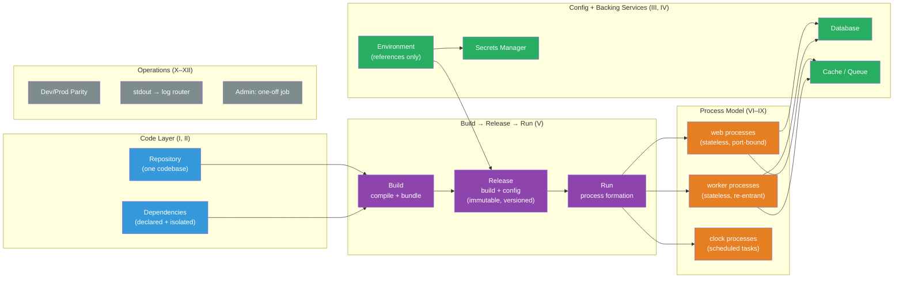

# [BEE-486] The Twelve-Factor App Methodology

:::info
The Twelve-Factor App is a methodology for building software-as-a-service applications that are portable across execution environments, deployable without server administration, and horizontally scalable — distilled from patterns observed across thousands of applications deployed to the Heroku platform.
:::

## Context

Adam Wiggins and the Heroku engineering team published the Twelve-Factor App at 12factor.net in 2011. Heroku, founded in 2007, was by then operating thousands of application deployments. Engineers repeatedly observed the same categories of failure — config mixed into code, processes storing local state that prevented scaling, log files filling disks on production servers — and the same approaches that made applications easy to deploy, scale, and operate. The methodology distills those observations into twelve named principles. As the site states: "This document synthesizes all of our experience and observations on a wide variety of software-as-a-service apps in the wild."

The document was explicitly formatted after Martin Fowler's *Patterns of Enterprise Application Architecture* — the intent was to create a shared vocabulary for systemic problems rather than a compliance checklist. A team that understands *why* each factor exists applies better judgment in edge cases than one mechanically checking boxes.

The twelve factors predate Docker (2013), Kubernetes (2014), and the founding of the CNCF (2015), yet Docker and Kubernetes independently converged on the same architectural principles and operationalized them: immutable images realize Factor V, `ConfigMaps` and `Secrets` realize Factor III, HorizontalPodAutoscaler realizes Factor VIII, container stdout capture realizes Factor XI. The methodology's durability comes from addressing the fundamental tension between application code and its execution environment — a tension that containers and orchestrators reformulate but do not eliminate.

Kevin Hoffman's *Beyond the Twelve-Factor App* (O'Reilly, 2016) identified three gaps in the original methodology — API-first design, telemetry, and authentication/authorization — gaps made visible by the industry's move to microservices. In November 2024, Heroku open-sourced the methodology on GitHub, enabling community-driven evolution of the standard.

## The Twelve Factors

### Code and Dependencies (I, II)

**I — Codebase**: One codebase tracked in revision control; many deploys. Each application has exactly one repository (or one root commit in a monorepo context). Multiple running environments — production, staging, local development — are *deploys* of that single codebase at different versions. Shared code between applications lives in a versioned library published to a package registry, not copy-pasted across repositories.

**II — Dependencies**: Explicitly declare and isolate all dependencies. A twelve-factor app never relies on the implicit presence of system-wide packages. Every dependency is declared in a manifest (`requirements.txt`, `package.json`, `go.mod`, `Gemfile`) and isolated from system packages during execution (`venv`, `node_modules`, Go module cache, Bundler). Both declaration *and* isolation are required — declaration without isolation allows system packages to satisfy dependencies silently, making the build non-reproducible.

The 2016 npm `left-pad` incident (a single 11-line package deletion breaking thousands of builds worldwide) demonstrated that declaration alone is insufficient: supply chain integrity (lock files with checksums, private registries, SBOM generation) has become a necessary extension of Factor II that the 2011 document did not anticipate.

### Configuration and Backing Services (III, IV)

**III — Config**: Store config in the environment. Config is everything that varies between deploys: database URLs, API credentials, per-environment hostnames, feature flags tied to environment. Config that does not vary between deploys (application routing, module wiring) is not Factor III config.

The prescription is to read config from environment variables — not from config files committed to the repository, and explicitly not from environment-grouped config files (`config/production.py`, `config/development.py`) which create a combinatorial explosion of named groups as the deployment surface grows.

**Critical nuance**: The factor specifies what the application *reads from* (the environment), not what the environment *contains*. Environment variables are an inadequate mechanism for secrets: they are visible in `/proc/<PID>/environ`, routinely captured in full by error reporting frameworks (Sentry, Rollbar), inherited by all child processes regardless of need, and carry no audit trail or rotation support. The reconciled modern pattern: store a *reference* (an ARN, a Vault path) in the environment variable; the application fetches the actual secret at startup from a secrets manager using a platform identity (IAM role, workload identity). The application still reads from the environment; the raw secret never appears in the environment.

**IV — Backing Services**: Treat all external services the app consumes over the network as attached resources. This includes databases, caches, queues, SMTP servers, and third-party APIs. The code makes no distinction between a "local" database and an "Amazon RDS" database — both are accessed via a URL in config. Swapping the local PostgreSQL for a managed cloud instance requires only a config change, not a code change. An app can itself become a backing service for another app, accessed via its bound port URL.

### Build, Release, Run (V)

**V — Build, release, run**: Strictly separate the three stages. The *build stage* converts a commit into an executable artifact (compiled binary, Docker image). The *release stage* combines the build artifact with deployment-specific config to produce an immutable, uniquely identified release. The *run stage* executes a selected release.

Releases are append-only and immutable — a release can never be mutated after creation. Any change (code or config) produces a new release. Rollback means switching the run stage to a previous release ID. This implies CI/CD automation: a pipeline that produces artifacts, tags them with the commit SHA, and deploys by updating the running target to the new artifact.

Violating this separation — SSH into production, edit a file, restart the process — makes the running system's state unknowable from version control. The deployed artifact and the repository diverge immediately.

### The Process Model (VI, VII, VIII, IX)

**VI — Processes**: Execute the app as one or more stateless, share-nothing processes. Any data that must persist beyond a single request lives in a backing service (a database, Redis, S3). Local memory and disk may be used as a transient scratch space within a single transaction, but this state is never assumed to survive a process restart.

Sticky sessions — routing a user's subsequent requests to the same process instance because that instance caches their session in local memory — violate this factor. Session state belongs in a time-expiring external store (Redis, Memcached) reachable by all process instances.

Tension exists with ML inference services that load large model weights into memory: the weights are read-only and change only on model updates — they are better understood as a static, read-only process-level asset analogous to compiled bytecode. Mutable session state (conversation history, user context) still belongs in an external store.

**VII — Port binding**: Export services via port binding. The app is self-contained: it loads a web server library as a declared dependency and binds to a port provided by the environment (`$PORT`). Nothing is injected by the execution environment. In production, a routing layer (load balancer, Kubernetes Service + Ingress) forwards requests from public hostnames to the bound port; the app is unaware of that layer.

**VIII — Concurrency**: Scale out via the process model. Work is typed into process types: `web` processes handle HTTP, `worker` processes handle background jobs, `clock` processes run scheduled tasks. The collection of process types and instance counts is the *process formation*. Scaling means adding more process instances of the appropriate type — not adding more threads within a single process, not vertically scaling to a larger server. Individual processes may internally use threads, async I/O, or coroutines, but the primary scaling lever is instance count.

**IX — Disposability**: Maximize robustness with fast startup and graceful shutdown. Processes must handle `SIGTERM` by stopping new work and completing (or re-queueing) current work before exiting. Web processes allow in-flight HTTP requests to finish. Worker processes NACK the current job back to the queue before exiting so another worker can pick it up. Jobs must be re-entrant: safe to execute multiple times or resume mid-execution after interruption. Apps must also survive sudden non-graceful termination — crash-only design, not clean-shutdown-only design.

### Operations and Environment (X, XI, XII)

**X — Dev/prod parity**: Keep development, staging, and production as similar as possible across three dimensions: time (hours between commit and production, not weeks), personnel (developers participate in deployment and monitoring), and tools (same backing services at same versions across environments). Using SQLite locally when PostgreSQL runs in production introduces real bugs from SQL dialect differences. Docker Compose makes tool parity achievable at low cost.

**XI — Logs**: Treat logs as event streams. The app writes its event stream, unbuffered, to `stdout`. It has no opinion about routing or storage. The execution environment captures those streams and routes them to their destination (log aggregator, data warehouse, alerting system). In development, the engineer reads the stream directly in the terminal. In production, the platform's log router (Kubernetes node log agent, Fluentd, Filebeat) captures and forwards.

This factor is necessary but insufficient for production observability. Logs alone do not provide RED metrics (rate, errors, duration) or distributed traces across service boundaries. Modern production systems require all three observability pillars — logs, metrics, and traces — in the framework outlined by Charity Majors and others; Factor XI covers only the first.

**XII — Admin processes**: Run administrative and management tasks as one-off processes in the same environment as the regular application. Database migrations, data repair scripts, REPL access to live data — these must run using the same codebase, the same dependencies, and the same config as the deployed application. Admin code ships with the app code and is subject to the same release process. In Kubernetes, this maps to `kubectl exec` into a running pod, or more correctly to a Kubernetes `Job` that runs the app image with an overridden command.

## Best Practices

**MUST separate config from code** — no credentials, database URLs, or environment-specific values in committed files. Twelve-factor apps must be open-sourceable without exposing any secrets. A simple test: could the codebase be made public today without compromising any credential?

**MUST handle SIGTERM and implement graceful shutdown.** The most commonly omitted factor in practice. Kubernetes sends SIGTERM before SIGKILL (default 30-second grace period); processes that ignore SIGTERM are force-killed, potentially dropping in-flight requests, corrupting job state, or leaving locks unreleased. Signal handling must be explicit — most web frameworks do not implement graceful shutdown by default.

**MUST NOT store session state in local process memory.** Sticky sessions prevent horizontal scaling and create invisible state loss on process restart. Use Redis or an equivalent external store with an appropriate TTL.

**SHOULD use a secrets manager rather than raw environment variables for sensitive values.** Store references in environment variables; fetch actual secrets at startup from Vault, AWS Secrets Manager, or a cloud-equivalent. This maintains Factor III compliance while adding rotation, audit logging, and least-privilege access control.

**SHOULD use Docker Compose (or equivalent) to run production-equivalent backing services locally.** `postgres:16`, `redis:7-alpine`, and `rabbitmq:3.13-management` run locally at the same versions as production. SQLite-in-dev / PostgreSQL-in-prod is a well-documented source of production bugs.

**SHOULD produce fully immutable release artifacts.** A Docker image tagged with the commit SHA, pushed to a registry, and deployed by changing the image tag in the Deployment spec realizes Factor V completely. The artifact is immutable; the deploy history is auditable; rollback is a one-line command.

**MAY use environment-file tooling (`direnv`, `docker-compose --env-file`)** to populate the environment from local files without committing those files. The files must be in `.gitignore`. This is compliant with Factor III — the factor specifies that the app reads from the environment; it does not specify how the environment is populated.

## Visual



## Example

**Factor III — config from environment with secrets manager reconciliation:**

```python
import os
import json
import boto3

# Twelve-factor: read config from the environment.
# Non-sensitive config: raw values in env vars are fine.
PORT = int(os.environ["PORT"])
LOG_LEVEL = os.environ.get("LOG_LEVEL", "INFO")
REDIS_URL = os.environ["REDIS_URL"]  # URL only, no credentials embedded

# Sensitive config: environment holds a reference, not the raw secret.
# The application fetches the actual value from a secrets manager at startup.
# This is Factor III-compliant: the app still reads from the environment.
_secret_arn = os.environ["DATABASE_SECRET_ARN"]
_sm = boto3.client("secretsmanager", region_name=os.environ["AWS_REGION"])
_secret = json.loads(_sm.get_secret_value(SecretId=_secret_arn)["SecretString"])
DATABASE_URL = (
    f"postgresql://{_secret['username']}:{_secret['password']}"
    f"@{_secret['host']}:{_secret['port']}/{_secret['dbname']}"
)
```

**Factor VI — stateless session storage in Redis:**

```python
import os, json, uuid, redis
from flask import Flask, request, jsonify

app = Flask(__name__)
# Backing service: session store in Redis, not in process memory
_r = redis.from_url(os.environ["REDIS_URL"])
SESSION_TTL_SECONDS = 3600

@app.post("/login")
def login():
    user_id = authenticate(request.json)   # validates credentials
    token = str(uuid.uuid4())
    # State lives in Redis — any process instance can serve subsequent requests
    _r.setex(f"session:{token}", SESSION_TTL_SECONDS, json.dumps({"user_id": user_id}))
    return jsonify({"token": token})

@app.get("/me")
def me():
    token = request.headers.get("Authorization", "").removeprefix("Bearer ")
    raw = _r.get(f"session:{token}")
    if not raw:
        return jsonify({"error": "unauthorized"}), 401
    return jsonify(json.loads(raw))
```

**Factor IX — graceful shutdown on SIGTERM:**

```python
import os, signal, sys, threading
from http.server import HTTPServer

server = HTTPServer(("0.0.0.0", int(os.environ["PORT"])), RequestHandler)
_shutdown_event = threading.Event()

def _handle_sigterm(signum, frame):
    # Stop accepting new connections; let in-flight requests complete.
    # Kubernetes waits terminationGracePeriodSeconds (default 30s) before SIGKILL.
    print("SIGTERM received — starting graceful shutdown", flush=True)
    threading.Thread(target=server.shutdown).start()  # non-blocking
    _shutdown_event.set()

signal.signal(signal.SIGTERM, _handle_sigterm)
signal.signal(signal.SIGINT, _handle_sigterm)

server.serve_forever()
_shutdown_event.wait()
sys.exit(0)
```

**Factor XI — structured stdout logging (no log files):**

```python
import logging, sys, json

class JSONFormatter(logging.Formatter):
    """Emit one JSON object per line to stdout — platform routes and aggregates."""
    def format(self, record):
        return json.dumps({
            "time": self.formatTime(record),
            "level": record.levelname,
            "logger": record.name,
            "message": record.getMessage(),
            **(record.__dict__.get("extra_fields", {})),
        })

handler = logging.StreamHandler(sys.stdout)   # stdout, not a file
handler.setFormatter(JSONFormatter())
logging.basicConfig(handlers=[handler], level=logging.INFO)
# The process does not configure log rotation, file paths, or log shipping.
# The container runtime captures stdout; a node agent (Fluentd/Filebeat) ships it.
```

**Factor XII — database migration as one-off process (Kubernetes Job):**

```yaml
# migration-job.yaml — runs the same image as the Deployment, overriding the command
apiVersion: batch/v1
kind: Job
metadata:
  name: migrate-v2-42
spec:
  template:
    spec:
      restartPolicy: Never
      containers:
        - name: migrate
          image: myapp:v2.42           # same image as the running Deployment
          command: ["python", "manage.py", "migrate", "--no-input"]
          envFrom:
            - secretRef:
                name: myapp-secrets    # same config as the Deployment
```

## Limitations and Evolution

**Factor III and secrets**: Raw environment variables are insufficient for production secrets. The factor's prescription must be extended with a secrets manager for any value that is sensitive. This is widely understood in the industry; the factor's intent (config separate from code, readable at runtime) is preserved by the reference-plus-fetch pattern.

**Factor XI and observability**: Logs alone do not constitute production observability. Metrics (Prometheus, Datadog) and distributed traces (OpenTelemetry, Jaeger) are required for diagnosing latency and cross-service failures. Factor XI's prescription remains correct — write to stdout — but the output should be structured JSON that observability platforms can ingest as structured data, not free-form text.

**Kevin Hoffman's three additions** (*Beyond the Twelve-Factor App*, O'Reilly, 2016): Factor 13 — API First (define service contracts before implementation, critical for microservices); Factor 14 — Telemetry (APM, domain metrics, and health endpoints in addition to logs); Factor 15 — Authentication and Authorization (security on every endpoint, not an afterthought). The Twelve-Factor team's own 2024 evolution proposal includes an Identity factor, validating these gaps.

**Factor VIII and vertical scaling**: The factor's horizontal-only stance is directionally correct but too absolute. Kubernetes VerticalPodAutoscaler (VPA) exists for workloads — particularly memory-intensive stateful components — where vertical scaling is the appropriate lever. A mix of horizontal and vertical scaling is modern practice.

## Related BEEs

- [BEE-32](../Security/32.md) -- Secrets Management: the modern extension of Factor III — Vault, AWS Secrets Manager, and the reference-plus-fetch pattern
- [BEE-361](../CI-CD/361.md) -- Deployment Strategies: Factor V's immutable releases are the prerequisite for canary, blue-green, and rolling deployment patterns
- [BEE-164](../Transactions and Data Integrity/164.md) -- Idempotency and Exactly-Once Semantics: Factor IX (disposability) requires re-entrant jobs — idempotency is the implementation mechanism
- [BEE-320](../Observability/320.md) -- The Three Pillars: Logs, Metrics, Traces: the full observability picture that Factor XI alone does not provide
- [BEE-453](../Distributed Systems/453.md) -- Graceful Shutdown and Connection Draining: the operational mechanics of Factor IX in a Kubernetes deployment
- [BEE-364](../CI-CD/364.md) -- Container Fundamentals: Docker operationalizes Factors II, V, VII, and IX directly; understanding containers contextualizes the whole methodology

## References

- [The Twelve-Factor App — Adam Wiggins and Heroku Engineering (2011)](https://12factor.net/)
- [Beyond the Twelve-Factor App — Kevin Hoffman (O'Reilly, 2016)](https://www.oreilly.com/library/view/beyond-the-twelve-factor/9781492042631/)
- [Heroku Open-Sources Twelve-Factor App Definition (November 2024)](https://www.heroku.com/blog/heroku-open-sources-twelve-factor-app-definition/)
- [Twelve-Factor App Anno 2022 — CNCF Blog (Anders Qvist)](https://www.cncf.io/blog/2022/04/28/twelve-factor-app-anno-2022/)
- [Twelve-Factor Config: Misunderstandings and Advice — Kristian Glass](https://blog.doismellburning.co.uk/twelve-factor-config-misunderstandings-and-advice/)
- [Storing Secrets in Env Vars Considered Harmful — Arcjet](https://blog.arcjet.com/storing-secrets-in-env-vars-considered-harmful/)
