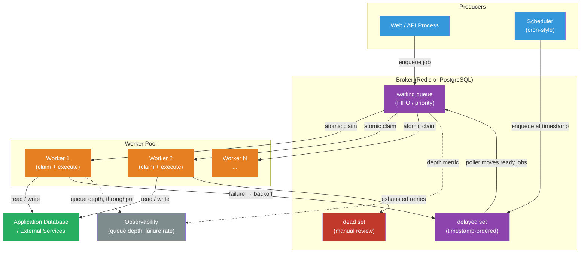

# [BEE-487] Background Job and Task Queue Architecture

:::info
A task queue decouples work from the HTTP request cycle by accepting a job description synchronously, persisting it to a broker, and executing it asynchronously by one or more worker processes — enabling horizontal scaling of compute-intensive, time-consuming, or externally rate-limited operations without blocking the client.
:::

## Context

The HTTP request–response model requires a response within seconds or the client times out and retries. Many operations — sending bulk email, generating reports, processing uploaded media, charging payment batches, running ML inference, syncing with third-party APIs — take far longer or may need to be deferred. The naive solution is to run these operations inline: the request blocks until the work completes, the load balancer timeout fires, the client retries, and the operation runs twice. The systematic solution is to separate the act of accepting work (the request) from performing it (the job), connected by a persistent queue.

Background job systems were first formalized in Ruby's Delayed::Job (Tobias Lütke, Shopify, 2008), which stored jobs in the application's relational database. Sidekiq (Mike Perham, 2012) popularized Redis-backed job queues, demonstrating that a single Ruby process with concurrent threads could outperform Delayed::Job's process-per-job model by an order of magnitude. The pattern spread across ecosystems: Celery (Python, 2009), Bull/BullMQ (Node.js, 2013/2019), Faktory (language-agnostic, Perham, 2017). A parallel lineage of database-native queues — Que (PostgreSQL advisory locks), Oban (Elixir/Ecto), pg-boss (Node.js/PostgreSQL), Solid Queue (Rails) — showed that Postgres's `SELECT FOR UPDATE SKIP LOCKED`, introduced in PostgreSQL 9.5 (2016), made the application database sufficient for most job queue workloads without adding Redis as an operational dependency.

In 2019, Temporal (a fork of Uber's Cadence project by former Uber engineers) introduced **durable execution**: a model where the entire workflow state machine persists to the Temporal service, and worker crashes are recovered transparently via deterministic replay of an append-only event history rather than job re-queuing.

## Design Thinking

### The Job State Machine

Every job progresses through a sequence of states. The canonical state machine:

```
enqueued → active → completed
              ↓
           failed (retriable) → [backoff delay] → enqueued
              ↓
           dead (retries exhausted)
```

Platforms add states for richer semantics:
- **delayed**: scheduled for future execution, or in exponential backoff between retries
- **waiting-children**: parent job blocked until all child jobs complete (BullMQ Flows)
- **paused**: queue administratively paused

Key state transitions:
- **enqueued → active**: a worker atomically claims the job — via `BRPOP`/`BZPOPMIN` from a Redis list, or `SELECT FOR UPDATE SKIP LOCKED` from a PostgreSQL table. Atomicity is critical: two workers must not claim the same job.
- **active → completed/failed**: the worker reports outcome to the broker. If it dies before reporting, the broker must decide what to do.
- **failed → delayed**: the retry mechanism increments the attempt counter and schedules the job for re-execution after a backoff (Sidekiq: `(retry_count ** 4) + 15 + rand(10) * (retry_count + 1)` seconds; 25 retries span ~20 days).
- **failed → dead**: once `max_retries` is exhausted, the job is moved to a dead set — BullMQ's `failed` sorted set, Sidekiq's `dead` sorted set (10,000 job limit, 6-month TTL), Faktory's dead queue. Dead jobs require manual intervention.

### Reliability: At-Least-Once vs Exactly-Once

The fundamental constraint: a job can only be safely removed from the queue *after* the worker confirms completion. If the worker crashes between starting work and confirming success, the broker cannot distinguish a crash from infinite-duration work — it must re-deliver. This produces **at-least-once** semantics: every job runs at least once, but may run more than once.

**Exactly-once processing** is achievable only when the job's side-effect target and the job-tracking store share the same transactional boundary — i.e., when the job queue lives in the same PostgreSQL database as the application data. The "mark job complete" and "apply side effect" steps commit atomically. With Redis-backed queues and a separate application database, the two-phase commit problem makes exactly-once impossible at the infrastructure level; idempotent job logic is required instead.

**Acknowledgement timing** determines the failure mode:
- Acknowledge on fetch (Celery default `task_acks_late=False`): the job is removed from the queue as soon as a worker picks it up. A crash before completion loses the job permanently — at-most-once on crash.
- Acknowledge on completion (`task_acks_late=True`; Sidekiq default): the job stays in the broker until the worker ACKs. A crash means re-delivery — at-least-once.

### The Lost Job Problem

When a Redis-backed worker process is `kill -9`'d mid-job, the job's fate depends on the queue system's design:

**Sidekiq open-source (BasicFetch)**: Jobs are dequeued via `BRPOP`, removing them from Redis before execution begins. A hard kill loses the job permanently. Sidekiq's in-progress tracking hash records what was running for monitoring purposes but cannot recover the lost work.

**Sidekiq Pro (SuperFetch)**: Uses `LMOVE` (formerly `RPOPLPUSH`) to move the job from the shared queue into a *private per-process queue* in Redis before starting work. The job remains in Redis until the worker ACKs. On startup, each Sidekiq Pro process scans for orphaned private queues from processes whose heartbeat has been absent for over 60 seconds and re-enqueues their jobs.

**BullMQ**: Workers hold a lock token on each active job — a Redis key with a TTL of `lockDuration` (default 30,000 ms). Workers renew the lock every `lockDuration / 2` (≈15 s). A separate stalled-job checker scans for jobs whose locks have expired; it moves them back to `waiting` (or to `failed` if `maxStalledCount` is exceeded, default 1). This provides automatic recovery but can produce double execution if a CPU-intensive job starves the event loop long enough to expire its lock while still running.

**PostgreSQL-backed queues**: The worker claims a job within a transaction that flips the row state to `active`. If the worker dies, the PostgreSQL connection drops, the row-level lock releases, and a recovery query can find jobs in `active` state with an expired `locked_at` timestamp and return them to `pending`. The transactional claim makes recovery simpler and more reliable than Redis-based approaches.

## Best Practices

**MUST design job handlers to be idempotent.** At-least-once delivery guarantees that a job may run more than once. A job that sends a payment charge or sends an email must produce the same observable outcome regardless of how many times it executes. Idempotency keys, database upserts, and checking-before-acting patterns are the standard techniques (see [BEE-473](../Distributed Systems/473.md)).

**MUST NOT perform unbounded work inside a single job.** A job that iterates over all records in a large table and processes each one will: (a) exceed the job timeout; (b) hold a large in-memory dataset; (c) restart from zero on failure, re-processing already-completed records. Instead, fan out: one trigger job enqueues N child jobs, one per item (or per page). Each child job is small, independently retryable, and independently tracked.

**SHOULD use a PostgreSQL-backed queue when the job store and application database coexist.** For workloads under ~1 million jobs/day: jobs can be enqueued and application state updated atomically in a single transaction; the Outbox Pattern becomes trivially implementable; operational complexity decreases (no Redis dependency). Libraries: pg-boss (Node.js), Oban (Elixir), Solid Queue (Rails), Que (Ruby).

**SHOULD set explicit timeouts on every job.** A job without a timeout can run indefinitely, holding a worker slot and a lock forever. Set both a hard execution timeout (kill the worker after N seconds) and, for long-running jobs, a heartbeat timeout that allows the broker to detect a stalled but living process.

**SHOULD use exponential backoff with jitter for retries.** Retry all N workers at the same interval after a third-party API goes down, and the first retry wave hammers the recovering API. Add random jitter to spread retries: Sidekiq's formula adds `rand(10) * (retry_count + 1)` seconds; BullMQ supports `jitter` in its backoff configuration.

**MUST monitor queue depth and worker throughput as operational metrics.** Queue depth is the primary signal that the worker pool is undersized for current load. A queue growing without bound while workers are at capacity means: add workers or reduce per-job work. Alert on: queue depth exceeding threshold, job failure rate spike, dead job count increasing.

**SHOULD route jobs to typed worker pools.** CPU-intensive jobs (image processing, PDF generation) should not compete for the same worker slots as fast I/O jobs (webhook delivery). Use separate named queues (`cpu-heavy`, `webhook`) with separate worker pools scaled independently. Priority queues (Sidekiq weighted queues; BullMQ priority field) ensure critical work preempts batch work within a single pool.

**MAY use a durable execution engine (Temporal, Conductor) for workflows with human-scale timeouts, complex branching, or multiple dependent activities.** A standard job queue is optimized for tasks that complete in seconds to minutes. Workflows that span hours, days, or require manual approval steps, saga-style compensations, or complex conditional logic benefit from a workflow engine where the entire execution history is durable.

### Heartbeating for Long-Running Jobs

A job that runs for 20 minutes holds its lock for 20 minutes. If the broker's lock TTL is shorter (BullMQ default: 30 s), the lock expires mid-execution and another worker claims the job — producing parallel execution and likely data corruption.

For long-running jobs, the worker must periodically renew its claim:
- **BullMQ**: lock renewal is automatic (every `lockDuration / 2`), but only while the event loop is unblocked. CPU-bound processors must run in a child process (`sandbox` mode) so the parent can renew locks.
- **Temporal**: `activity.RecordHeartbeat(ctx, progressDetails)` is called explicitly. The SDK throttles calls to `min(heartbeatTimeout * 0.8, 30s)`. The `heartbeatTimeout` should be set to the maximum acceptable silence interval (e.g., 60 s). On missed heartbeat, Temporal re-schedules the activity; the new attempt receives the last heartbeat's `progressDetails`, enabling resumption from a checkpoint rather than restart from zero.
- **Faktory**: workers send `BEAT` every 15 seconds (minimum 5 s, maximum 60 s). Job reservation timeout (`reserve_for`, default 1,800 s) is separate from the worker heartbeat — the reservation must be long enough to cover the job's execution.

### Poison Pills

A poison pill is a job that kills the worker *process* rather than raising a catchable exception — typically through OOM, a segfault in a native extension, or runaway memory allocation. The crash-recovery loop then runs:

1. Job is claimed → worker process dies → job is recovered → re-enqueued → another worker picks it up → same crash → repeat.

Standard retry logic does not protect against this because the exception is never caught.

**Detection**: Track jobs that have been recovered from worker crashes (orphaned private queue recovery in Sidekiq Pro SuperFetch; stalled job detection in BullMQ). If the same job ID has been recovered N times (Sidekiq Pro: 3 times within 72 hours), move it directly to the dead set and alert.

**Mitigation**: Run each job in an isolated subprocess. If the subprocess is killed, the parent survives and can report failure cleanly. BullMQ's sandboxed processors and Celery's prefork pool both isolate at the process level.

## Visual



## Example

**PostgreSQL-backed job queue — the SKIP LOCKED claim pattern:**

```sql
-- Schema: one table, a partial index on pending jobs only
CREATE TABLE jobs (
  id          UUID PRIMARY KEY DEFAULT gen_random_uuid(),
  queue       TEXT NOT NULL DEFAULT 'default',
  payload     JSONB NOT NULL,
  status      TEXT NOT NULL DEFAULT 'pending',  -- pending, active, completed, failed, dead
  priority    INTEGER NOT NULL DEFAULT 0,        -- higher = more important
  run_at      TIMESTAMPTZ NOT NULL DEFAULT NOW(),
  created_at  TIMESTAMPTZ NOT NULL DEFAULT NOW(),
  locked_at   TIMESTAMPTZ,
  locked_by   TEXT,
  retry_count INTEGER NOT NULL DEFAULT 0,
  max_retries INTEGER NOT NULL DEFAULT 25,
  error       TEXT
);

-- Partial index: only indexes pending rows — keeps the index small as completed rows grow
CREATE INDEX ON jobs (queue, priority DESC, run_at ASC)
  WHERE status = 'pending';

-- Worker: atomically claim one job, skipping rows already held by other workers
BEGIN;
  WITH claimed AS (
    SELECT id FROM jobs
    WHERE status = 'pending'
      AND queue   = 'default'
      AND run_at <= NOW()
    ORDER BY priority DESC, run_at ASC
    LIMIT 1
    FOR UPDATE SKIP LOCKED   -- skip rows locked by concurrent workers
  )
  UPDATE jobs
     SET status    = 'active',
         locked_at = NOW(),
         locked_by = 'worker-abc-1'
  FROM claimed
  WHERE jobs.id = claimed.id
  RETURNING id, payload;
COMMIT;
```

```python
# Worker loop — execute, then mark complete or increment retry
def process_next_job(conn, worker_id: str):
    row = claim_job(conn, queue="default", worker_id=worker_id)
    if not row:
        return False  # queue empty

    job_id, payload = row["id"], row["payload"]
    try:
        execute_job(payload)               # idempotent business logic
        conn.execute(
            "UPDATE jobs SET status='completed' WHERE id=%s", (job_id,)
        )
    except Exception as exc:
        conn.execute("""
            UPDATE jobs
               SET status      = CASE WHEN retry_count + 1 >= max_retries
                                      THEN 'dead' ELSE 'pending' END,
                   retry_count = retry_count + 1,
                   locked_at   = NULL,
                   locked_by   = NULL,
                   run_at      = NOW() + INTERVAL '1 second'
                                    * (POWER(retry_count + 1, 4) + 15),
                   error       = %s
             WHERE id = %s
        """, (str(exc), job_id))
    return True
```

**Redis-backed queue — BullMQ worker with lock renewal and sandboxing:**

```typescript
// BullMQ: worker with concurrency and sandbox for CPU-bound jobs
import { Worker, Job } from "bullmq";
import { connection } from "./redis";

// For CPU-intensive processors: use a sandboxed child process
// so the parent event loop can renew job locks uninterrupted
const worker = new Worker(
  "image-processing",
  "./processors/resize.js",   // path to a module-based processor (runs in child process)
  {
    connection,
    concurrency: 4,            // up to 4 concurrent sandboxed child processes
    lockDuration: 60_000,      // job lock TTL: 60 s (must exceed worst-case job duration)
    stalledInterval: 30_000,   // stalled checker runs every 30 s
    maxStalledCount: 2,        // after 2 stalls, job moves to failed (poison pill protection)
  }
);

worker.on("failed", (job: Job | undefined, err: Error) => {
  console.error({ jid: job?.id, attemptsMade: job?.attemptsMade, err: err.message });
  // alert if job has exceeded threshold stall count — likely a poison pill
});
```

```typescript
// processors/resize.js — runs in a sandboxed child process
import { SandboxedJob } from "bullmq";
import sharp from "sharp";

export default async function (job: SandboxedJob) {
  const { inputKey, outputKey, width } = job.data;
  const inputBuffer = await s3.download(inputKey);
  await job.updateProgress(25);               // progress visible in UI
  const output = await sharp(inputBuffer).resize(width).toBuffer();
  await s3.upload(outputKey, output);
  await job.updateProgress(100);
}
```

**Temporal activity with heartbeating for long file processing:**

```go
// activity.go — long-running activity with heartbeat checkpointing
func ProcessLargeFileActivity(ctx context.Context, input FileInput) (FileOutput, error) {
    // Retrieve progress from the last heartbeat (nil on first attempt)
    progress := 0
    if detail := activity.GetHeartbeatDetails(ctx); detail != nil {
        _ = detail.Get(&progress)
    }

    for i := progress; i < input.TotalChunks; i++ {
        if err := processChunk(ctx, input, i); err != nil {
            return FileOutput{}, err
        }

        // Heartbeat every chunk: records progress so the next attempt resumes from i+1
        // heartbeatTimeout is set to 60s on the caller; this must be called at least that frequently
        activity.RecordHeartbeat(ctx, i+1)

        // Check if context was cancelled (e.g., workflow cancelled externally)
        if ctx.Err() != nil {
            return FileOutput{}, ctx.Err()
        }
    }
    return FileOutput{OutputKey: deriveOutputKey(input)}, nil
}
```

```go
// workflow.go — activity options with heartbeat timeout
activityOptions := workflow.ActivityOptions{
    StartToCloseTimeout: 2 * time.Hour,   // budget for a single attempt
    HeartbeatTimeout:    60 * time.Second, // max silence before re-scheduling
    RetryPolicy: &temporal.RetryPolicy{
        InitialInterval:    time.Second,
        BackoffCoefficient: 2.0,
        MaximumInterval:    5 * time.Minute,
        MaximumAttempts:    10,
    },
}
```

## Implementation Notes

**Queue backend choice — PostgreSQL vs Redis:**

| Concern | PostgreSQL | Redis |
|---|---|---|
| Atomic enqueue + app DB update | Yes — single transaction | No — two separate writes |
| Operational dependency | Already present | Additional service |
| Throughput ceiling | ~10K–100K jobs/day for typical workloads; higher with tuning | Millions/day |
| Enqueue latency | 1–5 ms | < 1 ms |
| Persistence | WAL-backed, crash-safe | AOF/RDB (configurable) |
| Dead job visibility | SQL query | Redis CLI / Sidekiq web UI |
| Best fit | SaaS apps with predictable load | High-throughput, latency-sensitive pipelines |

**Celery Beat reliability gap**: Celery Beat is a single-process scheduler with no built-in leader election. Running multiple Beat instances causes duplicate task enqueuing. In production, ensure exactly one Beat process runs (supervisor, Kubernetes single-replica Deployment, or use `django-celery-beat` with a distributed lock). A Beat process failure silently skips job enqueuing — add heartbeat monitoring to detect Beat downtime.

**Worker scaling signal**: Queue depth is the primary horizontal scaling signal. KEDA (Kubernetes Event-Driven Autoscaling) provides native scalers for Redis lists and sorted sets, PostgreSQL queries, RabbitMQ queues, and more — enabling HPA-style autoscaling of worker Deployments driven by queue depth without writing custom metrics adapters.

**Python GIL and Celery**: Celery's `prefork` pool spawns N separate Python processes, bypassing the GIL for true CPU parallelism. The `gevent` and `eventlet` pools use monkey-patched cooperative concurrency for I/O-heavy tasks with lower memory overhead than multiple processes. Choose based on whether tasks are CPU-bound (`prefork`) or I/O-bound (`gevent`/`eventlet`).

## Related BEEs

- [BEE-305](../Performance and Scalability/305.md) -- Asynchronous Processing and Work Queues: the paradigm and motivation behind decoupled async work; this article covers the implementation architecture
- [BEE-164](../Transactions and Data Integrity/164.md) -- Idempotency and Exactly-Once Semantics: job handlers must be idempotent; this article covers the techniques in depth
- [BEE-473](../Distributed Systems/473.md) -- Idempotency Key Implementation Patterns: concrete implementation of idempotent job handlers
- [BEE-472](../Distributed Systems/472.md) -- The Outbox Pattern and Transactional Messaging: PostgreSQL-backed queues enable the Outbox Pattern natively within a single transaction
- [BEE-457](../Distributed Systems/457.md) -- Distributed Job Scheduling: covers cluster-level schedulers (Airflow, Quartz, Kubernetes CronJobs) that sit above single-machine job queues
- [BEE-224](../Messaging and Event-Driven/224.md) -- Dead Letter Queues and Poison Messages: dead job sets in task queues are the DLQ equivalent for message brokers

## References

- [Sidekiq Wiki — GitHub (Mike Perham)](https://github.com/sidekiq/sidekiq/wiki)
- [Sidekiq Reliability / SuperFetch — GitHub Wiki](https://github.com/sidekiq/sidekiq/wiki/Reliability)
- [BullMQ Documentation — docs.bullmq.io](https://docs.bullmq.io/)
- [BullMQ Stalled Jobs — docs.bullmq.io](https://docs.bullmq.io/guide/workers/stalled-jobs)
- [BullMQ Flows — docs.bullmq.io](https://docs.bullmq.io/guide/flows)
- [Temporal Activity Failure Detection — docs.temporal.io](https://docs.temporal.io/encyclopedia/detecting-activity-failures)
- [Temporal Event History — docs.temporal.io](https://docs.temporal.io/encyclopedia/event-history)
- [Celery Periodic Tasks (Beat) — docs.celeryq.dev](https://docs.celeryq.dev/en/stable/userguide/periodic-tasks.html)
- [Faktory Job Payload Format — GitHub Wiki](https://github.com/contribsys/faktory/wiki/The-Job-Payload)
- [pg-boss — GitHub (timgit)](https://github.com/timgit/pg-boss)
- [PostgreSQL SELECT FOR UPDATE SKIP LOCKED — PostgreSQL Docs](https://www.postgresql.org/docs/current/sql-select.html#SQL-FOR-UPDATE-SHARE)
- [PostgreSQL as a Queue Benchmark — Chanks (GitHub Gist)](https://gist.github.com/chanks/7585810)
