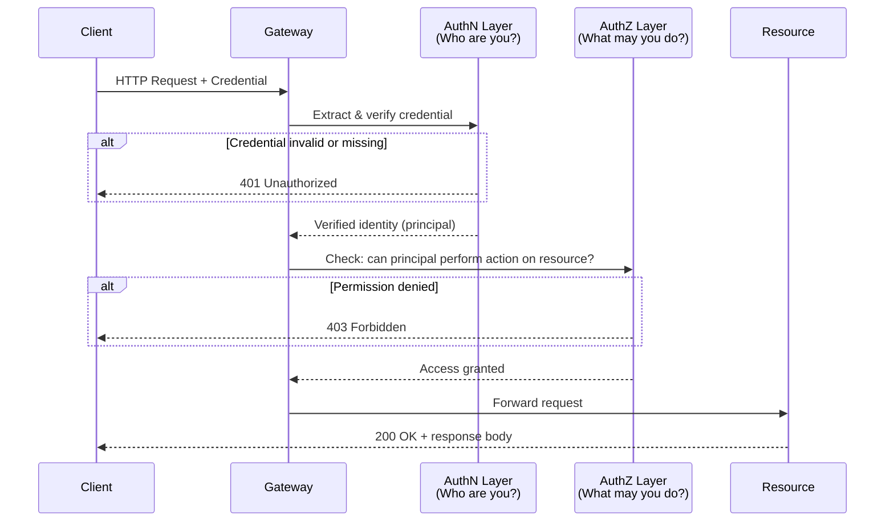

# [BEE-10] Authentication vs Authorization

:::info
Authentication establishes who you are; authorization determines what you are allowed to do. Conflating the two is one of the most common causes of broken access control.
:::

## Context

Access control failures consistently rank as the most critical web application vulnerability. OWASP's 2021 Top 10 lists Broken Access Control at position #1, and a significant share of those failures trace back to a single conceptual error: treating a verified identity as a granted permission.

The two concepts have distinct definitions in foundational standards:

- **Authentication (AuthN)** — "The process of determining the validity of one or more authenticators used to claim a digital identity." (NIST SP 800-63-3, Section 2)
- **Authorization (AuthZ)** — "The process of verifying that a requested action or service is approved for a specific entity." (NIST, via OWASP Authorization Cheat Sheet)

NIST is explicit that these are separate concerns: "Authentication does not determine the claimant's authorizations or access privileges; this is a separate decision." (NIST SP 800-63-3, Section 4.3.3)

RFC 7235, which defines the HTTP authentication framework, reinforces the boundary at the protocol level. A 401 response means the client has not authenticated; a 403 response means the server received valid credentials that are insufficient for access — authentication succeeded, authorization failed.

## Principle

Systems MUST treat authentication and authorization as distinct pipeline stages, executed in order.

1. **AuthN MUST precede AuthZ.** A permission check against an unverified identity is meaningless. The system cannot know whose permissions to check until identity is confirmed.

2. **A valid credential MUST NOT be treated as an authorization grant.** Proving identity (a token is valid, a password matched) only answers "who is this?" It does not answer "what may this identity do?"

3. **Authorization logic MUST be enforced server-side.** Client-side checks are advisory UI only. Every request that reaches a protected resource MUST be re-evaluated against the authorization policy, regardless of prior checks.

4. **Systems SHOULD deny by default.** Access MUST be explicitly granted. Absence of a deny rule MUST NOT be interpreted as permission.

5. **Authorization policies SHOULD be externalized** from application code into a dedicated policy layer (e.g., RBAC roles, ABAC rules, OPA policies). Hardcoded `if user.role == "admin"` logic scattered across handlers is brittle and auditable only with difficulty.

## Visual

The following diagram shows a single HTTP request passing through the identity pipeline as two distinct gates.



The 401 and 403 status codes map directly to the two gates: identity failure versus permission failure.

## Example

The following pseudocode shows the four-step pipeline in a generic request handler. It is intentionally framework-agnostic.

```
function handle(request):
    # Step 1 — Extract credential from the request
    credential = extract_credential(request)
    # e.g., parse Bearer token from Authorization header,
    #        read session cookie, read mTLS client certificate

    # Step 2 — Verify identity: authenticate
    principal = verify_credential(credential)
    if principal is null:
        return response(401, "Authentication required")
    # principal is now a verified identity object:
    # { id: "user-42", roles: ["editor"], tenant: "acme" }

    # Step 3 — Check permission: authorize
    action   = derive_action(request)        # e.g., "documents:write"
    resource = derive_resource(request)      # e.g., "doc-99"
    allowed  = policy.check(principal, action, resource)
    if not allowed:
        return response(403, "Forbidden")

    # Step 4 — Execute the request
    return execute(request, principal)
```

Notice that `verify_credential` and `policy.check` are separate calls to separate systems. The token (credential) carries identity claims; the policy engine decides permissions. A token that is cryptographically valid still goes through `policy.check` — validity is not permission.

### Common credential and policy mechanisms

| Concern | Common mechanisms |
|---|---|
| AuthN (identity) | Password + hash, JWT/JWS, mTLS client certificate, passkey/FIDO2, SAML assertion |
| AuthZ (permission) | RBAC (roles), ABAC (attributes + rules), ReBAC (relationship graph), OPA/Cedar policies |

## Common Mistakes

**1. Checking permissions before verifying identity.**

A handler that calls `policy.check(request.user_id, ...)` without first confirming that `request.user_id` is genuine trusts attacker-supplied input. An unauthenticated request must be rejected at step 2 before reaching step 3.

**2. Treating a valid token as an authorization decision.**

A JWT that passes signature verification proves the token was issued by your system. It does not prove the token holder is permitted to perform the requested action. Roles embedded in a token are identity claims — they still MUST be evaluated against the current policy. Policies change; tokens may be stale.

**3. Hardcoding authorization logic in application handlers.**

```
# Anti-pattern
if request.user.role == "admin":
    allow()
```

Scattered `if role == X` checks cannot be audited consistently, are omitted in new code paths, and cannot be updated without a deployment. Externalize policy evaluation behind a dedicated interface.

**4. Using OAuth 2.0 alone for authentication.**

OAuth 2.0 is an authorization delegation framework. An access token proves that a resource owner delegated certain scopes — it does not authenticate the user to your application. Use OpenID Connect (OIDC) on top of OAuth 2.0 when you need verified user identity. (See BEE-12.)

**5. Skipping authorization on internal or "trusted" paths.**

Internal APIs, background job handlers, and admin-only routes are common blind spots. Every request path that accesses protected data MUST enforce authorization regardless of where the request originates.

## Related BEPs

- [BEE-11: Token-Based Authentication](11.md) — how tokens establish identity
- [BEE-12: OAuth 2.0 and OpenID Connect](12.md) — delegation vs. authentication
- [BEE-13: Session Management](13.md) — maintaining authenticated state
- [BEE-14: RBAC vs ABAC](14.md) — permission models in depth
- [BEE-15: API Key Management](15.md) — API credential patterns

## References

- OWASP, "Authentication Cheat Sheet" (2024). https://cheatsheetseries.owasp.org/cheatsheets/Authentication_Cheat_Sheet.html
- OWASP, "Authorization Cheat Sheet" (2024). https://cheatsheetseries.owasp.org/cheatsheets/Authorization_Cheat_Sheet.html
- NIST, "Digital Identity Guidelines" SP 800-63-3 (2017, updated 2020). https://pages.nist.gov/800-63-3/sp800-63-3.html
- Fielding, R. et al., "Hypertext Transfer Protocol (HTTP/1.1): Authentication" RFC 7235 (2014). https://datatracker.ietf.org/doc/html/rfc7235
- OWASP, "Top 10 — A01:2021 Broken Access Control" (2021). https://owasp.org/Top10/A01_2021-Broken_Access_Control/
