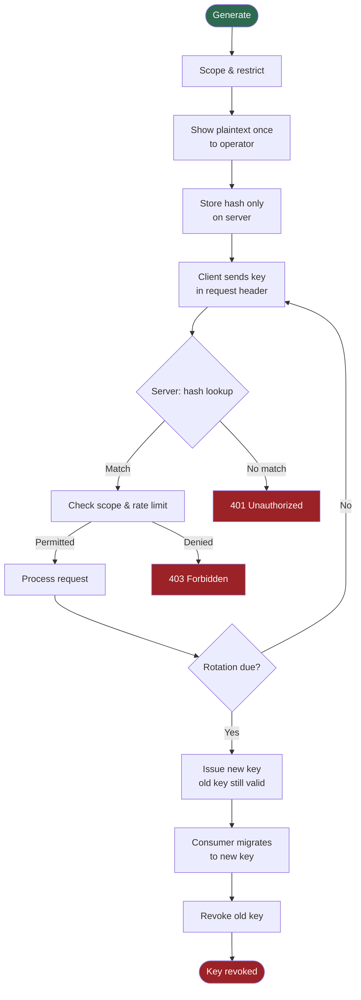

# [BEE-15] API Key Management

:::info
API keys are long-lived credentials that identify a client application, not a user. Treat them like passwords: generate them with a cryptographically secure source, hash them before storage, scope them tightly, and rotate them on a schedule.
:::

## Context

An API key is a secret string that a client application presents with every request so the server can identify which application is calling. Unlike a bearer token, which typically represents a delegated user session, an API key represents the application (or service account) itself. This distinction matters: an API key answers "which application is this?" — it does not answer "which user is acting?".

API keys appear in virtually every developer-facing API platform. Stripe issues secret keys for server-to-server payment processing. Google Cloud attaches API keys to projects for service quota tracking. GitHub personal access tokens function as API keys for automation scripts. Despite their ubiquity, API keys are frequently mishandled: embedded in client-side code, committed to version control, never rotated, and stored in plaintext — all of which turn a convenience credential into a persistent liability.

The OWASP API Security Top 10 (2023) lists Broken Authentication (API2:2023) as the second most critical API risk. Improper handling of long-lived credentials such as API keys is a direct contributor. The OWASP Secrets Management Cheat Sheet and REST Security Cheat Sheet provide practical guidance on credential generation, storage, and transmission that this BEE applies specifically to API keys.

## Principle

**P1 — API keys MUST be generated with a cryptographically secure random source, at a minimum of 256 bits of entropy.**

A key is only as unpredictable as its generator. Keys MUST NOT be derived from sequential IDs, timestamps, UUIDs (which have structured bits), or human-readable strings. Use `crypto/rand` (Go), `secrets.token_bytes(32)` (Python), `crypto.randomBytes(32)` (Node.js), or an equivalent CSPRNG. 256 bits of entropy ensures the key space is too large for brute-force enumeration even with significant compute.

**P2 — API keys MUST be hashed before storage using a password-safe hashing algorithm.**

The server never needs to recover the plaintext key — it only needs to verify that a presented key matches what was issued. Store only the hash (using bcrypt, Argon2, or BLAKE3-HMAC). The plaintext key MUST be shown to the user exactly once, at issuance, and never again. This mirrors the treatment of passwords: a leaked database of hashes does not immediately expose valid credentials. (OWASP Cryptographic Storage Cheat Sheet)

**P3 — API keys MUST be transmitted over HTTPS only, and SHOULD be placed in a request header rather than a query parameter.**

Query parameters appear in server access logs, browser history, referrer headers, and CDN logs. A key in a URL leaks silently and persistently. The standard header is `Authorization: Bearer <key>` or a custom header such as `X-API-Key: <key>`. The Google Cloud API key documentation explicitly recommends the `x-goog-api-key` header over URL parameters for this reason.

**P4 — API keys MUST be scoped to the minimum privilege required.**

Each key SHOULD be restricted to:
- A specific environment (development, staging, production)
- A specific service or set of endpoints
- A specific permission level (read-only vs. read-write)
- A specific source IP range where the calling service has known, stable addresses

Stripe's restricted API keys (RAKs) model this correctly: each key is issued with only the resource permissions the integration needs. A compromised read-only key cannot write data; a compromised staging key cannot reach production.

**P5 — API keys MUST have a rotation strategy and SHOULD support dual-key overlap during transitions.**

Keys with no rotation plan become permanent credentials. Rotation SHOULD occur on a regular schedule (Google Cloud recommends every 90 days as a baseline) and MUST occur immediately on suspected compromise or on team membership changes. During planned rotation, issue the new key while the old key remains valid for a grace period (typically 24–72 hours), then revoke the old key once all consumers have migrated. This dual-key overlap prevents downtime while eliminating the old credential.

**P6 — Servers MUST enforce per-key rate limiting.**

Rate limiting by API key enables the server to detect abuse (an unusual request spike on one key), protect backend capacity, and enforce tiered usage quotas. Rate limits SHOULD be tracked and returned in response headers (`X-RateLimit-Limit`, `X-RateLimit-Remaining`, `X-RateLimit-Reset`) so well-behaved clients can adapt.

**P7 — API keys MUST NOT be used as the sole security mechanism for user-sensitive operations.**

API keys identify the calling application. They do not identify a human user, carry consent scope, or support delegation. For any operation that acts on behalf of a user (accessing user data, initiating user-visible transactions), use OAuth 2.0 with a short-lived access token in addition to the API key, or replace the API key entirely with an OAuth client credentials grant for machine-to-machine flows. (See BEE-11.)

## Visual

The following diagram shows the complete API key lifecycle from generation through revocation, including the dual-key overlap window during rotation.



The hash lookup at validation time is analogous to verifying a password: the server hashes the inbound key with the same algorithm and compares against the stored hash. The plaintext key is never stored and never compared directly.

## Example

### Issuing a key (server side)

```python
import secrets
import hashlib
import hmac
import base64

# P1: Generate 32 bytes = 256 bits of cryptographically secure randomness
raw_key_bytes = secrets.token_bytes(32)

# Encode for transmission — prefix helps identify key type in logs/config
prefix = "myapp_key_"
raw_key_b64 = base64.urlsafe_b64encode(raw_key_bytes).decode("ascii").rstrip("=")
plaintext_key = f"{prefix}{raw_key_b64}"
# e.g. "myapp_key_example1234567890abcdefghijklmno"

# P2: Hash before storage — use a stable HMAC-SHA256 with a server-side secret
# (Argon2/bcrypt preferred for user passwords; HMAC-SHA256 is acceptable for
# API keys because the key itself provides 256 bits of entropy)
SERVER_SIGNING_SECRET = b"<loaded from environment, never hardcoded>"
key_hash = hmac.new(SERVER_SIGNING_SECRET, plaintext_key.encode(), hashlib.sha256).hexdigest()

# Store key_hash, prefix, scopes, rate_limit, created_at in the database.
# Return plaintext_key to the operator ONCE. Do not store plaintext_key.
```

### Validating an incoming request (server side)

```python
def authenticate_request(request):
    # P3: Read from header, not query param
    raw = request.headers.get("X-API-Key") or request.headers.get("Authorization", "").removeprefix("Bearer ")
    if not raw:
        return error(401, "API key required")

    # Hash the inbound key the same way it was hashed at issuance
    inbound_hash = hmac.new(SERVER_SIGNING_SECRET, raw.encode(), hashlib.sha256).hexdigest()

    # Constant-time comparison prevents timing attacks
    record = db.lookup_by_prefix(raw[:len("myapp_key_") + 8])
    if record is None or not hmac.compare_digest(inbound_hash, record.key_hash):
        return error(401, "Invalid API key")

    # P4: Check scope
    if required_scope not in record.scopes:
        return error(403, "Insufficient key scope")

    # P6: Check rate limit
    if rate_limiter.is_exceeded(record.id):
        return error(429, "Rate limit exceeded")

    return record  # authenticated application identity
```

### Key in a request header vs. query parameter

```
# Correct — key is in a header, not in the URL
GET /v1/reports/summary HTTP/1.1
Host: api.example.com
X-API-Key: myapp_key_example1234567890abcdefghijklmno

# Wrong — key appears in the URL and will be logged everywhere
GET /v1/reports/summary?api_key=myapp_key_example1234567890abcdefghijklmno HTTP/1.1
Host: api.example.com
```

### Rotation flow with dual-key overlap

```
Day 0:   Key A issued.  Client uses Key A.
         [A: valid]

Day 85:  Rotation initiated. Key B issued.
         Both keys accepted during grace period.
         [A: valid, B: valid]

Day 87:  Consumer updates configuration to Key B.
         Verification complete — all traffic now on Key B.
         [A: valid, B: valid]

Day 88:  Key A revoked.
         [A: revoked, B: valid]
```

## Common Mistakes

**1. Embedding API keys in client-side JavaScript.**

Any key shipped in a web page, mobile app binary, or public repository is compromised. Client-side code is readable by anyone. API keys belong on the server. If a browser application needs to call an external API, route the call through your own backend which holds the key.

**2. Committing keys to version control.**

`.env` files, configuration files, and hardcoded strings committed to git persist in history even after removal. Secrets scanning tools (GitHub secret scanning, GitGuardian) exist specifically because this mistake is extremely common. Store keys in a secrets manager (AWS Secrets Manager, HashiCorp Vault, Azure Key Vault) and inject them into the runtime environment.

**3. Using a single key across all environments.**

A development key with production-equivalent permissions is a production risk. Development environments have broader access (shared laptops, CI pipelines, third-party tooling) and lower security posture. Issue separate keys per environment so a development leak does not reach production data.

**4. Storing API keys in plaintext.**

A database compromise should not immediately yield usable credentials. Hash keys before storage using the same discipline applied to passwords. A leaked table of HMAC-SHA256 hashes of 256-bit random keys provides no practical attack surface — the attacker cannot reverse the hash to recover the key.

**5. No rotation strategy — treating keys as permanent.**

A key with no expiry and no rotation plan is a credential that will eventually be leaked, forgotten, or outlive the team members who know where it is deployed. Rotation on a schedule is an operational forcing function: it confirms you know every consumer, verifies runbooks work, and limits the historical exposure window.

## Related BEPs

- [BEE-10: Authentication vs Authorization](10.md) — the conceptual boundary between identity and permission
- [BEE-11: Token-Based Authentication](11.md) — short-lived tokens as an alternative for user-delegated access
- [BEE-31: Secrets Management](31.md) — storing and rotating credentials in production infrastructure
- [BEE-71: Rate Limiting and Throttling](71.md) — per-key rate limiting strategies

## References

- OWASP, "API Security Top 10 2023 — API2:2023 Broken Authentication". https://owasp.org/API-Security/editions/2023/en/0xa2-broken-authentication/
- OWASP, "Secrets Management Cheat Sheet" (2024). https://cheatsheetseries.owasp.org/cheatsheets/Secrets_Management_Cheat_Sheet.html
- OWASP, "REST Security Cheat Sheet" (2024). https://cheatsheetseries.owasp.org/cheatsheets/REST_Security_Cheat_Sheet.html
- OWASP, "Key Management Cheat Sheet" (2024). https://cheatsheetseries.owasp.org/cheatsheets/Key_Management_Cheat_Sheet.html
- Google Cloud, "Best practices for managing API keys" (2024). https://cloud.google.com/docs/authentication/api-keys-best-practices
- Google Cloud, "Best practices for securely using API keys". https://support.google.com/googleapi/answer/6310037
- Stripe, "API keys" (developer documentation). https://docs.stripe.com/keys
- Stripe, "Best practices for managing secret API keys". https://docs.stripe.com/keys-best-practices
- Stripe, "Restricted API keys". https://docs.stripe.com/keys/restricted-api-keys
