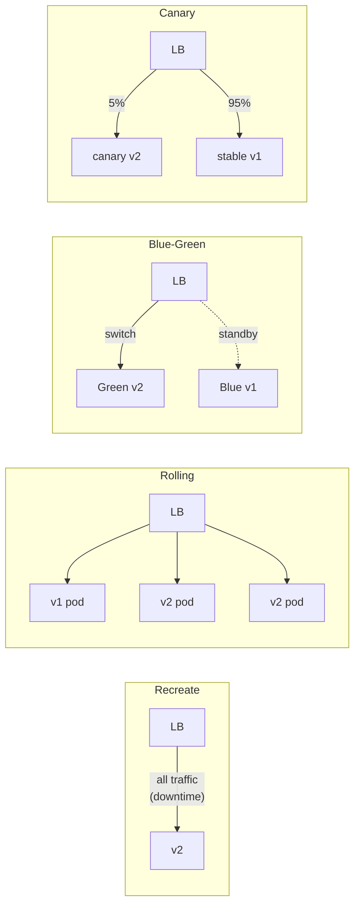

# [BEE-361] Deployment Strategies

:::info
Choosing the right deployment strategy determines your blast radius, rollback speed, and infrastructure cost during a release. Blue-green, canary, rolling update, and recreate each make different trade-offs.
:::

## Context

Every production deployment carries risk. The strategy you choose controls how much traffic is exposed to the new version, how quickly you can detect failures, and how fast you can recover. The wrong choice — or no deliberate choice at all — turns a routine release into an incident.

Four strategies dominate backend deployments: **recreate**, **rolling update**, **blue-green**, and **canary**. A fifth pattern, **A/B deployment**, is often confused with canary but serves a different purpose.

**References:**
- Martin Fowler, [Blue Green Deployment](https://martinfowler.com/bliki/BlueGreenDeployment.html)
- Martin Fowler, [Canary Release](https://martinfowler.com/bliki/CanaryRelease.html)
- Kubernetes, [Performing a Rolling Update](https://kubernetes.io/docs/tutorials/kubernetes-basics/update/update-intro/) and [Deployments](https://kubernetes.io/docs/concepts/workloads/controllers/deployment/)
- Google SRE Workbook, [Canarying Releases](https://sre.google/workbook/canarying-releases/)

## Principle

**Match your deployment strategy to your risk tolerance, infrastructure capacity, and the nature of the change being deployed.** No single strategy is universally correct; the choice must account for whether the change is backward-compatible, how quickly you can detect a bad release, and what rollback looks like when things go wrong.

## The Four Strategies

### 1. Recreate (Big Bang)

All running instances of the old version are stopped, then all instances of the new version are started.

**How it works:**

1. Terminate all v1 pods/instances.
2. Start all v2 pods/instances.
3. Traffic resumes once v2 is healthy.

**Trade-offs:**

| | |
|---|---|
| Simplicity | Highest — no traffic-splitting logic required |
| Downtime | Yes — unavoidable gap between stop and start |
| Rollback | Redeploy v1 (same downtime) |
| Use case | Non-critical services, batch workers, dev/staging |

Never use recreate for user-facing services unless planned maintenance windows are acceptable.

---

### 2. Rolling Update

Instances are replaced one at a time (or in small batches). Old and new versions run simultaneously during the transition.

**How it works (Kubernetes default):**

```
v1 v1 v1 v1  →  v2 v1 v1 v1  →  v2 v2 v1 v1  →  v2 v2 v2 v1  →  v2 v2 v2 v2
```

Key Kubernetes parameters:
- `maxSurge`: how many extra pods can exist above desired count
- `maxUnavailable`: how many pods can be unavailable during the update

**Trade-offs:**

| | |
|---|---|
| Downtime | Zero (with correct health checks) |
| Infrastructure cost | Minimal — small temporary surge |
| Rollback | `kubectl rollout undo` — fast, versioned |
| Risk | Old and new versions serve traffic simultaneously |

**Critical constraint:** Rolling update requires that v1 and v2 are API-compatible. If v2 breaks a contract that v1 clients depend on, requests hitting v1 pods will succeed while requests hitting v2 pods fail — a split-brain failure that is hard to diagnose.

---

### 3. Blue-Green Deployment

Two identical production environments exist: **blue** (current live) and **green** (new version). Traffic is switched atomically at the load balancer.

**How it works:**

```
Step 1: Blue is live, Green is idle
  LB → Blue (v1)      Green (v1, idle)

Step 2: Deploy v2 to Green, run smoke tests
  LB → Blue (v1)      Green (v2, testing)

Step 3: Switch LB to Green
  LB → Green (v2)     Blue (v1, on standby)

Step 4: Rollback if needed — flip LB back to Blue in seconds
  LB → Blue (v1)      Green (v2, idle)
```

**Trade-offs:**

| | |
|---|---|
| Downtime | Zero — switch is instant at the LB |
| Rollback | Near-instant — flip the LB back |
| Infrastructure cost | 2x during the switch window |
| Blast radius | 100% of traffic is on new version immediately after switch |

**Database consideration:** If v2 includes schema changes, the green environment must use a schema that v1 can also read (expand-before-contract pattern). See [BEE-123](#) for database migration alignment.

---

### 4. Canary Deployment

A small percentage of traffic is routed to the new version. Metrics are monitored before progressively increasing the percentage.

**How it works:**

```
Stage 1: 5% → v2,  95% → v1   (monitor 30 min)
Stage 2: 25% → v2, 75% → v1   (monitor 30 min)
Stage 3: 50% → v2, 50% → v1   (monitor 30 min)
Stage 4: 100% → v2             (old instances terminated)
```

**Automated promotion gate** — do not advance to the next stage without verifying:
- Error rate: new <= baseline
- P99 latency: new <= baseline × 1.1
- Business metrics: conversion, throughput unchanged

**Trade-offs:**

| | |
|---|---|
| Downtime | Zero |
| Infrastructure cost | Lower than blue-green — partial fleet only |
| Rollback | Route 0% to canary; fast and partial |
| Blast radius | Limited — only canary % is exposed |
| Complexity | High — requires traffic splitting and metric comparison |

**Do not run canary deployments with only manual metric review.** Automated analysis (error rate thresholds, SLO breach alerts) is required; manual review is too slow to prevent widespread impact.

---

### 5. A/B Deployment (vs. Canary)

A/B deployment routes traffic based on **user or request attributes** (header values, user segments, geography), not just a random percentage. Its goal is feature comparison, not risk reduction.

| | Canary | A/B |
|---|---|---|
| Routing basis | Random % of traffic | User segment or attribute |
| Goal | Reduce risk of a bad release | Measure feature impact on a segment |
| Traffic control | Increases over time | Stable split for measurement period |
| Related BEE | — | [BEE-363 Feature Flags](#) |

A/B deployment is a feature-management concern. Canary is a release-safety concern. Both can run simultaneously on the same service.

---

## Strategy Comparison at a Glance



| Strategy | Zero Downtime | Rollback Speed | Infra Cost | Blast Radius |
|---|---|---|---|---|
| Recreate | No | Minutes | 1x | 100% |
| Rolling Update | Yes | Fast (undo) | ~1.2x | Progressive |
| Blue-Green | Yes | Instant | 2x | 100% at switch |
| Canary | Yes | Fast (0% route) | ~1.1x | Limited % |

---

## Worked Example: Deploying v2 of an API Service

**Scenario:** REST API service, 20 pods in production, v2 adds a new response field and bumps a DB column.

### Blue-Green Path

1. Deploy v2 to the green fleet (20 pods), keeping blue live.
2. Run smoke test suite against green (internal health check endpoint, key API paths).
3. Confirm the DB migration is backward-compatible with v1 (additive column, no renames).
4. Switch LB from blue to green.
5. Monitor error rate for 15 minutes.
6. If error rate spikes: flip LB back to blue in under 30 seconds.
7. After 24-hour stability window: decommission blue or repurpose for next deployment.

### Canary Path

1. Deploy v2 to 1 pod (5% of fleet).
2. Route 5% of traffic to v2 pod.
3. Run automated metric comparison for 30 minutes:
   - Alert if v2 P99 latency > 110% of v1 P99.
   - Alert if v2 error rate > v1 error rate + 0.1%.
4. If gates pass: scale to 4 pods (20%), wait 30 minutes.
5. Scale to 10 pods (50%), wait 30 minutes.
6. Scale to 20 pods (100%), terminate v1 pods.
7. **Rollback at any stage:** scale canary pods to 0, redirect all traffic to v1.

---

## Database Migrations and Deployment Strategy

Database changes are the most common reason a rollback fails. The schema must be compatible with **both** old and new application versions during the transition window.

| Change type | Rolling safe? | Blue-green safe? | Canary safe? |
|---|---|---|---|
| Add nullable column | Yes | Yes | Yes |
| Add non-null column without default | No | No | No |
| Rename column | No — v1 breaks | No — v1 breaks | No |
| Remove column | No — v1 breaks | No — v1 breaks | No |
| Add index (concurrent) | Yes | Yes | Yes |

**Rule:** Deploy schema changes in two separate releases when they are not backward-compatible:
1. Release N: Add new column (nullable), migrate data, dual-write in code.
2. Release N+1: Remove old column after all old code is gone.

See [BEE-123](#) for the full expand-before-contract migration pattern.

---

## Zero-Downtime Requirements

Zero-downtime deployment is only achievable when all of the following are true:

1. **Health checks are correct.** The LB must not route traffic to a pod until its readiness probe passes.
2. **Graceful shutdown is implemented.** The app drains in-flight requests before exiting (handle `SIGTERM` with a drain period).
3. **Database changes are backward-compatible** for the full transition window.
4. **No breaking API changes** are deployed via rolling update (v1 and v2 clients will mix).
5. **Connection pools and caches** are pre-warmed before traffic is shifted.

---

## Rollback Strategies by Deployment Type

| Strategy | Rollback mechanism | Time to rollback | Data risk |
|---|---|---|---|
| Recreate | Redeploy v1 | Minutes + downtime | Low (single version) |
| Rolling update | `kubectl rollout undo` | ~30–90 seconds | Low if changes are additive |
| Blue-green | Flip LB to blue environment | < 30 seconds | Medium if DB schema changed |
| Canary | Set canary weight to 0% | < 60 seconds | Low — only partial traffic affected |

---

## Common Mistakes

**1. No rollback plan.**
Teams define the deployment steps but not the rollback steps. Before every deployment, write down exactly how to roll back and who executes it.

**2. Database changes that are not backward-compatible.**
If v2 renames a column and v1 code is still running (rolling update, canary), v1 will break. Schema changes must be additive during the transition window. Violating this makes code rollback impossible without a separate data rollback.

**3. Canary without automated metric comparison.**
Running a canary manually — checking dashboards by hand every 30 minutes — is too slow. A slow-burn error rate increase or a P99 regression will be missed. Automate the promotion gates.

**4. Blue-green without capacity for 2x infrastructure.**
Blue-green requires running two full production environments simultaneously. In cost-constrained or burst-capacity environments, the green fleet may not have enough headroom. Validate capacity before the deployment window, not during it.

**5. Rolling update with breaking API changes.**
During a rolling update, old and new pods serve traffic simultaneously. If v2 removes a field that v1 consumers require, or changes an error format, consumers that hit v1 pods get one behavior and consumers that hit v2 pods get another. Use blue-green or canary for breaking changes.

---

## Related BEPs

- [BEE-123: Database Migrations](#) — Schema migration patterns that align with deployment strategy; expand-before-contract
- [BEE-345: Testing in Production](#) — Smoke tests, synthetic traffic, and observability requirements that gate deployment progression
- [BEE-360: Continuous Integration](#) — CI pipeline gates that must pass before any deployment strategy is invoked
- [BEE-363: Feature Flags](#) — Decoupling code deployment from feature release; complements canary and A/B patterns
