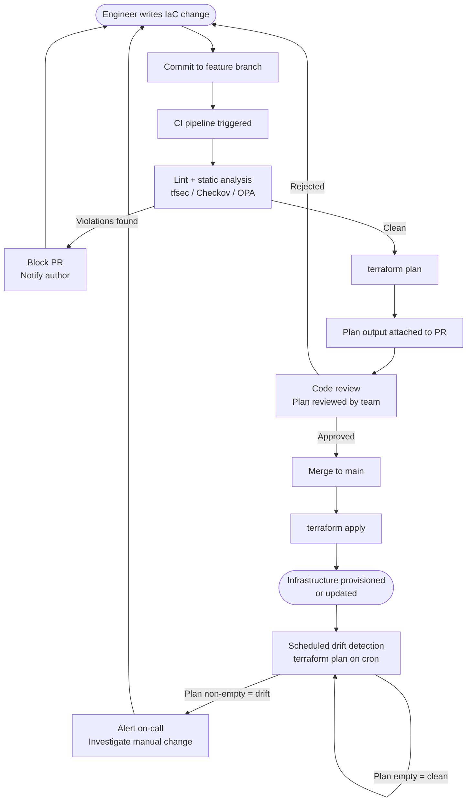

# [BEE-362] Infrastructure as Code

:::info
Manage every infrastructure resource through version-controlled code. Never configure infrastructure manually. The code is the system; the system is the code.
:::

## Context

Traditional infrastructure management relies on runbooks: ordered lists of manual steps — click here, type that, SSH in and run this command. This approach has a fundamental flaw: the runbook and the actual system diverge immediately after the first human makes a change outside the prescribed steps. Within months, no one knows exactly what is running. Rebuilding the environment from scratch is impossible.

Infrastructure as Code (IaC) eliminates that problem. Infrastructure resources — servers, databases, networks, load balancers, DNS records — are defined in source files. Those files are committed to version control, reviewed, and applied by an automated tool. The code describes the desired state; the tool figures out the diff and makes it so.

Kief Morris, in [*Infrastructure as Code* (O'Reilly)](https://www.oreilly.com/library/view/infrastructure-as-code/9781098114664/), articulates the foundational premise: infrastructure must be built from definitions that can be applied consistently, repeatedly, and without human intervention. The goal is not automation for its own sake — it is reproducibility, auditability, and the ability to treat environments as disposable and reconstructable on demand.

## Principles

### 1. Declarative Over Imperative

There are two approaches to expressing what infrastructure should exist:

**Imperative (procedural):** You write the steps. You tell the tool *how* to get to the desired state.

```bash
# Imperative: 10 ordered commands, all required, order matters
aws ec2 run-instances --image-id ami-0abc1234 --instance-type t3.medium
sleep 30
INSTANCE_ID=$(aws ec2 describe-instances ... | jq -r '.Reservations[0]...')
aws ec2 wait instance-running --instance-ids $INSTANCE_ID
aws rds create-db-instance --db-instance-identifier mydb --db-instance-class db.t3.micro ...
aws ec2 authorize-security-group-ingress --group-id sg-xyz --protocol tcp --port 5432 ...
# ... 4 more commands, each depending on the previous succeeding
```

If step 5 fails, you are now debugging which parts of the infrastructure exist and which do not.

**Declarative:** You describe *what* should exist. The tool figures out how to get there.

```hcl
# Declarative (Terraform): describe desired state, tool handles the diff
resource "aws_instance" "app_server" {
  ami           = "ami-0abc1234"
  instance_type = "t3.medium"
}

resource "aws_db_instance" "main" {
  identifier     = "mydb"
  instance_class = "db.t3.micro"
  engine         = "postgres"
  engine_version = "15.3"
  allocated_storage = 20
}
```

Run this on a blank account: both resources are created. Run it again: nothing changes — they already exist. Add a read replica:

```hcl
resource "aws_db_instance" "replica" {
  identifier             = "mydb-replica"
  instance_class         = "db.t3.micro"
  replicate_source_db    = aws_db_instance.main.id
}
```

One new block. Terraform computes the diff, adds the replica, touches nothing else. The imperative equivalent would be another ordered series of commands with opportunities to fail and diverge.

Prefer declarative tools (Terraform, Pulumi, AWS CloudFormation, Bicep) for infrastructure definition. Use imperative scripts only for bootstrapping or one-off operational tasks that do not represent standing infrastructure.

### 2. Idempotency

An IaC definition must be safe to apply multiple times. Applying the same configuration twice must produce the same result as applying it once.

This means:

- Running `terraform apply` on an already-correct environment makes zero changes.
- Running it after a partial failure resumes from where it failed, rather than re-creating already-created resources.
- Running it after a manual change reverts the drift and restores the declared state.

Non-idempotent IaC is dangerous. If re-applying your configuration destroys and recreates resources unnecessarily, operators will hesitate to run it after incidents. The result: production environments drift further from the code, which is exactly the problem IaC is meant to solve.

### 3. Version Control for Infrastructure

All infrastructure code lives in a Git repository. This is not optional.

Version control gives you:

- **Audit history** — who changed what, when, and why (from the commit message).
- **Rollback** — revert a bad infrastructure change by reverting the commit.
- **Code review** — infrastructure changes are reviewed via pull requests, same as application code.
- **Change correlation** — correlate an infrastructure change with the incident that followed it.

The Git repository is the source of truth for what infrastructure should exist. Any resource that does not correspond to a committed definition is either undeclared (should be added to IaC) or a manual deviation (drift, see below).

### 4. Drift Detection

Drift is the gap between the infrastructure defined in code and the infrastructure actually running in production. Drift accumulates when:

- An operator SSHes into a server and changes a config file.
- Someone creates a resource in the cloud console to "test something quickly."
- A one-off script modifies a database parameter.
- A deployment tool applies a change that IaC does not know about.

Every manual change is a potential incident waiting to happen. The next time IaC is applied, it may overwrite the manual change. Or the manual change may mask a bug in the IaC that won't surface until you rebuild the environment from scratch.

Drift detection runs `terraform plan` (or equivalent) on a schedule and alerts when the plan is non-empty. A non-empty plan means the actual state no longer matches the declared state. This must be investigated and resolved — either by updating the IaC to reflect an intentional deviation, or by reverting the manual change.

### 5. Immutable Infrastructure — Replace, Don't Patch

The mutable infrastructure model: a server is provisioned, then patched in place over months. Packages are updated via SSH. Config files are edited manually. The server accumulates a history of changes no one fully remembers. It becomes a snowflake — unique, fragile, irreplaceable.

The immutable infrastructure model: when a change is needed, build a new image with the change baked in and replace the running instance. Never modify a running server.

Practical implications:

- Application servers are replaced on every deployment, not updated in place.
- OS patches are applied by publishing a new base image and cycling instances.
- Configuration changes produce a new artifact, not a remote config file edit.
- Instances are treated as fungible — any instance in a group is identical to any other.

Immutable infrastructure eliminates drift at the instance level. It also makes rollback trivial: redeploy the previous image.

### 6. Environments as Code

Dev, staging, and production are not three different things configured separately. They are three instantiations of the same IaC template, parameterized by environment-specific values (instance size, replica count, domain name).

```
environments/
  dev/
    terraform.tfvars   # instance_type = "t3.small", replica_count = 0
  staging/
    terraform.tfvars   # instance_type = "t3.medium", replica_count = 1
  prod/
    terraform.tfvars   # instance_type = "r6g.large", replica_count = 2
modules/
  app-stack/
    main.tf            # single definition, reused across all environments
```

This guarantees that staging exercises the same infrastructure topology as production. A bug caught in staging is a bug caught before it reaches prod. A divergence between staging and production is not a test environment problem — it is an IaC configuration problem, and it is fixable.

### 7. Secrets Are Not in IaC Files

Infrastructure code will be committed to a Git repository. Git repositories are shared, backed up, and often mirrored. **Never commit secrets — passwords, API keys, TLS private keys, database credentials — to an IaC file.**

The correct pattern:

```hcl
# WRONG: secret hardcoded in IaC
resource "aws_db_instance" "main" {
  password = "hunter2"    # This is now in Git history forever
}

# CORRECT: reference a secret from a secrets manager
resource "aws_db_instance" "main" {
  password = data.aws_secretsmanager_secret_version.db_password.secret_string
}

data "aws_secretsmanager_secret_version" "db_password" {
  secret_id = "prod/myapp/db-password"
}
```

Secrets live in a dedicated secrets store (AWS Secrets Manager, HashiCorp Vault, Azure Key Vault). IaC references them by name at apply time; the secret value never touches the IaC file or the Git repository.

See [BEE-32: Secrets Management](#) for the full secrets handling policy.

### 8. Plan Before Apply — Never Apply Blindly

Before any IaC change reaches a real environment, produce a plan (dry run) and review it.

The plan output answers: "If I apply this, what will be created, changed, or destroyed?" Reviewing the plan before apply is the equivalent of reviewing a `git diff` before committing. It catches:

- Unintended destructions (renaming a resource in Terraform can trigger a destroy + recreate).
- Wider blast radius than expected (a module change propagating to 40 resources instead of 4).
- Policy violations surfaced by tools like `tfsec`, `Checkov`, or OPA before anything is touched.

In CI/CD for IaC, the plan step is mandatory and its output is attached to the pull request for reviewer inspection. Apply only runs after the plan has been reviewed and the PR approved. See [BEE-360: CI for IaC](#) for the pipeline pattern.

### 9. State Management

Terraform and similar tools maintain a state file: a record of which real resources correspond to which declarations in the code. State is how the tool knows that `aws_db_instance.main` in your code corresponds to `arn:aws:rds:us-east-1:123456789:db:mydb-abc` in AWS.

State management rules:

- **Remote state only.** State files must be stored in a remote backend (S3 + DynamoDB for Terraform, Terraform Cloud, etc.) never on local disk. Local state cannot be shared between team members or CI runners.
- **State locking.** The backend must support locking to prevent two simultaneous applies from corrupting state.
- **State is sensitive.** State files contain resource IDs, ARNs, and sometimes secret values from data sources. Treat state storage with the same security posture as production credentials.
- **Never edit state manually.** If state is corrupted or wrong, use `terraform state` subcommands — do not hand-edit the JSON file.

### 10. Modular IaC — Avoid Monoliths

One giant IaC file that defines all infrastructure for all services is an antipattern. Changes to one service require running the full plan across all infrastructure, increasing blast radius and apply time.

Structure IaC into modules with clear ownership boundaries:

```
modules/
  database/        # owned by data platform team
  networking/      # owned by infra team
  app-service/     # owned by each application team

services/
  payments-api/
    main.tf        # composes modules relevant to this service
  user-service/
    main.tf
```

Each module has a defined interface (inputs and outputs). Modules are versioned. A change to the database module does not require re-applying the networking module. Teams can change their service infrastructure independently without risking interference with other teams' resources.

## IaC Workflow



## Worked Example: Database and App Server

**Scenario:** Provision a PostgreSQL database and an application server. Then add a read replica.

### Imperative approach

```bash
# Step 1: Create security group
SG_ID=$(aws ec2 create-security-group --group-name myapp-sg --description "myapp" \
  --query 'GroupId' --output text)

# Step 2: Add inbound rules
aws ec2 authorize-security-group-ingress --group-id $SG_ID \
  --protocol tcp --port 5432 --cidr 10.0.0.0/16

# Step 3: Create subnet group
aws rds create-db-subnet-group --db-subnet-group-name myapp-subnets \
  --db-subnet-group-description "myapp" --subnet-ids subnet-aaa subnet-bbb

# Step 4: Create database (takes 5–10 min, poll for status)
aws rds create-db-instance --db-instance-identifier myapp-db \
  --db-instance-class db.t3.micro --engine postgres --master-username admin \
  --master-user-password "$DB_PASS" --db-subnet-group-name myapp-subnets \
  --vpc-security-group-ids $SG_ID

aws rds wait db-instance-available --db-instance-identifier myapp-db

# Step 5: Create app server
aws ec2 run-instances --image-id ami-0abc1234 --instance-type t3.medium \
  --security-group-ids $SG_ID ...

# Adding a replica: repeat steps 3–5 with different identifiers,
# add --source-db-instance-identifier, remember to update security groups...
# One misordering, one wrong variable → partial state, manual cleanup required
```

### Declarative approach (Terraform)

```hcl
resource "aws_security_group" "myapp" {
  name   = "myapp-sg"
  vpc_id = var.vpc_id

  ingress {
    from_port   = 5432
    to_port     = 5432
    protocol    = "tcp"
    cidr_blocks = ["10.0.0.0/16"]
  }
}

resource "aws_db_instance" "primary" {
  identifier        = "myapp-db"
  instance_class    = "db.t3.micro"
  engine            = "postgres"
  engine_version    = "15.3"
  username          = "admin"
  password          = data.aws_secretsmanager_secret_version.db_pass.secret_string
  db_subnet_group_name   = aws_db_subnet_group.myapp.name
  vpc_security_group_ids = [aws_security_group.myapp.id]
}

resource "aws_instance" "app_server" {
  ami           = var.ami_id
  instance_type = "t3.medium"
  vpc_security_group_ids = [aws_security_group.myapp.id]
}
```

**Adding a read replica:** one block added to the file, no other changes:

```hcl
resource "aws_db_instance" "replica" {
  identifier          = "myapp-db-replica"
  instance_class      = "db.t3.micro"
  replicate_source_db = aws_db_instance.primary.id
}
```

`terraform plan` shows exactly one resource to be created. `terraform apply` creates it. Applying again is a no-op.

## Common Mistakes

| Mistake | Why It Hurts | Fix |
|---|---|---|
| Hardcoding secrets in IaC files | Credentials end up in Git history permanently | Reference secrets from a secrets manager at apply time |
| No remote state / local state only | State lost on laptop wipe; team members conflict; CI runners can't share state | Use a remote backend (S3+DynamoDB, Terraform Cloud) with locking |
| Manual changes after IaC apply | Drift accumulates; next apply overwrites or conflicts with manual change | All changes go through IaC; enable drift detection alerts |
| No plan/preview step before apply | Unexpected destructions and wide blast radius go unnoticed | Mandate plan output in CI; require plan review before apply |
| One monolithic IaC file for all services | Full plan runs for every change; one team's refactor can destroy another team's resource | Modularize by service or domain; version modules; own them separately |

## Related BEPs

- [BEE-32: Secrets Management](#) — Secrets store patterns, rotation, and injection at runtime
- [BEE-360: CI for IaC](#) — Pipeline structure: lint, plan, policy check, apply gates
- [BEE-361: Deployment Strategies](#) — How immutable infrastructure enables blue-green and canary deployments

## References

- [Infrastructure as Code, 3rd Edition — Kief Morris, O'Reilly](https://www.oreilly.com/library/view/infrastructure-as-code/9781098150341/)
- [Infrastructure as Code Security Cheat Sheet — OWASP](https://cheatsheetseries.owasp.org/cheatsheets/Infrastructure_as_Code_Security_Cheat_Sheet.html)
- [The Ultimate Guide to Terraform Drift Detection — env0](https://www.env0.com/blog/the-ultimate-guide-to-terraform-drift-detection-how-to-detect-prevent-and-remediate-infrastructure-drift)
- [Immutable Infrastructure: Why You Should Replace, Not Patch — Medium](https://lukasniessen.medium.com/immutable-infrastructure-devops-why-you-should-replace-not-patch-e9a2cf71785e)
- [Infrastructure as Code Best Practices — Harness DevOps Academy](https://www.harness.io/harness-devops-academy/infrastructure-as-code-best-practices)
- [Infrastructure as Code Standards — UK Home Office Engineering](https://engineering.homeoffice.gov.uk/standards/infrastructure-as-code/)
