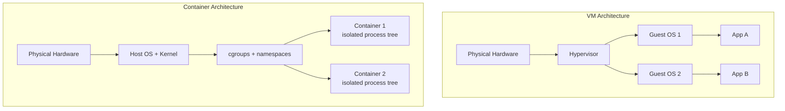

# [BEE-364] Container Fundamentals

## Context

Containers are everywhere in modern backend engineering -- from local development to production Kubernetes clusters. Yet many engineers treat them as a black box: "it's like a lightweight VM." This mental model leads to predictable mistakes: running as root, using `:latest` tags, stuffing state into the container filesystem, and skipping resource limits.

Understanding what containers actually are -- isolated Linux processes, not mini-VMs -- changes how you build, secure, and operate them.

**Related BEPs:**
- [BEE-240 Processes](/en/OS%20and%20Linux%20Fundamentals/240) -- containers are processes
- [BEE-325 Health Checks](/en/CI%20CD%20and%20DevOps/325) -- health checks inside containers
- [BEE-361 Deployment](/en/CI%20CD%20and%20DevOps/361) -- containers as the deployment unit

## Principle

**A container is an isolated process on the host kernel -- not a virtual machine. Build images small, run as non-root, enforce resource limits, and never store state in the container filesystem.**

---

## What a Container Actually Is

A container is a regular Linux process (or process tree) that the kernel has placed into a restricted view of the system. Two kernel primitives do the work:

| Primitive | Job |
|---|---|
| **Namespaces** | What the process can *see* (filesystem, network, PIDs, users) |
| **cgroups** | What the process can *use* (CPU, memory, I/O) |

No hypervisor. No guest kernel. The container shares the host kernel directly.

### Namespaces -- Isolation

Linux has seven namespace types used by containers:

| Namespace | Isolates |
|---|---|
| `PID` | Process IDs -- container processes start from PID 1 |
| `NET` | Network interfaces, routes, firewall rules, ports |
| `MNT` | Filesystem mount points (the container's `/`) |
| `UTS` | Hostname and domain name |
| `IPC` | Inter-process communication (semaphores, message queues) |
| `USER` | UID/GID mappings (enables rootless containers) |
| `CGROUP` | cgroup hierarchy visibility |

When Docker starts a container, it calls `clone()` or `unshare()` with the appropriate namespace flags. The process genuinely cannot see processes, network interfaces, or filesystem paths outside its namespaces.

### cgroups -- Resource Limits

Control groups (cgroups) are a kernel feature for organizing processes into hierarchies and applying resource policies:

- **CPU**: limit to a percentage of a core, or set CPU shares for scheduling priority
- **Memory**: hard limit in bytes; the kernel OOM-kills the process if exceeded
- **Block I/O**: throttle read/write bandwidth per device
- **Network**: classify and prioritize traffic (via `tc`)

Without cgroup limits, a single runaway container can consume all CPU and memory on the host, starving every other workload.

### Container vs. VM



| | Container | VM |
|---|---|---|
| Kernel | Shared (host) | Separate per VM |
| Boot time | Milliseconds | Seconds to minutes |
| Image size | Megabytes | Gigabytes |
| Isolation level | Process-level | Hardware-level |
| Overhead | Minimal | Hypervisor + guest OS |

VMs remain the right choice when you need strong hardware-level isolation (multi-tenant hosting, different OS families). Containers are the right choice for running many instances of the same application on shared infrastructure.

---

## OCI: The Standard

The **Open Container Initiative (OCI)** defines the portable standards that make containers interoperable across runtimes (Docker, Podman, containerd, CRI-O):

- **Image Spec** -- defines the image manifest, filesystem layer format (tar archives), and image configuration JSON
- **Runtime Spec** -- defines what a conformant runtime must do when given an unpacked image bundle (create namespaces, apply cgroups, exec the process)
- **Distribution Spec** -- the HTTP API for pushing and pulling images to/from registries

Because Docker, Kubernetes, and cloud registries all implement OCI, an image built with `docker build` runs identically on any OCI-compliant runtime.

---

## Image Layers and Copy-on-Write

A container image is a stack of read-only layers. Each `RUN`, `COPY`, and `ADD` instruction in a Dockerfile creates one layer. At runtime, Docker adds a thin writable layer on top -- the **container layer**.

```
[ writable container layer ]   ← changes live here, gone on container stop
[ COPY . /app             ]   ← read-only
[ RUN npm ci              ]   ← read-only
[ FROM node:20-alpine     ]   ← read-only base
```

**Copy-on-write (CoW)**: when a container modifies a file from a read-only layer, the storage driver copies the file up to the writable layer first. The original layer is untouched and shared across all containers using the same image.

**Layer caching**: Docker hashes each instruction + context. If nothing changed, it reuses the cached layer and skips the step. Cache invalidation is sequential -- changing layer N invalidates all layers below N. This has a direct consequence for how you order Dockerfile instructions.

---

## Dockerfile: Bad vs. Good

### Bad Dockerfile

```dockerfile
# BAD: large base image, root user, no multi-stage, bad layer order
FROM node:20

WORKDIR /app

COPY . .
RUN npm install

EXPOSE 3000
CMD ["node", "src/server.js"]
```

Problems:
- `node:20` is ~1 GB; ships curl, git, compilers, and other attack surface
- Runs as `root` (UID 0) -- if the app is exploited, the attacker has root in the container
- Copies source before installing dependencies -- any source change invalidates the `npm install` cache
- Includes `node_modules`, `.git`, test files in the image

Resulting image size: ~1.1 GB

### Good Dockerfile

```dockerfile
# GOOD: multi-stage, minimal base, non-root, cache-optimized layers
# ---- build stage ----
FROM node:20-alpine AS builder

WORKDIR /app

# Copy dependency manifests first -- cached unless deps change
COPY package.json package-lock.json ./
RUN npm ci --omit=dev

# Copy source after deps are installed
COPY src/ ./src/

# ---- runtime stage ----
FROM node:20-alpine AS runtime

# Create a non-root user
RUN addgroup -S appgroup && adduser -S appuser -G appgroup

WORKDIR /app

# Copy only the artifacts needed at runtime
COPY --from=builder --chown=appuser:appgroup /app/node_modules ./node_modules
COPY --from=builder --chown=appuser:appgroup /app/src ./src
COPY package.json ./

USER appuser

EXPOSE 3000
CMD ["node", "src/server.js"]
```

**.dockerignore** (prevents build context bloat and cache busting):

```
node_modules
.git
*.test.js
.env
coverage/
```

Resulting image size: ~180 MB -- an 83% reduction. The runtime stage contains no compiler, no build tools, and no root access.

---

## Container Networking Basics

Docker creates a virtual network bridge (`docker0`) by default. Each container gets a virtual Ethernet pair -- one end in the container's NET namespace, one end connected to the bridge.

Common network modes:

| Mode | Use case |
|---|---|
| `bridge` (default) | Containers on the same host can reach each other by container name |
| `host` | Container shares host network stack -- no isolation, maximum performance |
| `none` | No network access |
| `overlay` | Multi-host networking in Swarm / Kubernetes |

In Kubernetes, each Pod gets its own network namespace. The CNI plugin (Flannel, Calico, Cilium) handles IP assignment and inter-node routing.

---

## Resource Limits in Orchestration

Always set resource requests and limits. In Kubernetes:

```yaml
resources:
  requests:
    cpu: "250m"      # 0.25 cores guaranteed at scheduling time
    memory: "256Mi"
  limits:
    cpu: "500m"      # hard cap -- throttled if exceeded
    memory: "512Mi"  # hard cap -- OOM-killed if exceeded
```

Without limits, a single pod can starve its node. Without requests, the scheduler cannot bin-pack pods correctly and nodes become over-committed.

---

## Image Security Scanning

Container images accumulate CVEs in base image packages. Integrate scanning into CI:

- **Trivy** (`trivy image myapp:1.2.3`) -- fast, free, scans OS packages and language deps
- **Docker Scout** -- integrated into Docker Hub and Docker Desktop
- **Grype** -- alternative to Trivy, good GitHub Actions integration

Scanning rules:
1. Fail the pipeline on CRITICAL severity CVEs
2. Rebuild and re-push images when base image updates are available (use Renovate or Dependabot for base image pinning)
3. Pin base images to a digest, not a tag: `FROM node:20-alpine@sha256:abc123...`

---

## Common Mistakes

### 1. Running as root in the container

```dockerfile
# missing USER instruction -- process runs as UID 0
CMD ["node", "server.js"]
```

If an attacker exploits your app, they get root in the container. With a misconfigured volume mount or privileged mode, root in the container can become root on the host. Always add `USER appuser` before `CMD`.

### 2. Using `:latest` in production

```dockerfile
FROM node:latest   # resolves to different commits over time
```

`:latest` is not a version. It changes when the maintainer pushes a new image. Two builds from the same Dockerfile can produce different images. Pin to an exact version and digest.

### 3. Fat base images

`ubuntu:22.04` ships a package manager, shell utilities, and hundreds of packages that your app never calls -- all potential CVE surface. Prefer `alpine` variants (busybox shell, minimal packages) or `distroless` images (no shell at all).

### 4. No resource limits

A container without memory limits that hits a memory leak will consume all available host memory, triggering the kernel OOM killer, which may kill unrelated processes -- including the container runtime itself.

### 5. Storing state in the container filesystem

```bash
# inside a container
echo "important-data" > /app/data/results.json
# container restarts -- /app/data/results.json is gone
```

The writable container layer is ephemeral. It disappears when the container is removed or replaced. Persist state in volumes (`docker run -v /host/path:/app/data`) or external storage (databases, object storage).

---

## Summary

| Concept | Key point |
|---|---|
| Containers vs. VMs | Containers share the host kernel; VMs have a separate guest kernel |
| Namespaces | Isolate what the process sees: PID, NET, MNT, UTS, IPC, USER |
| cgroups | Limit what the process uses: CPU, memory, I/O |
| Image layers | Read-only stacked tarballs; writable layer added at runtime |
| CoW | Files from lower layers are copied up only when modified |
| Multi-stage builds | Separate build environment from runtime; dramatically smaller images |
| OCI | Portable image + runtime standard; interoperable across Docker, containerd, CRI-O |
| Non-root user | Mandatory security hygiene; create a dedicated user in the Dockerfile |
| Resource limits | Always set requests and limits in orchestration |
| No state in container | Use volumes or external storage for persistent data |

## References

- [NGINX Blog: What Are Namespaces and cgroups, and How Do They Work?](https://blog.nginx.org/blog/what-are-namespaces-cgroups-how-do-they-work)
- [Datadog Security Labs: Container Security Fundamentals Part 2 -- Isolation & Namespaces](https://securitylabs.datadoghq.com/articles/container-security-fundamentals-part-2/)
- [Open Container Initiative](https://opencontainers.org/about/overview/)
- [OCI Image Spec](https://specs.opencontainers.org/image-spec/)
- [Docker Docs: Multi-stage builds](https://docs.docker.com/build/building/multi-stage/)
- [Docker Docs: Build cache](https://docs.docker.com/build/cache/)
- [Baeldung: Differences Between cgroups and Namespaces in Linux](https://www.baeldung.com/linux/cgroups-and-namespaces)
