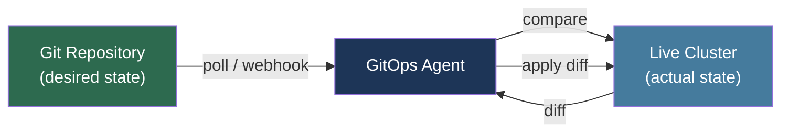

# [BEE-367] GitOps and Declarative Delivery

:::info
GitOps applies Git as the single source of truth for infrastructure and application state. An agent running inside the cluster continuously reconciles actual state toward the desired state declared in Git — no credentials leave the cluster, every change is auditable, and rollback is a Git revert.
:::

## Context

Alexis Richardson coined "GitOps" in a Weaveworks blog post in August 2017 and expanded it at KubeCon North America 2017 ("GitOps — Operations by Pull Request"). The core observation: Kubernetes had made infrastructure declarative and API-driven, yet delivery pipelines were still imperative — a CI job would `kubectl apply` directly against the cluster using credentials stored as CI secrets. This created two problems. First, the pipeline held escalated credentials to every environment it could reach, making it a high-value target. Second, live cluster state could drift from any declared source whenever someone ran `kubectl edit` or a pod crashed and was replaced with different configuration.

Richardson's proposed inversion: keep desired state in Git and have an agent inside the cluster pull and apply it. The cluster never exposes its API server credentials externally. Every change to production passes through a pull request, giving full audit history, code review, and instant rollback via `git revert`. The agent continuously compares live state against Git and applies corrections — meaning the moment a manual change is made directly to the cluster, the agent reverts it.

The CNCF GitOps Working Group formalized this into the OpenGitOps specification v1.0.0 (2021), which defines four principles: **Declarative** (system state is expressed as declarations, not scripts), **Versioned and Immutable** (state is stored in Git with full history), **Pulled Automatically** (agents poll or receive push notifications from the store), and **Continuously Reconciled** (agents detect and correct drift at runtime).

## Core Concepts

### Pull Model vs Push Model

A push-based pipeline (Jenkins, GitHub Actions with `kubectl apply`) drives changes from outside the cluster. It requires the pipeline to hold cluster credentials and cannot detect drift occurring between deployments.

A pull-based GitOps agent runs inside the cluster. It holds a read-only token for the Git repository and uses its own service account to call the Kubernetes API. No external system needs write access to the cluster.

```
┌─────────────────────────────────────────────────────┐
│  Push model                                         │
│  CI Pipeline ──(kubectl apply)──► Kubernetes API   │
│  CI holds cluster credentials                       │
└─────────────────────────────────────────────────────┘

┌─────────────────────────────────────────────────────┐
│  Pull model (GitOps)                                │
│  Git ◄──(poll/webhook)── GitOps Agent               │
│                          │                          │
│                          ▼                          │
│                    Kubernetes API                   │
│  Agent holds Git token; cluster API is internal     │
└─────────────────────────────────────────────────────┘
```

### Reconciliation Loop



The agent computes the diff between desired (Git) and actual (cluster). If the diff is empty, no action is taken. If a resource is missing, it is created. If a resource differs, it is patched. If a resource exists in the cluster but not in Git (and pruning is enabled), it is deleted.

## Argo CD

Argo CD is the most widely deployed GitOps controller. It was CNCF-graduated in December 2022 and is used by over 350 organizations including BlackRock, Adobe, and Intuit.

Its seven components: API server (gRPC/REST for UI and CLI), repository server (clones repos and renders manifests), application controller (reconciliation loop, calls Kubernetes API), Redis (cache for rendered manifests and cluster state), Dex (OIDC/SSO provider), ApplicationSet controller (generates Applications from generators), and notifications controller (sends alerts on sync events).

The `Application` CRD is the unit of deployment:

```yaml
apiVersion: argoproj.io/v1alpha1
kind: Application
metadata:
  name: guestbook
  namespace: argocd
spec:
  project: default
  source:
    repoURL: https://github.com/argoproj/argocd-example-apps
    targetRevision: HEAD
    path: guestbook
  destination:
    server: https://kubernetes.default.svc
    namespace: guestbook
  syncPolicy:
    automated:
      prune: true        # delete resources removed from Git
      selfHeal: true     # revert manual changes to the cluster
    syncOptions:
      - CreateNamespace=true
```

Argo CD reports health for each resource: `Healthy`, `Progressing`, `Degraded`, `Suspended`, `Missing`, or `Unknown`. Application sync status is either `Synced` (cluster matches Git) or `OutOfSync` (drift detected).

`ApplicationSet` generates multiple `Application` resources from a single template using generators: List, Cluster, Git directory, Git file, SCM Provider, Pull Request, and Matrix. This enables fleet management — one ApplicationSet can deploy an application to 50 clusters simultaneously.

## Flux CD

Flux CD takes a composable controller architecture. Each concern is a separate Kubernetes controller with its own CRDs. Flux was CNCF-graduated in November 2022.

The five core controllers: source-controller (watches Git repos, Helm repos, OCI registries; produces Artifact resources), kustomize-controller (applies Kustomization resources from source artifacts), helm-controller (manages HelmRelease resources), notification-controller (webhook receivers and alert senders), image-automation-controller (optional; updates image tags in Git).

A minimal Flux setup for a repository:

```yaml
# GitRepository: source-controller watches this repo
apiVersion: source.toolkit.fluxcd.io/v1
kind: GitRepository
metadata:
  name: my-app
  namespace: flux-system
spec:
  interval: 1m
  url: https://github.com/example/my-app
  ref:
    branch: main

---
# Kustomization: kustomize-controller applies this path
apiVersion: kustomize.toolkit.fluxcd.io/v1
kind: Kustomization
metadata:
  name: my-app
  namespace: flux-system
spec:
  interval: 10m
  path: ./deploy/overlays/production
  prune: true
  sourceRef:
    kind: GitRepository
    name: my-app
  healthChecks:
    - apiVersion: apps/v1
      kind: Deployment
      name: my-app
      namespace: default
```

Flux enforces multi-tenancy via `--no-cross-namespace-refs`: a Kustomization in namespace `team-a` cannot reference a GitRepository in namespace `team-b`. Each team's controllers impersonate a service account scoped to their namespace, preventing privilege escalation across tenant boundaries.

## Image Automation

Image automation closes the loop for container image updates without requiring a human to commit a tag bump.

**Flux image automation** uses three CRDs: `ImageRepository` (polls registry for new tags), `ImagePolicy` (selects the latest tag matching a policy — semver, alphabetical, or regex), and `ImageUpdateAutomation` (writes the selected tag back to Git using marker comments):

```yaml
# In the deployment manifest
image: ghcr.io/example/my-app:v1.2.3 # {"$imagepolicy": "flux-system:my-app"}
```

When a new tag satisfying the ImagePolicy is pushed, Flux commits the updated tag to Git, which triggers the reconciliation loop for the actual deployment.

**Argo CD Image Updater** supports two write methods: `argocd` (updates the Application's Helm parameter in Argo CD directly, no Git commit) and `git` (commits the updated values file to a branch).

## Environment Promotion

The recommended pattern is **directory-per-environment with Kustomize overlays**:

```
deploy/
  base/           # shared manifests (Deployment, Service)
  overlays/
    staging/      # patch: 1 replica, staging image tag, staging ingress
    production/   # patch: 3 replicas, production image tag, production ingress
```

Promotion is a PR that updates the production overlay's image tag (or Helm values file). The PR review becomes the promotion gate; merge triggers reconciliation.

**App-of-apps** (Argo CD) or a root Kustomization (Flux) can manage multiple services from a single entry point, useful when onboarding an entire cluster's worth of applications.

Branch-per-environment (a separate `staging` and `production` branch) is possible but creates merge conflicts and complicates image automation; directory-per-environment is strongly preferred.

## Progressive Delivery

GitOps controllers integrate with progressive delivery tools to automate canary promotion and rollback.

**Argo Rollouts** extends the `Deployment` model with `Rollout` CRDs. A canary `Rollout` shifts traffic in steps (e.g., 10% → 30% → 50% → 100%) and gates each step on an `AnalysisTemplate` that queries Prometheus, Datadog, or a custom metric provider. If the analysis fails, the rollout is automatically aborted and traffic is shifted back to the stable version.

**Flagger** (Flux ecosystem) wraps existing `Deployment` objects and manages a primary/canary replica pair. It integrates with Istio, Linkerd, NGINX, and AWS App Mesh for traffic splitting, and queries Prometheus for success rate and latency before advancing each weight increment.

## Best Practices

**MUST store all Kubernetes manifests in Git.** Applying resources manually or via `kubectl edit` in a GitOps-managed cluster creates drift and will be reverted by the reconciliation loop. Use `kubectl get` to inspect; use Git to change.

**SHOULD enable `prune: true` in production.** Without pruning, resources removed from Git remain in the cluster silently. Pruning ensures the cluster is a faithful replica of Git, not an accumulation of orphaned resources.

**MUST NOT store secrets as plaintext in Git.** Use Sealed Secrets (Bitnami), SOPS (Mozilla), or External Secrets Operator to store only encrypted or references to secrets. External Secrets Operator syncs secrets from Vault, AWS Secrets Manager, or GCP Secret Manager into Kubernetes `Secret` objects, keeping plaintext outside Git entirely.

**SHOULD separate application and infrastructure repositories.** Application teams commit to an app repo; platform teams own the cluster-config repo. Cross-repo `ApplicationSet` generators or Flux `GitRepository` references compose them.

**SHOULD use a dedicated sync service account per tenant.** Grant it only the RBAC permissions needed for that tenant's namespace. Never use `cluster-admin` for application sync.

## Limitations

GitOps as described applies primarily to Kubernetes. For non-Kubernetes targets (VMs, serverless, databases), tools like Terraform with Atlantis or Pulumi provide comparable pull-based reconciliation but are distinct ecosystems.

Stateful workloads (databases, message brokers) require additional operators (e.g., CloudNativePG, Strimzi) that own the lifecycle of their resources; the GitOps controller should own the operator CRDs, not raw StatefulSets.

Large monorepos with hundreds of Kustomize overlays can cause reconciliation latency. Flux's `interval` and `timeout` fields and Argo CD's `--app-resync` flag tune this, but very large fleets may require sharding across multiple controller instances.

## Related BEEs

- [BEE-360](360.md) -- Continuous Integration Principles: CI produces the artifact (container image) that GitOps delivers
- [BEE-361](361.md) -- Deployment Strategies: GitOps is the mechanism; blue-green, canary, and rolling are strategies it executes
- [BEE-362](362.md) -- Infrastructure as Code: GitOps applies the same Git-as-source-of-truth principle to live reconciliation rather than one-shot apply
- [BEE-363](363.md) -- Feature Flags: progressive delivery with Argo Rollouts/Flagger complements feature flags for production traffic shifting
- [BEE-366](366.md) -- Grey and Dark Releases: Argo Rollouts implements the canary and blue-green patterns described there

## References

- [Alexis Richardson. GitOps — Operations by Pull Request — Weaveworks Blog, August 2017](https://www.weave.works/blog/gitops-operations-by-pull-request)
- [OpenGitOps Principles v1.0.0 — CNCF GitOps Working Group, 2021](https://opengitops.dev/)
- [Argo CD Documentation — argoproj.github.io](https://argo-cd.readthedocs.io/en/stable/)
- [Argo CD: CNCF Graduation Proposal — CNCF TOC GitHub, December 2022](https://github.com/cncf/toc/blob/main/proposals/graduation/argo.md)
- [Flux CD Documentation — fluxcd.io](https://fluxcd.io/flux/)
- [Flux CD: CNCF Graduation — CNCF TOC GitHub, November 2022](https://github.com/cncf/toc/pull/952)
- [Weaveworks. The GitOps Handbook — Weaveworks, 2021](https://www.weave.works/technologies/gitops/)
- [Argo Rollouts Documentation — argoproj.github.io](https://argoproj.github.io/argo-rollouts/)
- [Flagger Documentation — fluxcd.io/flagger](https://docs.flagger.app/)
- [Bitnami Sealed Secrets — github.com/bitnami-labs/sealed-secrets](https://github.com/bitnami-labs/sealed-secrets)
- [External Secrets Operator — external-secrets.io](https://external-secrets.io/)
- [Mozilla SOPS — github.com/getsops/sops](https://github.com/getsops/sops)
