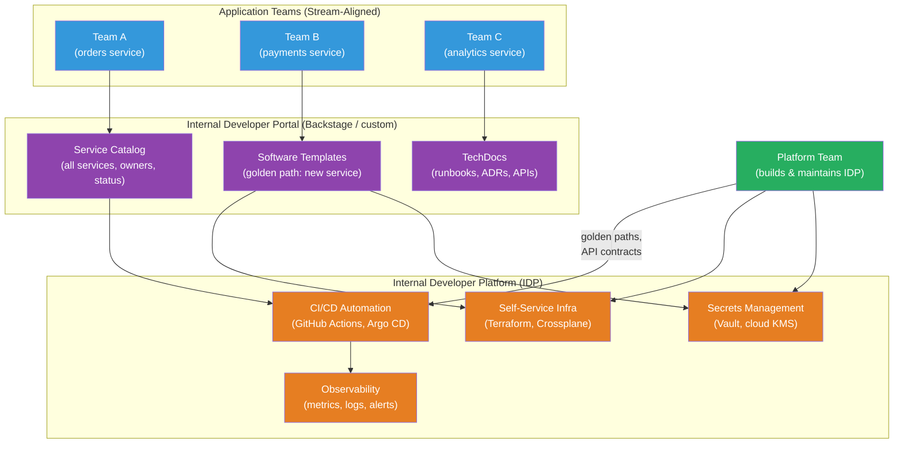

# [BEE-483] Platform Engineering and Internal Developer Platforms

:::info
Platform engineering is the discipline of building and maintaining self-service Internal Developer Platforms (IDPs) that reduce the cognitive load on application teams — letting developers provision infrastructure, create services, and deploy software without waiting on operations.
:::

## Context

As organizations adopted microservices and cloud infrastructure, a new problem emerged: the operational surface area exploded. Each team now needed to understand Kubernetes, CI/CD pipelines, secrets management, observability tooling, service discovery, and dozens of other concerns to ship features. DevOps succeeded in breaking down dev/ops silos but created a new burden — developers became part-time infrastructure engineers.

Platform engineering emerged as the response. Rather than asking every application team to independently solve infrastructure concerns, a dedicated platform team builds and maintains shared, self-service capabilities — opinionated tools, templates, and workflows that encode organizational best practices. Application teams consume the platform; they do not build it.

Matthew Skelton and Manuel Pais formalized the organizational model in **"Team Topologies" (2019)**: the "platform team" type exists specifically to reduce cognitive load on "stream-aligned teams" (product teams). Cognitive load has three types: intrinsic (understanding the technology itself), extraneous (the burden of using tools correctly), and germane (applying domain knowledge). A good platform absorbs extraneous cognitive load — the pipeline configuration, the Kubernetes manifest boilerplate, the secret rotation logic — so developers focus on germane work.

Spotify pioneered the practical implementation, introducing **golden paths** around 2014 (Spotify Engineering Blog, 2020) and open-sourcing **Backstage** in March 2020 — a developer portal and service catalog that became a CNCF incubating project in March 2022. By 2025, Backstage had over 3,000 adopters. The Cloud Native Computing Foundation published its **Platforms for Cloud Native Computing white paper** in April 2023, providing a vendor-neutral definition and capability model. Gartner projects that 80% of large software engineering organizations will have established platform engineering teams by 2026, up from 45% in 2022.

## Design Thinking

### Platform vs Portal vs Toolchain

Three terms are often conflated:

**Internal Developer Platform (IDP)**: The integrated backend — APIs, automation, infrastructure capabilities, security policies — that enables self-service. The IDP is not a single product; it is the composition of existing tools (Terraform, Kubernetes, Vault, CI/CD systems) with a unifying layer that makes them self-serviceable.

**Internal Developer Portal**: The user-facing interface to the IDP — a web UI where developers discover services, create new components from templates, check deployment status, and find documentation. Backstage is a portal framework; the IDP is what it connects to.

**Toolchain**: The individual tools (GitHub Actions, Argo CD, Datadog, HashiCorp Vault) before they are integrated. A toolchain without a platform layer is what platform engineering replaces.

### Golden Paths vs Paved Roads

A **golden path** is an opinionated, well-supported route for a specific concern: "how to create and deploy a new backend service." It encodes the organization's preferred technology, configuration, and process. Developers who follow the golden path get infrastructure, CI/CD, secrets, and observability configured correctly by default.

The crucial word is "optional." A golden path should be compelling enough that deviating from it is a conscious decision, not a forced constraint. If teams can leave the path when they have genuine reasons, they accept the path as helpful rather than resenting it as a bureaucratic requirement.

### Maturity Levels

Platform engineering matures in stages. The CNCF Platforms white paper describes a progression:

| Level | Characteristics |
|---|---|
| **Provisional** | Platform capabilities are scripts and wiki pages; high coordination overhead |
| **Operational** | Platform is a product with defined owners; self-service for common tasks |
| **Scalable** | Platform team measures developer experience; feedback loops exist |
| **Optimizing** | Golden paths cover most use cases; deviation is rare and deliberate |

Most organizations start at Level 1 without realizing it, and the platform engineering motion begins by elevating to Level 2: treating the platform as a product with users, not just an internal tooling project.

## Best Practices

**MUST treat the platform as a product, not an infrastructure project.** Platform teams have users (application developers), and those users have needs. Use product management practices: a roadmap, user interviews, adoption metrics, and an explicit API contract for platform capabilities. A platform built without user research builds features nobody uses.

**MUST define golden paths before building a portal.** A portal is a UI for capabilities that already exist. Building the portal first creates the illusion of progress while leaving the underlying workflows manual and inconsistent. Define the golden path for the two or three most common developer journeys (create service, deploy to production, add a secret) before investing in portal tooling.

**SHOULD measure cognitive load reduction, not platform features shipped.** The platform's purpose is to reduce the time and effort application teams spend on infrastructure concerns. Track: time from "idea to first deployment," number of support requests to platform team, percentage of service creation using templates vs from scratch. These are outcome metrics; platform feature count is an output metric.

**SHOULD make onboarding to the platform self-service.** If joining the platform requires filing a ticket or waiting for a platform team member, the platform has a bottleneck. New services should be provisionable with a self-service form or a CLI command. The platform team's time is better spent on capabilities than on individual requests.

**SHOULD version and document platform APIs explicitly.** Application teams depend on platform capabilities. Breaking changes to the Terraform module API, the CI/CD template interface, or the service creation template break everyone who uses them. Treat platform APIs with the same backward-compatibility discipline as external APIs.

**MAY start with a thin platform layer over existing tools.** A common mistake is building a new platform from scratch. Most organizations already have GitHub Actions, Kubernetes, and a cloud provider. A thin self-service layer — a form that generates a GitHub repository from a template, opens a PR with Kubernetes manifests, and creates a Datadog monitor — is a platform. Start thin; add capabilities based on developer feedback.

**MAY use a software catalog as the initial platform anchor.** A catalog of all services (owner, repo, deployment status, dependencies) costs little to implement and delivers immediate value by answering "who owns this?" It also provides the data model for later capabilities: routing alerts to service owners, generating runbooks, enforcing standards programmatically.

## Visual



## Example

**Backstage software catalog entry (`catalog-info.yaml`):**

```yaml
# catalog-info.yaml — lives at the root of every service repository
# Backstage reads this to populate the service catalog automatically
apiVersion: backstage.io/v1alpha1
kind: Component
metadata:
  name: orders-service
  description: Handles order creation, validation, and lifecycle
  annotations:
    # Links Backstage to the GitHub repo for CI status, PR count, etc.
    github.com/project-slug: myorg/orders-service
    # Links to the ArgoCD application for deployment status
    argocd/app-name: orders-service-prod
    # Links to the Datadog dashboard for live metrics
    datadoghq.com/dashboard-url: https://app.datadoghq.com/dashboard/abc
    # PagerDuty service for alert routing
    pagerduty.com/service-id: P12345
  tags:
    - java
    - kafka
    - postgresql
spec:
  type: service
  lifecycle: production
  owner: group:team-commerce          # who owns this service
  system: commerce-platform
  dependsOn:
    - component:payments-service
    - component:inventory-service
  providesApis:
    - orders-api
```

**Golden path Backstage software template (new backend service):**

```yaml
# template.yaml — defines the "Create Backend Service" golden path
# A developer fills out a form; Backstage generates a repo, CI config, and K8s manifests
apiVersion: scaffolder.backstage.io/v1beta3
kind: Template
metadata:
  name: new-backend-service
  title: New Backend Service
  description: Creates a production-ready backend service with CI/CD, observability, and secrets pre-configured
spec:
  owner: group:platform-team
  type: service

  parameters:
    - title: Service Details
      required: [name, owner, description]
      properties:
        name:
          title: Service Name
          type: string
          pattern: '^[a-z][a-z0-9-]*$'
        owner:
          title: Owner Team
          type: string
          ui:field: OwnerPicker
        description:
          title: Description
          type: string

  steps:
    # 1. Generate service from the org's opinionated template
    - id: fetch
      name: Fetch Template
      action: fetch:template
      input:
        url: ./skeleton   # the golden-path template files
        values:
          name: ${{ parameters.name }}
          owner: ${{ parameters.owner }}

    # 2. Create GitHub repository
    - id: create-repo
      name: Create Repository
      action: github:repo:create
      input:
        repoUrl: github.com?repo=${{ parameters.name }}&owner=myorg

    # 3. Open PR with Kubernetes manifests and CI configuration
    - id: push
      name: Push to Repository
      action: github:repo:push
      input:
        repoUrl: github.com?repo=${{ parameters.name }}&owner=myorg

    # 4. Register in catalog automatically
    - id: register
      name: Register in Catalog
      action: catalog:register
      input:
        repoContentsUrl: ${{ steps.create-repo.output.repoContentsUrl }}
        catalogInfoPath: /catalog-info.yaml

  output:
    links:
      - title: Repository
        url: ${{ steps.create-repo.output.remoteUrl }}
      - title: Open in Catalog
        url: ${{ steps.register.output.entityRef }}
```

**Platform API — self-service secret provisioning (CLI wrapper):**

```bash
# platform-cli: a thin wrapper over Vault and Kubernetes
# Abstracts the complexity; developers do not need to know Vault paths

# Developer creates a secret for their service (no Vault knowledge required)
platform secret create \
  --service orders-service \
  --env production \
  --name DATABASE_URL \
  --value "postgres://..."
# Platform CLI:
# 1. Validates service ownership (catalog lookup)
# 2. Writes to Vault path: secret/production/orders-service/DATABASE_URL
# 3. Updates the K8s ExternalSecret manifest in the service repo via PR
# 4. Developer reviews and merges the PR — secret rotation is auditable

# Developer lists secrets for their service
platform secret list --service orders-service --env production
# NAME           LAST_ROTATED         OWNER
# DATABASE_URL   2026-04-01 10:00 UTC  team-commerce
# STRIPE_KEY     2026-03-15 08:00 UTC  team-commerce
```

## Implementation Notes

**Backstage vs custom portal**: Backstage is the most widely adopted developer portal framework, but it requires significant React/TypeScript engineering to customize. Teams with strong frontend capacity benefit from its plugin ecosystem (500+ plugins for GitHub, Kubernetes, Datadog, PagerDuty, etc.). Teams without frontend resources often start with a simpler catalog (Port, Cortex, OpsLevel) or a static documentation site with manually maintained service registry before graduating to Backstage.

**Infrastructure as Code integration**: The platform's self-service infrastructure layer is typically built on Terraform modules or Crossplane compositions. Developers invoke platform capabilities through a higher-level API (the CLI, a portal form, or a GitHub Actions workflow) that internally calls approved, organization-standard Terraform modules. This prevents teams from using arbitrary infrastructure configurations while retaining flexibility.

**Measuring platform success**: The key metric is developer experience, measured as: time to first deployment for new services, number of manual platform-team touchpoints per service creation, and developer satisfaction scores (SPACE framework or DORA metrics). Adoption rate (percentage of services using platform golden paths) is a leading indicator.

**Starting small**: Most successful platform engineering initiatives start with one high-impact capability: a service catalog that makes ownership discoverable, or a "create new service" template that takes a 2-week manual process down to 15 minutes. The platform grows incrementally based on what developers actually need.

## Related BEEs

- [BEE-362](../CI-CD/362.md) -- Infrastructure as Code: the platform's self-service infra layer is built on IaC; the platform exposes IaC through a higher-level self-service interface
- [BEE-361](../CI-CD/361.md) -- Deployment Strategies: golden paths encode the organization's preferred deployment strategy (canary, blue-green); the platform automates execution
- [BEE-363](../CI-CD/363.md) -- Feature Flags: feature flag management is commonly a platform capability, providing teams a self-service way to create and manage flags
- [BEE-32](../Security/32.md) -- Secrets Management: secrets management is a core platform capability; the platform provides self-service secret creation that abstracts the underlying secret store

## References

- [Platforms for Cloud Native Computing — CNCF TAG App Delivery White Paper (April 2023)](https://tag-app-delivery.cncf.io/whitepapers/platforms/)
- [Team Topologies — Matthew Skelton and Manuel Pais (2019)](https://teamtopologies.com/book)
- [How We Use Golden Paths to Solve Fragmentation — Spotify Engineering (2020)](https://engineering.atspotify.com/2020/08/how-we-use-golden-paths-to-solve-fragmentation-in-our-software-ecosystem/)
- [Backstage — CNCF Project](https://www.cncf.io/projects/backstage/)
- [Backstage Documentation — backstage.io](https://backstage.io/docs/)
