# [BEE-201] Cache Invalidation Strategies

:::info
TTL, event-driven invalidation, write-through, versioned keys -- how to keep cached data consistent with the source of truth without destroying cache utility.
:::

## Why Invalidation Is Hard

Phil Karlton, a developer at Netscape in the 1990s, is credited with the observation that has since become a staple of engineering culture:

> "There are only two hard things in Computer Science: cache invalidation and naming things."

The quote first appeared online around 2005, but reportedly dates to the mid-1990s. It endures because it is precise. Naming things is hard because language is ambiguous. Cache invalidation is hard because of **distributed time**.

When you write data, you know it has changed. But copies of that data may exist in a Redis cluster, an in-process LRU map, a CDN edge node, and a downstream service's local cache -- all operating on their own clocks, with no shared mechanism for learning that a write occurred. Getting all of them to converge on the new value, at the right time, without either serving stale reads or missing cache entirely, is the core problem.

The naive solution -- use a short TTL and let things expire -- works until it doesn't. For critical data like prices, permissions, or inventory, "eventually correct in a few minutes" is not good enough. For high-traffic data, aggressive invalidation causes cache stampedes. The right answer depends on how stale is acceptable, how often data changes, and how many copies of the cache exist.

## The Core Approaches

### TTL-Based Invalidation

Every cache entry is assigned a time-to-live. When the TTL expires, the entry is evicted. The next read triggers a cache miss and repopulates from the source.

```
function set(key, value):
    cache.set(key, value, ttl=300)   // expire in 5 minutes

function get(key):
    value = cache.get(key)
    if value is null:
        value = database.query(key)
        cache.set(key, value, ttl=300)
    return value
```

**Characteristics:**

- Simple to implement. No coordination required between the writer and the cache.
- Provides *eventual* consistency. Data will be correct after at most `TTL` seconds.
- TTL acts as a safety net for any other invalidation mechanism that fails.
- Does not respond to data changes -- the cache entry lives until expiry regardless.

**When it breaks down:**

- A product price changes. Users see the old price for up to `TTL` seconds. If TTL is 10 minutes, you are showing incorrect prices for 10 minutes to every user who hits the cache.
- Very short TTLs reduce staleness but increase cache miss rate and origin load.
- Very long TTLs reduce origin load but allow stale data to persist longer.

**Best for:** Non-critical data with low change frequency where a bounded window of staleness is acceptable (e.g., product descriptions, public profile pages, leaderboards).

### Event-Driven Invalidation

When a write occurs, the writer publishes an invalidation event. Subscribers (the cache layer, other services) receive the event and delete or update the affected cache entries.

```
function updateProduct(id, newData):
    database.update(id, newData)                    // write to source of truth
    cache.delete("product:" + id)                  // invalidate own cache
    messageBus.publish("product.updated", {id})    // notify other subscribers

// In another service or cache subscriber:
messageBus.subscribe("product.updated", (event) => {
    cache.delete("product:" + event.id)
    cache.delete("product-list:*")                 // invalidate related keys
})
```

**Characteristics:**

- Near-real-time invalidation. Cache becomes consistent within milliseconds of a write.
- Decoupled: the writer does not need to know which caches hold copies.
- Requires reliable message delivery. If the event is lost, the cache stays stale until TTL.
- Ordering matters: if an invalidation event arrives before the write commits, a subsequent cache fill may re-cache stale data.

**Common implementations:**

- **Application-level events**: The write path explicitly publishes to a message bus (Kafka, RabbitMQ, Redis Pub/Sub).
- **Change Data Capture (CDC)**: A daemon reads the database binlog (e.g., MySQL binlog, Postgres WAL) and publishes invalidation events. This is the approach used by Meta's `mcsqueal` daemon -- one instance per database host, fanning out invalidations to frontend cache clusters.
- **Database triggers**: Triggers on write operations publish events. Generally avoided in production due to coupling and debugging complexity.

**Best for:** Data that changes frequently and where staleness has real user impact (pricing, inventory, permissions, account state).

### Write-Through Invalidation

The cache is updated synchronously on every write. When data is written to the database, the same transaction (or immediately after) writes the new value to cache. The cache is never stale because it is updated before the write is acknowledged.

```
function updateProduct(id, newData):
    database.update(id, newData)             // write to source of truth
    cache.set("product:" + id, newData,      // update cache synchronously
              ttl=3600)
    return success
```

**Characteristics:**

- Strong consistency. Reads after a write always see the new value.
- Write latency increases -- every write pays two write costs (DB + cache).
- Cache is populated with data even if it is never read again (write-amplification risk).
- If the cache write fails after the DB write succeeds, they are out of sync. Requires careful error handling or retry.

**Best for:** Data that is written and then immediately read (e.g., user session creation, configuration updates, feature flags), or anywhere read-after-write consistency is non-negotiable.

### Versioned / Tagged Keys

Instead of invalidating an existing key, you change the key itself. The cache entry for the old version becomes unreachable (and eventually evicted), and the first read with the new key populates the cache fresh.

```
// Store the current version for a resource
function getCurrentVersion(entity, id):
    return versionStore.get(entity + ":" + id)  // e.g., "product:42" -> "v7"

function get(id):
    version = getCurrentVersion("product", id)
    key = "product:" + id + ":v" + version      // e.g., "product:42:v7"
    value = cache.get(key)
    if value is null:
        value = database.query(id)
        cache.set(key, value, ttl=3600)
    return value

function update(id, newData):
    database.update(id, newData)
    newVersion = versionStore.increment("product:" + id)  // bump version -> v8
    // Old key "product:42:v7" is now effectively dead
```

For group invalidation (invalidating all items in a category or namespace), use a **cache tag**:

```
// All product cache entries tagged with "catalog-v{version}"
// Increment the version to invalidate all at once
function invalidateCatalog():
    versionStore.increment("catalog-version")   // all keys using old version miss
```

**Characteristics:**

- No explicit delete required. Changing the version suffix makes old entries unreachable.
- Excellent for bulk invalidation -- invalidate a namespace by bumping one version counter.
- Old entries accumulate in cache until eviction. Can waste memory if version increments are frequent.
- Version store itself becomes a dependency -- if it is unavailable, cache reads fail or fall back.

**Best for:** Batch invalidation of related data (e.g., invalidate all cached responses for a product category), CDN cache versioning, or immutable asset caching.

## Strategies Compared

```mermaid
flowchart TD
    subgraph TTL["TTL-Based"]
        A1["Write to DB"] --> A2["Cache untouched"]
        A2 --> A3["TTL expires after N seconds"]
        A3 --> A4["Next read: miss, repopulate"]
    end

    subgraph EventDriven["Event-Driven"]
        B1["Write to DB"] --> B2["Publish invalidation event"]
        B2 --> B3["Cache subscriber receives event"]
        B3 --> B4["Cache.delete(key) -- within ms"]
        B4 --> B5["Next read: miss, repopulate fresh"]
    end

    subgraph WriteThrough["Write-Through"]
        C1["Write to DB"] --> C2["Write new value to cache"]
        C2 --> C3["Cache is immediately current"]
        C3 --> C4["Next read: hit, returns fresh value"]
    end
```



| Strategy | Consistency | Write Overhead | Infrastructure Required | Failure Mode |
|---|---|---|---|---|
| TTL only | Eventual (bounded by TTL) | None | None | Stale for TTL duration |
| Event-driven | Near-real-time | Low (async) | Message bus / CDC | Lost event = stale forever |
| Write-through | Strong | High (sync) | None beyond cache | Cache write failure = inconsistency |
| Versioned keys | Strong (key change) | Low | Version store | Version store outage |

## Concrete Example: Product Price Update

Consider an e-commerce system where a product's price is stored in a database and cached in Redis with key `product:42`.

### TTL Only

```
// Initial state: cache["product:42"] = {price: 99.99, ttl: remaining 8 min}
// Admin updates price to 79.99 in database

// For the next 8 minutes:
cache.get("product:42")  // returns {price: 99.99}  <-- WRONG
// After TTL expires:
cache.get("product:42")  // miss -> DB fetch -> {price: 79.99}  <-- correct
```

Users see the wrong price for up to 8 minutes. In a flash sale scenario, this is a critical bug.

### Event-Driven

```
// Admin updates price to 79.99
database.update(42, {price: 79.99})
messageBus.publish("product.updated", {id: 42})

// Cache subscriber (within ~50ms):
cache.delete("product:42")

// Next user request (after invalidation):
cache.get("product:42")  // miss -> DB fetch -> {price: 79.99}  <-- correct
```

Price is correct within milliseconds. The cost: message bus infrastructure and a subscriber that must be running and reliable.

### Write-Through

```
// Admin updates price to 79.99
database.update(42, {price: 79.99})
cache.set("product:42", {price: 79.99}, ttl=3600)  // sync update

// Next user request (immediately after):
cache.get("product:42")  // hit -> {price: 79.99}  <-- correct, no miss at all
```

Cache is always current. The cost: every write pays an additional Redis write, and if the cache write fails, you have an inconsistency to resolve.

### Tradeoff Summary

| Scenario | TTL Only | Event-Driven | Write-Through |
|---|---|---|---|
| Flash sale price update | Unacceptable | Good | Best |
| Product description edit | Acceptable | Overkill | Reasonable |
| High write volume (1k/s) | Fine | Needs queue capacity | Expensive |
| Message bus goes down | Unaffected | Falls back to TTL | Unaffected |
| Cache node goes down | Self-heals on miss | Self-heals on miss | Inconsistent until rewrite |

## Purge vs. Ban

Caching proxies (Varnish, Nginx, CDN providers) often distinguish two invalidation operations:

- **Purge**: Delete a specific object by exact URL or key. Immediate, targeted, and cheap.
- **Ban**: Mark a pattern of objects as invalid. All objects matching the pattern are considered stale on next request. Varnish implements this as a ban list checked on each request.

```
# Purge: delete one specific URL
PURGE /products/42

# Ban: invalidate all product pages (Varnish ban expression)
ban req.url ~ "^/products/"
```

Bans are powerful for bulk invalidation but have a cost: the ban list grows until entries expire, and every cache hit must be checked against active bans. This is called **ban lurker** overhead. Most CDNs implement surrogate keys (Cloudflare Cache-Tag, Fastly Surrogate-Key header) as a cleaner alternative to ban patterns.

## Invalidation in Distributed Caches

When the cache is distributed across multiple nodes (Redis Cluster, sharded Memcached), invalidation must propagate to all nodes that hold a copy of the key.

**Scenarios:**

- **Single primary cache**: Invalidation targets one node. Simple, but that node is a single point of failure.
- **Replicated cache**: Writes propagate to replicas. Invalidation must go to the primary and be replicated. Replica lag means brief inconsistency windows.
- **Sharded cache**: Each key lives on exactly one shard. A correct hash function routes invalidations to the right shard automatically.
- **Multi-region cache**: Meta's architecture invalidates from a storage cluster to all regional frontend clusters via a fan-out pipeline. Invalidation is idempotent (`delete` is safe to retry) -- a design choice that eliminates ordering hazards.

Meta's `mcsqueal` daemon (detailed in their [2013 NSDI paper](https://www.usenix.org/system/files/conference/nsdi13/nsdi13-final170_update.pdf)) reads the database binlog on each DB host and batches deletes to mcrouter servers, which fan out to all cache nodes. Critically, they chose **delete over update** because delete is idempotent: replaying a delete is always safe, while replaying an update with stale data can overwrite a more recent value.

## Race Conditions During Invalidation

Even a well-designed invalidation system can produce stale data if a race condition occurs between the write and the invalidation. The most common pattern:

```
Thread A:                              Thread B:
1. Read cache -> miss
2.                                     Write new data to DB
3.                                     Delete cache key (invalidation)
4. Fetch from DB -> gets OLD value
   (DB write not yet visible to A)
5. Write old value back to cache
   Cache is now stale with no TTL protection
```

This is the **stale read race**: the invalidation event arrives before the cache fill reads the new value. Mitigations:

- **Leases (Facebook approach)**: On a cache miss, the cache issues a short-lived token (a lease) to the reader. Writes during this window cancel the lease, preventing the reader from committing stale data.
- **Version guards**: The writer increments a version number. The reader only caches the result if the version it fetched matches the current version.
- **Short TTL as a backstop**: Even if the race results in stale data being cached, a short TTL ensures it expires within a bounded window.

## Cache Stampede During Invalidation

When a popular cache entry is invalidated, all in-flight requests for that key experience a cache miss simultaneously and rush to the database. This is a **cache stampede** (also called a thundering herd).

Prevention strategies during planned invalidation:

- **Staggered invalidation**: If invalidating many keys, do it in batches with a small sleep between batches to spread the miss load.
- **Background refresh**: Before invalidating, pre-populate the cache with fresh data, then remove the old key.
- **Request coalescing (mutex/lock)**: When a miss occurs, acquire a lock before querying the database. Other threads wait for the lock holder to populate the cache, then read from it.
- **Probabilistic early expiration (XFetch)**: Instead of waiting for expiry, cache readers occasionally refresh an entry early based on a probabilistic function. The entry stays "live" and is never a surprise miss.

See [BEE-201](201.md) for a full treatment of cache stampede patterns.

## Common Mistakes

1. **No invalidation strategy -- relying on TTL alone for critical data.** TTL is a safety net, not a consistency mechanism. For data where staleness causes incorrect user-facing behavior (prices, permissions, inventory), implement explicit invalidation.

2. **Invalidating too aggressively.** Invalidating every cache entry on every write destroys the cache's utility. Profile which keys are actually affected by a given write and only invalidate those. A write to product `42` should not invalidate product `43`.

3. **Race condition between write and invalidation.** If you invalidate the cache before the DB write commits, a concurrent reader may re-cache the old value from the DB. Always invalidate after the write has committed and is visible to all readers.

4. **Not handling invalidation failures.** If the message bus drops the invalidation event, the cache will serve stale data indefinitely. Combine event-driven invalidation with TTL as a fallback. Monitor invalidation pipeline lag and alert on it.

5. **Cascade invalidation.** One write invalidates a key that is referenced in aggregated cache entries, which are invalidated, which invalidate summary cache entries. A single price update invalidates all category listings, all search results, all recommendation feeds. Map your data dependencies before designing invalidation scope.

## Related BEPs

- [BEE-200](200.md) -- Caching Fundamentals: cache patterns (cache-aside, write-through, write-behind) and when to cache.
- [BEE-201](201.md) -- Cache Eviction Policies: how LRU, LFU, and capacity limits interact with invalidation.
- [BEE-201](201.md) -- Cache Stampede and Thundering Herd: handling the burst of misses that follows invalidation.
- [BEE-220](220.md) -- Messaging Patterns: the publish/subscribe infrastructure that powers event-driven invalidation.

## References

- [Scaling Memcache at Facebook -- NSDI 2013 (USENIX)](https://www.usenix.org/system/files/conference/nsdi13/nsdi13-final170_update.pdf)
- [Cache Made Consistent -- Engineering at Meta (2022)](https://engineering.fb.com/2022/06/08/core-infra/cache-made-consistent/)
- [TwoHardThings -- Martin Fowler](https://martinfowler.com/bliki/TwoHardThings.html)
- [Cache Invalidation and the Methods to Invalidate Cache -- GeeksforGeeks](https://www.geeksforgeeks.org/system-design/cache-invalidation-and-the-methods-to-invalidate-cache/)
- [How to Build Cache Invalidation Strategies -- OneUptime Engineering Blog (2026)](https://oneuptime.com/blog/post/2026-01-30-cache-invalidation-strategies/view)
- [The Complete Guide to Cache Invalidation for System Design Interviews -- Design Gurus](https://designgurus.substack.com/p/the-complete-guide-to-cache-invalidation)
