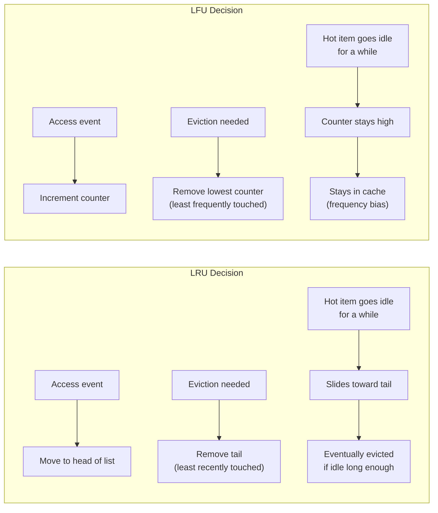
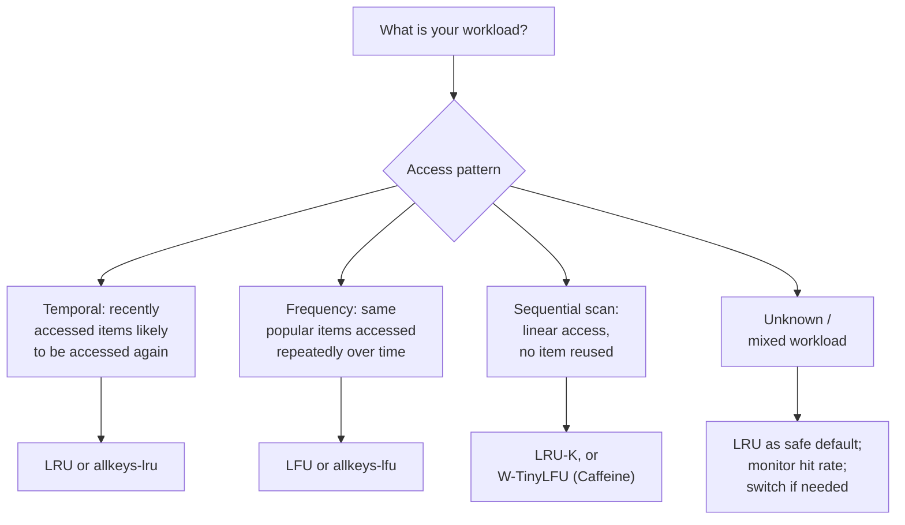

# [BEE-202] Cache Eviction Policies

:::info
LRU, LFU, FIFO, and adaptive policies -- how caches decide what to discard when memory runs out, and how to pick the right policy for your workload.
:::

## Why Eviction Matters

A cache is a finite resource. RAM costs money and has a hard upper bound; disk-backed caches trade latency for capacity but still have limits. When a cache fills up, every new entry requires discarding an existing one. The question is: which entry?

The wrong answer silently destroys the value of your cache. Evict a hot item and the next request misses, hits the database, and re-populates the cache -- only to evict that item again moments later. Under pathological access patterns, a misbehaving eviction policy can produce a **hit ratio close to zero** even with a large cache.

The right answer depends entirely on your workload. There is no universally optimal policy. Understanding the trade-offs is what separates a cache that absorbs 95% of your read traffic from one that merely adds latency.

:::warning No eviction policy is not an option
If you configure no eviction policy and no memory limit, a long-running process will grow its cache without bound and eventually crash with an OOM error. Always set an explicit memory limit and a matching eviction policy.
:::

## Core Policies

### LRU -- Least Recently Used

LRU evicts the entry that was accessed least recently. The rationale is **temporal locality**: if you haven't touched something in a while, you probably won't need it soon.

**How it works:** Maintain a linked list ordered by access time. On every read or write, move the accessed entry to the head. When eviction is needed, remove from the tail.

```
Cache state (head = most recent, tail = least recent):
[D] -> [C] -> [B] -> [A]   (capacity: 4)

Access E (new entry, cache full):
  Evict A (tail, least recently used)
  Insert E at head

New state: [E] -> [D] -> [C] -> [B]
```

**Characteristics:**
- O(1) access and eviction with a hash map + doubly-linked list
- Adapts quickly to shifts in access patterns
- Vulnerable to **scan pollution**: a full table scan reads millions of keys sequentially, flushing hot items from the cache even though none of the scanned keys will be accessed again

**Best for:** General-purpose caching, workloads with temporal locality, user session data, recently viewed content.

### LFU -- Least Frequently Used

LFU evicts the entry with the lowest access count. The rationale is **frequency locality**: popular items get accessed often and should stay; rare items should be first to go.

**How it works:** Track a hit counter per entry. On eviction, remove the entry with the minimum counter. When counters are equal, use recency as a tiebreaker.

```
Cache state (showing [key: count]):
[A:5] [B:3] [C:2] [D:1]   (capacity: 4)

Access E (new entry, E:1, cache full):
  Evict D (lowest count)
  Insert E with count=1

New state: [A:5] [B:3] [C:2] [E:1]
```

**Characteristics:**
- Retains consistently popular items even through brief periods of inactivity
- **Slow to adapt**: an item that was popular six months ago retains a high count and resists eviction even when no longer accessed (frequency bias)
- New items start with count=1 and are immediately vulnerable, even if they are about to become very popular
- Higher implementation complexity; naive implementation is O(log n) unless optimized

**Best for:** Stable workload distributions, media streaming (popular videos stay cached), public API responses where the same content is requested by many users.

### FIFO -- First In, First Out

FIFO evicts the entry that has been in the cache the longest, regardless of how often or recently it was accessed. The rationale is simplicity: oldest entry leaves first.

**How it works:** Maintain a queue. Insertions go to the tail. Evictions come from the head.

```
Cache state (left = oldest):
[A] -> [B] -> [C] -> [D]   (capacity: 4)

Access E (new entry, cache full):
  Evict A (oldest, regardless of access count)
  Insert E at tail

New state: [B] -> [C] -> [D] -> [E]

Note: A may have been accessed 100 times. FIFO does not care.
```

**Characteristics:**
- Extremely simple to implement; minimal overhead
- **No access pattern awareness**: a heavily-accessed item is evicted simply because it was inserted first
- Known to produce **Belady's anomaly** in some configurations: adding more cache capacity can make hit rate worse
- Rarely used in production application caches; useful in streaming pipelines and queues

**Best for:** Message queues, log buffers, situations where data genuinely has a time-based lifecycle and older entries are less valuable by definition.

### Random Eviction

Evict a randomly selected entry. No tracking of access patterns.

**Characteristics:**
- Near-zero overhead
- Surprisingly competitive in practice against LRU for workloads with uniform access distributions
- Non-deterministic: behavior is hard to reason about and test
- Benchmarks by Dan Luu ([Caches: LRU vs. random](https://danluu.com/2choices-eviction/)) show that for some real-world workloads, random eviction approaches LRU performance while being far simpler to implement

**Best for:** Embedded systems with severe memory constraints, situations where implementation simplicity outweighs a few percentage points of hit rate.

### TTL-Based Expiry

Entries expire after a configured time-to-live, regardless of access frequency or recency. This is not strictly an eviction policy but a **validity policy** -- entries are not evicted due to capacity pressure; they expire because their data may be stale.

In practice, TTL and eviction work together: TTL entries are cleared when they expire (freeing space), and the eviction policy handles capacity pressure among unexpired entries.

:::tip Eviction vs. invalidation
TTL-based expiry is a form of cache invalidation (see [BEE-201](201.md)), not eviction. Eviction is driven by memory pressure; invalidation is driven by data staleness. The two operate independently.
:::

## Advanced Policies

### LRU-K

LRU-K evicts the entry whose K-th most recent access is furthest in the past. LRU is equivalent to LRU-1. LRU-2 and LRU-3 are common choices.

The idea is to require an entry to have been accessed at least K times before it is considered "hot" enough to resist eviction. A single access (e.g., a scan) does not promote an entry; K accesses are required.

This directly addresses scan pollution. A sequential table scan accesses each key exactly once; with K=2, none of those entries are promoted and they are evicted first when the cache fills up.

### W-TinyLFU (Caffeine)

W-TinyLFU is the eviction policy used by [Caffeine](https://github.com/ben-manes/caffeine), a high-performance Java caching library, and by Ristretto (Go). It consistently outperforms both LRU and LFU on diverse workloads.

**Architecture:**

The cache is split into two regions:

1. **Window cache** (~1% of capacity): New entries enter here. Acts like LRU. Gives new entries a chance to build up frequency before being promoted or rejected.
2. **Main cache** (~99% of capacity): Entries that have proven their value. Split further into a "protected" LRU segment and a "probationary" LRU segment.

**Admission filter (TinyLFU):** When an entry would be promoted from the window to the main cache, it must compete against the entry being evicted from the main cache. A compact frequency sketch (Count-Min Sketch) tracks approximate access counts. The incoming entry wins only if its frequency is higher. This prevents cache pollution by low-frequency entries.

**Adaptive sizing:** The relative sizes of the window and main regions are adjusted dynamically using a hill-climbing algorithm. If the workload is recency-biased (like a scan), the window grows. If it is frequency-biased (like a stable popularity distribution), the main region grows.

The result: W-TinyLFU gets high hit rates on both frequency-biased and recency-biased workloads, including mixed workloads where neither pure LRU nor pure LFU would excel. See [Caffeine's efficiency benchmarks](https://github.com/ben-manes/caffeine/wiki/Efficiency) for comparisons across multiple trace datasets.

## Worked Example: LRU vs. LFU vs. FIFO

Cache capacity: 4. Access sequence: `A, B, C, D, A, E`.

We trace the state after each access, marking evictions.

```
Step 1: Access A  (miss, insert)
  LRU:  [A]
  LFU:  [A:1]
  FIFO: [A]

Step 2: Access B  (miss, insert)
  LRU:  [B, A]
  LFU:  [A:1, B:1]
  FIFO: [A, B]

Step 3: Access C  (miss, insert)
  LRU:  [C, B, A]
  LFU:  [A:1, B:1, C:1]
  FIFO: [A, B, C]

Step 4: Access D  (miss, insert -- cache now full)
  LRU:  [D, C, B, A]
  LFU:  [A:1, B:1, C:1, D:1]
  FIFO: [A, B, C, D]

Step 5: Access A  (hit -- A is already cached)
  LRU:  A moves to head: [A, D, C, B]   (A count: touched most recently)
  LFU:  A count increments: [A:2, B:1, C:1, D:1]
  FIFO: [A, B, C, D]   (FIFO does not track access; no change to order)

Step 6: Access E  (miss, insert -- must evict)
  LRU:  Evict B (least recently used). Insert E.
        Result: [E, A, D, C]

  LFU:  Evict B, C, or D (all count=1; use recency as tiebreaker -> evict D)
        Result: [E:1, A:2, B:1, C:1]

  FIFO: Evict A (oldest entry). Insert E.
        Result: [B, C, D, E]
        Note: A was accessed in step 5 but FIFO evicts it anyway.
```

**Outcome summary:**

| Policy | Evicted at step 6 | Why |
|--------|------------------|-----|
| LRU    | B                | B was not accessed after step 2 |
| LFU    | D (or B or C)    | D was accessed only once, same as B and C, but was inserted last |
| FIFO   | A                | A was inserted first, regardless of its step-5 hit |

FIFO's eviction of A is the most obviously wrong outcome: A was accessed just one step prior, yet it is the first to go because insertion order is all that matters to FIFO.

LRU and LFU both make defensible choices. LFU chose to keep A based on its higher count, which is correct if A will remain popular. LRU kept A because it was accessed recently, which is correct if A's recent activity predicts future activity.

## LRU vs. LFU Behavior Diagram



The diagram highlights the key difference: LRU responds to **recency** and will eventually evict an item that stops being accessed. LFU responds to **cumulative frequency** and retains items that were popular in the past even if they are no longer accessed -- until the counter ages out or the item is explicitly evicted.

## Redis Eviction Policies

Redis exposes a set of named eviction policies configured via `maxmemory-policy` in `redis.conf` or at runtime:

```
CONFIG SET maxmemory 2gb
CONFIG SET maxmemory-policy allkeys-lru
```

The full list from the [official Redis eviction documentation](https://redis.io/docs/latest/develop/reference/eviction/):

| Policy | Eviction target | Algorithm |
|--------|----------------|-----------|
| `noeviction` | None -- returns error on writes when full | None |
| `allkeys-lru` | All keys | LRU |
| `volatile-lru` | Keys with TTL set | LRU |
| `allkeys-lfu` | All keys | LFU |
| `volatile-lfu` | Keys with TTL set | LFU |
| `allkeys-random` | All keys | Random |
| `volatile-random` | Keys with TTL set | Random |
| `volatile-ttl` | Keys with TTL set | Evict soonest-expiring first |

**Key distinctions:**

- `allkeys-*` policies apply to every key in the database, including keys with no TTL.
- `volatile-*` policies apply only to keys that have an expiration set. If no such keys exist, nothing is evicted and new writes will fail once the memory limit is reached.
- `noeviction` is appropriate only when you would rather receive an error than lose data (e.g., a primary data store, not a cache).

**Redis recommendation:**

> Use `allkeys-lru` when you expect a power-law distribution in the popularity of requests -- that is, a subset of items will be accessed far more often than the rest. This is a safe default if you are unsure. Use `allkeys-lfu` when access patterns are stable and you want to keep the most consistently popular items in memory.

Note that Redis implements LRU and LFU as **approximations**, not exact algorithms. For LRU, Redis samples a configurable number of random keys (`maxmemory-samples`, default 5) and evicts the least recently used among them. This avoids the overhead of maintaining a full sorted list while producing results close to true LRU in practice. The `allkeys-lfu` policy tracks access frequency using a logarithmic counter with decay to prevent stale high counts from blocking eviction indefinitely.

## Choosing the Right Policy



| Workload type | Recommended policy | Reason |
|--------------|-------------------|--------|
| General web app, user sessions | LRU | Recent activity predicts future activity |
| Stable popular content (video, news) | LFU | Consistently popular items should stay |
| Database query results (varied queries) | LRU | Query recency correlates with reuse |
| Scan-heavy analytics | LRU-K or W-TinyLFU | Prevents scan pollution |
| Mixed / adaptive | W-TinyLFU (Caffeine) | Adaptive; best average-case hit rate |
| Redis with TTL-only keys | volatile-lru | Evict only TTL keys, preserve non-expiring data |
| Redis as primary store (no cache) | noeviction | Do not silently lose data |

## Common Mistakes

**1. Using the default eviction policy without checking what it is.**
Redis defaults to `noeviction`, which causes write errors when memory is full. If you are using Redis as a cache, set `maxmemory` and `maxmemory-policy` explicitly. Relying on defaults in production is a silent bomb.

**2. Cache too small for the working set.**
If your cache can hold 10,000 entries but your active working set is 500,000 entries, the eviction rate will be so high that the cache provides almost no benefit. Profile your working set size before sizing the cache. A hit rate below 80% usually signals a sizing problem, not a policy problem.

**3. No eviction policy at all (OOM crash).**
An in-process cache with no size limit and no eviction will grow unbounded over time. JVM heap exhaustion, Node.js heap overflow, and Linux OOM kills are common symptoms. Always set a maximum size on any cache, including in-process ones (e.g., Caffeine's `maximumSize`, Guava Cache's `maximumWeight`).

**4. LRU with scan-intensive workloads.**
A full table scan, a batch ETL job, or a nightly report that reads millions of unique rows in sequence will pollute an LRU cache with entries that will never be accessed again. Each scan key replaces a hot entry. After the scan, the cache is full of cold data and the hit rate crashes until the cache re-warms. Use LRU-K, W-TinyLFU, or a separate cache pool for scan queries.

**5. Not monitoring eviction rate.**
Evictions are not a problem in small numbers -- they are how caches work. But a high eviction rate relative to hit rate indicates the cache is too small or the policy is wrong. Export and monitor `evicted_keys` (Redis `INFO stats`) or equivalent metrics from your cache library. Alert when eviction rate exceeds a threshold that implies the hit rate is degraded.

## Related BEPs

- [BEE-200](200.md) -- Caching Fundamentals: cache patterns (cache-aside, write-through, write-behind) and when to add a cache layer.
- [BEE-201](201.md) -- Cache Invalidation Strategies: TTL, event-driven invalidation, and write-through. Invalidation is driven by data staleness; eviction is driven by memory pressure. They interact but are separate concerns.
- [BEE-203](203.md) -- Distributed Caching: how eviction policies behave in clustered and sharded caches, and the implications of consistent hashing on per-node capacity.

## References

- [Key eviction -- Redis documentation](https://redis.io/docs/latest/develop/reference/eviction/)
- [LFU vs. LRU: How to choose the right cache eviction policy -- Redis Blog](https://redis.io/blog/lfu-vs-lru-how-to-choose-the-right-cache-eviction-policy/)
- [Cache eviction strategies -- Redis Blog](https://redis.io/blog/cache-eviction-strategies/)
- [Cache replacement policies -- Wikipedia](https://en.wikipedia.org/wiki/Cache_replacement_policies)
- [TinyLFU: A Highly Efficient Cache Admission Policy -- Einziger et al., ACM TOS 2017](https://dl.acm.org/doi/10.1145/3149371)
- [Caffeine -- Efficiency benchmarks (GitHub Wiki)](https://github.com/ben-manes/caffeine/wiki/Efficiency)
- [Design of a Modern Cache -- High Scalability](https://highscalability.com/design-of-a-modern-cache/)
- [Caches: LRU vs. random -- Dan Luu](https://danluu.com/2choices-eviction/)
- [It's Time to Revisit LRU vs. FIFO -- Eytan et al., HotStorage 2020 (USENIX)](https://www.usenix.org/system/files/hotstorage20_paper_eytan.pdf)
