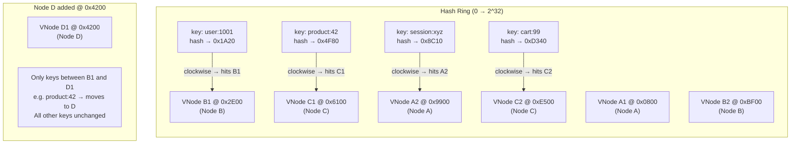
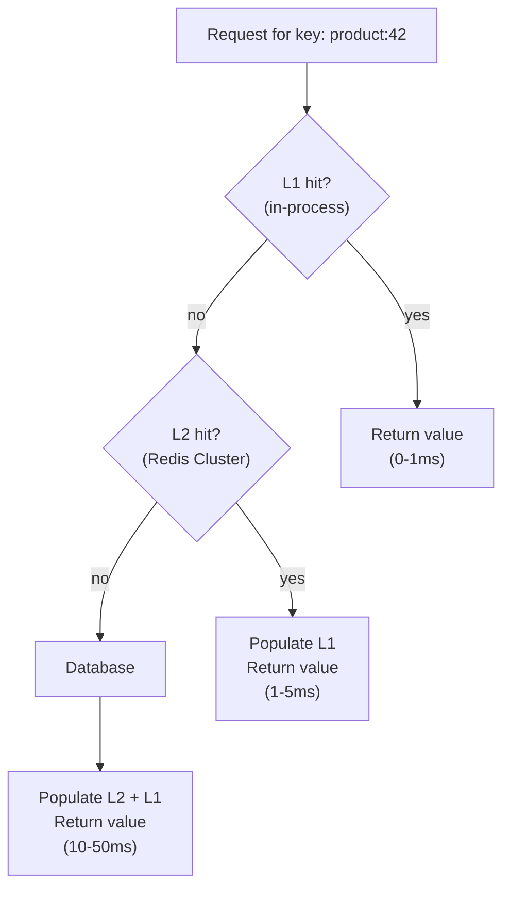

# [BEE-203] Distributed Caching

:::info
Consistent hashing, virtual nodes, cache cluster topologies, replication, hot key mitigation, and two-tier caching -- how to scale a cache beyond a single node without fragmenting correctness.
:::

## Why a Single Cache Node Is Not Enough

A single Redis or Memcached instance is bounded by the memory of one machine. For most production workloads, a few dozen gigabytes fills up quickly: user sessions, product catalogs, search result pages, feature flags, and computed aggregates all compete for the same address space. The moment the dataset grows past node capacity you start evicting entries that should stay warm, and cache hit rate drops.

Memory is not the only constraint:

- **Availability**: A single cache node is a single point of failure. When it crashes, every read goes to the database simultaneously -- a thundering herd (see BEE-204).
- **Throughput**: A single Redis instance handles roughly 100k operations per second at low latency. For high-traffic services, this ceiling is hit quickly.
- **Network bandwidth**: A cache node serving 50 GB/s of reads saturates a network interface long before it saturates CPU.

Distributing the cache across multiple nodes solves all three. The challenge is deciding which keys live on which nodes, and keeping that mapping consistent as the cluster evolves.

## Consistent Hashing

### The Problem with Modular Hashing

The naive approach is to hash each key and assign it to a node using modulo arithmetic:

```
node_index = hash(key) % number_of_nodes
```

This works until the cluster changes. When you add or remove a node, `number_of_nodes` changes, which changes the result of the modulo for almost every key. In a three-node cluster expanded to four nodes, roughly 75% of all keys map to a different node. That means a mass cache miss: the entire working set must be reloaded from the database, which can collapse the origin under load.

### The Hash Ring

Consistent hashing eliminates the mass redistribution problem. The core idea:

1. Map the hash space (e.g., 0 to 2^32 - 1) to a circular ring.
2. Place each cache node at one or more positions on the ring by hashing the node's identifier.
3. For each key, compute `hash(key)`, locate that position on the ring, and walk clockwise until you hit a node. That node owns the key.

When a node is added, it takes over only the keys that fall between its new position and the previous node on the ring going counter-clockwise. All other keys are unaffected. When a node is removed, only its keys must move to the next node clockwise. In an N-node cluster, adding or removing one node redistributes approximately 1/N of keys rather than all of them.

### Virtual Nodes

Without virtual nodes, a single physical node occupies one point on the ring. The key distribution across nodes depends heavily on how the hash function places those points. In practice, three nodes might get 40%, 35%, and 25% of keys -- uneven and worsening under load.

Virtual nodes solve this by assigning each physical node multiple positions on the ring. A node with 150 virtual nodes is distributed across 150 ring positions. Keys spread more evenly because they are claimed by whichever virtual node they land closest to, and those virtual nodes are spread around the ring.

When a physical node joins or leaves, its virtual node slots are individually redistributed. With 150 virtual nodes per physical node, the load is absorbed gradually and evenly by all remaining nodes rather than cascading onto one neighbor.



### Adding a Node: Minimal Key Redistribution

Consider a three-node cluster (A, B, C) with consistent hashing and 150 virtual nodes per node. The ring has 450 virtual node slots. You add a fourth node D with 150 virtual nodes.

```
Before: 450 virtual slots, 3 nodes
  Node A: ~150 slots (33%)
  Node B: ~150 slots (33%)
  Node C: ~150 slots (33%)

After: 600 virtual slots, 4 nodes
  Node A: ~150 slots (25%)  -- shed ~8% to D
  Node B: ~150 slots (25%)  -- shed ~8% to D
  Node C: ~150 slots (25%)  -- shed ~8% to D
  Node D: ~150 slots (25%)  -- new, receives ~8% from each
```

Only about 25% of keys move -- specifically those in the ring segments now claimed by D's virtual nodes. The remaining 75% of keys stay on their current nodes with full cache hits intact. The database sees only a small, gradual increase in misses as D's segments warm up, rather than a complete cache flush.

## Cache Cluster Topologies

### Client-Side Sharding

The cache client (your application code or a client library) is responsible for hashing each key to the correct node and talking to that node directly. Libraries like the Memcached client `libmemcached` or Redis clients with consistent-hashing support implement this.

```
Application
    ↓
[Cache Client Library]
    ↓ hash("user:1001") → Node B
    ↓ hash("product:42") → Node C
    ↓ hash("session:xyz") → Node A
[Node A]   [Node B]   [Node C]
```

**Pros:** Low latency (one hop to the right node), no proxy bottleneck.
**Cons:** Each client must maintain the node list and consistent hashing ring. Adding a node requires rolling out updated config to all application instances. Shard logic is baked into every client.

### Proxy-Based Sharding

A proxy layer (e.g., Twemproxy/Nutcracker for Memcached, Codis for Redis) sits between the application and cache nodes. The application connects to the proxy as if it were a single cache server. The proxy handles key routing, consistent hashing, and connection pooling.

```
Application
    ↓
[Proxy: Twemproxy / mcrouter]
    ↓ routing table + consistent hashing
[Node A]   [Node B]   [Node C]
```

**Pros:** Application is decoupled from the node topology. Adding/removing nodes requires only proxy config changes. Consistent hashing is maintained centrally.
**Cons:** Proxy is a new latency hop (~0.5-1ms) and a potential bottleneck. Must be made highly available (run multiple proxy instances).

Meta's `mcrouter` (used at Facebook scale) is a battle-tested proxy for Memcached. It implements consistent hashing, connection pooling, replication routing, failover, and invalidation fan-out -- all in one proxy tier.

### Native Cluster Mode (Redis Cluster)

Redis Cluster is built into Redis and handles sharding internally using 16,384 hash slots. Each key is assigned to a slot via `CRC16(key) % 16384`. Slots are distributed across master nodes, and each master can have one or more replicas.

```
Client (cluster-aware)
    ↓
[Redis Cluster: 16384 hash slots]
  Master A (slots 0–5460)      + Replica A'
  Master B (slots 5461–10922)  + Replica B'
  Master C (slots 10923–16383) + Replica C'
```

Cluster-aware clients know the slot-to-node mapping and route commands directly to the right master. If a client sends a command to the wrong node, that node replies with a `MOVED` redirect.

**Pros:** No external proxy required, built-in replication and automatic failover.
**Cons:** Multi-key operations (MGET, pipelines) only work if all keys map to the same slot. Cross-slot operations require `{hash tags}` to force key collocation, which requires application-level awareness.

## Replication in Cache Clusters

Cache replication serves two purposes: fault tolerance and read scaling.

**Fault tolerance**: Each master has one or more replicas. If a master fails, a replica is promoted. Redis Cluster uses a Raft-like election; Twemproxy/mcrouter can be configured to fail over to a standby pool.

**Read scaling**: Read-heavy workloads can route reads to replicas, reducing load on masters. This introduces replication lag: reads from a replica may return data that is a few milliseconds behind the master.

For cache use cases, brief replication lag is usually acceptable -- the data is already an approximation of the source of truth. The important thing is that replication does not introduce unbounded staleness; Redis replication is asynchronous but fast, with typical lag in single-digit milliseconds under normal conditions.

A common pattern in large deployments is **cluster per region**: each data center runs a full cache cluster, and replication between regions is handled at the application or database layer rather than at the cache layer (see BEE-165 on eventual consistency). This avoids cross-region cache writes on every request.

## Cache-Aside with a Distributed Cache

The cache-aside pattern (read-through from application code) works identically with a distributed cache. The only difference is that the cache client routes each key to the correct node transparently:

```
function get(key):
    // client routes to correct node via consistent hashing
    value = distributedCache.get(key)
    if value is null:
        value = database.query(key)
        distributedCache.set(key, value, ttl=300)
    return value

function update(key, newValue):
    database.update(key, newValue)
    distributedCache.delete(key)   // routed to correct node automatically
```

The application does not need to know which node holds a key. The client library or proxy handles routing. This is one of the key advantages of consistent hashing with virtual nodes: the cache topology becomes an operational concern, not an application concern.

## The Hot Key Problem

Consistent hashing distributes keys across nodes, but it cannot distribute load on a single key. If one key receives disproportionate traffic -- a celebrity's profile page, a viral product listing, a global configuration entry -- all requests for that key hit the same cache node. That node becomes a bottleneck regardless of how many other nodes exist in the cluster.

**Symptoms:**
- One node at 100% CPU/memory while others are mostly idle.
- Latency spikes for a specific key pattern.
- Cache misses concentrated on one node under load.

**Mitigation strategies:**

1. **Key replication / read replicas**: Replicate the hot key to multiple nodes and randomly distribute reads across all replicas. The application reads from `hot_key:replica_{random(0, N)}` and a background process keeps all replicas in sync.

2. **Local cache tier**: Cache the hot key in-process (in the application server's memory) for a short TTL (e.g., 1-5 seconds). Most requests are served from local memory and never touch the distributed cache. Only misses go to the distributed node.

3. **Key disaggregation**: If the hot key represents a large aggregate (e.g., a sorted leaderboard), break it into sub-keys that can be distributed across nodes, and merge at read time.

4. **Jittered TTL**: If many keys have the same TTL and they all expire together, they can all become hot simultaneously (cache stampede by time). Adding random jitter to TTLs spreads expiration across time.

## Two-Tier Caching: Local + Distributed

Two-tier caching combines an in-process local cache (L1) with a shared distributed cache (L2). It is the most effective mitigation for both hot key problems and high-frequency reads.

```
Request
    ↓
[L1: In-process cache (e.g., Caffeine, LRU map)]
    ↓ miss
[L2: Distributed cache (e.g., Redis Cluster)]
    ↓ miss
[Database]
```

**Read path:**
1. Check L1. If hit, return immediately (sub-millisecond, no network).
2. If L1 miss, check L2. If hit, populate L1 and return.
3. If L2 miss, query database, populate L2, populate L1, return.

**L1 characteristics:**
- Lives in the application process heap. Zero network latency.
- Small capacity (a few hundred to a few thousand entries per process).
- Short TTL (1-10 seconds) to limit staleness, since L1 is not invalidated by other application instances.
- Eliminates network calls for the hottest keys.

**L2 characteristics:**
- Shared across all application instances. Invalidations are visible to all.
- Larger capacity (gigabytes across the cluster).
- Longer TTL (minutes to hours).
- Handles the long tail of keys that are warm but not hot enough for L1.

**Coherence caveat**: L1 caches are local to each application process. If a key is invalidated in L2 (because the underlying data changed), the L1 caches across all application instances still hold the old value until their local TTL expires. This is an intentional tradeoff: a 5-second L1 TTL means at most 5 seconds of cross-instance incoherence. For data where sub-second consistency matters, keep the L1 TTL very short or do not cache that key in L1 at all.



## Common Mistakes

1. **Not using consistent hashing (using modulo instead).** Adding or removing cache nodes with modulo hashing invalidates most of the cache. Always use consistent hashing with virtual nodes. Libraries like Ketama (used by Memcached clients) implement this correctly.

2. **Hot key on a single node with no mitigation.** One celebrity's profile page causes one cache node to saturate while others idle. Monitor per-node metrics (CPU, connections, ops/sec) individually -- aggregated cluster metrics hide this failure mode. Implement local caching for known hot keys.

3. **No failover strategy.** A node going down without failover causes a cache miss storm on the database as all keys from that node miss simultaneously. Use replication (Redis Cluster replicas, Sentinel, or Enterprise HA) and design the application to tolerate brief miss spikes via circuit breakers or request coalescing (see BEE-204).

4. **Using the distributed cache as a source of truth.** Cache data is ephemeral. A node restart, eviction under memory pressure, or configuration change can delete any key at any time. The database is always the source of truth. Never write data to cache without also writing it to persistent storage.

5. **Not monitoring per-node metrics.** A cluster can look healthy in aggregate while one shard is saturated. Track memory usage, hit rate, CPU utilization, and connection count per node. Set alerts on node-level thresholds, not just cluster-level totals. Imbalanced load often signals a hot key problem or a misconfigured consistent hashing ring.

## Related BEPs

- **BEE-123** -- Database Sharding: consistent hashing applies identically to partitioning databases across nodes.
- **BEE-200** -- Caching Fundamentals: cache-aside, write-through, write-behind patterns and the fundamentals this article builds on.
- **BEE-204** -- Cache Stampede and Thundering Herd: what happens when distributed cache nodes fail and keys miss simultaneously.
- **BEE-165** -- Eventual Consistency: cross-region cache coherence and the consistency tradeoffs in distributed systems.

## References

- [Scaling Memcache at Facebook -- NSDI 2013 (USENIX)](https://www.usenix.org/conference/nsdi13/technical-sessions/presentation/nishtala)
- [Scaling Memcache at Facebook -- Full Paper PDF](https://www.usenix.org/system/files/conference/nsdi13/nsdi13-final170_update.pdf)
- [Redis Cluster Specification -- redis.io](https://redis.io/docs/latest/operate/oss_and_stack/reference/cluster-spec/)
- [Scale with Redis Cluster -- redis.io Docs](https://redis.io/docs/latest/operate/oss_and_stack/management/scaling/)
- [Consistent Hashing Explained -- AlgoMaster](https://blog.algomaster.io/p/consistent-hashing-explained)
- [Consistent Hashing -- Wikipedia](https://en.wikipedia.org/wiki/Consistent_hashing)
- [Designing a Distributed Cache: Redis and Memcached at Scale -- DEV Community](https://dev.to/sgchris/designing-a-distributed-cache-redis-and-memcached-at-scale-1if3)
