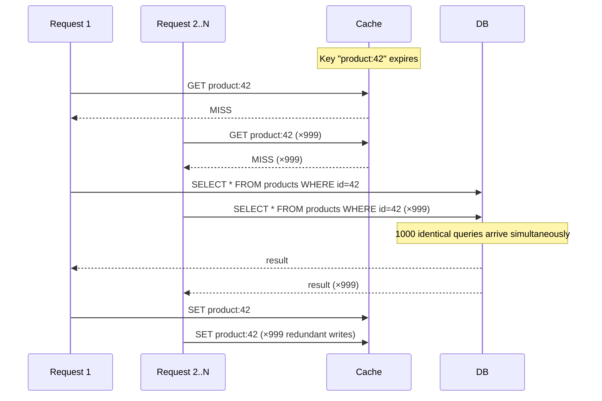
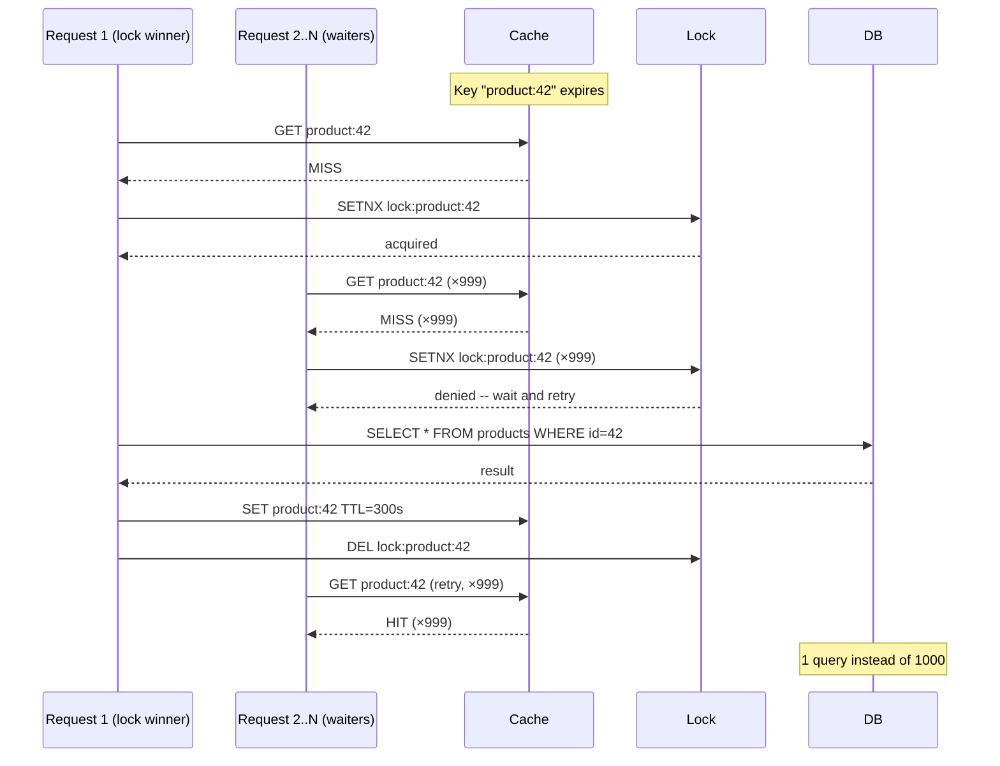

# [BEP-204] Cache Stampede and Thundering Herd

:::info
When a cache key expires under heavy load, many concurrent requests can race to regenerate it, overwhelming the database. This article defines the problem and covers the mitigation strategies every backend engineer should know.
:::

## Context

A cache is only useful when it absorbs traffic before it reaches the database. But the moment a hot cache key expires, the cache momentarily becomes a liability: the first request to arrive finds nothing and goes to the database, and before that query returns, hundreds or thousands of identical requests do the same. This is a **cache stampede** (also called **cache miss storm**).

The **thundering herd** is the broader family of problems where a large cohort of clients or workers simultaneously try to acquire the same scarce resource -- examples include a service restart that boots with cold caches, a mass connection retry after a network blip, or a fleet of workers woken up by the same event.

Both problems share the same structure: a single triggering event causes N independent actors to compete for the same backend resource at the same time, with N often being large enough to cause database overload or service outage.

### The Stampede Scenario



### The Fix: Only One Request Regenerates



## Principle

**Protect every hot cache key against concurrent regeneration.** Choose a strategy proportional to your traffic: mutex locking for simplicity, singleflight/coalescing for in-process concurrency, probabilistic early expiration for lock-free resilience, and stale-while-revalidate for zero-latency tolerance.

## Mitigation Strategies

### 1. Mutex / Distributed Lock

The simplest protection: only the request that acquires the lock regenerates the value. All others wait, then read from cache once the lock is released.

```python
import time
import random

LOCK_TTL = 10  # seconds -- must exceed worst-case DB query time

def get_product(product_id: str) -> dict:
    key = f"product:{product_id}"
    lock_key = f"lock:{key}"

    # Fast path: cache hit
    value = cache.get(key)
    if value:
        return value

    # Slow path: acquire lock to regenerate
    acquired = cache.set(lock_key, "1", nx=True, ex=LOCK_TTL)  # atomic SETNX

    if acquired:
        try:
            value = db.query("SELECT * FROM products WHERE id = ?", product_id)
            cache.set(key, value, ex=300)
            return value
        finally:
            cache.delete(lock_key)  # always release
    else:
        # Did not win the lock -- wait for the winner to populate cache
        for _ in range(20):
            time.sleep(0.1)
            value = cache.get(key)
            if value:
                return value
        # Fallback: return stale data or raise a graceful error
        return get_stale_or_default(product_id)
```

**Trade-offs:** Simple to reason about. Under very high concurrency, waiters may retry several times. If the lock holder crashes before releasing, other requests are blocked until the TTL expires -- which is why the lock TTL is mandatory.

### 2. Request Coalescing (Singleflight)

Collapse all in-flight requests for the same key into a single backend call. The first caller executes the fetch; every subsequent caller for the same key blocks and shares the result when it arrives.

This is the Go `singleflight` pattern, but the concept applies in any language.

```go
// Go -- using golang.org/x/sync/singleflight
var group singleflight.Group

func GetProduct(productID string) (*Product, error) {
    key := "product:" + productID

    // All concurrent calls with the same key share one DB query
    result, err, _ := group.Do(key, func() (interface{}, error) {
        cached, err := cache.Get(key)
        if err == nil {
            return cached, nil
        }
        product, err := db.QueryProduct(productID)
        if err != nil {
            return nil, err
        }
        cache.Set(key, product, 5*time.Minute)
        return product, nil
    })
    if err != nil {
        return nil, err
    }
    return result.(*Product), nil
}
```

```typescript
// TypeScript -- manual coalescing map
const inFlight = new Map<string, Promise<Product>>();

async function getProduct(productId: string): Promise<Product> {
  const key = `product:${productId}`;

  if (inFlight.has(key)) {
    return inFlight.get(key)!; // join the existing in-flight request
  }

  const promise = (async () => {
    const cached = await cache.get(key);
    if (cached) return cached;

    const product = await db.queryProduct(productId);
    await cache.set(key, product, { ttl: 300 });
    return product;
  })().finally(() => inFlight.delete(key));

  inFlight.set(key, promise);
  return promise;
}
```

**Trade-offs:** Works within a single process. In a distributed system with many nodes, each node coalesces its own traffic but still sends one query per node. Combine with a distributed lock if cross-node coalescing is needed.

### 3. Probabilistic Early Expiration (XFetch)

Recompute the cache value before it expires with a probability that grows as the expiry approaches. No lock needed -- each process independently decides whether to refresh based on a random draw.

The algorithm from [Vattani et al. 2015](https://cseweb.ucsd.edu/~avattani/papers/cache_stampede.pdf):

```
recompute = time.now() - (delta * beta * ln(random(0,1))) >= expiry
```

- `delta` -- time the last recomputation took (in seconds)
- `beta` -- tuning parameter (default 1.0; raise to recompute earlier)
- `expiry` -- absolute Unix timestamp when the key expires

```python
import math
import random
import time

BETA = 1.0  # 1.0 is optimal for most workloads; increase to be more aggressive

def get_product_xfetch(product_id: str) -> dict:
    key = f"product:{product_id}"
    entry = cache.get_with_metadata(key)  # returns {value, expiry, delta}

    if entry:
        # Decide probabilistically whether to recompute now
        early_recompute = (
            time.time() - entry["delta"] * BETA * math.log(random.random())
            >= entry["expiry"]
        )
        if not early_recompute:
            return entry["value"]

    # Cache miss or early recompute triggered
    start = time.time()
    value = db.query("SELECT * FROM products WHERE id = ?", product_id)
    delta = time.time() - start  # measure actual fetch time

    expiry = time.time() + 300
    cache.set_with_metadata(key, value, expiry=expiry, delta=delta)
    return value
```

**Trade-offs:** Lock-free and highly scalable. Multiple processes may occasionally recompute simultaneously (that is intentional -- it avoids a single point of failure). Works best for keys with measurable fetch time. See [Cache stampede -- Wikipedia](https://en.wikipedia.org/wiki/Cache_stampede) for the formal derivation.

### 4. Stale-While-Revalidate

Serve the stale cached value immediately while refreshing in the background. From the user's perspective, there is no latency spike. A stampede cannot occur because only one background job refreshes each key.

```python
import threading

def get_product_swr(product_id: str) -> dict:
    key = f"product:{product_id}"
    stale_key = f"stale:{key}"

    value = cache.get(key)
    if value:
        return value  # fresh cache -- done

    stale = cache.get(stale_key)
    if stale:
        # Return stale value, trigger background refresh once
        refresh_key = f"refresh:{key}"
        if cache.set(refresh_key, "1", nx=True, ex=30):
            threading.Thread(
                target=refresh_product, args=(product_id,), daemon=True
            ).start()
        return stale

    # Truly cold -- must synchronously fetch
    return refresh_product(product_id)

def refresh_product(product_id: str) -> dict:
    key = f"product:{product_id}"
    value = db.query("SELECT * FROM products WHERE id = ?", product_id)
    cache.set(key, value, ex=300)             # fresh TTL
    cache.set(f"stale:{key}", value, ex=600)  # stale copy lives longer
    return value
```

**Trade-offs:** Best user experience -- zero added latency. Requires storing a stale copy with a longer TTL. Not suitable for data that must never be served stale (e.g., account balances, inventory counts).

### 5. Jittered TTL

Prevent synchronized mass expiry by adding random jitter to every TTL. This eliminates the thundering herd caused by many keys being written simultaneously (e.g., a cache warm-up job or a deploy).

```python
import random

BASE_TTL = 300   # 5 minutes
MAX_JITTER = 60  # ±60 seconds

def set_product_cache(product_id: str, value: dict) -> None:
    ttl = BASE_TTL + random.randint(-MAX_JITTER, MAX_JITTER)
    cache.set(f"product:{product_id}", value, ex=ttl)
```

Use jittered TTL as a baseline practice for all caches, not as a primary stampede prevention mechanism.

### 6. Cache Warming on Deploy

A service restart boots with all caches cold. Before shifting traffic to the new instance, pre-populate the cache for the most critical keys.

```bash
# Deployment script: warm cache before switching load balancer
./scripts/cache-warm.sh --keys product_catalog,homepage,featured_products
# Wait for warm-up confirmation, then proceed with traffic shift
./scripts/lb-switch.sh
```

Or at application startup:

```python
def on_application_startup():
    top_products = db.query("SELECT id FROM products ORDER BY views DESC LIMIT 1000")
    for product in top_products:
        value = db.query("SELECT * FROM products WHERE id = ?", product.id)
        cache.set(f"product:{product.id}", value, ex=300)
    logger.info("Cache warm-up complete. Ready for traffic.")
```

## Common Mistakes

### 1. No stampede protection on high-traffic keys

The most frequent mistake. Any key that receives concurrent traffic at expiry time is vulnerable. Audit your hottest keys and ensure at least one protection mechanism is in place.

### 2. Lock without timeout (deadlock on holder crash)

```python
# WRONG -- lock never expires, holder crash causes permanent block
cache.set(lock_key, "1", nx=True)  # no ex= argument

# CORRECT -- lock expires after worst-case recomputation time
cache.set(lock_key, "1", nx=True, ex=10)
```

### 3. Uniform TTL across all keys (synchronized mass expiry)

If a cache warm-up job writes 50,000 keys all with `TTL=300`, they all expire at the same second five minutes later. Always add jitter.

### 4. Not warming cache after deploy (cold start stampede)

After every deploy, your caches are cold. If you shift traffic immediately, every request on every node is a miss. Warm before switching traffic.

### 5. Mutex without fallback

If lock acquisition fails repeatedly (e.g., the lock holder is extremely slow), requests will either queue indefinitely or error. Always implement a fallback: return stale data, a default response, or a graceful degradation rather than hanging or crashing.

```python
# Fallback hierarchy
def get_product_safe(product_id: str) -> dict:
    try:
        return get_product_with_lock(product_id)
    except LockTimeoutError:
        stale = cache.get(f"stale:product:{product_id}")
        if stale:
            return stale  # serve stale rather than fail
        return {"id": product_id, "error": "temporarily unavailable"}
```

## Strategy Comparison

| Strategy | Complexity | Cross-Node | User Latency | Use When |
|---|---|---|---|---|
| Mutex / distributed lock | Low | Yes | Added wait for non-winners | Simplicity is priority; DB queries are slow |
| Singleflight / coalescing | Low | No (per-process) | Shared wait for first result | High concurrency within one process/node |
| XFetch (probabilistic) | Medium | Yes (lock-free) | None | High read throughput; can tolerate occasional duplicate fetch |
| Stale-while-revalidate | Medium | Yes | None | Staleness is acceptable; user-facing latency is critical |
| Jittered TTL | Very low | Yes | None | Always apply as baseline |
| Cache warming | Medium | Yes | None | Deploys and service restarts |

For most production systems, apply **jittered TTL** universally and add **singleflight** at the application layer. Reserve **distributed locks** or **XFetch** for the small set of extremely hot keys that drive disproportionate DB load.

## Related BEPs

- [BEP-200: Caching Fundamentals](./200.md) -- foundational concepts: TTL, eviction, consistency
- [BEP-201: Cache Invalidation](./201.md) -- invalidation events are the primary stampede trigger
- [BEP-203: Distributed Cache](./203.md) -- stampede propagation across cache nodes
- [BEP-266: Rate Limiting](../../Resilience/266.md) -- last-resort DB protection when stampedes do occur

## References

- Vattani, A.; Chierichetti, F.; Lowenstein, K. (2015). "Optimal Probabilistic Cache Stampede Prevention." [cseweb.ucsd.edu](https://cseweb.ucsd.edu/~avattani/papers/cache_stampede.pdf)
- [Cache stampede -- Wikipedia](https://en.wikipedia.org/wiki/Cache_stampede)
- [Thundering herd problem -- Wikipedia](https://en.wikipedia.org/wiki/Thundering_herd_problem)
- [Solving Thundering Herds with Request Coalescing in Go -- Jaz's Blog](https://jazco.dev/2023/09/28/request-coalescing/)
- [How to Handle Cache Stampede in Redis -- OneUptime](https://oneuptime.com/blog/post/2026-01-21-redis-cache-stampede/view)
- [Avoiding Cache Stampede with XFetch](https://pjatk.in/avoiding-cache-stampede.html)
