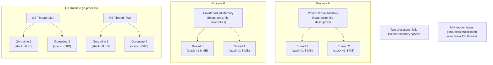

# [BEE-240] Threads vs Processes vs Coroutines

:::info
Concurrency models and their resource tradeoffs. Choosing the wrong abstraction at scale causes resource exhaustion, data races, or wasted CPU — this article maps each model to its appropriate use case.
:::

## Context

Modern backend services must handle many things "at once": incoming requests, database queries, background jobs, external API calls. The OS and language runtimes offer three fundamental abstractions for structuring this work: **processes**, **threads**, and **coroutines** (a family that includes green threads and goroutines).

Choosing the wrong model at scale is expensive. A naively threaded HTTP server that spawns one OS thread per connection will exhaust memory long before it runs out of CPU. An async server that never uses multiple threads will underutilize a 32-core machine for CPU-bound work. The right choice depends on the workload, the isolation requirements, and the language runtime in play.

### Concurrency vs. Parallelism

Rob Pike's canonical formulation: **concurrency is the composition of independently executing processes; parallelism is the simultaneous execution of computations.** Concurrency is a design property — you structure the program into independent pieces. Parallelism is an execution property — those pieces actually run at the same instant on multiple CPUs.

A single-core machine can be highly concurrent (many tasks interleaved) but never parallel. A poorly structured multi-core program can be parallel in hardware but serial in logic. The goal of concurrency is good structure; parallelism is an optional benefit that follows from running concurrent designs on multiple cores.

Reference: [go.dev/blog/waza-talk](https://go.dev/blog/waza-talk)

## The Three Models



### Processes

A process is the OS unit of isolation. Each process owns:

- A private virtual address space (up to 128 TB on 64-bit Linux)
- Its own file descriptor table, signal handlers, and credentials
- One or more threads

**Memory overhead:** 10–100 MB minimum, including code segments, heap, stack, and kernel metadata.

**Fault isolation:** A crash or memory corruption in Process A cannot affect Process B. The kernel enforces this at the hardware level via the MMU.

**Communication:** Inter-Process Communication (IPC) requires explicit mechanisms — pipes, sockets, shared memory segments, or message queues. This adds latency and complexity.

**Context switch cost:** The OS must flush the TLB (Translation Lookaside Buffer) when switching between processes. This costs roughly 1,000–2,000 additional CPU cycles compared to a same-process thread switch.

**Creation cost:** Spawning a process via `fork()` takes 1–10 ms.

### Threads

A thread is the OS unit of execution within a process. All threads in a process share the same heap and file descriptors, but each has its own:

- Stack (typically 1–8 MB, allocated upfront by the OS)
- Register set and program counter

**Memory overhead:** ~1–8 MB per thread (dominated by the stack). 1,000 threads = 1–8 GB just in stacks.

**Context switch cost:** Thread switches within a process skip TLB flushes, making them 2–5× faster than process switches.

**Creation cost:** 10–100 µs.

**Synchronization:** Shared memory is convenient but dangerous. Any thread can read or overwrite any data in the heap. Correct concurrent mutation requires locks, atomics, or lock-free structures. Missing synchronization causes data races and undefined behavior.

### Coroutines / Green Threads / Goroutines

These are all variants of **user-space scheduling**: the runtime (not the OS kernel) decides which logical unit of work runs on which OS thread.

| Concept | Description |
|---|---|
| Coroutine | Language construct; suspends at explicit `yield`/`await` points (cooperative) |
| Green thread | Runtime-managed thread; may be cooperative or preemptive |
| Goroutine (Go) | Runtime-managed; uses work-stealing M:N scheduler; preemptive since Go 1.14 |
| async task (Python/JS/Rust) | Event-loop driven; cooperative; runs on one or more OS threads |

The **M:N model** maps M goroutines (or green threads) onto N OS threads. Go's runtime typically sets N to `GOMAXPROCS` (default: number of CPU cores). When a goroutine blocks on I/O, the runtime parks it and schedules another goroutine on the same OS thread — no OS context switch required.

**Memory overhead:** A Go goroutine starts with an 8 KB stack that grows dynamically. 100,000 goroutines ≈ 800 MB — versus 100 GB for the same count of OS threads at 1 MB each.

**Context switch cost:** User-space only; on the order of tens of nanoseconds versus ~1 µs for an OS thread switch.

**Scheduling:** Go's scheduler is preemptive (goroutines can be suspended at any safe point). Python's `asyncio` and JavaScript are cooperative (a task must `await` or return to yield control). A CPU-bound coroutine in a cooperative system can starve all other tasks on the event loop.

References:
- [adaskin.github.io — Green threads, goroutines, and coroutines](https://adaskin.github.io/hpc/2024/05/08/green-threads-goroutine-coroutine.html)
- [kushallabs.com — Understanding Concurrency in Go](https://kushallabs.com/understanding-concurrency-in-go-green-threads-os-threads-and-goroutines-b40a4ec14981)

## Memory and Cost Comparison

| Dimension | Process | OS Thread | Goroutine / Coroutine |
|---|---|---|---|
| Stack memory | 10–100 MB | 1–8 MB | 8 KB (Go); grows on demand |
| Creation cost | 1–10 ms | 10–100 µs | < 1 µs |
| Context switch | ~10 µs (TLB flush) | ~1–5 µs | ~100 ns (user-space) |
| Memory isolation | Full (kernel-enforced) | None (shared heap) | None (shared heap) |
| Fault isolation | Full | None | None |
| True parallelism | Yes (multi-core) | Yes (multi-core) | Yes, if M:N with N > 1 |

## Principle

**Match the concurrency primitive to the workload, not to convention.**

1. **CPU-bound work with isolation requirements** → multiple processes (or process pools). Crash isolation and no shared state simplify correctness. Example: data processing pipelines, ML inference workers.

2. **CPU-bound work within a trusted boundary** → OS threads with a thread pool. Share memory for performance, but synchronize access carefully. Example: image encoding, cryptographic operations in a server.

3. **I/O-bound work at high concurrency** → coroutines / async / goroutines. Thousands of concurrent I/O waits cost almost nothing in user-space; OS threads would exhaust memory. Example: HTTP servers, microservice proxies, database connection handlers.

4. **Strong isolation needed between tenants** → processes. A bug in one tenant's request handler cannot corrupt another's state. Example: multi-tenant code execution, browser tab isolation.

## The 10,000-Connection HTTP Server Example

Consider a server that must handle 10,000 concurrent connections, each waiting on a database query (pure I/O wait, no CPU).

**Model 1: Process per request**

```
10,000 connections × ~50 MB per process = ~500 GB RAM
```

Infeasible on any realistic machine. Process creation overhead also makes short-lived requests extremely slow.

**Model 2: Thread per request (naïve)**

```
10,000 connections × 1 MB stack per thread = ~10 GB RAM
```

Exhausts a standard server's memory before saturating the CPU. At this point, the OS scheduler is thrashing through 10,000 kernel threads, most of which are blocked on I/O. Context-switch overhead dominates.

**Model 3: Async / coroutine per request**

```
10,000 connections × 8 KB goroutine stack = ~80 MB RAM
```

The runtime parks each goroutine (or async task) while it waits for I/O. Only a handful of OS threads are active. CPU and memory remain available for actual computation.

The math makes the case: for I/O-bound concurrency at scale, user-space scheduling wins by orders of magnitude.

## The GIL: Python's Threading Caveat

CPython has a **Global Interpreter Lock (GIL)**: only one thread executes Python bytecode at a time, even on multi-core hardware. This means:

- Python threads provide concurrency (interleaving), but **not parallelism** for CPU-bound Python code.
- For I/O-bound work the GIL is released during syscalls, so threads do help.
- To achieve CPU parallelism in Python, use `multiprocessing` (separate processes, no GIL) or offload to C extensions (NumPy, etc.) that release the GIL.

Python 3.13 introduced experimental no-GIL builds (PEP 703), but this is not yet the default.

Other runtimes avoid this problem: Go, Rust, Java, and C# threads all run truly in parallel on multi-core hardware without a global interpreter lock.

## Common Mistakes

**1. Thread-per-request at high concurrency**

Allocating one OS thread per connection is natural to reason about but collapses under load. At a few thousand concurrent connections, memory and scheduler overhead dominate. Use a thread pool with a fixed upper bound, or switch to an async model.

**2. Shared mutable state without synchronization**

Threads share heap memory. Writing a counter, a map, or a list from multiple threads without synchronization is a data race — the outcome is undefined and may be non-deterministic in production. Always protect shared state with a mutex, use atomic operations, or design message-passing architectures (CSP, actors).

**3. Assuming coroutines are parallel**

Coroutines on a single-threaded event loop (Node.js, Python `asyncio`, most browser JS) are concurrent but not parallel. Two `async` functions cannot run at the same physical instant. CPU-bound work on the event loop blocks all other tasks. Use worker threads or processes for CPU work alongside an async I/O layer.

**4. Ignoring the GIL for CPU-bound Python**

Python `threading` feels like it adds parallelism, but the GIL serializes bytecode execution. Profiling a CPU-bound Python workload on 8 threads will often show near-zero improvement over 1 thread. Use `multiprocessing`, or delegate to C/Rust extensions.

**5. Spawning unbounded goroutines or tasks**

Goroutines are cheap, but not free. Spawning a goroutine for every incoming request with no backpressure mechanism will exhaust memory under a spike. Always cap concurrency with a semaphore, worker pool, or rate limiter. See [BEE-244](244.md) for worker pool patterns.

## Decision Guide

```
Is the work CPU-bound?
├── Yes, and isolation needed between jobs? → Processes / process pool
├── Yes, shared state is acceptable? → OS thread pool
└── No, mostly waiting on I/O?
    ├── Need strong per-request isolation? → Processes (rare)
    └── Normal I/O multiplexing? → Coroutines / async / goroutines
```

## Related BEPs

- [BEE-241](241.md) — Race Conditions: what goes wrong when threads share state without synchronization
- [BEE-242](242.md) — Locks and Mutual Exclusion: mutex patterns, deadlock, and lock ordering
- [BEE-243](243.md) — Async I/O: event loops, non-blocking syscalls, and the reactor pattern
- [BEE-244](244.md) — Worker Pools: bounding concurrency, backpressure, and graceful shutdown
