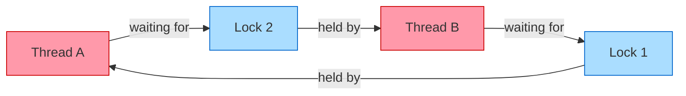

# [BEE-242] Locks, Mutexes, and Semaphores

:::info
Locks are the most common way to protect shared state, but they are also a frequent source of bugs: deadlock, starvation, and performance bottlenecks. Understanding the distinctions between mutex, semaphore, read-write lock, and spinlock — and the four conditions that cause deadlock — is foundational for concurrent systems.
:::

## Context

When multiple threads or goroutines access shared mutable state, correctness requires that critical sections execute atomically with respect to one another. The OS and language runtimes provide several synchronization primitives for this purpose. Each primitive has different semantics, ownership rules, and performance characteristics. Using the wrong one — or using the right one incorrectly — produces subtle, hard-to-reproduce bugs.

This article defines the major lock types, explains deadlock and its four necessary conditions, walks through prevention strategies, and covers distributed locking.

## Definitions

### Mutex (Mutual Exclusion Lock)

A **mutex** is a binary lock: it is either held (locked) or free (unlocked). Only one thread can hold a mutex at a time.

The defining property of a mutex is **ownership**: the thread that locks the mutex is the only thread allowed to unlock it. This ownership rule prevents one thread from accidentally releasing another thread's lock, and it enables priority inheritance (a higher-priority thread can temporarily inherit a lower-priority thread's priority to avoid priority inversion).

A mutex is the correct choice when protecting a critical section that must be entered by exactly one thread at a time.

```
# Generic pseudocode
mutex = Mutex()

function update_counter():
    mutex.lock()
    try:
        shared_counter += 1
    finally:
        mutex.unlock()
```

The `try/finally` (or `defer` in Go, `with` in Python, RAII in C++) pattern is critical: it ensures the lock is always released even if an exception or early return occurs.

### Semaphore

A **semaphore** is a counting synchronization primitive introduced by Dijkstra (1965). It maintains an integer counter and two operations:

- `wait()` (also called `P`, `acquire`, or `down`): decrements the counter. If the counter is already 0, the calling thread blocks until another thread increments it.
- `signal()` (also called `V`, `release`, or `up`): increments the counter and unblocks a waiting thread if any.

Unlike a mutex, **a semaphore has no ownership**: any thread can call `signal()`, not just the one that called `wait()`. This makes semaphores suitable for signaling and resource pool management, not just mutual exclusion.

**Binary semaphore** (counter starts at 1): functionally similar to a mutex, but without the ownership rule. Usually the wrong choice when mutual exclusion is the goal — use a mutex instead.

**Counting semaphore** (counter starts at N): controls access to a pool of N identical resources. N threads can proceed concurrently; the (N+1)th blocks until one of the N releases.

```
# Limit concurrent database connections to 10
db_semaphore = Semaphore(10)

function query_db(sql):
    db_semaphore.wait()       # acquire a connection slot
    try:
        return execute(sql)
    finally:
        db_semaphore.signal() # release the slot
```

| Property | Mutex | Semaphore |
|---|---|---|
| Counter range | Binary (0 or 1) | 0 to N |
| Ownership | Yes — locker must unlock | No — any thread can signal |
| Primary use | Mutual exclusion | Resource pools, signaling |
| Priority inheritance | Supported by most implementations | Not applicable |

Reference: [GeeksforGeeks — Mutex vs Semaphore](https://www.geeksforgeeks.org/operating-systems/mutex-vs-semaphore/)

### Read-Write Lock (RWLock)

A **read-write lock** distinguishes between readers and writers:

- **Multiple readers** can hold the lock simultaneously (shared mode). Reads do not block other reads.
- **One writer** holds the lock exclusively (exclusive mode). A write blocks all readers and other writers.

Read-write locks are correct when reads vastly outnumber writes and reads are genuinely safe to run concurrently (i.e., they do not mutate state).

```
rwlock = RWLock()

# Many goroutines can call this concurrently
function read_cache(key):
    rwlock.read_lock()
    try:
        return cache[key]
    finally:
        rwlock.read_unlock()

# Only one goroutine runs this at a time; blocks all readers
function write_cache(key, value):
    rwlock.write_lock()
    try:
        cache[key] = value
    finally:
        rwlock.write_unlock()
```

**Pitfall:** Some implementations have writer starvation — if readers arrive continuously, a waiting writer may never get access. Check your runtime's RWLock fairness guarantees (Go's `sync.RWMutex` gives writers priority over new readers once a write is pending).

### Spinlock

A **spinlock** is a lock where the waiting thread repeatedly polls (spins) in a tight loop until the lock becomes free, rather than blocking and yielding to the OS scheduler.

```
# Conceptual implementation
function spin_lock(lock):
    while not compare_and_swap(lock, FREE, HELD):
        pass  # spin
```

**When to use:** Only for very short critical sections (on the order of tens of nanoseconds) on multi-core hardware, where the overhead of suspending a thread and waking it back up would exceed the spin wait time.

**When not to use:** Any critical section that involves I/O, system calls, memory allocation, or other locks. A spinning thread wastes CPU cycles and can cause performance collapse under contention. Most application-level code should use a mutex.

## Deadlock

A **deadlock** is a state where two or more threads are each waiting for a resource held by another, and no thread can make progress.

### The Four Coffman Conditions

Deadlock requires all four of these conditions to hold simultaneously (E. G. Coffman et al., 1971):

1. **Mutual exclusion**: Resources cannot be shared; at most one thread holds a resource at a time.
2. **Hold and wait**: A thread holds at least one resource while waiting to acquire additional resources held by other threads.
3. **No preemption**: Resources cannot be forcibly taken from a thread; they must be released voluntarily.
4. **Circular wait**: There exists a cycle in the resource allocation graph: Thread A waits for Thread B, Thread B waits for Thread A (or a longer cycle).

Breaking any one of these four conditions prevents deadlock.

Reference: [CS 341 UIUC — Deadlock](https://cs341.cs.illinois.edu/coursebook/Deadlock), [AfterAcademy — Four Necessary Conditions](https://afteracademy.com/article/what-is-deadlock-and-what-are-its-four-necessary-conditions)

### Deadlock Diagram



Thread A holds Lock 1 and waits for Lock 2. Thread B holds Lock 2 and waits for Lock 1. Neither can proceed. The circular wait is the visible symptom; all four conditions are present.

## Deadlock Prevention Strategies

### 1. Consistent Lock Ordering

The most reliable prevention strategy: all threads must acquire multiple locks in the same global order. This eliminates circular wait.

**Deadlock scenario:**

```
# Thread A                    # Thread B
lock(resource_1)              lock(resource_2)
lock(resource_2)  # waits     lock(resource_1)  # waits → deadlock
```

**Fix — enforce a global order:**

```
# Both Thread A and Thread B always lock in order: resource_1 → resource_2
function transfer(from_account, to_account, amount):
    first, second = sorted([from_account, to_account], key=lambda a: a.id)
    lock(first)
    try:
        lock(second)
        try:
            execute_transfer(from_account, to_account, amount)
        finally:
            unlock(second)
    finally:
        unlock(first)
```

Sorting by a stable key (account ID, pointer address, UUID) before locking ensures both threads always acquire locks in identical order regardless of argument order.

### 2. Try-Lock with Timeout

Use `try_lock(timeout)` instead of a blocking `lock()` when acquiring multiple resources. If the timeout expires, release all held locks and retry after a random backoff. This breaks the hold-and-wait condition.

```
function acquire_both(lock_a, lock_b):
    while True:
        lock_a.lock()
        if lock_b.try_lock(timeout=50ms):
            return  # both acquired
        lock_a.unlock()  # release and retry
        sleep(random_backoff())
```

This approach is useful when lock ordering cannot be imposed (e.g., user-supplied resource pairs). The tradeoff is complexity and the risk of livelock (threads continually retrying but never making progress) — use random backoff with an upper bound.

### 3. Lock Hierarchy / Levels

Assign a numeric level to each lock. A thread may only acquire a lock at a lower level than any lock it currently holds. This is a formalized version of lock ordering and is commonly used in OS kernel and database implementations.

## Lock Granularity

**Coarse-grained locking** uses a single lock for a large shared data structure. Simple to reason about; easy to get right. Can become a performance bottleneck when many threads contend for the single lock.

**Fine-grained locking** partitions the data structure and uses one lock per partition. Higher throughput under contention, but more complex. Risk: partial locks require acquiring multiple locks — deadlock risk returns.

**Rule of thumb:** Start coarse. Profile. Only move to fine-grained when measurements show lock contention is the actual bottleneck. Premature fine-graining introduces bugs without measurable benefit.

## Lock Contention and Performance

High lock contention degrades performance in two ways:
1. **Serialization**: Threads queue up waiting for the lock. At the extreme, throughput regresses to single-threaded performance.
2. **Context switch overhead**: When a thread blocks, the OS suspends it and schedules another. Each switch costs ~1–5 µs.

Strategies to reduce contention:
- **Reduce critical section duration**: Do the minimum work under the lock. Move I/O, computation, and memory allocation outside the lock.
- **Fine-grained locking**: Shard the data structure (e.g., a hash map with one lock per bucket).
- **Lock-free / wait-free algorithms**: Use atomic operations (CAS) instead of locks for high-contention counters or queues.
- **Read-write lock**: If reads dominate, an RWLock eliminates reader-reader contention.
- **Batching**: Accumulate work, then acquire the lock once to flush the batch.

## Distributed Locks

In a distributed system, multiple processes on different machines must coordinate access to shared resources (a database row, an S3 object, a task queue slot). OS-level mutexes do not cross process boundaries. Distributed locks fill this gap.

### Redis SETNX

The simplest pattern uses Redis's atomic SET command with NX (only set if not exists) and EX (expiration):

```
# Acquire
result = redis.SET("lock:resource_id", unique_token, NX=True, EX=30)
if result is None:
    # lock already held
    return LOCK_FAILED

# Release — only release if we own it
script = """
if redis.call("GET", KEYS[1]) == ARGV[1] then
    return redis.call("DEL", KEYS[1])
else
    return 0
end
"""
redis.eval(script, keys=["lock:resource_id"], args=[unique_token])
```

Key points:
- Use a **unique token** per lock acquisition (UUID or random bytes) to avoid releasing someone else's lock.
- Release via a **Lua script** to make the get-and-delete atomic.
- Set a **TTL** so the lock auto-expires if the holder crashes. Size the TTL conservatively larger than the expected critical section, but not indefinitely large.

### Redlock and Its Limitations

Redlock is an algorithm proposed by Redis's author for fault-tolerant distributed locks using N independent Redis instances (typically 5). A lock is considered acquired only when a majority (floor(N/2)+1) of instances accept it within a quorum window.

Redlock is controversial. Distributed systems researcher Martin Kleppmann identified fundamental problems:

1. **Clock drift**: Redlock relies on wall-clock TTLs. If a Redis node's clock skews, a lock may expire earlier than expected, allowing two holders simultaneously.
2. **GC pauses / process pauses**: A process can be paused (GC, VM migration) after acquiring the lock. When it resumes, the TTL may have expired and another process already holds the lock.
3. **No fencing tokens**: Redlock does not provide monotonically increasing fencing tokens, so a downstream resource (e.g., a database) cannot verify that a holder's token is still the latest.

Reference: [Redis Distributed Locks](https://redis.io/docs/latest/develop/clients/patterns/distributed-locks/), [Leapcell — Redlock controversies](https://leapcell.io/blog/implementing-distributed-locks-with-redis-delving-into-setnx-redlock-and-their-controversies)

**Guidance:** For correctness-critical distributed locks (e.g., financial operations), prefer systems with stronger linearizability guarantees: etcd (Raft-based), ZooKeeper (ZAB-based), or a database row lock. Use Redis-based locks only when brief double-lock windows are tolerable (e.g., cache invalidation, rate limiting).

## Common Mistakes

**1. Holding a lock during I/O.**
Performing network calls, file reads, or database queries while holding a lock blocks all threads waiting for that lock for the full I/O latency. Extract the I/O outside the critical section: prepare inputs, release the lock, do I/O, reacquire if the result must be written back.

**2. Not using try-lock with a timeout.**
Blocking `lock()` calls with no timeout are the most common deadlock path. In any code that acquires multiple locks, use `try_lock(timeout)` or enforce strict lock ordering. Prefer the ordering approach — it has no timeout overhead and no livelock risk.

**3. Lock granularity too coarse.**
A single lock protecting an entire service's state becomes a bottleneck under concurrent load. Profile with lock contention metrics before assuming granularity is the problem, then shard only what the data shows.

**4. Forgetting to release locks in error paths.**
A lock that is never released deadlocks every subsequent caller. Always use a `try/finally` block, `defer`, RAII guard, or `with` statement. Never rely on manually placed `unlock()` calls after branches.

```
# Wrong: unlock may never execute if exception is raised
mutex.lock()
result = risky_operation()  # may throw
mutex.unlock()              # skipped on exception

# Correct: finally always executes
mutex.lock()
try:
    result = risky_operation()
finally:
    mutex.unlock()
```

**5. Using a distributed lock without understanding Redlock limitations.**
Treating Redis-based locks as equivalent to database-level serializable transactions leads to subtle correctness bugs. If you need a guarantee that at most one process executes a critical section, use a lock backed by a CP (consistent-partition-tolerant) system, not an AP cache. Always include a fencing token when the downstream resource can validate it.

## Related BEPs

- [BEE-240](240.md) -- Concurrency models: threads, goroutines, async/await
- [BEE-241](241.md) -- Race conditions and data races: what locks are protecting against
- [BEE-245](245.md) -- Optimistic concurrency control: an alternative to locking for low-contention scenarios

## References

- [GeeksforGeeks — Mutex vs Semaphore](https://www.geeksforgeeks.org/operating-systems/mutex-vs-semaphore/)
- [CS 341 UIUC Coursebook — Deadlock](https://cs341.cs.illinois.edu/coursebook/Deadlock)
- [AfterAcademy — What is Deadlock and its Four Necessary Conditions](https://afteracademy.com/article/what-is-deadlock-and-what-are-its-four-necessary-conditions)
- [Redis — Distributed Locks with Redis](https://redis.io/docs/latest/develop/clients/patterns/distributed-locks/)
- [Leapcell — Implementing Distributed Locks with Redis: SETNX, Redlock, and Their Controversies](https://leapcell.io/blog/implementing-distributed-locks-with-redis-delving-into-setnx-redlock-and-their-controversies)
- [Martin Kleppmann — How to do distributed locking](https://martin.kleppmann.com/2016/02/08/how-to-do-distributed-locking.html)
